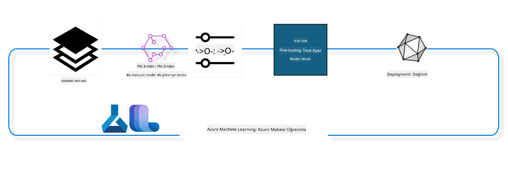

<!--
CO_OP_TRANSLATOR_METADATA:
{
  "original_hash": "944949f040e61b2ea25b3460f7394fd4",
  "translation_date": "2025-05-09T21:09:38+00:00",
  "source_file": "md/03.FineTuning/FineTuning_MLSDK.md",
  "language_code": "tr"
}
-->
## Azure ML sistem kayıt defterinden chat-completion bileşenlerini kullanarak bir modeli ince ayar yapmak

Bu örnekte, Phi-3-mini-4k-instruct modelinin, ultrachat_200k veri seti kullanılarak iki kişi arasındaki sohbeti tamamlaması için ince ayarını yapacağız.



Örnek, Azure ML SDK ve Python kullanarak ince ayar yapmayı ve ardından ince ayarlı modeli gerçek zamanlı çıkarım için çevrimiçi bir uç noktaya dağıtmayı gösterecek.

### Eğitim verisi

Ultrachat_200k veri setini kullanacağız. Bu, UltraChat veri setinin yoğun filtrelenmiş bir versiyonudur ve Zephyr-7B-β adlı, en son teknoloji 7b sohbet modeli eğitmek için kullanılmıştır.

### Model

Kullanıcıların chat-completion görevi için bir modeli nasıl ince ayar yapabileceğini göstermek amacıyla Phi-3-mini-4k-instruct modelini kullanacağız. Eğer bu not defterini belirli bir model kartından açtıysanız, model adını ona göre değiştirmeniz gerektiğini unutmayın.

### Görevler

- İnce ayar yapılacak modeli seçin.
- Eğitim verisini seçin ve inceleyin.
- İnce ayar işini yapılandırın.
- İnce ayar işini çalıştırın.
- Eğitim ve değerlendirme metriklerini gözden geçirin.
- İnce ayarlı modeli kaydedin.
- İnce ayarlı modeli gerçek zamanlı çıkarım için dağıtın.
- Kaynakları temizleyin.

## 1. Ön koşulları kurma

- Bağımlılıkları yükleyin
- AzureML Workspace'e bağlanın. SDK kimlik doğrulamasını kurmak için daha fazlasını öğrenin. Aşağıda <WORKSPACE_NAME>, <RESOURCE_GROUP> ve <SUBSCRIPTION_ID> yerlerini değiştirin.
- azureml sistem kayıt defterine bağlanın
- İsteğe bağlı bir deney adı belirleyin
- Compute'u kontrol edin veya oluşturun.

> [!NOTE]
> Gereksinimler tek bir GPU düğümü birden fazla GPU kartına sahip olabilir. Örneğin, Standard_NC24rs_v3 düğümünde 4 NVIDIA V100 GPU bulunurken, Standard_NC12s_v3 düğümünde 2 NVIDIA V100 GPU vardır. Bu bilgiler için dokümantasyona bakınız. Düğüm başına GPU kart sayısı aşağıdaki gpus_per_node parametresinde ayarlanır. Bu değerin doğru ayarlanması, düğümdeki tüm GPU'ların kullanılmasını sağlar. Önerilen GPU compute SKU'ları burada ve burada bulunabilir.

### Python Kütüphaneleri

Aşağıdaki hücreyi çalıştırarak bağımlılıkları yükleyin. Bu, yeni bir ortamda çalıştırılıyorsa isteğe bağlı olmayan bir adımdır.

```bash
pip install azure-ai-ml
pip install azure-identity
pip install datasets==2.9.0
pip install mlflow
pip install azureml-mlflow
```

### Azure ML ile Etkileşim

1. Bu Python betiği, Azure Machine Learning (Azure ML) servisi ile etkileşim için kullanılır. İşte yaptığı işlemlerin özeti:

    - azure.ai.ml, azure.identity ve azure.ai.ml.entities paketlerinden gerekli modülleri içe aktarır. Ayrıca time modülünü de içe aktarır.

    - DefaultAzureCredential() kullanarak kimlik doğrulama yapmaya çalışır. Bu, Azure bulutunda uygulama geliştirmeye hızlı başlamak için basitleştirilmiş bir kimlik doğrulama deneyimi sağlar. Eğer bu başarısız olursa, etkileşimli bir giriş istemi sağlayan InteractiveBrowserCredential()'a geçer.

    - Ardından, varsayılan config dosyasından (config.json) yapılandırmayı okuyarak MLClient örneği oluşturmayı dener. Başarısız olursa, subscription_id, resource_group_name ve workspace_name manuel olarak verilerek MLClient örneği oluşturur.

    - Azure ML kayıt defteri "azureml" için başka bir MLClient örneği oluşturur. Bu kayıt defteri modellerin, ince ayar boru hatlarının ve ortamların saklandığı yerdir.

    - experiment_name değişkenini "chat_completion_Phi-3-mini-4k-instruct" olarak ayarlar.

    - Şu anki zamanı (epoch'tan itibaren geçen saniye olarak, float türünde) tam sayıya ve ardından string'e çevirerek benzersiz bir zaman damgası oluşturur. Bu zaman damgası, benzersiz isimler ve sürümler oluşturmak için kullanılabilir.

    ```python
    # Import necessary modules from Azure ML and Azure Identity
    from azure.ai.ml import MLClient
    from azure.identity import (
        DefaultAzureCredential,
        InteractiveBrowserCredential,
    )
    from azure.ai.ml.entities import AmlCompute
    import time  # Import time module
    
    # Try to authenticate using DefaultAzureCredential
    try:
        credential = DefaultAzureCredential()
        credential.get_token("https://management.azure.com/.default")
    except Exception as ex:  # If DefaultAzureCredential fails, use InteractiveBrowserCredential
        credential = InteractiveBrowserCredential()
    
    # Try to create an MLClient instance using the default config file
    try:
        workspace_ml_client = MLClient.from_config(credential=credential)
    except:  # If that fails, create an MLClient instance by manually providing the details
        workspace_ml_client = MLClient(
            credential,
            subscription_id="<SUBSCRIPTION_ID>",
            resource_group_name="<RESOURCE_GROUP>",
            workspace_name="<WORKSPACE_NAME>",
        )
    
    # Create another MLClient instance for the Azure ML registry named "azureml"
    # This registry is where models, fine-tuning pipelines, and environments are stored
    registry_ml_client = MLClient(credential, registry_name="azureml")
    
    # Set the experiment name
    experiment_name = "chat_completion_Phi-3-mini-4k-instruct"
    
    # Generate a unique timestamp that can be used for names and versions that need to be unique
    timestamp = str(int(time.time()))
    ```

## 2. İnce ayar yapmak için temel modeli seçin

1. Phi-3-mini-4k-instruct, 3.8 milyar parametreli, hafif, en son teknoloji açık modeldir ve Phi-2 için kullanılan veri setleri üzerine inşa edilmiştir. Model Phi-3 model ailesine aittir ve Mini versiyonu, destekleyebileceği bağlam uzunluğu (token cinsinden) olan 4K ve 128K olmak üzere iki varyantta gelir. Modeli kullanmak için özel amacımıza göre ince ayar yapmamız gerekir. Bu modelleri AzureML Studio'daki Model Kataloğu'nda chat-completion görevi ile filtreleyerek inceleyebilirsiniz. Bu örnekte Phi-3-mini-4k-instruct modelini kullanıyoruz. Farklı bir model için bu not defterini açtıysanız, model adı ve sürümünü buna göre değiştirin.

    > [!NOTE]
    > Modelin id özelliği. Bu, ince ayar işine girdi olarak verilecektir. Ayrıca AzureML Studio Model Kataloğu'ndaki model detay sayfasında Asset ID alanında bulunabilir.

2. Bu Python betiği Azure Machine Learning (Azure ML) servisi ile etkileşim halindedir. İşte yaptığı işlemlerin özeti:

    - model_name değişkenini "Phi-3-mini-4k-instruct" olarak ayarlar.

    - registry_ml_client nesnesinin models özelliğinin get metodunu kullanarak Azure ML kayıt defterinden belirtilen isimdeki modelin en son sürümünü alır. get metodu iki argümanla çağrılır: modelin adı ve modelin en son sürümünün alınacağını belirten bir etiket.

    - İnce ayar için kullanılacak modelin adı, sürümü ve id'sini konsola yazdırır. String'in format metodu, modelin adı, sürümü ve id'sini mesaj içine yerleştirmek için kullanılır. Modelin adı, sürümü ve id'si foundation_model nesnesinin özellikleri olarak erişilir.

    ```python
    # Set the model name
    model_name = "Phi-3-mini-4k-instruct"
    
    # Get the latest version of the model from the Azure ML registry
    foundation_model = registry_ml_client.models.get(model_name, label="latest")
    
    # Print the model name, version, and id
    # This information is useful for tracking and debugging
    print(
        "\n\nUsing model name: {0}, version: {1}, id: {2} for fine tuning".format(
            foundation_model.name, foundation_model.version, foundation_model.id
        )
    )
    ```

## 3. İş için kullanılacak compute oluşturun

İnce ayar işi SADECE GPU compute ile çalışır. Compute boyutu, modelin büyüklüğüne bağlıdır ve çoğu durumda doğru compute'u belirlemek zor olabilir. Bu hücrede, kullanıcıya iş için doğru compute'u seçmesi için rehberlik edilir.

> [!NOTE]
> Aşağıda listelenen compute'lar en optimize yapılandırma ile çalışır. Yapılandırmadaki herhangi bir değişiklik, Cuda Out Of Memory hatasına yol açabilir. Böyle durumlarda, compute'u daha büyük bir boyuta yükseltmeyi deneyin.

> [!NOTE]
> compute_cluster_size seçilirken, compute'un kaynak grubunuzda mevcut olduğundan emin olun. Belirli bir compute mevcut değilse, compute kaynaklarına erişim talebinde bulunabilirsiniz.

### İnce Ayar Desteği için Modeli Kontrol Etme

1. Bu Python betiği Azure Machine Learning (Azure ML) modeline etkileşimde bulunur. İşte yaptığı işlemlerin özeti:

    - Python soyut sözdizimi ağacını işlemek için fonksiyonlar sağlayan ast modülünü içe aktarır.

    - foundation_model nesnesinde finetune_compute_allow_list adında bir etiket (tag) olup olmadığını kontrol eder. Azure ML'deki etiketler, modelleri filtrelemek ve sıralamak için oluşturulan anahtar-değer çiftleridir.

    - Eğer finetune_compute_allow_list etiketi varsa, ast.literal_eval fonksiyonunu kullanarak bu etiketin değerini (string) güvenli bir şekilde Python listesine dönüştürür. Bu liste computes_allow_list değişkenine atanır. Ardından, listeden compute oluşturulması gerektiğini belirten bir mesaj yazdırır.

    - Eğer finetune_compute_allow_list etiketi yoksa, computes_allow_list değişkenini None yapar ve bu etiketin modelin etiketleri arasında olmadığını belirten bir mesaj yazdırır.

    - Özetle, bu betik modelin meta verilerinde belirli bir etiketi kontrol eder, varsa değerini listeye dönüştürür ve kullanıcıya bilgi verir.

    ```python
    # Import the ast module, which provides functions to process trees of the Python abstract syntax grammar
    import ast
    
    # Check if the 'finetune_compute_allow_list' tag is present in the model's tags
    if "finetune_compute_allow_list" in foundation_model.tags:
        # If the tag is present, use ast.literal_eval to safely parse the tag's value (a string) into a Python list
        computes_allow_list = ast.literal_eval(
            foundation_model.tags["finetune_compute_allow_list"]
        )  # convert string to python list
        # Print a message indicating that a compute should be created from the list
        print(f"Please create a compute from the above list - {computes_allow_list}")
    else:
        # If the tag is not present, set computes_allow_list to None
        computes_allow_list = None
        # Print a message indicating that the 'finetune_compute_allow_list' tag is not part of the model's tags
        print("`finetune_compute_allow_list` is not part of model tags")
    ```

### Compute Örneğini Kontrol Etme

1. Bu Python betiği Azure Machine Learning (Azure ML) servisi ile etkileşimde bulunur ve bir compute örneği üzerinde çeşitli kontroller yapar. İşte yaptığı işlemlerin özeti:

    - compute_cluster değişkeninde saklanan isimle Azure ML çalışma alanından compute örneğini almaya çalışır. Compute örneğinin provisioning durumu "failed" ise ValueError yükseltir.

    - computes_allow_list None değilse, listedeki tüm compute boyutlarını küçük harfe çevirir ve mevcut compute örneğinin boyutunun bu listede olup olmadığını kontrol eder. Eğer yoksa ValueError yükseltir.

    - computes_allow_list None ise, compute örneğinin boyutunun desteklenmeyen GPU VM boyutları listesinde olup olmadığını kontrol eder. Eğer varsa ValueError yükseltir.

    - Çalışma alanındaki tüm kullanılabilir compute boyutlarını alır. Liste üzerinde döner ve her compute boyutunun adı mevcut compute örneğinin boyutuna eşit mi diye kontrol eder. Eşitse, o compute boyutundaki GPU sayısını alır ve gpu_count_found değişkenini True yapar.

    - Eğer gpu_count_found True ise, compute örneğindeki GPU sayısını yazdırır. Değilse ValueError yükseltir.

    - Özetle, bu betik Azure ML çalışma alanındaki bir compute örneği üzerinde provisioning durumu, boyutunun izin verilen veya yasaklanan listelerde olup olmadığı ve GPU sayısı gibi kontroller yapar.

    ```python
    # Print the exception message
    print(e)
    # Raise a ValueError if the compute size is not available in the workspace
    raise ValueError(
        f"WARNING! Compute size {compute_cluster_size} not available in workspace"
    )
    
    # Retrieve the compute instance from the Azure ML workspace
    compute = workspace_ml_client.compute.get(compute_cluster)
    # Check if the provisioning state of the compute instance is "failed"
    if compute.provisioning_state.lower() == "failed":
        # Raise a ValueError if the provisioning state is "failed"
        raise ValueError(
            f"Provisioning failed, Compute '{compute_cluster}' is in failed state. "
            f"please try creating a different compute"
        )
    
    # Check if computes_allow_list is not None
    if computes_allow_list is not None:
        # Convert all compute sizes in computes_allow_list to lowercase
        computes_allow_list_lower_case = [x.lower() for x in computes_allow_list]
        # Check if the size of the compute instance is in computes_allow_list_lower_case
        if compute.size.lower() not in computes_allow_list_lower_case:
            # Raise a ValueError if the size of the compute instance is not in computes_allow_list_lower_case
            raise ValueError(
                f"VM size {compute.size} is not in the allow-listed computes for finetuning"
            )
    else:
        # Define a list of unsupported GPU VM sizes
        unsupported_gpu_vm_list = [
            "standard_nc6",
            "standard_nc12",
            "standard_nc24",
            "standard_nc24r",
        ]
        # Check if the size of the compute instance is in unsupported_gpu_vm_list
        if compute.size.lower() in unsupported_gpu_vm_list:
            # Raise a ValueError if the size of the compute instance is in unsupported_gpu_vm_list
            raise ValueError(
                f"VM size {compute.size} is currently not supported for finetuning"
            )
    
    # Initialize a flag to check if the number of GPUs in the compute instance has been found
    gpu_count_found = False
    # Retrieve a list of all available compute sizes in the workspace
    workspace_compute_sku_list = workspace_ml_client.compute.list_sizes()
    available_sku_sizes = []
    # Iterate over the list of available compute sizes
    for compute_sku in workspace_compute_sku_list:
        available_sku_sizes.append(compute_sku.name)
        # Check if the name of the compute size matches the size of the compute instance
        if compute_sku.name.lower() == compute.size.lower():
            # If it does, retrieve the number of GPUs for that compute size and set gpu_count_found to True
            gpus_per_node = compute_sku.gpus
            gpu_count_found = True
    # If gpu_count_found is True, print the number of GPUs in the compute instance
    if gpu_count_found:
        print(f"Number of GPU's in compute {compute.size}: {gpus_per_node}")
    else:
        # If gpu_count_found is False, raise a ValueError
        raise ValueError(
            f"Number of GPU's in compute {compute.size} not found. Available skus are: {available_sku_sizes}."
            f"This should not happen. Please check the selected compute cluster: {compute_cluster} and try again."
        )
    ```

## 4. Modelin ince ayarı için veri setini seçin

1. ultrachat_200k veri setini kullanıyoruz. Veri seti, Denetimli ince ayar (sft) için uygun dört parçaya bölünmüştür.
Üretim sıralaması (gen). Parçalar başına örnek sayısı aşağıdaki gibidir:

    ```bash
    train_sft test_sft  train_gen  test_gen
    207865  23110  256032  28304
    ```

1. Sonraki birkaç hücre, ince ayar için temel veri hazırlama işlemlerini gösterir:

### Bazı veri satırlarını görselleştirme

Bu örneğin hızlı çalışmasını istediğimiz için, zaten kırpılmış satırların %5'ini içeren train_sft, test_sft dosyalarını kaydediyoruz. Bu, ince ayarlı modelin daha düşük doğruluğa sahip olacağı anlamına gelir, bu yüzden gerçek dünyada kullanılmamalıdır.
download-dataset.py, ultrachat_200k veri setini indirip veri setini ince ayar boru hattı bileşeni tarafından kullanılabilir formata dönüştürmek için kullanılır. Ayrıca veri seti büyük olduğu için burada sadece bir kısmı vardır.

1. Aşağıdaki betiği çalıştırmak sadece verinin %5'ini indirir. Bu oran dataset_split_pc parametresi değiştirilerek artırılabilir.

    > [!NOTE]
    > Bazı dil modellerinin farklı dil kodları vardır, bu yüzden veri setindeki sütun isimleri buna göre olmalıdır.

1. Verilerin nasıl görünmesi gerektiğine dair bir örnek:
Chat-completion veri seti parquet formatında saklanır ve her kayıt aşağıdaki şemayı kullanır:

    - Bu, JSON (JavaScript Nesne Gösterimi) formatında bir dokümandır; popüler bir veri alışveriş formatıdır. Çalıştırılabilir kod değil, veri depolama ve taşıma yöntemidir. Yapısı şöyledir:

    - "prompt": AI asistanına yöneltilen görev veya soruyu temsil eden bir string değeri tutar.

    - "messages": Kullanıcı ile AI asistanı arasındaki bir konuşmadaki mesajları temsil eden nesneler dizisini tutar. Her mesaj nesnesi iki anahtar içerir:

    - "content": Mesajın içeriğini temsil eden string.
    - "role": Mesajı gönderenin rolünü temsil eden string, "user" veya "assistant" olabilir.
    - "prompt_id": Her prompt için benzersiz kimlik tutan string.

1. Bu JSON dokümanında, bir kullanıcı distopik bir hikaye için bir başrol oluşturmasını AI asistana ister. Asistan yanıt verir, kullanıcı daha fazla detay ister ve asistan kabul eder. Tüm konuşma belirli bir prompt id ile ilişkilidir.

    ```python
    {
        // The task or question posed to an AI assistant
        "prompt": "Create a fully-developed protagonist who is challenged to survive within a dystopian society under the rule of a tyrant. ...",
        
        // An array of objects, each representing a message in a conversation between a user and an AI assistant
        "messages":[
            {
                // The content of the user's message
                "content": "Create a fully-developed protagonist who is challenged to survive within a dystopian society under the rule of a tyrant. ...",
                // The role of the entity that sent the message
                "role": "user"
            },
            {
                // The content of the assistant's message
                "content": "Name: Ava\n\n Ava was just 16 years old when the world as she knew it came crashing down. The government had collapsed, leaving behind a chaotic and lawless society. ...",
                // The role of the entity that sent the message
                "role": "assistant"
            },
            {
                // The content of the user's message
                "content": "Wow, Ava's story is so intense and inspiring! Can you provide me with more details.  ...",
                // The role of the entity that sent the message
                "role": "user"
            }, 
            {
                // The content of the assistant's message
                "content": "Certainly! ....",
                // The role of the entity that sent the message
                "role": "assistant"
            }
        ],
        
        // A unique identifier for the prompt
        "prompt_id": "d938b65dfe31f05f80eb8572964c6673eddbd68eff3db6bd234d7f1e3b86c2af"
    }
    ```

### Veriyi İndirme

1. Bu Python betiği, download-dataset.py adlı yardımcı betiği kullanarak bir veri seti indirir. İşte yaptığı işlemlerin özeti:

    - İşletim sistemi fonksiyonlarını sağlayan os modülünü içe aktarır.

    - os.system fonksiyonunu kullanarak download-dataset.py betiğini belirli komut satırı argümanlarıyla çalıştırır. Argümanlar indirilecek veri setini (HuggingFaceH4/ultrachat_200k), indirileceği dizini (ultrachat_200k_dataset) ve veri setinin yüzde kaçının indirileceğini (5) belirtir. os.system fonksiyonu komutun çıkış durumunu döndürür; bu durum exit_status değişkenine atanır.

    - exit_status 0 değilse, yani komut başarısızsa, veri seti indirilirken hata olduğunu belirten bir Exception yükseltir.

    - Özetle, bu betik bir yardımcı betiği kullanarak veri setini indirir ve komut başarısızsa hata verir.

    ```python
    # Import the os module, which provides a way of using operating system dependent functionality
    import os
    
    # Use the os.system function to run the download-dataset.py script in the shell with specific command-line arguments
    # The arguments specify the dataset to download (HuggingFaceH4/ultrachat_200k), the directory to download it to (ultrachat_200k_dataset), and the percentage of the dataset to split (5)
    # The os.system function returns the exit status of the command it executed; this status is stored in the exit_status variable
    exit_status = os.system(
        "python ./download-dataset.py --dataset HuggingFaceH4/ultrachat_200k --download_dir ultrachat_200k_dataset --dataset_split_pc 5"
    )
    
    # Check if exit_status is not 0
    # In Unix-like operating systems, an exit status of 0 usually indicates that a command has succeeded, while any other number indicates an error
    # If exit_status is not 0, raise an Exception with a message indicating that there was an error downloading the dataset
    if exit_status != 0:
        raise Exception("Error downloading dataset")
    ```

### Veriyi DataFrame'e Yükleme

1. Bu Python betiği, JSON Lines formatındaki bir dosyayı pandas DataFrame'e yükler ve ilk 5 satırı gösterir. İşte yaptığı işlemlerin özeti:

    - Güçlü veri işleme ve analiz kütüphanesi pandas'ı içe aktarır.

    - pandas'ın gösterim ayarlarında maksimum sütun genişliğini 0 yapar. Bu, DataFrame yazdırılırken her sütunun tam metninin kesilmeden gösterilmesini sağlar.

    - pd.read_json fonksiyonunu kullanarak ultrachat_200k_dataset dizinindeki train_sft.jsonl dosyasını DataFrame'e yükler. lines=True argümanı, dosyanın her satırının ayrı bir JSON nesnesi olduğu JSON Lines formatında olduğunu belirtir.

    - head metodu ile DataFrame'in ilk 5 satırını gösterir. Eğer satır sayısı 5'ten azsa tüm satırları gösterir.

    - Özetle, bu betik JSON Lines dosyasını DataFrame'e yükler ve ilk 5 satırı tam metinle birlikte gösterir.

    ```python
    # Import the pandas library, which is a powerful data manipulation and analysis library
    import pandas as pd
    
    # Set the maximum column width for pandas' display options to 0
    # This means that the full text of each column will be displayed without truncation when the DataFrame is printed
    pd.set_option("display.max_colwidth", 0)
    
    # Use the pd.read_json function to load the train_sft.jsonl file from the ultrachat_200k_dataset directory into a DataFrame
    # The lines=True argument indicates that the file is in JSON Lines format, where each line is a separate JSON object
    df = pd.read_json("./ultrachat_200k_dataset/train_sft.jsonl", lines=True)
    
    # Use the head method to display the first 5 rows of the DataFrame
    # If the DataFrame has less than 5 rows, it will display all of them
    df.head()
    ```

## 5. Model ve veriyi girdiler olarak kullanarak ince ayar işini gönderme

Chat-completion boru hattı bileşenini kullanan işi oluşturun. İnce ayar için desteklenen tüm parametreler hakkında daha fazla bilgi edinin.

### İnce Ayar Parametrelerini Tanımlama

1. İnce ayar parametreleri iki kategoriye ayrılabilir - eğitim parametreleri, optimizasyon parametreleri

1. Eğitim parametreleri, eğitimin çeşitli yönlerini tanımlar:

    - Kullanılacak optimizer, scheduler
    - İnce ayarın optimize edeceği metrik
    - Eğitim adımları sayısı, batch boyutu vb.
    - Optimizasyon parametreleri, GPU belleğini optimize etmeye ve compute kaynaklarını etkin kullanmaya yardımcı olur.

1. Aşağıda bu kategoriye ait bazı parametreler yer almaktadır. Optimizasyon parametreleri modelden modele farklılık gösterir ve bu farklılıklar modeli paketleyen bileşenle birlikte gelir.

    - Deepspeed ve LoRA'yı etkinleştir
    - Karışık hassasiyetli eğitimi etkinleştir
    - Çok düğümlü eğitimi etkinleştir

> [!NOTE]
> Denetimli ince ayar hizalamayı kaybetmeye veya felaket unutmaya yol açabilir. Bu sorunu kontrol etmenizi ve ince ayardan sonra hizalama aşaması çalıştırmanızı öneririz.

### İnce Ayar Parametreleri

1. Bu Python betiği, bir makine öğrenmesi modelini ince ayar için parametreleri ayarlamaktadır. İşte yaptığı işlemlerin özeti:

    - Eğitim parametreleri olarak varsayılan eğitim epoch sayısı, eğitim ve değerlendirme batch boyutları, öğrenme hızı ve öğrenme hızı scheduler türü gibi parametreleri ayarlar.

    - Optimizasyon parametreleri olarak LoRa ve DeepSpeed uygulanıp uygulanmayacağı ve DeepSpeed aşaması gibi ayarları yapar.

    - Eğitim ve optimizasyon parametrelerini finetune_parameters adlı tek bir sözlükte birleştirir.

    - Eğer foundation_model model-özel varsayılan parametrelere sahipse, bir uyarı mesajı yazdırır ve bu model-özel varsayılanları ast.literal_eval ile sözlüğe dönüştürüp finetune_parameters sözlüğünü günceller.

    - İnce ayar için kullanılacak nihai parametreleri yazdırır.

    - Özetle, bu betik makine öğrenmesi modeli için ince ayar parametrelerini ayarlayıp gösterir, varsayılan parametrelerin model-özel parametrelerle üzerine yazılmasına izin verir.

    ```python
    # Set up default training parameters such as the number of training epochs, batch sizes for training and evaluation, learning rate, and learning rate scheduler type
    training_parameters = dict(
        num_train_epochs=3,
        per_device_train_batch_size=1,
        per_device_eval_batch_size=1,
        learning_rate=5e-6,
        lr_scheduler_type="cosine",
    )
    
    # Set up default optimization parameters such as whether to apply Layer-wise Relevance Propagation (LoRa) and DeepSpeed, and the DeepSpeed stage
    optimization_parameters = dict(
        apply_lora="true",
        apply_deepspeed="true",
        deepspeed_stage=2,
    )
    
    # Combine the training and optimization parameters into a single dictionary called finetune_parameters
    finetune_parameters = {**training_parameters, **optimization_parameters}
    
    # Check if the foundation_model has any model-specific default parameters
    # If it does, print a warning message and update the finetune_parameters dictionary with these model-specific defaults
    # The ast.literal_eval function is used to convert the model-specific defaults from a string to a Python dictionary
    if "model_specific_defaults" in foundation_model.tags:
        print("Warning! Model specific defaults exist. The defaults could be overridden.")
        finetune_parameters.update(
            ast.literal_eval(  # convert string to python dict
                foundation_model.tags["model_specific_defaults"]
            )
        )
    
    # Print the final set of fine-tuning parameters that will be used for the run
    print(
        f"The following finetune parameters are going to be set for the run: {finetune_parameters}"
    )
    ```

### Eğitim Boru Hattı

1. Bu Python betiği, makine öğrenmesi eğitim boru hattı için bir görüntüleme adı oluşturma fonksiyonu tanımlar ve ardından bu fonksiyonu çağırarak görüntüleme adını oluşturur ve yazdırır. İşte yaptığı işlemlerin özeti:

    1. get_pipeline_display_name fonksiyonu tanımlanır. Bu fonksiyon, eğitim boru hattı ile ilgili çeşitli parametrelere dayanarak bir görüntüleme adı oluşturur.

    2. Fonksiyon içinde, toplam batch boyutu cihaz başına batch boy
çeşitli parametrelere dayalı eğitim hattı ve ardından bu görüntüleme adını yazdırma. ```python
    # Define a function to generate a display name for the training pipeline
    def get_pipeline_display_name():
        # Calculate the total batch size by multiplying the per-device batch size, the number of gradient accumulation steps, the number of GPUs per node, and the number of nodes used for fine-tuning
        batch_size = (
            int(finetune_parameters.get("per_device_train_batch_size", 1))
            * int(finetune_parameters.get("gradient_accumulation_steps", 1))
            * int(gpus_per_node)
            * int(finetune_parameters.get("num_nodes_finetune", 1))
        )
        # Retrieve the learning rate scheduler type
        scheduler = finetune_parameters.get("lr_scheduler_type", "linear")
        # Retrieve whether DeepSpeed is applied
        deepspeed = finetune_parameters.get("apply_deepspeed", "false")
        # Retrieve the DeepSpeed stage
        ds_stage = finetune_parameters.get("deepspeed_stage", "2")
        # If DeepSpeed is applied, include "ds" followed by the DeepSpeed stage in the display name; if not, include "nods"
        if deepspeed == "true":
            ds_string = f"ds{ds_stage}"
        else:
            ds_string = "nods"
        # Retrieve whether Layer-wise Relevance Propagation (LoRa) is applied
        lora = finetune_parameters.get("apply_lora", "false")
        # If LoRa is applied, include "lora" in the display name; if not, include "nolora"
        if lora == "true":
            lora_string = "lora"
        else:
            lora_string = "nolora"
        # Retrieve the limit on the number of model checkpoints to keep
        save_limit = finetune_parameters.get("save_total_limit", -1)
        # Retrieve the maximum sequence length
        seq_len = finetune_parameters.get("max_seq_length", -1)
        # Construct the display name by concatenating all these parameters, separated by hyphens
        return (
            model_name
            + "-"
            + "ultrachat"
            + "-"
            + f"bs{batch_size}"
            + "-"
            + f"{scheduler}"
            + "-"
            + ds_string
            + "-"
            + lora_string
            + f"-save_limit{save_limit}"
            + f"-seqlen{seq_len}"
        )
    
    # Call the function to generate the display name
    pipeline_display_name = get_pipeline_display_name()
    # Print the display name
    print(f"Display name used for the run: {pipeline_display_name}")
    ```

### Pipeline'ı Yapılandırma

Bu Python betiği, Azure Machine Learning SDK kullanarak bir makine öğrenimi pipeline'ı tanımlıyor ve yapılandırıyor. İşte yaptığı işlemlerin özeti:

1. Azure AI ML SDK'dan gerekli modülleri içe aktarır.
2. Kayıt defterinden "chat_completion_pipeline" adlı bir pipeline bileşenini alır.
3. `@pipeline` decorator and the function `create_pipeline`. The name of the pipeline is set to `pipeline_display_name`.

1. Inside the `create_pipeline` function, it initializes the fetched pipeline component with various parameters, including the model path, compute clusters for different stages, dataset splits for training and testing, the number of GPUs to use for fine-tuning, and other fine-tuning parameters.

1. It maps the output of the fine-tuning job to the output of the pipeline job. This is done so that the fine-tuned model can be easily registered, which is required to deploy the model to an online or batch endpoint.

1. It creates an instance of the pipeline by calling the `create_pipeline` function.

1. It sets the `force_rerun` setting of the pipeline to `True`, meaning that cached results from previous jobs will not be used.

1. It sets the `continue_on_step_failure` setting of the pipeline to `False` kullanarak bir pipeline işi tanımlar; bu, herhangi bir adım başarısız olursa pipeline'ın duracağı anlamına gelir.
4. Özetle, bu betik Azure Machine Learning SDK kullanarak sohbet tamamlama görevi için bir makine öğrenimi pipeline'ı tanımlayıp yapılandırmaktadır.

```python
    # Import necessary modules from the Azure AI ML SDK
    from azure.ai.ml.dsl import pipeline
    from azure.ai.ml import Input
    
    # Fetch the pipeline component named "chat_completion_pipeline" from the registry
    pipeline_component_func = registry_ml_client.components.get(
        name="chat_completion_pipeline", label="latest"
    )
    
    # Define the pipeline job using the @pipeline decorator and the function create_pipeline
    # The name of the pipeline is set to pipeline_display_name
    @pipeline(name=pipeline_display_name)
    def create_pipeline():
        # Initialize the fetched pipeline component with various parameters
        # These include the model path, compute clusters for different stages, dataset splits for training and testing, the number of GPUs to use for fine-tuning, and other fine-tuning parameters
        chat_completion_pipeline = pipeline_component_func(
            mlflow_model_path=foundation_model.id,
            compute_model_import=compute_cluster,
            compute_preprocess=compute_cluster,
            compute_finetune=compute_cluster,
            compute_model_evaluation=compute_cluster,
            # Map the dataset splits to parameters
            train_file_path=Input(
                type="uri_file", path="./ultrachat_200k_dataset/train_sft.jsonl"
            ),
            test_file_path=Input(
                type="uri_file", path="./ultrachat_200k_dataset/test_sft.jsonl"
            ),
            # Training settings
            number_of_gpu_to_use_finetuning=gpus_per_node,  # Set to the number of GPUs available in the compute
            **finetune_parameters
        )
        return {
            # Map the output of the fine tuning job to the output of pipeline job
            # This is done so that we can easily register the fine tuned model
            # Registering the model is required to deploy the model to an online or batch endpoint
            "trained_model": chat_completion_pipeline.outputs.mlflow_model_folder
        }
    
    # Create an instance of the pipeline by calling the create_pipeline function
    pipeline_object = create_pipeline()
    
    # Don't use cached results from previous jobs
    pipeline_object.settings.force_rerun = True
    
    # Set continue on step failure to False
    # This means that the pipeline will stop if any step fails
    pipeline_object.settings.continue_on_step_failure = False
    ```

### İş Gönderme

1. Bu Python betiği, Azure Machine Learning çalışma alanına bir makine öğrenimi pipeline işi gönderir ve iş tamamlanana kadar bekler. İşte yaptığı işlemlerin özeti:

- workspace_ml_client içindeki jobs nesnesinin create_or_update metodunu çağırarak pipeline işini gönderir. Çalıştırılacak pipeline pipeline_object ile, işin çalıştırıldığı deney ise experiment_name ile belirtilir.
- Ardından, jobs nesnesinin stream metodunu çağırarak pipeline işinin tamamlanmasını bekler. Beklenecek iş, pipeline_job nesnesinin name özelliği ile belirtilir.
- Özetle, bu betik Azure Machine Learning çalışma alanına bir makine öğrenimi pipeline işi gönderir ve iş tamamlanana kadar bekler.

```python
    # Submit the pipeline job to the Azure Machine Learning workspace
    # The pipeline to be run is specified by pipeline_object
    # The experiment under which the job is run is specified by experiment_name
    pipeline_job = workspace_ml_client.jobs.create_or_update(
        pipeline_object, experiment_name=experiment_name
    )
    
    # Wait for the pipeline job to complete
    # The job to wait for is specified by the name attribute of the pipeline_job object
    workspace_ml_client.jobs.stream(pipeline_job.name)
    ```

## 6. İncelenmiş modeli çalışma alanına kaydetme

İncelenmiş işin çıktısından modeli kaydedeceğiz. Bu, ince ayarlanmış model ile ince ayar işi arasında izlenebilirlik sağlar. İnce ayar işi ayrıca temel model, veri ve eğitim kodu ile izlenebilirliği takip eder.

### ML Modelini Kaydetme

1. Bu Python betiği, Azure Machine Learning pipeline'ında eğitilmiş bir makine öğrenimi modelini kaydediyor. İşte yaptığı işlemlerin özeti:

- Azure AI ML SDK'dan gerekli modülleri içe aktarır.
- workspace_ml_client içindeki jobs nesnesinin get metodunu çağırarak pipeline işinden trained_model çıktısının mevcut olup olmadığını kontrol eder ve outputs özelliğine erişir.
- Pipeline işinin adı ve çıktı adı ("trained_model") kullanılarak eğitilmiş modele giden bir yol oluşturur.
- Orijinal model adına "-ultrachat-200k" ekleyerek ve varsa eğik çizgileri tire ile değiştirerek ince ayarlanmış model için bir ad tanımlar.
- Model nesnesi oluşturarak modeli kaydetmeye hazırlanır; bu nesne modelin yolu, türü (MLflow modeli), adı, versiyonu ve açıklaması gibi parametreleri içerir.
- workspace_ml_client içindeki models nesnesinin create_or_update metodunu çağırarak modeli kaydeder.
- Kaydedilen modeli yazdırır.

1. Özetle, bu betik Azure Machine Learning pipeline'ında eğitilmiş bir makine öğrenimi modelini kaydetmektedir.

```python
    # Import necessary modules from the Azure AI ML SDK
    from azure.ai.ml.entities import Model
    from azure.ai.ml.constants import AssetTypes
    
    # Check if the `trained_model` output is available from the pipeline job
    print("pipeline job outputs: ", workspace_ml_client.jobs.get(pipeline_job.name).outputs)
    
    # Construct a path to the trained model by formatting a string with the name of the pipeline job and the name of the output ("trained_model")
    model_path_from_job = "azureml://jobs/{0}/outputs/{1}".format(
        pipeline_job.name, "trained_model"
    )
    
    # Define a name for the fine-tuned model by appending "-ultrachat-200k" to the original model name and replacing any slashes with hyphens
    finetuned_model_name = model_name + "-ultrachat-200k"
    finetuned_model_name = finetuned_model_name.replace("/", "-")
    
    print("path to register model: ", model_path_from_job)
    
    # Prepare to register the model by creating a Model object with various parameters
    # These include the path to the model, the type of the model (MLflow model), the name and version of the model, and a description of the model
    prepare_to_register_model = Model(
        path=model_path_from_job,
        type=AssetTypes.MLFLOW_MODEL,
        name=finetuned_model_name,
        version=timestamp,  # Use timestamp as version to avoid version conflict
        description=model_name + " fine tuned model for ultrachat 200k chat-completion",
    )
    
    print("prepare to register model: \n", prepare_to_register_model)
    
    # Register the model by calling the create_or_update method of the models object in the workspace_ml_client with the Model object as the argument
    registered_model = workspace_ml_client.models.create_or_update(
        prepare_to_register_model
    )
    
    # Print the registered model
    print("registered model: \n", registered_model)
    ```

## 7. İncelenmiş modeli çevrimiçi uç noktaya dağıtma

Çevrimiçi uç noktalar, modelin kullanılmasını gerektiren uygulamalarla entegre edilebilen kalıcı bir REST API sağlar.

### Uç Noktayı Yönetme

1. Bu Python betiği, Azure Machine Learning'de kayıtlı model için yönetilen bir çevrimiçi uç nokta oluşturuyor. İşte yaptığı işlemlerin özeti:

- Azure AI ML SDK'dan gerekli modülleri içe aktarır.
- "ultrachat-completion-" ifadesine zaman damgası ekleyerek benzersiz bir çevrimiçi uç nokta adı tanımlar.
- Uç nokta adı, açıklaması ve kimlik doğrulama modu ("key") gibi parametrelerle ManagedOnlineEndpoint nesnesi oluşturarak uç nokta yaratmaya hazırlanır.
- workspace_ml_client içindeki begin_create_or_update metodunu ManagedOnlineEndpoint nesnesi ile çağırarak uç noktayı oluşturur ve wait metodunu çağırarak oluşturma işleminin tamamlanmasını bekler.

1. Özetle, bu betik Azure Machine Learning'de kayıtlı model için yönetilen bir çevrimiçi uç nokta oluşturuyor.

```python
    # Import necessary modules from the Azure AI ML SDK
    from azure.ai.ml.entities import (
        ManagedOnlineEndpoint,
        ManagedOnlineDeployment,
        ProbeSettings,
        OnlineRequestSettings,
    )
    
    # Define a unique name for the online endpoint by appending a timestamp to the string "ultrachat-completion-"
    online_endpoint_name = "ultrachat-completion-" + timestamp
    
    # Prepare to create the online endpoint by creating a ManagedOnlineEndpoint object with various parameters
    # These include the name of the endpoint, a description of the endpoint, and the authentication mode ("key")
    endpoint = ManagedOnlineEndpoint(
        name=online_endpoint_name,
        description="Online endpoint for "
        + registered_model.name
        + ", fine tuned model for ultrachat-200k-chat-completion",
        auth_mode="key",
    )
    
    # Create the online endpoint by calling the begin_create_or_update method of the workspace_ml_client with the ManagedOnlineEndpoint object as the argument
    # Then wait for the creation operation to complete by calling the wait method
    workspace_ml_client.begin_create_or_update(endpoint).wait()
    ```

> [!NOTE]  
> Burada dağıtım için desteklenen SKU'ların listesini bulabilirsiniz - [Managed online endpoints SKU list](https://learn.microsoft.com/azure/machine-learning/reference-managed-online-endpoints-vm-sku-list)

### ML Modelini Dağıtma

1. Bu Python betiği, kayıtlı bir makine öğrenimi modelini Azure Machine Learning'de yönetilen bir çevrimiçi uç noktaya dağıtıyor. İşte yaptığı işlemlerin özeti:

- Python soyut sözdizimi ağacı işlemleri için fonksiyonlar sağlayan ast modülünü içe aktarır.
- Dağıtım için instance türünü "Standard_NC6s_v3" olarak ayarlar.
- Temel modelde inference_compute_allow_list etiketi varsa, bu etiketi string'den Python listesine çevirir ve inference_computes_allow_list değişkenine atar; yoksa None olarak ayarlar.
- Belirtilen instance türünün izin verilen listede olup olmadığını kontrol eder. Değilse, kullanıcıya izin verilen listeden bir instance türü seçmesini isteyen bir mesaj yazdırır.
- Dağıtımı oluşturmak için, dağıtım adı, uç nokta adı, model ID'si, instance türü ve sayısı, canlılık yoklama ayarları ve istek ayarları gibi parametrelerle ManagedOnlineDeployment nesnesi oluşturur.
- workspace_ml_client içindeki begin_create_or_update metodunu ManagedOnlineDeployment nesnesi ile çağırarak dağıtımı oluşturur ve wait metodunu çağırarak oluşturma işleminin tamamlanmasını bekler.
- Uç noktadaki trafiği "demo" dağıtımına %100 yönlendirir.
- workspace_ml_client içindeki begin_create_or_update metodunu uç nokta nesnesi ile çağırarak uç noktayı günceller ve result metodunu çağırarak güncellemenin tamamlanmasını bekler.

1. Özetle, bu betik kayıtlı bir makine öğrenimi modelini Azure Machine Learning'de yönetilen bir çevrimiçi uç noktaya dağıtmaktadır.

```python
    # Import the ast module, which provides functions to process trees of the Python abstract syntax grammar
    import ast
    
    # Set the instance type for the deployment
    instance_type = "Standard_NC6s_v3"
    
    # Check if the `inference_compute_allow_list` tag is present in the foundation model
    if "inference_compute_allow_list" in foundation_model.tags:
        # If it is, convert the tag value from a string to a Python list and assign it to `inference_computes_allow_list`
        inference_computes_allow_list = ast.literal_eval(
            foundation_model.tags["inference_compute_allow_list"]
        )
        print(f"Please create a compute from the above list - {computes_allow_list}")
    else:
        # If it's not, set `inference_computes_allow_list` to `None`
        inference_computes_allow_list = None
        print("`inference_compute_allow_list` is not part of model tags")
    
    # Check if the specified instance type is in the allow list
    if (
        inference_computes_allow_list is not None
        and instance_type not in inference_computes_allow_list
    ):
        print(
            f"`instance_type` is not in the allow listed compute. Please select a value from {inference_computes_allow_list}"
        )
    
    # Prepare to create the deployment by creating a `ManagedOnlineDeployment` object with various parameters
    demo_deployment = ManagedOnlineDeployment(
        name="demo",
        endpoint_name=online_endpoint_name,
        model=registered_model.id,
        instance_type=instance_type,
        instance_count=1,
        liveness_probe=ProbeSettings(initial_delay=600),
        request_settings=OnlineRequestSettings(request_timeout_ms=90000),
    )
    
    # Create the deployment by calling the `begin_create_or_update` method of the `workspace_ml_client` with the `ManagedOnlineDeployment` object as the argument
    # Then wait for the creation operation to complete by calling the `wait` method
    workspace_ml_client.online_deployments.begin_create_or_update(demo_deployment).wait()
    
    # Set the traffic of the endpoint to direct 100% of the traffic to the "demo" deployment
    endpoint.traffic = {"demo": 100}
    
    # Update the endpoint by calling the `begin_create_or_update` method of the `workspace_ml_client` with the `endpoint` object as the argument
    # Then wait for the update operation to complete by calling the `result` method
    workspace_ml_client.begin_create_or_update(endpoint).result()
    ```

## 8. Uç noktayı örnek verilerle test etme

Test veri kümesinden bazı örnek veriler alıp çevrimiçi uç noktaya çıkarım için göndereceğiz. Ardından tahmin edilen etiketleri gerçek etiketlerle birlikte göstereceğiz.

### Sonuçları Okuma

1. Bu Python betiği, bir JSON Lines dosyasını pandas DataFrame olarak okur, rastgele bir örnek alır ve indeksleri sıfırlar. İşte yaptığı işlemlerin özeti:

- ./ultrachat_200k_dataset/test_gen.jsonl dosyasını pandas DataFrame olarak okur. read_json fonksiyonu lines=True argümanı ile kullanılır çünkü dosya JSON Lines formatındadır; her satır ayrı bir JSON nesnesidir.
- DataFrame'den 1 satır rastgele örnek alır. sample fonksiyonu n=1 argümanı ile çağrılır.
- DataFrame'in indeksini sıfırlar. reset_index fonksiyonu drop=True argümanı ile orijinal indeksi atar ve varsayılan tam sayı indeksleriyle değiştirir.
- head fonksiyonu 2 argümanı ile DataFrame'in ilk 2 satırını gösterir. Ancak örnekleme sonrası DataFrame sadece 1 satır içerdiğinden sadece o satır gösterilir.

1. Özetle, bu betik bir JSON Lines dosyasını pandas DataFrame olarak okur, 1 satır rastgele örnek alır, indeksi sıfırlar ve ilk satırı gösterir.

```python
    # Import pandas library
    import pandas as pd
    
    # Read the JSON Lines file './ultrachat_200k_dataset/test_gen.jsonl' into a pandas DataFrame
    # The 'lines=True' argument indicates that the file is in JSON Lines format, where each line is a separate JSON object
    test_df = pd.read_json("./ultrachat_200k_dataset/test_gen.jsonl", lines=True)
    
    # Take a random sample of 1 row from the DataFrame
    # The 'n=1' argument specifies the number of random rows to select
    test_df = test_df.sample(n=1)
    
    # Reset the index of the DataFrame
    # The 'drop=True' argument indicates that the original index should be dropped and replaced with a new index of default integer values
    # The 'inplace=True' argument indicates that the DataFrame should be modified in place (without creating a new object)
    test_df.reset_index(drop=True, inplace=True)
    
    # Display the first 2 rows of the DataFrame
    # However, since the DataFrame only contains one row after the sampling, this will only display that one row
    test_df.head(2)
    ```

### JSON Nesnesi Oluşturma

1. Bu Python betiği, belirli parametrelerle bir JSON nesnesi oluşturur ve bunu bir dosyaya kaydeder. İşte yaptığı işlemlerin özeti:

- JSON verileri ile çalışmak için fonksiyonlar sağlayan json modülünü içe aktarır.
- Bir makine öğrenimi modeli için parametreleri temsil eden anahtar ve değerlerden oluşan parameters sözlüğünü oluşturur. Anahtarlar "temperature", "top_p", "do_sample" ve "max_new_tokens" olup karşılık gelen değerleri sırasıyla 0.6, 0.9, True ve 200'dür.
- İkinci bir sözlük olan test_json'u oluşturur; iki anahtarı vardır: "input_data" ve "params". "input_data" başka bir sözlük olup içinde "input_string" ve "parameters" anahtarları bulunur. "input_string" değeri test_df DataFrame'indeki ilk mesajı içeren bir liste, "parameters" ise az önce oluşturulan parameters sözlüğüdür. "params" ise boş bir sözlüktür.
- sample_score.json adlı bir dosya açar.

```python
    # Import the json module, which provides functions to work with JSON data
    import json
    
    # Create a dictionary `parameters` with keys and values that represent parameters for a machine learning model
    # The keys are "temperature", "top_p", "do_sample", and "max_new_tokens", and their corresponding values are 0.6, 0.9, True, and 200 respectively
    parameters = {
        "temperature": 0.6,
        "top_p": 0.9,
        "do_sample": True,
        "max_new_tokens": 200,
    }
    
    # Create another dictionary `test_json` with two keys: "input_data" and "params"
    # The value of "input_data" is another dictionary with keys "input_string" and "parameters"
    # The value of "input_string" is a list containing the first message from the `test_df` DataFrame
    # The value of "parameters" is the `parameters` dictionary created earlier
    # The value of "params" is an empty dictionary
    test_json = {
        "input_data": {
            "input_string": [test_df["messages"][0]],
            "parameters": parameters,
        },
        "params": {},
    }
    
    # Open a file named `sample_score.json` in the `./ultrachat_200k_dataset` directory in write mode
    with open("./ultrachat_200k_dataset/sample_score.json", "w") as f:
        # Write the `test_json` dictionary to the file in JSON format using the `json.dump` function
        json.dump(test_json, f)
    ```

### Uç Noktayı Çağırma

1. Bu Python betiği, Azure Machine Learning'deki bir çevrimiçi uç noktayı JSON dosyasını puanlamak için çağırır. İşte yaptığı işlemlerin özeti:

- workspace_ml_client nesnesinin online_endpoints özelliğinin invoke metodunu çağırır. Bu metod, çevrimiçi uç noktaya istek gönderip yanıt almak için kullanılır.
- endpoint_name ve deployment_name argümanlarıyla uç nokta ve dağıtım isimlerini belirtir. Bu durumda uç nokta adı online_endpoint_name değişkeninde, dağıtım adı ise "demo" olarak ayarlanmıştır.
- request_file argümanı ile puanlanacak JSON dosyasının yolunu belirtir. Bu durumda dosya ./ultrachat_200k_dataset/sample_score.json'dur.
- Uç noktadan dönen yanıtı response değişkenine atar.
- Ham yanıtı yazdırır.

1. Özetle, bu betik Azure Machine Learning'deki bir çevrimiçi uç noktayı JSON dosyasını puanlamak için çağırır ve yanıtı yazdırır.

```python
    # Invoke the online endpoint in Azure Machine Learning to score the `sample_score.json` file
    # The `invoke` method of the `online_endpoints` property of the `workspace_ml_client` object is used to send a request to an online endpoint and get a response
    # The `endpoint_name` argument specifies the name of the endpoint, which is stored in the `online_endpoint_name` variable
    # The `deployment_name` argument specifies the name of the deployment, which is "demo"
    # The `request_file` argument specifies the path to the JSON file to be scored, which is `./ultrachat_200k_dataset/sample_score.json`
    response = workspace_ml_client.online_endpoints.invoke(
        endpoint_name=online_endpoint_name,
        deployment_name="demo",
        request_file="./ultrachat_200k_dataset/sample_score.json",
    )
    
    # Print the raw response from the endpoint
    print("raw response: \n", response, "\n")
    ```

## 9. Çevrimiçi uç noktayı silme

1. Çevrimiçi uç noktayı silmeyi unutmayın; aksi halde uç nokta tarafından kullanılan hesaplama için faturalandırma devam eder. Bu Python kod satırı, Azure Machine Learning'de bir çevrimiçi uç noktayı siler. İşte yaptığı işlemlerin özeti:

- workspace_ml_client nesnesinin online_endpoints özelliğinin begin_delete metodunu çağırır. Bu metod, bir çevrimiçi uç noktanın silinmesini başlatır.
- Silinecek uç noktanın adını name argümanı ile belirtir. Bu durumda uç nokta adı online_endpoint_name değişkenindedir.
- wait metodunu çağırarak silme işleminin tamamlanmasını bekler. Bu engelleyen bir işlemdir; yani silme tamamlanana kadar betik devam etmez.
- Özetle, bu kod satırı Azure Machine Learning'de bir çevrimiçi uç noktanın silinmesini başlatır ve işlemin tamamlanmasını bekler.

```python
    # Delete the online endpoint in Azure Machine Learning
    # The `begin_delete` method of the `online_endpoints` property of the `workspace_ml_client` object is used to start the deletion of an online endpoint
    # The `name` argument specifies the name of the endpoint to be deleted, which is stored in the `online_endpoint_name` variable
    # The `wait` method is called to wait for the deletion operation to complete. This is a blocking operation, meaning that it will prevent the script from continuing until the deletion is finished
    workspace_ml_client.online_endpoints.begin_delete(name=online_endpoint_name).wait()
    ```

**Feragatname**:  
Bu belge, AI çeviri hizmeti [Co-op Translator](https://github.com/Azure/co-op-translator) kullanılarak çevrilmiştir. Doğruluk için çaba gösterilse de, otomatik çevirilerin hata veya yanlışlık içerebileceğini lütfen unutmayınız. Orijinal belge, kendi ana dilinde yetkili kaynak olarak kabul edilmelidir. Kritik bilgiler için profesyonel insan çevirisi önerilir. Bu çevirinin kullanımı sonucu oluşabilecek yanlış anlamalar veya yorum hatalarından sorumlu değiliz.