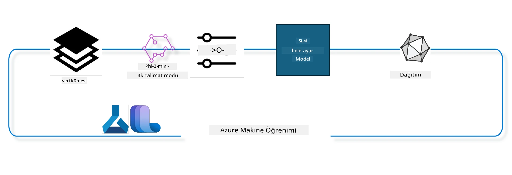

## Azure ML sistem kaydından sohbet tamamlama bileşenlerini kullanarak bir modeli ince ayar yapmak için nasıl kullanılır

Bu örnekte, ultrachat_200k veri setini kullanarak 2 kişi arasındaki bir sohbeti tamamlamak üzere Phi-3-mini-4k-instruct modelinin ince ayarını yapacağız.



Örnek, Azure ML SDK ve Python kullanarak nasıl ince ayar yapılacağını ve ardından ince ayarlı modelin gerçek zamanlı çıkarım için çevrimiçi bir uç noktaya nasıl konuşlandırılacağını gösterecektir.

### Eğitim verisi

Ultrachat_200k veri setini kullanacağız. Bu, UltraChat veri setinin yoğun şekilde filtrelenmiş bir versiyonudur ve Zephyr-7B-β, yani son teknoloji 7b sohbet modeli eğitmek için kullanılmıştır.

### Model

Sohbet tamamlama görevi için bir modelin nasıl ince ayar yapılacağını göstermek üzere Phi-3-mini-4k-instruct modelini kullanacağız. Eğer bu not defterini belirli bir model kartından açtıysanız, modeli ismini değiştirmeyi unutmayın.

### Görevler

- İnce ayar yapılacak bir model seçin.
- Eğitim verisini seçin ve inceleyin.
- İnce ayar işini yapılandırın.
- İnce ayar işini çalıştırın.
- Eğitim ve değerlendirme ölçümlerini gözden geçirin.
- İnce ayarlı modeli kaydedin.
- İnce ayarlı modeli gerçek zamanlı çıkarım için konuşlandırın.
- Kaynakları temizleyin.

## 1. Önkoşulları kurun

- Bağımlılıkları yükleyin
- AzureML Çalışma Alanına bağlanın. Daha fazla bilgi için SDK kimlik doğrulamasını kur bölümüne bakın. Aşağıda <WORKSPACE_NAME>, <RESOURCE_GROUP> ve <SUBSCRIPTION_ID> değerlerini değiştirin.
- Azureml sistem kaydına bağlanın
- İsteğe bağlı bir deneme ismi belirleyin
- Hesaplama kaynağını kontrol edin veya oluşturun.

> [!NOTE]
> Gereksinimler tek bir GPU düğümü birden fazla GPU kartına sahip olabilir. Örneğin, Standard_NC24rs_v3 düğümünde 4 NVIDIA V100 GPU varken, Standard_NC12s_v3 düğümünde 2 NVIDIA V100 GPU vardır. Bu bilgi için dokümantasyona bakın. GPU kartlarının sayısı aşağıdaki gpus_per_node parametresinde belirlenir. Bu değerin doğru ayarlanması, düğümdeki tüm GPU'ların kullanımını sağlar. Önerilen GPU hesaplama SKU'ları burada ve burada bulunabilir.

### Python Kütüphaneleri

Bağımlılıkları aşağıdaki hücreyi çalıştırarak yükleyin. Yeni bir ortamda çalışıyorsanız bu isteğe bağlı bir adım değildir.

```bash
pip install azure-ai-ml
pip install azure-identity
pip install datasets==2.9.0
pip install mlflow
pip install azureml-mlflow
```

### Azure ML ile Etkileşim

1. Bu Python betiği, Azure Machine Learning (Azure ML) servisi ile etkileşim için kullanılır. İşte yaptığı işlemlerin açıklaması:

    - azure.ai.ml, azure.identity ve azure.ai.ml.entities paketlerinden gerekli modülleri içe aktarır. Ayrıca time modülünü de içe aktarır.

    - DefaultAzureCredential() kullanarak kimlik doğrulamaya çalışır. Bu kimlik doğrulama, Azure bulutunda çalışan uygulamaları hızlıca geliştirmeye başlamak için basitleştirilmiş bir kimlik doğrulama deneyimi sunar. Başarısız olursa, etkileşimli bir oturum açma sağlayan InteractiveBrowserCredential() kullanır.

    - Ardından, varsayılan yapılandırma dosyasından (config.json) ayarları okuyarak MLClient örneği oluşturmaya çalışır. Başarısız olursa, subscription_id, resource_group_name ve workspace_name manuel olarak sağlayarak MLClient nesnesi oluşturur.

    - Azure ML kayıt defteri "azureml" için başka bir MLClient örneği oluşturur. Burada modeller, ince ayar hatları ve ortamlar saklanır.

    - experiment_name değişkenini "chat_completion_Phi-3-mini-4k-instruct" olarak ayarlar.

    - Şu anki zamanı (epoch'tan bu yana saniye olarak, kayan nokta sayısı) tam sayıya sonra da stringe çevirerek benzersiz bir zaman damgası oluşturur. Bu zaman damgası, benzersiz isimler ve sürümler oluşturmak için kullanılabilir.

    ```python
    # Azure ML ve Azure Identity'den gerekli modülleri içe aktar
    from azure.ai.ml import MLClient
    from azure.identity import (
        DefaultAzureCredential,
        InteractiveBrowserCredential,
    )
    from azure.ai.ml.entities import AmlCompute
    import time  # time modülünü içe aktar
    
    # DefaultAzureCredential kullanarak kimlik doğrulaması yapmayı dene
    try:
        credential = DefaultAzureCredential()
        credential.get_token("https://management.azure.com/.default")
    except Exception as ex:  # DefaultAzureCredential başarısız olursa, InteractiveBrowserCredential kullan
        credential = InteractiveBrowserCredential()
    
    # Varsayılan yapılandırma dosyasını kullanarak bir MLClient örneği oluşturmaya çalış
    try:
        workspace_ml_client = MLClient.from_config(credential=credential)
    except:  # Eğer bu başarısız olursa, bilgileri manuel olarak sağlayarak bir MLClient örneği oluştur
        workspace_ml_client = MLClient(
            credential,
            subscription_id="<SUBSCRIPTION_ID>",
            resource_group_name="<RESOURCE_GROUP>",
            workspace_name="<WORKSPACE_NAME>",
        )
    
    # "azureml" adlı Azure ML kaydı için başka bir MLClient örneği oluştur
    # Bu kayıt, modellerin, ince ayar işlem hatlarının ve ortamların saklandığı yerdir
    registry_ml_client = MLClient(credential, registry_name="azureml")
    
    # Deney adını ayarla
    experiment_name = "chat_completion_Phi-3-mini-4k-instruct"
    
    # Benzersiz olması gereken isimler ve sürümler için kullanılabilecek benzersiz bir zaman damgası oluştur
    timestamp = str(int(time.time()))
    ```

## 2. İnce ayar yapmak için bir temel model seçin

1. Phi-3-mini-4k-instruct, 3.8 milyar parametreli, hafif, Phi-2 için kullanılmış veri setleri üzerine inşa edilmiş son teknoloji açık bir modeldir. Model, Phi-3 model ailesine aittir ve Mini versiyonu iki varyantta gelir: 4K ve 128K; bu destekleyebileceği bağlam uzunluğudur (token cinsinden). Kullanmak için bu modeli belirli amaca göre ince ayar yapmamız gerekir. Bu modelleri AzureML Stüdyo Model Kataloğu’nda sohbet tamamlama görevi filtrelenerek gezinebilirsiniz. Bu örnekte Phi-3-mini-4k-instruct modelini kullanıyoruz. Eğer bu not defterini farklı bir model için açtıysanız, model adı ve sürümünü uygun şekilde değiştirin.

> [!NOTE]
> Modelin model id özelliği. Bu ince ayar işine giriş olarak verilir. Ayrıca AzureML Stüdyo Model Kataloğu’daki model detaylar sayfasında Varlık Kimliği (Asset ID) alanı olarak da bulunur.

2. Bu Python betiği Azure Machine Learning (Azure ML) servisi ile etkileşiyor. İşte yaptığı işlemler:

    - model_name değişkenini "Phi-3-mini-4k-instruct" olarak ayarlar.

    - registry_ml_client nesnesinin models özelliğinin get metodunu kullanarak Azure ML kayıt defterinden belirtilen ada sahip modelin en son sürümünü alır. get metodu iki argümanla çağrılır: modelin adı ve modelin en son sürümünü alması için etiket.

    - Konsola, ince ayar için kullanılacak modelin adı, sürümü ve kimliği hakkında bir mesaj yazdırır. String format metodu, modelin adı, sürümü ve kimliğini mesaj metnine yerleştirmek için kullanılır. Modelin adı, sürümü ve kimliği foundation_model nesnesinin özellikleri olarak alınır.

    ```python
    # Model adını ayarla
    model_name = "Phi-3-mini-4k-instruct"
    
    # Azure ML kayıt defterinden modelin en son sürümünü al
    foundation_model = registry_ml_client.models.get(model_name, label="latest")
    
    # Model adını, sürümünü ve kimliğini yazdır
    # Bu bilgi izleme ve hata ayıklama için faydalıdır
    print(
        "\n\nUsing model name: {0}, version: {1}, id: {2} for fine tuning".format(
            foundation_model.name, foundation_model.version, foundation_model.id
        )
    )
    ```

## 3. İş için kullanılacak hesaplamayı oluşturun

İnce ayar işi SADECE GPU hesaplaması ile çalışır. Hesaplama boyutu modele bağlıdır ve çoğu durumda işe uygun hesaplamayı belirlemek zordur. Bu hücrede kullanıcıya işe uygun hesaplama seçimi için rehberlik edilir.

> [!NOTE]
> Aşağıda listelenen hesaplamalar en optimize konfigürasyonlarla çalışır. Konfigürasyonda herhangi bir değişiklik Cuda Bellek Aşımı (Out Of Memory) hatalarına yol açabilir. Böyle durumlarda hesaplamayı daha büyük boyuta yükseltmeyi deneyin.

> [!NOTE]
> compute_cluster_size seçerken hesabınızda kaynak grubunuzda ilgili hesaplamanın müsait olduğundan emin olun. Eğer belirli bir hesaplama yoksa, hesaplama kaynaklarına erişim için talepte bulunabilirsiniz.

### İnce Ayar Desteği için Model Kontrolü

1. Bu Python betiği Azure ML modeline erişiyor. İşte yaptığı işlemler:

    - ast modülünü içe aktarır; bu modül Python soyut sözdizim ağacı (AST) işlemek fonksiyonları sağlar.

    - foundation_model nesnesinin (Azure ML'deki bir modeli temsil eder) finetune_compute_allow_list adında bir etikete sahip olup olmadığını kontrol eder. Azure ML içindeki etiketler, modelleri filtrelemek ve sıralamak için kullanılan anahtar-değer çiftleridir.

    - Eğer finetune_compute_allow_list etiketi varsa, ast.literal_eval fonksiyonuyla bu etiketin değerini (string) güvenli şekilde Python listesine dönüştürür. Bu liste computes_allow_list değişkenine atanır. Ardından kullanıcıya listeden hesaplama oluşturulması gerektiğine dair mesaj verir.

    - Eğer etiket yoksa computes_allow_list değişkenini None yapar ve bu etiketin model etiketleri arasında olmadığını belirten mesaj verir.

    - Özetle, bu betik model metaverisinde belirli bir etiketi kontrol eder, varsa değerini listeye çevirir ve kullanıcıya geri bildirim verir.

    ```python
    # Python soyut sözdizimi dilbilgisinin ağaçlarını işlemek için fonksiyonlar sağlayan ast modülünü içe aktar
    import ast
    
    # Modelin etiketlerinde 'finetune_compute_allow_list' etiketinin var olup olmadığını kontrol et
    if "finetune_compute_allow_list" in foundation_model.tags:
        # Etiket mevcutsa, ast.literal_eval kullanarak etiketin değerini (bir dize) güvenli bir şekilde Python listesine dönüştür
        computes_allow_list = ast.literal_eval(
            foundation_model.tags["finetune_compute_allow_list"]
        )  # string'i python listesine dönüştür
        # Listeden bir compute oluşturulacağını belirten bir mesaj yazdır
        print(f"Please create a compute from the above list - {computes_allow_list}")
    else:
        # Etiket mevcut değilse, computes_allow_list'i None olarak ayarla
        computes_allow_list = None
        # 'finetune_compute_allow_list' etiketinin modelin etiketlerinin bir parçası olmadığını belirten bir mesaj yazdır
        print("`finetune_compute_allow_list` is not part of model tags")
    ```

### Hesaplama Örneğini Kontrol Etme

1. Bu Python betiği Azure Machine Learning (Azure ML) servisi ile etkileşime girer ve bir hesaplama örneği üzerinde çeşitli kontroller yapar. İşte yaptığı işlemlerin açıklaması:

    - compute_cluster adında saklanan isim ile Azure ML çalışma alanından hesaplama örneğini almaya çalışır. Eğer hesaplama örneğinin kurulumu başarısızsa (provisioning_state "failed" ise) ValueError yükseltir.

    - computes_allow_list değişkeni None değilse, listedeki tüm hesaplama boyutlarını küçük harfe dönüştürür ve şu anki hesaplama örneğinin boyutunun bu listede olup olmadığını kontrol eder. Yoksa ValueError yükseltir.

    - computes_allow_list None ise, hesaplama örneğinin boyutu desteklenmeyen GPU VM boyutları listesinde olup olmadığını kontrol eder. Eğer varsa ValueError yükseltir.

    - Çalışma alanındaki tüm mevcut hesaplama boyutlarının listesini alır. Bu liste üzerinde döngü yapar ve her hesaplama boyutunun adının mevcut hesaplama örneğinin boyutuna eşit olup olmadığını kontrol eder. Bulursa o hesaplama boyutundaki GPU sayısını alır ve gpu_count_found değişkenini True yapar.

    - gpu_count_found True ise hesaplama örneğindeki GPU sayısını yazdırır, değilse ValueError yükseltir.

    - Özetle, bu betik bir Azure ML çalışma alanındaki hesaplama örneğinin durumunu, boyutunu (deny ve allow listelere göre) ve GPU sayısını kontrol eder.
    
    ```python
    # İstisna mesajını yazdır
    print(e)
    # Çalışma alanında hesaplama boyutu mevcut değilse ValueError yükselt
    raise ValueError(
        f"WARNING! Compute size {compute_cluster_size} not available in workspace"
    )
    
    # Azure ML çalışma alanından hesaplama örneğini al
    compute = workspace_ml_client.compute.get(compute_cluster)
    # Hesaplama örneğinin sağlama durumu "failed" (başarısız) mı kontrol et
    if compute.provisioning_state.lower() == "failed":
        # Sağlama durumu "failed" ise ValueError yükselt
        raise ValueError(
            f"Provisioning failed, Compute '{compute_cluster}' is in failed state. "
            f"please try creating a different compute"
        )
    
    # computes_allow_list'in None olmadığını kontrol et
    if computes_allow_list is not None:
        # computes_allow_list içindeki tüm hesaplama boyutlarını küçük harfe çevir
        computes_allow_list_lower_case = [x.lower() for x in computes_allow_list]
        # Hesaplama örneğinin boyutunun computes_allow_list_lower_case içinde olup olmadığını kontrol et
        if compute.size.lower() not in computes_allow_list_lower_case:
            # Hesaplama örneğinin boyutu computes_allow_list_lower_case içinde değilse ValueError yükselt
            raise ValueError(
                f"VM size {compute.size} is not in the allow-listed computes for finetuning"
            )
    else:
        # Desteklenmeyen GPU VM boyutları listesini tanımla
        unsupported_gpu_vm_list = [
            "standard_nc6",
            "standard_nc12",
            "standard_nc24",
            "standard_nc24r",
        ]
        # Hesaplama örneğinin boyutunun unsupported_gpu_vm_list içinde olup olmadığını kontrol et
        if compute.size.lower() in unsupported_gpu_vm_list:
            # Hesaplama örneğinin boyutu unsupported_gpu_vm_list içinde ise ValueError yükselt
            raise ValueError(
                f"VM size {compute.size} is currently not supported for finetuning"
            )
    
    # Hesaplama örneğindeki GPU sayısının bulunup bulunmadığını kontrol etmek için bir bayrak başlat
    gpu_count_found = False
    # Çalışma alanındaki tüm mevcut hesaplama boyutlarının listesini al
    workspace_compute_sku_list = workspace_ml_client.compute.list_sizes()
    available_sku_sizes = []
    # Mevcut hesaplama boyutları listesi üzerinde dön
    for compute_sku in workspace_compute_sku_list:
        available_sku_sizes.append(compute_sku.name)
        # Hesaplama boyutunun adı ile hesaplama örneğinin boyutunun eşleşip eşleşmediğini kontrol et
        if compute_sku.name.lower() == compute.size.lower():
            # Eğer eşleşiyorsa, o hesaplama boyutu için GPU sayısını al ve gpu_count_found'u True yap
            gpus_per_node = compute_sku.gpus
            gpu_count_found = True
    # Eğer gpu_count_found True ise, hesaplama örneğindeki GPU sayısını yazdır
    if gpu_count_found:
        print(f"Number of GPU's in compute {compute.size}: {gpus_per_node}")
    else:
        # Eğer gpu_count_found False ise, ValueError yükselt
        raise ValueError(
            f"Number of GPU's in compute {compute.size} not found. Available skus are: {available_sku_sizes}."
            f"This should not happen. Please check the selected compute cluster: {compute_cluster} and try again."
        )
    ```

## 4. Modeli ince ayar yapmak için veri setini seçin

1. Ultrachat_200k veri setini kullanıyoruz. Veri setinin dört bölümü vardır; Denetimli ince ayar (sft) için uygundur.
Generasyon sıralaması (gen). Bölümlere göre örnek sayıları aşağıdaki gibidir:

    ```bash
    train_sft test_sft  train_gen  test_gen
    207865  23110  256032  28304
    ```

1. Sonraki birkaç hücre, ince ayar için temel veri hazırlamayı göstermektedir:

### Bazı veri satırlarını görselleştirme

Bu örneğin hızlı çalışmasını istiyoruz, bu yüzden zaten kırpılmış satırların %5’ini içeren train_sft, test_sft dosyalarını kaydedin. Bu, ince ayarlı modelin doğruluğunu düşürecektir; bu nedenle gerçek dünyada kullanım için uygun değildir.
download-dataset.py ultrachat_200k veri setini indirir ve veri setini ince ayar pipeline bileşeni için uygun formata dönüştürür. Ayrıca veri seti büyük olduğu için burada sadece kısmı bulunmaktadır.

1. Aşağıdaki betik sadece verinin %5’ini indirir. Bu oran dataset_split_pc parametresi değiştirilerek artırılabilir.

> [!NOTE]
> Bazı dil modellerinin farklı dil kodları vardır, bu yüzden veri setindeki sütun isimleri buna göre olmalıdır.

1. Verinin görünüşü hakkında örnek
Sohbet tamamlama veri seti parquet formatında depolanır ve her kayıt aşağıdaki şemaya sahiptir:

    - Bu JSON (JavaScript Nesne Gösterimi) formatında bir dokümandır, popüler bir veri alışveriş formatıdır. Yürütülebilir kod değildir, veri depolamak ve taşımak için kullanılır. İşte yapısı:

    - "prompt": AI asistana sunulan bir görev veya soruyu temsil eden string değer.

    - "messages": Kullanıcı ile AI asistanı arasındaki konuşmadaki mesajları temsil eden nesne dizisi. Her mesaj nesnesi iki anahtara sahiptir:

    - "content": Mesaj içeriğini tutan string değer.
    - "role": Mesajı gönderen varlığın rolünü tutan string değer; "user" veya "assistant" olabilir.
    - "prompt_id": Prompt için benzersiz kimlik tutan string değer.

1. Bu özel JSON dokümanında, kullanıcı distopik bir hikaye için bir ana karakter oluşturmasını ister. Asistan yanıt verir, ardından kullanıcı daha fazla ayrıntı ister. Asistan ayrıntı sağlamayı kabul eder. Tüm konuşma belirli bir prompt id ile ilişkilidir.

    ```python
    {
        // The task or question posed to an AI assistant
        "prompt": "Create a fully-developed protagonist who is challenged to survive within a dystopian society under the rule of a tyrant. ...",
        
        // An array of objects, each representing a message in a conversation between a user and an AI assistant
        "messages":[
            {
                // The content of the user's message
                "content": "Create a fully-developed protagonist who is challenged to survive within a dystopian society under the rule of a tyrant. ...",
                // The role of the entity that sent the message
                "role": "user"
            },
            {
                // The content of the assistant's message
                "content": "Name: Ava\n\n Ava was just 16 years old when the world as she knew it came crashing down. The government had collapsed, leaving behind a chaotic and lawless society. ...",
                // The role of the entity that sent the message
                "role": "assistant"
            },
            {
                // The content of the user's message
                "content": "Wow, Ava's story is so intense and inspiring! Can you provide me with more details.  ...",
                // The role of the entity that sent the message
                "role": "user"
            }, 
            {
                // The content of the assistant's message
                "content": "Certainly! ....",
                // The role of the entity that sent the message
                "role": "assistant"
            }
        ],
        
        // A unique identifier for the prompt
        "prompt_id": "d938b65dfe31f05f80eb8572964c6673eddbd68eff3db6bd234d7f1e3b86c2af"
    }
    ```

### Veri İndirme

1. Bu Python betiği, download-dataset.py adlı yardımcı betiği kullanarak bir veri seti indirir. İşte yaptığı:

    - İşletim sistemi bağımlı işlevler sağlayan os modülünü içe aktarır.

    - os.system fonksiyonunu kullanarak shell'de download-dataset.py betiğini belirli komut satırı argümanları ile çalıştırır. Argümanlar indirilecek veri seti (HuggingFaceH4/ultrachat_200k), indirilecek dizin (ultrachat_200k_dataset) ve veri setinin bölünme oranını (5) belirtir. os.system döndürdüğü çıkış durumunu exit_status değişkenine atar.

    - exit_status 0 değilse (Unix benzeri sistemlerde 0 başarılı komut, diğerleri hata anlamına gelir) veri setini indirirken hata olduğunu belirten bir Exception yükseltir.

    - Özetle, bu betik yardımcı komut dosyasını çalıştırarak veri seti indirir ve hata durumunda istisna fırlatır.
    
    ```python
    # İşletim sistemi bağımlı işlevselliği kullanmanın bir yolunu sağlayan os modülünü içe aktar
    import os
    
    # Belirli komut satırı argümanlarıyla shell'de download-dataset.py betiğini çalıştırmak için os.system işlevini kullan
    # Argümanlar indirilecek veri kümesini (HuggingFaceH4/ultrachat_200k), indirileceği dizini (ultrachat_200k_dataset) ve veri kümesini bölme yüzdesini (5) belirtir
    # os.system işlevi yürüttüğü komutun çıkış durumunu döner; bu durum exit_status değişkeninde saklanır
    exit_status = os.system(
        "python ./download-dataset.py --dataset HuggingFaceH4/ultrachat_200k --download_dir ultrachat_200k_dataset --dataset_split_pc 5"
    )
    
    # exit_status'un 0 olup olmadığını kontrol et
    # Unix benzeri işletim sistemlerinde, çıkış durumu 0 genellikle bir komutun başarılı olduğunu gösterirken, başka herhangi bir sayı bir hatayı belirtir
    # Eğer exit_status 0 değilse, veri kümesi indirirken bir hata olduğunu belirten bir mesajla Exception fırlat
    if exit_status != 0:
        raise Exception("Error downloading dataset")
    ```

### Veriyi DataFrame'e Yükleme
1. Bu Python betiği, bir JSON Lines dosyasını pandas DataFrame'e yüklüyor ve ilk 5 satırı gösteriyor. İşte yaptıklarının bir dökümü:

    - Güçlü bir veri manipülasyonu ve analiz kütüphanesi olan pandas kütüphanesini içe aktarır.

    - pandas'ın görüntüleme seçenekleri için maksimum sütun genişliğini 0 olarak ayarlar. Bu, DataFrame yazdırıldığında her sütunun tam metninin kesilmeden görüntüleneceği anlamına gelir.

    - `pd.read_json` fonksiyonunu, dosyanın JSON Lines formatında olduğunu belirten `lines=True` argümanı ile birlikte ultrachat_200k_dataset dizinindeki train_sft.jsonl dosyasını bir DataFrame olarak yüklemek için kullanır. JSON Lines formatında her satır ayrı bir JSON nesnesidir.

    - DataFrame'in ilk 5 satırını göstermek için `head` metodunu kullanır. Eğer DataFrame 5'ten az satıra sahipse, tamamını gösterir.

    - Özetle, bu betik bir JSON Lines dosyasını DataFrame'e yüklüyor ve tam sütun metniyle birlikte ilk 5 satırı gösteriyor.
    
    ```python
    # Güçlü bir veri manipülasyonu ve analiz kütüphanesi olan pandas kütüphanesini içe aktar
    import pandas as pd
    
    # pandas'ın görüntüleme seçenekleri için maksimum sütun genişliğini 0 olarak ayarla
    # Bu, DataFrame yazdırıldığında her sütunun tam metninin kesilmeden gösterileceği anlamına gelir
    pd.set_option("display.max_colwidth", 0)
    
    # ultrachat_200k_dataset dizinindeki train_sft.jsonl dosyasını bir DataFrame olarak yüklemek için pd.read_json fonksiyonunu kullan
    # lines=True argümanı, dosyanın JSON Lines formatında olduğunu, yani her satırın ayrı bir JSON nesnesi olduğunu belirtir
    df = pd.read_json("./ultrachat_200k_dataset/train_sft.jsonl", lines=True)
    
    # DataFrame'in ilk 5 satırını göstermek için head metodunu kullan
    # Eğer DataFrame 5'ten az satıra sahipse, tüm satırları gösterecektir
    df.head()
    ```

## 5. Model ve verileri girdiler olarak kullanarak ince ayar işini gönderin

Chat-completion pipeline bileşenini kullanan işi oluşturun. İnce ayar için desteklenen tüm parametreler hakkında daha fazla bilgi edinin.

### İnce ayar parametrelerini tanımlayın

1. İnce ayar parametreleri 2 kategoriye ayrılabilir - eğitim parametreleri, optimizasyon parametreleri

1. Eğitim parametreleri eğitimin yönlerini tanımlar, örneğin -

    - Kullanılacak optimizatör, planlayıcı
    - İnce ayarı optimize etmek için ölçüt
    - Eğitim adımlarının sayısı ve batch boyutu vb.
    - Optimizasyon parametreleri GPU belleğini optimize etmeye ve hesaplama kaynaklarını etkin kullanmaya yardımcı olur.

1. Aşağıda bu kategoriye ait birkaç parametre yer almaktadır. Optimizasyon parametreleri her model için farklıdır ve bu farklılıkları yönetmek için model ile paketlenmiştir.

    - Deepspeed ve LoRA'yı etkinleştir
    - Karma hassasiyet eğitimini etkinleştir
    - Çok düğümlü eğitimi etkinleştir

> [!NOTE]
> Denetimli ince ayar hizalanmanın kaybına veya felaket unutmaya yol açabilir. Bu sorunu kontrol etmenizi ve ince ayardan sonra bir hizalama aşaması çalıştırmanızı öneririz.

### İnce Ayar Parametreleri

1. Bu Python betiği, bir makine öğrenmesi modelinin ince ayarı için parametreleri ayarlıyor. İşte yaptıklarının bir dökümü:

    - Eğitim epoch sayısı, eğitim ve doğrulama için batch boyutları, öğrenme hızı ve öğrenme hızı planlayıcı türü gibi varsayılan eğitim parametrelerini ayarlar.

    - Layer-wise Relevance Propagation (LoRa) ve DeepSpeed'in uygulanıp uygulanmayacağı ve DeepSpeed aşaması gibi varsayılan optimizasyon parametrelerini ayarlar.

    - Eğitim ve optimizasyon parametrelerini birleştirip finetune_parameters adlı tek bir sözlükte tutar.

    - foundation_model’un model-özgü varsayılan parametreleri varsa, bir uyarı mesajı yazdırır ve bu model-özgü varsayılanlarla finetune_parameters sözlüğünü günceller. `ast.literal_eval` fonksiyonu, model-özgü varsayılanları dizeden Python sözlüğüne dönüştürmek için kullanılır.

    - Çalıştırmada kullanılacak nihai ince ayar parametrelerini yazdırır.

    - Özetle, bu betik bir makine öğrenmesi modelinin ince ayarı için parametreleri ayarlıyor ve varsayılan parametrelerin üzerine model-özgü parametrelerle geçme imkanı sunarak bu parametreleri gösteriyor.

    ```python
    # Eğitim epoch sayısı, eğitim ve değerlendirme için batch boyutları, öğrenme hızı ve öğrenme hızı planlayıcısı türü gibi varsayılan eğitim parametrelerini ayarla
    training_parameters = dict(
        num_train_epochs=3,
        per_device_train_batch_size=1,
        per_device_eval_batch_size=1,
        learning_rate=5e-6,
        lr_scheduler_type="cosine",
    )
    
    # Layer-wise Relevance Propagation (LoRa) ve DeepSpeed uygulayıp uygulamayacağınız ve DeepSpeed aşaması gibi varsayılan optimizasyon parametrelerini ayarla
    optimization_parameters = dict(
        apply_lora="true",
        apply_deepspeed="true",
        deepspeed_stage=2,
    )
    
    # Eğitim ve optimizasyon parametrelerini finetune_parameters adlı tek bir sözlükte birleştir
    finetune_parameters = {**training_parameters, **optimization_parameters}
    
    # foundation_model'in model-spesifik varsayılan parametreleri olup olmadığını kontrol et
    # Eğer varsa, bir uyarı mesajı yazdır ve finetune_parameters sözlüğünü bu model-spesifik varsayılanlarla güncelle
    # ast.literal_eval fonksiyonu model-spesifik varsayılanları bir string'den Python sözlüğüne dönüştürmek için kullanılır
    if "model_specific_defaults" in foundation_model.tags:
        print("Warning! Model specific defaults exist. The defaults could be overridden.")
        finetune_parameters.update(
            ast.literal_eval(  # string'i python sözlüğüne dönüştür
                foundation_model.tags["model_specific_defaults"]
            )
        )
    
    # Çalıştırma için kullanılacak son ince ayar parametre setini yazdır
    print(
        f"The following finetune parameters are going to be set for the run: {finetune_parameters}"
    )
    ```

### Eğitim Pipeline'ı

1. Bu Python betiği, bir makine öğrenme eğitim pipeline'ı için görüntüleme adı oluşturacak bir fonksiyon tanımlıyor ve sonra bu fonksiyonu çağırarak görüntüleme adını oluşturup yazdırıyor. İşte yaptıklarının bir dökümü:

1. `get_pipeline_display_name` fonksiyonu tanımlanıyor. Bu fonksiyon, eğitim pipeline'ına ilişkin çeşitli parametrelere dayanarak bir görüntüleme adı üretir.

1. Fonksiyon içinde, toplam batch boyutu, cihaz başına batch boyutu, gradyan biriktirme adımı sayısı, node başına GPU sayısı ve ince ayar için kullanılan node sayısının çarpımı olarak hesaplanır.

1. Öğrenme hızı planlayıcı türü, DeepSpeed’in uygulanıp uygulanmadığı, DeepSpeed aşaması, Layer-wise Relevance Propagation (LoRa) uygulanması, saklanacak model kontrol noktası sayısı limiti ve maksimum dizi uzunluğu gibi diğer parametreler alınır.

1. Tüm bu parametreleri içeren ve aralarına tire konmuş bir dize oluşturulur. Eğer DeepSpeed veya LoRa uygulanıyorsa, dizide sırasıyla "ds" ve DeepSpeed aşaması ya da "lora" bulunur. Uygulanmıyorsa "nods" veya "nolora" bulunur.

1. Fonksiyon bu diziyi döndürür; bu dize eğitim pipeline'ının görüntüleme adı olarak kullanılır.

1. Fonksiyon tanımlandıktan sonra çağrılır, üretilen ad yazdırılır.

1. Özetle, bu betik bir makine öğrenimi eğitim pipeline’ı için çeşitli parametrelere göre bir görüntüleme adı oluşturuyor ve sonra bu adı yazdırıyor.

    ```python
    # Eğitim hattı için bir görüntüleme adı oluşturmak üzere bir fonksiyon tanımlayın
    def get_pipeline_display_name():
        # Aygıt başına partisyon boyutunu, gradyan birikim adımları sayısını, düğüm başına GPU sayısını ve ince ayar için kullanılan düğüm sayısını çarparak toplam partisyon boyutunu hesaplayın
        batch_size = (
            int(finetune_parameters.get("per_device_train_batch_size", 1))
            * int(finetune_parameters.get("gradient_accumulation_steps", 1))
            * int(gpus_per_node)
            * int(finetune_parameters.get("num_nodes_finetune", 1))
        )
        # Öğrenme oranı çizelgeleyici türünü alın
        scheduler = finetune_parameters.get("lr_scheduler_type", "linear")
        # DeepSpeed'in uygulanıp uygulanmadığını alın
        deepspeed = finetune_parameters.get("apply_deepspeed", "false")
        # DeepSpeed aşamasını alın
        ds_stage = finetune_parameters.get("deepspeed_stage", "2")
        # DeepSpeed uygulanıyorsa, görüntüleme adına DeepSpeed aşamasını takiben "ds" ekleyin; uygulanmıyorsa "nods" ekleyin
        if deepspeed == "true":
            ds_string = f"ds{ds_stage}"
        else:
            ds_string = "nods"
        # Katman bazlı İlgililik Yayılımı (LoRa) uygulanıp uygulanmadığını alın
        lora = finetune_parameters.get("apply_lora", "false")
        # LoRa uygulanıyorsa görüntüleme adına "lora" ekleyin; uygulanmıyorsa "nolora" ekleyin
        if lora == "true":
            lora_string = "lora"
        else:
            lora_string = "nolora"
        # Tutulacak model kontrol noktası sayısı sınırını alın
        save_limit = finetune_parameters.get("save_total_limit", -1)
        # Maksimum dizi uzunluğunu alın
        seq_len = finetune_parameters.get("max_seq_length", -1)
        # Tüm bu parametreleri tire ile ayrılmış şekilde birleştirerek görüntüleme adını oluşturun
        return (
            model_name
            + "-"
            + "ultrachat"
            + "-"
            + f"bs{batch_size}"
            + "-"
            + f"{scheduler}"
            + "-"
            + ds_string
            + "-"
            + lora_string
            + f"-save_limit{save_limit}"
            + f"-seqlen{seq_len}"
        )
    
    # Görüntüleme adı oluşturma fonksiyonunu çağırın
    pipeline_display_name = get_pipeline_display_name()
    # Görüntüleme adını yazdırın
    print(f"Display name used for the run: {pipeline_display_name}")
    ```

### Pipeline'ı Yapılandırma

Bu Python betiği, Azure Machine Learning SDK'sını kullanarak bir makine öğrenimi pipeline'ı tanımlamakta ve yapılandırmaktadır. İşte yaptıklarının bir dökümü:

1. Azure AI ML SDK'dan gerekli modülleri içe aktarır.

1. Kayıt defterinden “chat_completion_pipeline” adlı bir pipeline bileşenini alır.

1. `@pipeline` dekoratörü ve `create_pipeline` fonksiyonu ile bir pipeline işi tanımlar. Pipeline'ın adı `pipeline_display_name` olarak ayarlanır.

1. `create_pipeline` fonksiyonu içinde, alınan pipeline bileşeni model yolu, farklı aşamalar için hesaplama küme isimleri, eğitim ve test için veri seti bölümleri, ince ayar için kullanılacak GPU sayısı ve diğer ince ayar parametreleri gibi çeşitli parametrelerle başlatılır.

1. İnce ayar işinin çıktısı, pipeline işinin çıktısı olarak eşlenir. Bu, ince ayarlanmış modelin kolayca kaydedilmesini sağlar; bu da modeli çevrimiçi veya toplu bir son noktaya dağıtmak için gereklidir.

1. Pipeline oluşturmak için `create_pipeline` fonksiyonu çağrılarak bir örneği oluşturulur.

1. Pipeline'ın `force_rerun` ayarı `True` olarak belirlenir; bu, önceki işlerin önbelleğe alınmış sonuçlarının kullanılmayacağı anlamına gelir.

1. Pipeline'ın `continue_on_step_failure` ayarı `False` olarak belirlenir; bu, herhangi bir adım başarısız olursa pipeline'ı durdurur.

1. Özetle, bu betik Azure Machine Learning SDK'sını kullanarak bir sohbet tamamlama görevi için makine öğrenimi pipeline'ı tanımlamakta ve yapılandırmaktadır.

    ```python
    # Azure AI ML SDK'dan gerekli modülleri içe aktar
    from azure.ai.ml.dsl import pipeline
    from azure.ai.ml import Input
    
    # Kayıt defterinden "chat_completion_pipeline" adlı boru hattı bileşenini al
    pipeline_component_func = registry_ml_client.components.get(
        name="chat_completion_pipeline", label="latest"
    )
    
    # @pipeline dekoratörü ve create_pipeline fonksiyonunu kullanarak boru hattı işini tanımla
    # Boru hattının adı pipeline_display_name olarak ayarlanır
    @pipeline(name=pipeline_display_name)
    def create_pipeline():
        # Alınan boru hattı bileşenini çeşitli parametrelerle başlat
        # Bunlar model yolu, farklı aşamalar için hesaplama kümeleri, eğitim ve test için veri seti bölümleri, ince ayar için kullanılacak GPU sayısı ve diğer ince ayar parametrelerini içerir
        chat_completion_pipeline = pipeline_component_func(
            mlflow_model_path=foundation_model.id,
            compute_model_import=compute_cluster,
            compute_preprocess=compute_cluster,
            compute_finetune=compute_cluster,
            compute_model_evaluation=compute_cluster,
            # Veri seti bölümlerini parametrelere eşle
            train_file_path=Input(
                type="uri_file", path="./ultrachat_200k_dataset/train_sft.jsonl"
            ),
            test_file_path=Input(
                type="uri_file", path="./ultrachat_200k_dataset/test_sft.jsonl"
            ),
            # Eğitim ayarları
            number_of_gpu_to_use_finetuning=gpus_per_node,  # Hesaplamadaki kullanılabilir GPU sayısına ayarlandı
            **finetune_parameters
        )
        return {
            # İnce ayar işinin çıktısını boru hattı işinin çıktısına eşle
            # Bu, ince ayarlı modeli kolayca kaydedebilmemiz için yapılır
            # Modeli kayıt etmek, modeli çevrimiçi veya toplu uç noktaya dağıtmak için gereklidir
            "trained_model": chat_completion_pipeline.outputs.mlflow_model_folder
        }
    
    # create_pipeline fonksiyonunu çağırarak boru hattı örneği oluştur
    pipeline_object = create_pipeline()
    
    # Önceki işlerin önbelleğe alınmış sonuçlarını kullanma
    pipeline_object.settings.force_rerun = True
    
    # Adım hatasında devam etmeyi False olarak ayarla
    # Bu, herhangi bir adım başarısız olursa boru hattının duracağı anlamına gelir
    pipeline_object.settings.continue_on_step_failure = False
    ```

### İşi Gönderin

1. Bu Python betiği, bir Azure Machine Learning çalışma alanına makine öğrenimi pipeline işi gönderiyor ve sonra işin tamamlanmasını bekliyor. İşte yaptıklarının bir dökümü:

    - pipeline işini gönderirken, çalışma alanı `workspace_ml_client`'in `jobs` nesnesi üzerinden `create_or_update` metodunu çağırır. Çalıştırılacak pipeline `pipeline_object` ile belirtilmiştir, işin altında çalıştırılacağı deney ise `experiment_name` ile belirtilmiştir.

    - Ardından, pipeline işinin tamamlanmasını beklemek için `workspace_ml_client.jobs` nesnesinin `stream` yöntemi çağrılır. Beklenen iş `pipeline_job` nesnesinin `name` özniteliği ile belirtilir.

    - Özetle, bu betik bir makine öğrenimi pipeline işini Azure Machine Learning çalışma alanına gönderiyor ve işin tamamlanmasını bekliyor.

    ```python
    # Azure Machine Learning çalışma alanına pipeline işini gönder
    # Çalıştırılacak pipeline pipeline_object ile belirtilmiştir
    # İşin çalıştırıldığı deney experiment_name ile belirtilmiştir
    pipeline_job = workspace_ml_client.jobs.create_or_update(
        pipeline_object, experiment_name=experiment_name
    )
    
    # Pipeline işinin tamamlanmasını bekle
    # Beklenecek iş pipeline_job nesnesinin name özelliği ile belirtilmiştir
    workspace_ml_client.jobs.stream(pipeline_job.name)
    ```

## 6. İnce ayarlı modeli çalışma alanına kaydedin

Modeli, ince ayar işinin çıktısından kaydedeceğiz. Bu, ince ayarlı model ile ince ayar işi arasındaki soy ağacını izler. İnce ayar işi ayrıca temel model, veri ve eğitim kodu ile soy ağacını takip eder.

### ML Modelini Kaydetme

1. Bu Python betiği, Azure Machine Learning pipeline'ında eğitilmiş bir makine öğrenmesi modelini kaydediyor. İşte yaptıklarının bir dökümü:

    - Azure AI ML SDK'dan gerekli modülleri içe aktarır.

    - Pipeline işinden `trained_model` çıktısının mevcut olup olmadığını kontrol etmek için `workspace_ml_client` içinde `jobs` nesnesinin `get` metodu çağrılır ve `outputs` özelliği kontrol edilir.

    - Pipeline işi adını ve çıktı adını ("trained_model") kullanarak eğitilmiş modelin yolunu oluşturan bir dize biçimlendirir.

    - İnce ayarlanmış model için, orijinal model adının sonuna "-ultrachat-200k" ekler ve varsa tüm eğik çizgileri tireyle değiştirir; model adı tanımlanır.

    - Modeli kaydetmek için, model yolu, model türü (MLflow model), adı, versiyonu ve açıklaması dahil olmak üzere çeşitli parametrelerle bir Model nesnesi hazırlanır.

    - `workspace_ml_client` üzerindeki `models` nesnesinin `create_or_update` metodu Model nesnesi ile çağrılarak modeli kaydeder.

    - Kayıtlı modeli yazdırır.

1. Özetle, bu betik Azure Machine Learning pipeline’ında eğitilmiş bir makine öğrenimi modelini kayıt altına alıyor.
    
    ```python
    # Azure AI ML SDK'sından gerekli modülleri içe aktar
    from azure.ai.ml.entities import Model
    from azure.ai.ml.constants import AssetTypes
    
    # Pipeline işinden `trained_model` çıktısının mevcut olup olmadığını kontrol et
    print("pipeline job outputs: ", workspace_ml_client.jobs.get(pipeline_job.name).outputs)
    
    # Pipeline işinin adı ve çıktının adı ("trained_model") kullanılarak eğitilmiş modele giden bir yol oluştur
    model_path_from_job = "azureml://jobs/{0}/outputs/{1}".format(
        pipeline_job.name, "trained_model"
    )
    
    # Orijinal model adına "-ultrachat-200k" ekleyerek ve tüm eğik çizgileri tire ile değiştirerek ince ayarlı model için bir ad tanımla
    finetuned_model_name = model_name + "-ultrachat-200k"
    finetuned_model_name = finetuned_model_name.replace("/", "-")
    
    print("path to register model: ", model_path_from_job)
    
    # Model nesnesi oluşturarak modeli kaydetmeye hazırlan, çeşitli parametrelerle birlikte
    # Bunlar modelin yolu, modelin türü (MLflow modeli), modelin adı ve sürümü ile modelin açıklamasını içerir
    prepare_to_register_model = Model(
        path=model_path_from_job,
        type=AssetTypes.MLFLOW_MODEL,
        name=finetuned_model_name,
        version=timestamp,  # Sürüm çakışmasını önlemek için sürüm olarak zaman damgası kullan
        description=model_name + " fine tuned model for ultrachat 200k chat-completion",
    )
    
    print("prepare to register model: \n", prepare_to_register_model)
    
    # Workspace_ml_client içindeki models nesnesinin create_or_update metodunu Model nesnesini argüman olarak vererek çağırarak modeli kaydet
    registered_model = workspace_ml_client.models.create_or_update(
        prepare_to_register_model
    )
    
    # Kaydedilen modeli yazdır
    print("registered model: \n", registered_model)
    ```

## 7. İnce ayarlı modeli çevrimiçi son noktaya dağıtın

Çevrimiçi son noktalar, modeli kullanması gereken uygulamalarla entegre edilebilen kalıcı bir REST API sağlar.

### Son Noktayı Yönetin

1. Bu Python betiği, Azure Machine Learning için kayıtlı bir model için yönetilen bir çevrimiçi son nokta oluşturuyor. İşte yaptıklarının bir dökümü:

    - Azure AI ML SDK'dan gerekli modülleri içe aktarır.

    - "ultrachat-completion-" dizisine zaman damgası ekleyerek çevrimiçi son nokta için benzersiz bir ad tanımlar.

    - Son noktayı oluşturmak için, adı, açıklaması ve kimlik doğrulama modu ("key") dahil olmak üzere çeşitli parametrelerle bir ManagedOnlineEndpoint nesnesi oluşturmak üzere hazırlanır.

    - `workspace_ml_client`’in `begin_create_or_update` metodu ManagedOnlineEndpoint nesnesi ile çağrılarak son nokta oluşturulur. Sonra, `wait` metodu çağrılarak oluşturma işlemi tamamlanana kadar beklenir.

1. Özetle, bu betik Azure Machine Learning’de kayıtlı model için yönetilen bir çevrimiçi son nokta oluşturuyor.

    ```python
    # Azure AI ML SDK'dan gerekli modülleri içe aktar
    from azure.ai.ml.entities import (
        ManagedOnlineEndpoint,
        ManagedOnlineDeployment,
        ProbeSettings,
        OnlineRequestSettings,
    )
    
    # "ultrachat-completion-" stringine bir zaman damgası ekleyerek çevrimiçi uç nokta için benzersiz bir ad tanımla
    online_endpoint_name = "ultrachat-completion-" + timestamp
    
    # Çeşitli parametrelerle ManagedOnlineEndpoint nesnesi oluşturarak çevrimiçi uç nokta oluşturulmaya hazırlanıyor
    # Bunlar uç noktanın adı, uç noktanın açıklaması ve kimlik doğrulama modu ("key") içerir
    endpoint = ManagedOnlineEndpoint(
        name=online_endpoint_name,
        description="Online endpoint for "
        + registered_model.name
        + ", fine tuned model for ultrachat-200k-chat-completion",
        auth_mode="key",
    )
    
    # ManagedOnlineEndpoint nesnesini argüman olarak kullanarak workspace_ml_client'ın begin_create_or_update metodunu çağırarak çevrimiçi uç noktayı oluştur
    # Ardından, wait metodunu çağırarak oluşturma işleminin tamamlanmasını bekle
    workspace_ml_client.begin_create_or_update(endpoint).wait()
    ```

> [!NOTE]
> Dağıtım için desteklenen SKU listesini şurada bulabilirsiniz - [Managed online endpoints SKU list](https://learn.microsoft.com/azure/machine-learning/reference-managed-online-endpoints-vm-sku-list)

### ML Modelini Dağıtma

1. Bu Python betiği, bir kayıtlı makine öğrenmesi modelini Azure Machine Learning’de yönetilen bir çevrimiçi son noktaya dağıtıyor. İşte yaptıklarının bir dökümü:

    - Python soyut sözdizimi ağacı işlemleri için fonksiyonlar sunan ast modülünü içe aktarır.

    - Dağıtım için örnek türünü "Standard_NC6s_v3" olarak ayarlar.

    - foundation_model içinde `inference_compute_allow_list` etiketi varsa, etiketin değerini dizeden Python listesine dönüştürür ve `inference_computes_allow_list` olarak atar. Yoksa None olarak ayarlanır.

    - Belirtilen örnek türünün izin verilen listede olup olmadığını kontrol eder. Değilse, kullanıcıdan izin verilen listeden bir örnek türü seçmesini isteyen bir mesaj yazdırır.

    - Dağıtımı oluşturmak için, dağıtım adı, son nokta adı, model kimliği, örnek türü ve sayısı, canlılık kontrol ayarları ve istek ayarları dahil olmak üzere çeşitli parametrelerle bir ManagedOnlineDeployment nesnesi oluşturulur.

    - `workspace_ml_client` üzerinde `begin_create_or_update` metodu ManagedOnlineDeployment nesnesi ile çağrılarak dağıtım oluşturulur. Ardından, `wait` metodu çağrılarak oluşturma tamamlanıncaya kadar beklenir.

    - Son noktanın trafiğini %100 "demo" dağıtımına yönlendirir.

    - Son noktayı güncellemek için `workspace_ml_client` üzerindeki `begin_create_or_update` metodu son nokta nesnesi ile çağrılır ve güncelleme işleminin tamamlanması için `result` çağrılır.

1. Özetle, bu betik Azure Machine Learning'de kayıtlı bir makine öğrenmesi modelini yönetilen bir çevrimiçi son noktaya dağıtıyor.

    ```python
    # Python soyut sözdizim ağacının ağaçlarını işlemek için fonksiyonlar sağlayan ast modülünü içe aktar
    import ast
    
    # Dağıtım için örnek türünü ayarla
    instance_type = "Standard_NC6s_v3"
    
    # Temel modelde `inference_compute_allow_list` etiketinin olup olmadığını kontrol et
    if "inference_compute_allow_list" in foundation_model.tags:
        # Eğer varsa, etiket değerini string'den Python listesine dönüştür ve `inference_computes_allow_list` değişkenine ata
        inference_computes_allow_list = ast.literal_eval(
            foundation_model.tags["inference_compute_allow_list"]
        )
        print(f"Please create a compute from the above list - {computes_allow_list}")
    else:
        # Yoksa, `inference_computes_allow_list` değerini `None` olarak ayarla
        inference_computes_allow_list = None
        print("`inference_compute_allow_list` is not part of model tags")
    
    # Belirtilen örnek türünün izin verilen listede olup olmadığını kontrol et
    if (
        inference_computes_allow_list is not None
        and instance_type not in inference_computes_allow_list
    ):
        print(
            f"`instance_type` is not in the allow listed compute. Please select a value from {inference_computes_allow_list}"
        )
    
    # Çeşitli parametrelerle bir `ManagedOnlineDeployment` nesnesi oluşturarak dağıtım yaratmaya hazırlan
    demo_deployment = ManagedOnlineDeployment(
        name="demo",
        endpoint_name=online_endpoint_name,
        model=registered_model.id,
        instance_type=instance_type,
        instance_count=1,
        liveness_probe=ProbeSettings(initial_delay=600),
        request_settings=OnlineRequestSettings(request_timeout_ms=90000),
    )
    
    # `workspace_ml_client`'in `begin_create_or_update` metodunu `ManagedOnlineDeployment` nesnesi ile çağırarak dağıtımı oluştur
    # Daha sonra `wait` metodunu çağırarak oluşturma işleminin tamamlanmasını bekle
    workspace_ml_client.online_deployments.begin_create_or_update(demo_deployment).wait()
    
    # Uç noktanın trafiğini tümüyle %100 "demo" dağıtımına yönlendir
    endpoint.traffic = {"demo": 100}
    
    # `workspace_ml_client`'in `begin_create_or_update` metodunu `endpoint` nesnesi ile çağırarak uç noktayı güncelle
    # Daha sonra güncelleme işleminin tamamlanmasını `result` metodunu çağırarak bekle
    workspace_ml_client.begin_create_or_update(endpoint).result()
    ```

## 8. Örnek verilerle son noktayı test edin

Test veri setinden bazı örnek veriler alacağız ve çıkarım için çevrimiçi son noktaya göndereceğiz. Daha sonra puanlanan etiketleri gerçek yer doğrulama (ground truth) etiketleriyle birlikte göstereceğiz.

### Sonuçları Okuma

1. Bu Python betiği, bir JSON Lines dosyasını pandas DataFrame'ine okuyor, rastgele bir örnek seçiyor ve indeksleri sıfırlıyor. İşte yaptıklarının bir dökümü:

    - `./ultrachat_200k_dataset/test_gen.jsonl` dosyasını pandas DataFrame olarak okur. `read_json` fonksiyonu `lines=True` argümanı ile kullanılır çünkü dosya JSON Lines formatındadır, yani her satır ayrı bir JSON nesnesidir.

    - DataFrame’den 1 satırlık rastgele bir örnek alır. `sample` fonksiyonu `n=1` argümanı ile rastgele seçilecek satır sayısını belirtir.

    - DataFrame'in indeksini sıfırlar. `reset_index` fonksiyonu `drop=True` argümanı ile orijinal indeksi düşürüp yeni varsayılan tam sayı indeksleri ile değiştirir.

    - `head(2)` fonksiyonu ile DataFrame’in ilk 2 satırını gösterir. Ancak, örnekleme nedeniyle sadece 1 satır olduğundan yalnızca bu bir satır gösterilecektir.

1. Özetle, bu betik bir JSON Lines dosyasını pandas DataFrame olarak okuyor, 1 satırlık rastgele örnek alıyor, indeksleri sıfırlıyor ve ilk satırı gösteriyor.
    
    ```python
    # pandas kütüphanesini içe aktar
    import pandas as pd
    
    # JSON Lines dosyası './ultrachat_200k_dataset/test_gen.jsonl' pandas DataFrame olarak oku
    # 'lines=True' argümanı, dosyanın JSON Lines formatında olduğunu, her satırın ayrı bir JSON nesnesi olduğunu belirtir
    test_df = pd.read_json("./ultrachat_200k_dataset/test_gen.jsonl", lines=True)
    
    # DataFrame'den rastgele 1 satır örnekle
    # 'n=1' argümanı seçilecek rastgele satır sayısını belirtir
    test_df = test_df.sample(n=1)
    
    # DataFrame'in indeksini sıfırla
    # 'drop=True' argümanı, orijinal indeksin düşürülüp yerine varsayılan tam sayı değerlerinden oluşan yeni bir indeks konacağını belirtir
    # 'inplace=True' argümanı, DataFrame'in yerinde (yeni bir nesne oluşturulmadan) değiştirilmesi gerektiğini belirtir
    test_df.reset_index(drop=True, inplace=True)
    
    # DataFrame'in ilk 2 satırını göster
    # Ancak, örneklemeden sonra DataFrame sadece bir satır içerdiği için, sadece o satırı gösterecek
    test_df.head(2)
    ```

### JSON Nesnesi Oluşturma
1. Bu Python betiği, belirli parametrelerle bir JSON nesnesi oluşturuyor ve bunu bir dosyaya kaydediyor. İşte ne yaptığına dair bir açıklama:

    - JSON verileriyle çalışmak için fonksiyonlar sağlayan json modülünü içe aktarır.

    - Makine öğrenimi modeli için parametreleri temsil eden anahtarlar ve değerlerden oluşan parameters sözlüğünü oluşturur. Anahtarlar "temperature", "top_p", "do_sample" ve "max_new_tokens" olup, karşılık gelen değerleri sırasıyla 0.6, 0.9, True ve 200'dür.

    - İki anahtara sahip bir başka sözlük olan test_json'u oluşturur: "input_data" ve "params". "input_data"nın değeri, "input_string" ve "parameters" anahtarlarına sahip başka bir sözlüktür. "input_string" değeri, test_df DataFrame'inden ilk mesajı içeren bir listedir. "parameters" değeri ise önceden oluşturulan parameters sözlüğüdür. "params" değeri boş bir sözlüktür.

    - sample_score.json adlı bir dosyayı açar
    
    ```python
    # JSON verileriyle çalışmak için fonksiyonlar sağlayan json modülünü içe aktar
    import json
    
    # Bir makine öğrenmesi modeli için parametreleri temsil eden anahtarlar ve değerlerle bir `parameters` sözlüğü oluştur
    # Anahtarlar "temperature", "top_p", "do_sample" ve "max_new_tokens" olup, karşılık gelen değerleri sırasıyla 0.6, 0.9, True ve 200'dür
    parameters = {
        "temperature": 0.6,
        "top_p": 0.9,
        "do_sample": True,
        "max_new_tokens": 200,
    }
    
    # İki anahtarı olan başka bir `test_json` sözlüğü oluştur: "input_data" ve "params"
    # "input_data" değeri, "input_string" ve "parameters" anahtarlarına sahip başka bir sözlüktür
    # "input_string" değeri, `test_df` DataFrame'inden ilk mesajı içeren bir listedir
    # "parameters" değeri daha önce oluşturulan `parameters` sözlüğüdür
    # "params" değeri boş bir sözlüktür
    test_json = {
        "input_data": {
            "input_string": [test_df["messages"][0]],
            "parameters": parameters,
        },
        "params": {},
    }
    
    # `./ultrachat_200k_dataset` dizininde `sample_score.json` adlı dosyayı yazma modunda aç
    with open("./ultrachat_200k_dataset/sample_score.json", "w") as f:
        # `json.dump` fonksiyonunu kullanarak `test_json` sözlüğünü JSON formatında dosyaya yaz
        json.dump(test_json, f)
    ```

### Uç Noktayı Çağırma

1. Bu Python betiği, Azure Machine Learning'de çevrimiçi bir uç noktayı çağırarak bir JSON dosyasını skorlamak için kullanılmaktadır. İşte ne yaptığına dair bir açıklama:

    - workspace_ml_client nesnesinin online_endpoints özelliğinin invoke metodunu çağırır. Bu yöntem, çevrimiçi bir uç noktaya istek göndermek ve yanıt almak için kullanılır.

    - endpoint_name ve deployment_name argümanlarıyla uç noktanın ve dağıtımın adını belirtir. Bu durumda, uç nokta adı online_endpoint_name değişkeninde saklanır ve dağıtım adı "demo"dur.

    - request_file argümanı ile skorlanacak JSON dosyasının yolunu belirtir. Bu durumda dosya yolu ./ultrachat_200k_dataset/sample_score.json'dur.

    - Uç noktadan gelen yanıtı response değişkenine kaydeder.

    - Ham yanıtı yazdırır.

1. Özetle, bu betik Azure Machine Learning'de çevrimiçi bir uç noktayı çağırarak bir JSON dosyasını skorlamakta ve yanıtı yazdırmaktadır.

    ```python
    # Azure Machine Learning'deki çevrimiçi uç noktayı çağırarak `sample_score.json` dosyasını puanla
    # `workspace_ml_client` nesnesinin `online_endpoints` özelliğinin `invoke` yöntemi, bir çevrimiçi uç noktaya istek göndermek ve yanıt almak için kullanılır
    # `endpoint_name` argümanı, `online_endpoint_name` değişkeninde saklanan uç noktanın adını belirtir
    # `deployment_name` argümanı, "demo" olan dağıtım adını belirtir
    # `request_file` argümanı, puanlanacak JSON dosyasının yolunu belirtir, bu yol `./ultrachat_200k_dataset/sample_score.json`'dir
    response = workspace_ml_client.online_endpoints.invoke(
        endpoint_name=online_endpoint_name,
        deployment_name="demo",
        request_file="./ultrachat_200k_dataset/sample_score.json",
    )
    
    # Uç noktadan ham yanıtı yazdırın
    print("raw response: \n", response, "\n")
    ```

## 9. Çevrimiçi uç noktayı silme

1. Çevrimiçi uç noktayı silmeyi unutmayın, aksi halde uç nokta tarafından kullanılan hesaplama için faturalandırma sayacı çalışmaya devam eder. Bu Python kod satırı, Azure Machine Learning'de bir çevrimiçi uç noktayı silmektedir. İşte ne yaptığına dair bir açıklama:

    - workspace_ml_client nesnesinin online_endpoints özelliğinin begin_delete metodunu çağırır. Bu yöntem, bir çevrimiçi uç noktanın silinmesini başlatmak için kullanılır.

    - name argümanı ile silinecek uç noktanın adını belirtir. Bu durumda, uç nokta adı online_endpoint_name değişkeninde saklanır.

    - wait metodunu çağırarak silme işleminin tamamlanmasını bekler. Bu, engelleyici bir işlemdir, yani silme tamamlanana kadar betiğin devam etmesini engeller.

    - Özetle, bu kod satırı Azure Machine Learning'de bir çevrimiçi uç noktanın silinmesini başlatmakta ve işlemin tamamlanmasını beklemektedir.

    ```python
    # Azure Machine Learning'de çevrimiçi uç noktayı sil
    # `workspace_ml_client` nesnesinin `online_endpoints` özelliğinin `begin_delete` yöntemi, çevrimiçi bir uç noktanın silinmesini başlatmak için kullanılır
    # `name` argümanı, silinecek uç noktanın adını belirtir ve bu ad `online_endpoint_name` değişkeninde saklanır
    # Silme işleminin tamamlanmasını beklemek için `wait` yöntemi çağrılır. Bu, işlemin tamamlanana kadar betiğin devam etmesini engelleyen engelleyici bir işlemdir
    workspace_ml_client.online_endpoints.begin_delete(name=online_endpoint_name).wait()
    ```

---

<!-- CO-OP TRANSLATOR DISCLAIMER START -->
**Feragatname**:
Bu belge, AI çeviri hizmeti [Co-op Translator](https://github.com/Azure/co-op-translator) kullanılarak çevrilmiştir. Doğruluk için çaba göstersek de, otomatik çevirilerin hatalar veya yanlışlıklar içerebileceğini lütfen unutmayın. Orijinal belge, kendi dilinde yetkili kaynak olarak kabul edilmelidir. Önemli bilgiler için profesyonel insan çevirisi önerilir. Bu çevirinin kullanımı sonucunda ortaya çıkabilecek yanlış anlama veya yorumlama durumlarından sorumlu değiliz.
<!-- CO-OP TRANSLATOR DISCLAIMER END -->