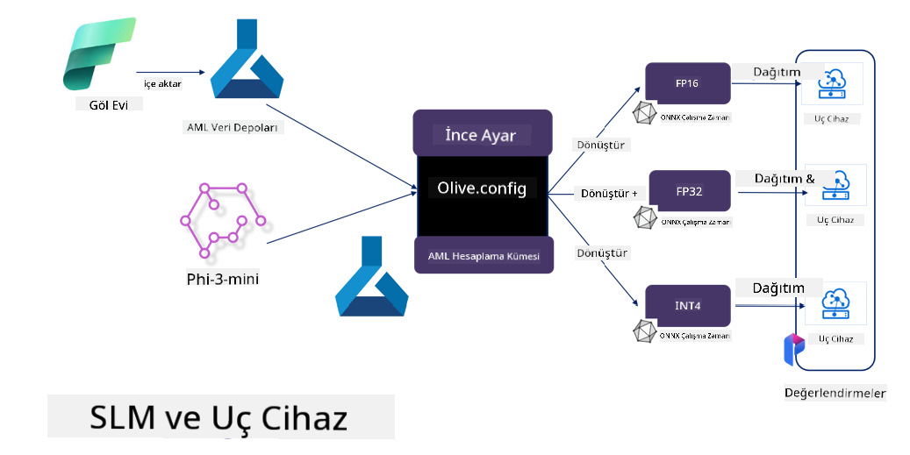

<!--
CO_OP_TRANSLATOR_METADATA:
{
  "original_hash": "5764be88ad2eb4f341e742eb8f14fab1",
  "translation_date": "2025-07-17T06:44:47+00:00",
  "source_file": "md/03.FineTuning/FineTuning_MicrosoftOlive.md",
  "language_code": "tr"
}
-->
# **Microsoft Olive ile Phi-3 İnce Ayarı**

[Olive](https://github.com/microsoft/OLive?WT.mc_id=aiml-138114-kinfeylo), model sıkıştırma, optimizasyon ve derleme alanlarında sektör lideri teknikleri bir araya getiren, kullanımı kolay donanım farkındalıklı bir model optimizasyon aracıdır.

Makine öğrenimi modellerini optimize etme sürecini kolaylaştırmak ve belirli donanım mimarilerinden en verimli şekilde yararlanılmasını sağlamak için tasarlanmıştır.

İster bulut tabanlı uygulamalar üzerinde çalışıyor olun, ister uç cihazlarda, Olive modellerinizi zahmetsiz ve etkili bir şekilde optimize etmenize olanak tanır.

## Temel Özellikler:
- Olive, hedef donanım için istenen optimizasyon tekniklerini bir araya getirir ve otomatikleştirir.
- Tek bir optimizasyon tekniği tüm senaryolara uymaz; bu nedenle Olive, sektör uzmanlarının kendi optimizasyon yeniliklerini entegre etmelerine olanak tanıyarak genişletilebilirlik sağlar.

## Mühendislik Çabasını Azaltın:
- Geliştiriciler, eğitilmiş modelleri dağıtıma hazırlamak ve optimize etmek için genellikle birden fazla donanım tedarikçisine özgü araç zincirini öğrenmek ve kullanmak zorundadır.
- Olive, istenen donanım için optimizasyon tekniklerini otomatikleştirerek bu deneyimi basitleştirir.

## Kullanıma Hazır Uçtan Uca Optimizasyon Çözümü:

Entegre teknikleri birleştirip ayarlayarak Olive, uçtan uca optimizasyon için birleşik bir çözüm sunar.
Modeli optimize ederken doğruluk ve gecikme gibi kısıtlamaları dikkate alır.

## Microsoft Olive ile İnce Ayar Yapmak

Microsoft Olive, jeneratif yapay zeka alanında hem ince ayar hem de referans için kullanılabilen, kullanımı çok kolay açık kaynaklı bir model optimizasyon aracıdır. Sadece basit bir yapılandırma gerektirir; açık kaynak küçük dil modelleri ve ilgili çalışma zamanı ortamları (AzureML / yerel GPU, CPU, DirectML) ile birleştirildiğinde, otomatik optimizasyon yoluyla modelin ince ayarını veya referansını tamamlayabilir ve buluta ya da uç cihazlara dağıtmak için en iyi modeli bulabilirsiniz. İşletmelerin kendi sektör dikey modellerini hem yerel hem de bulut ortamında oluşturmasına olanak tanır.


## Microsoft Olive ile Phi-3 İnce Ayarı



## Phi-3 Olive Örnek Kodu ve Örnek

Bu örnekte Olive kullanarak:

- LoRA adaptörünü ince ayar yaparak ifadeleri Üzgün, Neşeli, Korku, Sürpriz olarak sınıflandıracaksınız.
- Adaptör ağırlıklarını temel modele birleştireceksiniz.
- Modeli optimize edip int4 formatında kuantize edeceksiniz.

[Örnek Kod](../../code/03.Finetuning/olive-ort-example/README.md)

### Microsoft Olive Kurulumu

Microsoft Olive kurulumu çok basittir ve CPU, GPU, DirectML ve Azure ML için kurulabilir.

```bash
pip install olive-ai
```

Bir ONNX modelini CPU ile çalıştırmak isterseniz, şu komutu kullanabilirsiniz:

```bash
pip install olive-ai[cpu]
```

Bir ONNX modelini GPU ile çalıştırmak isterseniz, şu komutu kullanabilirsiniz:

```python
pip install olive-ai[gpu]
```

Azure ML kullanmak isterseniz, şu komutu kullanabilirsiniz:

```python
pip install git+https://github.com/microsoft/Olive#egg=olive-ai[azureml]
```

**Dikkat**
İşletim Sistemi gereksinimi: Ubuntu 20.04 / 22.04

### **Microsoft Olive Config.json**

Kurulumdan sonra, Config dosyası aracılığıyla veri, hesaplama, eğitim, dağıtım ve model oluşturma dahil olmak üzere farklı modele özgü ayarları yapılandırabilirsiniz.

**1. Veri**

Microsoft Olive üzerinde hem yerel veri hem de bulut verisi ile eğitim desteklenir ve ayarlarda yapılandırılabilir.

*Yerel veri ayarları*

İnce ayar için eğitilmesi gereken veri setini genellikle json formatında basitçe ayarlayabilir ve veri şablonuna uyarlayabilirsiniz. Bu, modelin gereksinimlerine göre ayarlanmalıdır (örneğin, Microsoft Phi-3-mini’nin gerektirdiği formata uyarlayın. Başka modelleriniz varsa, lütfen diğer modellerin ince ayar formatlarına bakarak işleyin).

```json

    "data_configs": [
        {
            "name": "dataset_default_train",
            "type": "HuggingfaceContainer",
            "load_dataset_config": {
                "params": {
                    "data_name": "json", 
                    "data_files":"dataset/dataset-classification.json",
                    "split": "train"
                }
            },
            "pre_process_data_config": {
                "params": {
                    "dataset_type": "corpus",
                    "text_cols": [
                            "phrase",
                            "tone"
                    ],
                    "text_template": "### Text: {phrase}\n### The tone is:\n{tone}",
                    "corpus_strategy": "join",
                    "source_max_len": 2048,
                    "pad_to_max_len": false,
                    "use_attention_mask": false
                }
            }
        }
    ],
```

**Bulut veri kaynağı ayarları**

Azure AI Studio/Azure Machine Learning Service’in veri deposunu bağlayarak buluttaki verilere erişebilir, Microsoft Fabric ve Azure Data üzerinden farklı veri kaynaklarını Azure AI Studio/Azure Machine Learning Service’e entegre ederek ince ayar için veri desteği sağlayabilirsiniz.

```json

    "data_configs": [
        {
            "name": "dataset_default_train",
            "type": "HuggingfaceContainer",
            "load_dataset_config": {
                "params": {
                    "data_name": "json", 
                    "data_files": {
                        "type": "azureml_datastore",
                        "config": {
                            "azureml_client": {
                                "subscription_id": "Your Azure Subscrition ID",
                                "resource_group": "Your Azure Resource Group",
                                "workspace_name": "Your Azure ML Workspaces name"
                            },
                            "datastore_name": "workspaceblobstore",
                            "relative_path": "Your train_data.json Azure ML Location"
                        }
                    },
                    "split": "train"
                }
            },
            "pre_process_data_config": {
                "params": {
                    "dataset_type": "corpus",
                    "text_cols": [
                            "Question",
                            "Best Answer"
                    ],
                    "text_template": "<|user|>\n{Question}<|end|>\n<|assistant|>\n{Best Answer}\n<|end|>",
                    "corpus_strategy": "join",
                    "source_max_len": 2048,
                    "pad_to_max_len": false,
                    "use_attention_mask": false
                }
            }
        }
    ],
    
```

**2. Hesaplama yapılandırması**

Yerel çalışmanız gerekiyorsa, doğrudan yerel veri kaynaklarını kullanabilirsiniz. Azure AI Studio / Azure Machine Learning Service kaynaklarını kullanmanız gerekiyorsa, ilgili Azure parametrelerini, hesaplama gücü adını vb. yapılandırmanız gerekir.

```json

    "systems": {
        "aml": {
            "type": "AzureML",
            "config": {
                "accelerators": ["gpu"],
                "hf_token": true,
                "aml_compute": "Your Azure AI Studio / Azure Machine Learning Service Compute Name",
                "aml_docker_config": {
                    "base_image": "Your Azure AI Studio / Azure Machine Learning Service docker",
                    "conda_file_path": "conda.yaml"
                }
            }
        },
        "azure_arc": {
            "type": "AzureML",
            "config": {
                "accelerators": ["gpu"],
                "aml_compute": "Your Azure AI Studio / Azure Machine Learning Service Compute Name",
                "aml_docker_config": {
                    "base_image": "Your Azure AI Studio / Azure Machine Learning Service docker",
                    "conda_file_path": "conda.yaml"
                }
            }
        }
    },
```

***Dikkat***

Azure AI Studio/Azure Machine Learning Service üzerinde konteyner aracılığıyla çalıştığı için gerekli ortamın yapılandırılması gerekir. Bu, conda.yaml ortamında yapılandırılır.

```yaml

name: project_environment
channels:
  - defaults
dependencies:
  - python=3.8.13
  - pip=22.3.1
  - pip:
      - einops
      - accelerate
      - azure-keyvault-secrets
      - azure-identity
      - bitsandbytes
      - datasets
      - huggingface_hub
      - peft
      - scipy
      - sentencepiece
      - torch>=2.2.0
      - transformers
      - git+https://github.com/microsoft/Olive@jiapli/mlflow_loading_fix#egg=olive-ai[gpu]
      - --extra-index-url https://aiinfra.pkgs.visualstudio.com/PublicPackages/_packaging/ORT-Nightly/pypi/simple/ 
      - ort-nightly-gpu==1.18.0.dev20240307004
      - --extra-index-url https://aiinfra.pkgs.visualstudio.com/PublicPackages/_packaging/onnxruntime-genai/pypi/simple/
      - onnxruntime-genai-cuda

    

```

**3. SLM Seçimi**

Modeli doğrudan Hugging Face’den kullanabilir veya Azure AI Studio / Azure Machine Learning’in Model Kataloğu ile entegre ederek kullanmak istediğiniz modeli seçebilirsiniz. Aşağıdaki kod örneğinde Microsoft Phi-3-mini kullanılacaktır.

Modeliniz yerel ise şu yöntemi kullanabilirsiniz:

```json

    "input_model":{
        "type": "PyTorchModel",
        "config": {
            "hf_config": {
                "model_name": "model-cache/microsoft/phi-3-mini",
                "task": "text-generation",
                "model_loading_args": {
                    "trust_remote_code": true
                }
            }
        }
    },
```

Azure AI Studio / Azure Machine Learning Service’den bir model kullanmak isterseniz şu yöntemi kullanabilirsiniz:

```json

    "input_model":{
        "type": "PyTorchModel",
        "config": {
            "model_path": {
                "type": "azureml_registry_model",
                "config": {
                    "name": "microsoft/Phi-3-mini-4k-instruct",
                    "registry_name": "azureml-msr",
                    "version": "11"
                }
            },
             "model_file_format": "PyTorch.MLflow",
             "hf_config": {
                "model_name": "microsoft/Phi-3-mini-4k-instruct",
                "task": "text-generation",
                "from_pretrained_args": {
                    "trust_remote_code": true
                }
            }
        }
    },
```

**Dikkat:**
Azure AI Studio / Azure Machine Learning Service ile entegrasyon gereklidir, bu nedenle model kurulumunda sürüm numarası ve ilgili isimlendirmeye dikkat edin.

Azure üzerindeki tüm modeller PyTorch.MLflow olarak ayarlanmalıdır.

Bir Hugging Face hesabınız olmalı ve anahtarı Azure AI Studio / Azure Machine Learning’in Key değerine bağlamalısınız.

**4. Algoritma**

Microsoft Olive, Lora ve QLora ince ayar algoritmalarını çok iyi kapsar. Yapmanız gereken sadece bazı ilgili parametreleri yapılandırmaktır. Burada QLora örnek olarak alınmıştır.

```json
        "lora": {
            "type": "LoRA",
            "config": {
                "target_modules": [
                    "o_proj",
                    "qkv_proj"
                ],
                "double_quant": true,
                "lora_r": 64,
                "lora_alpha": 64,
                "lora_dropout": 0.1,
                "train_data_config": "dataset_default_train",
                "eval_dataset_size": 0.3,
                "training_args": {
                    "seed": 0,
                    "data_seed": 42,
                    "per_device_train_batch_size": 1,
                    "per_device_eval_batch_size": 1,
                    "gradient_accumulation_steps": 4,
                    "gradient_checkpointing": false,
                    "learning_rate": 0.0001,
                    "num_train_epochs": 3,
                    "max_steps": 10,
                    "logging_steps": 10,
                    "evaluation_strategy": "steps",
                    "eval_steps": 187,
                    "group_by_length": true,
                    "adam_beta2": 0.999,
                    "max_grad_norm": 0.3
                }
            }
        },
```

Kuantizasyon dönüşümü yapmak isterseniz, Microsoft Olive ana dalı onnxruntime-genai yöntemini desteklemektedir. İhtiyacınıza göre ayarlayabilirsiniz:

1. Adaptör ağırlıklarını temel modele birleştirin
2. ModelBuilder ile modeli gereken hassasiyette onnx modeline dönüştürün

Örneğin, kuantize edilmiş INT4’e dönüştürme

```json

        "merge_adapter_weights": {
            "type": "MergeAdapterWeights"
        },
        "builder": {
            "type": "ModelBuilder",
            "config": {
                "precision": "int4"
            }
        }
```

**Dikkat**
- QLoRA kullanıyorsanız, ONNXRuntime-genai kuantizasyon dönüşümü şu an desteklenmemektedir.
- Burada belirtmek gerekir ki yukarıdaki adımları kendi ihtiyaçlarınıza göre ayarlayabilirsiniz. Tüm bu adımları tamamen yapılandırmak zorunda değilsiniz. İhtiyacınıza göre algoritmanın adımlarını doğrudan ince ayar yapmadan kullanabilirsiniz. Son olarak ilgili motorları yapılandırmanız gerekir.

```json

    "engine": {
        "log_severity_level": 0,
        "host": "aml",
        "target": "aml",
        "search_strategy": false,
        "execution_providers": ["CUDAExecutionProvider"],
        "cache_dir": "../model-cache/models/phi3-finetuned/cache",
        "output_dir" : "../model-cache/models/phi3-finetuned"
    }
```

**5. İnce ayar tamamlandı**

Komut satırında, olive-config.json dosyasının bulunduğu dizinde şu komutu çalıştırın:

```bash
olive run --config olive-config.json  
```

**Feragatname**:  
Bu belge, AI çeviri servisi [Co-op Translator](https://github.com/Azure/co-op-translator) kullanılarak çevrilmiştir. Doğruluk için çaba gösterilse de, otomatik çevirilerin hatalar veya yanlışlıklar içerebileceğini lütfen unutmayınız. Orijinal belge, kendi dilinde yetkili kaynak olarak kabul edilmelidir. Kritik bilgiler için profesyonel insan çevirisi önerilir. Bu çevirinin kullanımı sonucu oluşabilecek yanlış anlamalar veya yorum hatalarından sorumlu değiliz.