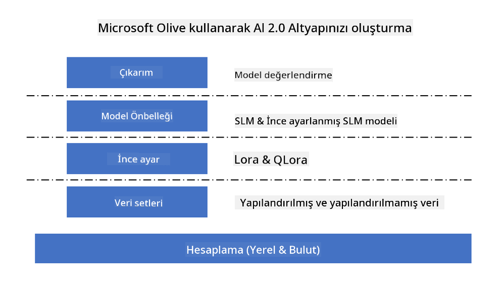
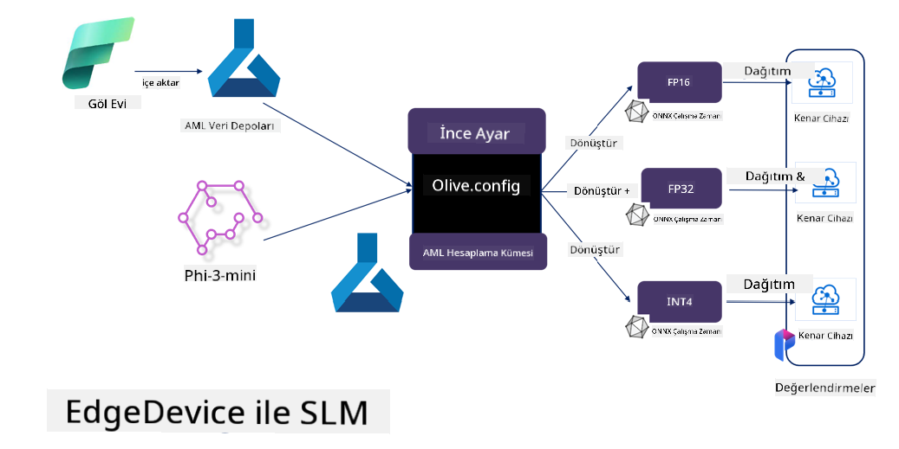

<!--
CO_OP_TRANSLATOR_METADATA:
{
  "original_hash": "5764be88ad2eb4f341e742eb8f14fab1",
  "translation_date": "2025-05-09T20:51:11+00:00",
  "source_file": "md/03.FineTuning/FineTuning_MicrosoftOlive.md",
  "language_code": "tr"
}
-->
# **Microsoft Olive ile Phi-3 İnce Ayarı**

[Olive](https://github.com/microsoft/OLive?WT.mc_id=aiml-138114-kinfeylo), model sıkıştırma, optimizasyon ve derleme alanında sektör lideri teknikleri bir araya getiren, kullanımı kolay donanım farkındalıklı bir model optimizasyon aracıdır.

Makine öğrenimi modellerinin optimize edilme sürecini kolaylaştırmak ve belirli donanım mimarilerinden en verimli şekilde yararlanmasını sağlamak için tasarlanmıştır.

İster bulut tabanlı uygulamalar üzerinde çalışıyor olun, ister uç cihazlarda, Olive modellerinizi zahmetsiz ve etkili bir şekilde optimize etmenizi sağlar.

## Temel Özellikler:
- Olive, hedeflenen donanım için optimizasyon tekniklerini toplar ve otomatikleştirir.
- Tek bir optimizasyon tekniği tüm senaryolara uymadığından, Olive, sektör uzmanlarının kendi optimizasyon yeniliklerini entegre etmelerine olanak tanıyarak genişletilebilirlik sağlar.

## Mühendislik Çabasını Azaltın:
- Geliştiricilerin, eğitilmiş modelleri dağıtıma hazırlamak ve optimize etmek için genellikle birden fazla donanım tedarikçisine özgü araç zincirini öğrenip kullanmaları gerekir.
- Olive, istenen donanım için optimizasyon tekniklerini otomatikleştirerek bu deneyimi basitleştirir.

## Kullanıma Hazır Uçtan Uca Optimizasyon Çözümü:

Entegre teknikleri birleştirip ayarlayarak, Olive uçtan uca optimizasyon için birleşik bir çözüm sunar.
Model optimizasyonunda doğruluk ve gecikme gibi kısıtlamaları göz önünde bulundurur.

## Microsoft Olive ile İnce Ayar Yapmak

Microsoft Olive, generatif yapay zeka alanında hem ince ayar hem de referans için kapsam sağlayabilen çok kullanışlı açık kaynaklı bir model optimizasyon aracıdır. Sadece basit bir yapılandırma gerektirir, açık kaynak küçük dil modelleri ve ilgili çalışma zamanı ortamları (AzureML / yerel GPU, CPU, DirectML) ile birleştirildiğinde, otomatik optimizasyon yoluyla modeli ince ayar yapabilir veya referans alabilir ve buluta ya da uç cihazlara dağıtmak üzere en iyi modeli bulabilirsiniz. İşletmelerin kendi sektör dikey modellerini yerinde ve bulutta oluşturmalarına olanak tanır.



## Microsoft Olive ile Phi-3 İnce Ayarı



## Phi-3 Olive Örnek Kodu ve Örnek

Bu örnekte Olive’ı kullanarak:

- LoRA adaptörünü ince ayar yaparak ifadeleri Üzgün, Neşeli, Korku, Sürpriz olarak sınıflandıracaksınız.
- Adaptör ağırlıklarını temel modele birleştireceksiniz.
- Modeli optimize edip int4 formatında kuantize edeceksiniz.

[Sample Code](../../code/03.Finetuning/olive-ort-example/README.md)

### Microsoft Olive Kurulumu

Microsoft Olive kurulumu çok basittir ve CPU, GPU, DirectML ve Azure ML için de kurulabilir.

```bash
pip install olive-ai
```

ONNX modelini CPU ile çalıştırmak isterseniz

```bash
pip install olive-ai[cpu]
```

ONNX modelini GPU ile çalıştırmak isterseniz

```python
pip install olive-ai[gpu]
```

Azure ML kullanmak isterseniz

```python
pip install git+https://github.com/microsoft/Olive#egg=olive-ai[azureml]
```

**Dikkat**
İşletim Sistemi gereksinimi: Ubuntu 20.04 / 22.04

### **Microsoft Olive Config.json**

Kurulumdan sonra Config dosyası aracılığıyla veri, hesaplama, eğitim, dağıtım ve model oluşturma gibi model spesifik farklı ayarları yapılandırabilirsiniz.

**1. Veri**

Microsoft Olive’da yerel veri ve bulut verisi üzerinde eğitim desteklenir ve ayarlarda yapılandırılabilir.

*Yerel veri ayarları*

İnce ayar için eğitilecek veri setini genellikle json formatında ve veri şablonuna uyacak şekilde kolayca ayarlayabilirsiniz. Bu, modelin gereksinimlerine göre (örneğin Microsoft Phi-3-mini’nin istediği formata uyarlamak gibi) ayarlanmalıdır. Başka modelleriniz varsa, ince ayar için gereken formatlar için ilgili modellere bakınız.

```json

    "data_configs": [
        {
            "name": "dataset_default_train",
            "type": "HuggingfaceContainer",
            "load_dataset_config": {
                "params": {
                    "data_name": "json", 
                    "data_files":"dataset/dataset-classification.json",
                    "split": "train"
                }
            },
            "pre_process_data_config": {
                "params": {
                    "dataset_type": "corpus",
                    "text_cols": [
                            "phrase",
                            "tone"
                    ],
                    "text_template": "### Text: {phrase}\n### The tone is:\n{tone}",
                    "corpus_strategy": "join",
                    "source_max_len": 2048,
                    "pad_to_max_len": false,
                    "use_attention_mask": false
                }
            }
        }
    ],
```

**Bulut veri kaynağı ayarları**

Azure AI Studio/Azure Machine Learning Service’in veri deposunu bağlayarak buluttaki verilere erişebilir, Microsoft Fabric ve Azure Data aracılığıyla farklı veri kaynaklarını Azure AI Studio/Azure Machine Learning Service’e entegre ederek ince ayar verisi için destek sağlayabilirsiniz.

```json

    "data_configs": [
        {
            "name": "dataset_default_train",
            "type": "HuggingfaceContainer",
            "load_dataset_config": {
                "params": {
                    "data_name": "json", 
                    "data_files": {
                        "type": "azureml_datastore",
                        "config": {
                            "azureml_client": {
                                "subscription_id": "Your Azure Subscrition ID",
                                "resource_group": "Your Azure Resource Group",
                                "workspace_name": "Your Azure ML Workspaces name"
                            },
                            "datastore_name": "workspaceblobstore",
                            "relative_path": "Your train_data.json Azure ML Location"
                        }
                    },
                    "split": "train"
                }
            },
            "pre_process_data_config": {
                "params": {
                    "dataset_type": "corpus",
                    "text_cols": [
                            "Question",
                            "Best Answer"
                    ],
                    "text_template": "<|user|>\n{Question}<|end|>\n<|assistant|>\n{Best Answer}\n<|end|>",
                    "corpus_strategy": "join",
                    "source_max_len": 2048,
                    "pad_to_max_len": false,
                    "use_attention_mask": false
                }
            }
        }
    ],
    
```

**2. Hesaplama yapılandırması**

Yerelde çalışmanız gerekiyorsa doğrudan yerel veri kaynaklarını kullanabilirsiniz. Azure AI Studio / Azure Machine Learning Service kaynaklarını kullanmanız gerekiyorsa ilgili Azure parametrelerini, hesaplama gücü adını vb. yapılandırmalısınız.

```json

    "systems": {
        "aml": {
            "type": "AzureML",
            "config": {
                "accelerators": ["gpu"],
                "hf_token": true,
                "aml_compute": "Your Azure AI Studio / Azure Machine Learning Service Compute Name",
                "aml_docker_config": {
                    "base_image": "Your Azure AI Studio / Azure Machine Learning Service docker",
                    "conda_file_path": "conda.yaml"
                }
            }
        },
        "azure_arc": {
            "type": "AzureML",
            "config": {
                "accelerators": ["gpu"],
                "aml_compute": "Your Azure AI Studio / Azure Machine Learning Service Compute Name",
                "aml_docker_config": {
                    "base_image": "Your Azure AI Studio / Azure Machine Learning Service docker",
                    "conda_file_path": "conda.yaml"
                }
            }
        }
    },
```

***Dikkat***

Azure AI Studio/Azure Machine Learning Service üzerinde bir konteyner aracılığıyla çalıştığı için gereken ortamın yapılandırılması gerekir. Bu, conda.yaml ortamında yapılandırılır.

```yaml

name: project_environment
channels:
  - defaults
dependencies:
  - python=3.8.13
  - pip=22.3.1
  - pip:
      - einops
      - accelerate
      - azure-keyvault-secrets
      - azure-identity
      - bitsandbytes
      - datasets
      - huggingface_hub
      - peft
      - scipy
      - sentencepiece
      - torch>=2.2.0
      - transformers
      - git+https://github.com/microsoft/Olive@jiapli/mlflow_loading_fix#egg=olive-ai[gpu]
      - --extra-index-url https://aiinfra.pkgs.visualstudio.com/PublicPackages/_packaging/ORT-Nightly/pypi/simple/ 
      - ort-nightly-gpu==1.18.0.dev20240307004
      - --extra-index-url https://aiinfra.pkgs.visualstudio.com/PublicPackages/_packaging/onnxruntime-genai/pypi/simple/
      - onnxruntime-genai-cuda

    

```

**3. SLM seçimi**

Modeli doğrudan Hugging Face’den kullanabilir veya Azure AI Studio / Azure Machine Learning’in Model Kataloğu ile entegre ederek kullanacağınız modeli seçebilirsiniz. Aşağıdaki kod örneğinde Microsoft Phi-3-mini örnek olarak kullanılmıştır.

Modeliniz yerel ise şu yöntemi kullanabilirsiniz

```json

    "input_model":{
        "type": "PyTorchModel",
        "config": {
            "hf_config": {
                "model_name": "model-cache/microsoft/phi-3-mini",
                "task": "text-generation",
                "model_loading_args": {
                    "trust_remote_code": true
                }
            }
        }
    },
```

Azure AI Studio / Azure Machine Learning Service’den model kullanmak isterseniz şu yöntemi kullanabilirsiniz

```json

    "input_model":{
        "type": "PyTorchModel",
        "config": {
            "model_path": {
                "type": "azureml_registry_model",
                "config": {
                    "name": "microsoft/Phi-3-mini-4k-instruct",
                    "registry_name": "azureml-msr",
                    "version": "11"
                }
            },
             "model_file_format": "PyTorch.MLflow",
             "hf_config": {
                "model_name": "microsoft/Phi-3-mini-4k-instruct",
                "task": "text-generation",
                "from_pretrained_args": {
                    "trust_remote_code": true
                }
            }
        }
    },
```

**Dikkat:**
Azure AI Studio / Azure Machine Learning Service ile entegrasyon gereklidir, bu nedenle model kurulumunda sürüm numarası ve ilgili isimlendirmeye dikkat edin.

Azure’daki tüm modeller PyTorch.MLflow olarak ayarlanmalıdır.

Hugging Face hesabınız olmalı ve anahtar Azure AI Studio / Azure Machine Learning’in Key değerine bağlanmalıdır.

**4. Algoritma**

Microsoft Olive, Lora ve QLora ince ayar algoritmalarını çok iyi paketler. Yapmanız gereken sadece bazı ilgili parametreleri yapılandırmaktır. Burada QLora örneği verilmiştir.

```json
        "lora": {
            "type": "LoRA",
            "config": {
                "target_modules": [
                    "o_proj",
                    "qkv_proj"
                ],
                "double_quant": true,
                "lora_r": 64,
                "lora_alpha": 64,
                "lora_dropout": 0.1,
                "train_data_config": "dataset_default_train",
                "eval_dataset_size": 0.3,
                "training_args": {
                    "seed": 0,
                    "data_seed": 42,
                    "per_device_train_batch_size": 1,
                    "per_device_eval_batch_size": 1,
                    "gradient_accumulation_steps": 4,
                    "gradient_checkpointing": false,
                    "learning_rate": 0.0001,
                    "num_train_epochs": 3,
                    "max_steps": 10,
                    "logging_steps": 10,
                    "evaluation_strategy": "steps",
                    "eval_steps": 187,
                    "group_by_length": true,
                    "adam_beta2": 0.999,
                    "max_grad_norm": 0.3
                }
            }
        },
```

Kuantizasyon dönüşümü yapmak isterseniz, Microsoft Olive ana dalı onnxruntime-genai yöntemini desteklemektedir. İhtiyacınıza göre ayarlayabilirsiniz:

1. Adaptör ağırlıklarını temel modele birleştir
2. ModelBuilder ile modeli gereken hassasiyette onnx modeline dönüştür

Örneğin kuantize edilmiş INT4’e dönüştürmek gibi

```json

        "merge_adapter_weights": {
            "type": "MergeAdapterWeights"
        },
        "builder": {
            "type": "ModelBuilder",
            "config": {
                "precision": "int4"
            }
        }
```

**Dikkat**
- QLoRA kullanıyorsanız, ONNXRuntime-genai’nin kuantizasyon dönüşümü şu anda desteklenmemektedir.
- Burada belirtmek gerekir ki yukarıdaki adımları kendi ihtiyacınıza göre ayarlayabilirsiniz. Yukarıdaki tüm adımları tamamen yapılandırmanız gerekmez. İhtiyacınıza bağlı olarak, algoritmanın adımlarını ince ayar yapmadan doğrudan kullanabilirsiniz. Son olarak ilgili motorları yapılandırmanız gerekir.

```json

    "engine": {
        "log_severity_level": 0,
        "host": "aml",
        "target": "aml",
        "search_strategy": false,
        "execution_providers": ["CUDAExecutionProvider"],
        "cache_dir": "../model-cache/models/phi3-finetuned/cache",
        "output_dir" : "../model-cache/models/phi3-finetuned"
    }
```

**5. İnce ayar tamamlandı**

Komut satırında, olive-config.json dosyasının bulunduğu dizinde çalıştırın

```bash
olive run --config olive-config.json  
```

**Feragatname**:  
Bu belge, AI çeviri servisi [Co-op Translator](https://github.com/Azure/co-op-translator) kullanılarak çevrilmiştir. Doğruluk için çaba göstersek de, otomatik çevirilerin hata veya yanlışlık içerebileceğini lütfen unutmayınız. Orijinal belge, kendi ana dilinde yetkili kaynak olarak kabul edilmelidir. Kritik bilgiler için profesyonel insan çevirisi önerilir. Bu çevirinin kullanımı sonucu oluşabilecek yanlış anlamalar veya yanlış yorumlamalardan dolayı sorumluluk kabul edilmemektedir.