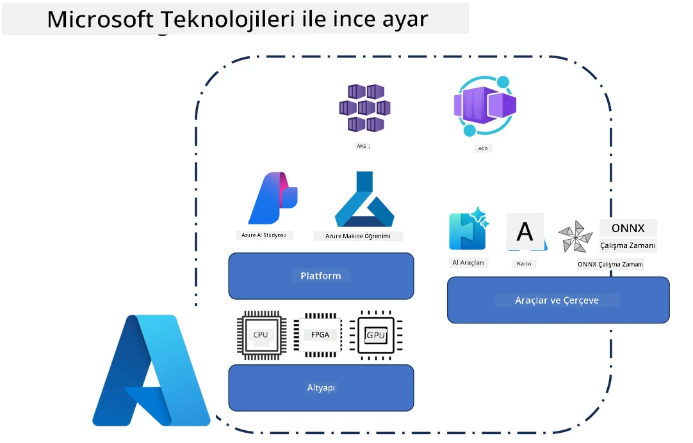
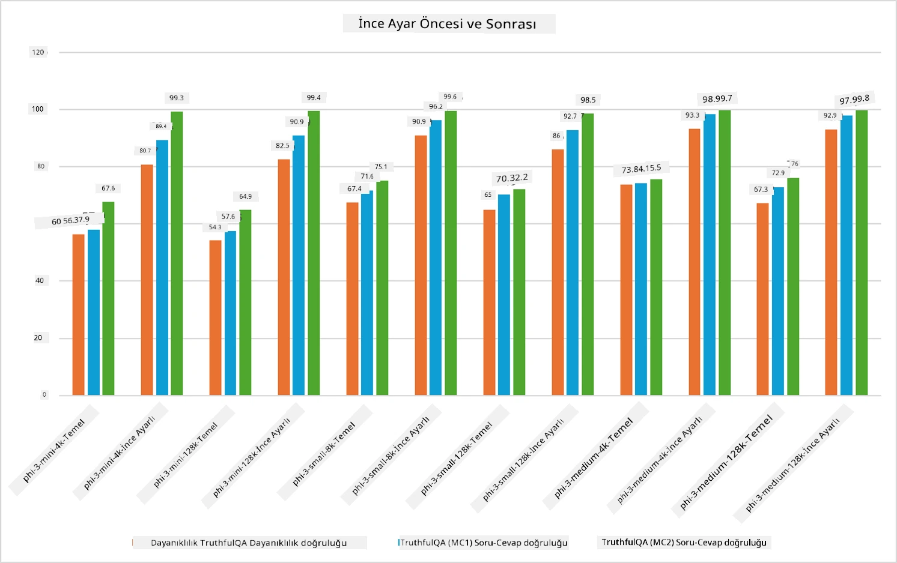

<!--
CO_OP_TRANSLATOR_METADATA:
{
  "original_hash": "cb5648935f63edc17e95ce38f23adc32",
  "translation_date": "2025-07-17T08:26:43+00:00",
  "source_file": "md/03.FineTuning/FineTuning_Scenarios.md",
  "language_code": "tr"
}
-->
## İnce Ayar Senaryoları

**Platform** Azure AI Foundry, Azure Machine Learning, AI Araçları, Kaito ve ONNX Runtime gibi çeşitli teknolojileri içerir.

**Altyapı** İnce ayar süreci için gerekli olan CPU ve FPGA'yı kapsar. Her bir teknolojinin simgelerini göstereyim.

**Araçlar ve Çerçeve** ONNX Runtime ve ONNX Runtime'ı içerir. Her bir teknolojinin simgelerini göstereyim.  
[ONNX Runtime ve ONNX Runtime için simgeler ekleyin]

Microsoft teknolojileriyle ince ayar süreci çeşitli bileşenler ve araçlar içerir. Bu teknolojileri anlayıp kullanarak uygulamalarımızı etkili bir şekilde ince ayarlayabilir ve daha iyi çözümler oluşturabiliriz.

## Hizmet Olarak Model

Hesaplama oluşturup yönetmeye gerek kalmadan barındırılan ince ayar ile modeli ince ayarlayın.

Phi-3-mini ve Phi-3-medium modelleri için sunucusuz ince ayar mevcuttur; bu sayede geliştiriciler, bulut ve uç senaryolar için modelleri hızlı ve kolayca özelleştirebilir, hesaplama ayarlamak zorunda kalmazlar. Ayrıca, Phi-3-small modelinin artık Hizmet Olarak Modeller (Models-as-a-Service) kapsamında sunulduğunu duyurduk; böylece geliştiriciler, altyapıyı yönetmeden yapay zeka geliştirmeye hızlıca başlayabilirler.

## Platform Olarak Model

Kullanıcılar, modellerini ince ayarlamak için kendi hesaplamalarını yönetirler.

[İnce Ayar Örneği](https://github.com/Azure/azureml-examples/blob/main/sdk/python/foundation-models/system/finetune/chat-completion/chat-completion.ipynb)

## İnce Ayar Senaryoları

| | | | | | | |
|-|-|-|-|-|-|-|
|Senaryo|LoRA|QLoRA|PEFT|DeepSpeed|ZeRO|DORA|
|Önceden eğitilmiş LLM'leri belirli görev veya alanlara uyarlama|Evet|Evet|Evet|Evet|Evet|Evet|
|Metin sınıflandırma, isim tanıma ve makine çevirisi gibi NLP görevleri için ince ayar|Evet|Evet|Evet|Evet|Evet|Evet|
|Soru-cevap görevleri için ince ayar|Evet|Evet|Evet|Evet|Evet|Evet|
|Sohbet botlarında insan benzeri yanıtlar üretmek için ince ayar|Evet|Evet|Evet|Evet|Evet|Evet|
|Müzik, sanat veya diğer yaratıcı içerikler üretmek için ince ayar|Evet|Evet|Evet|Evet|Evet|Evet|
|Hesaplama ve maliyetleri azaltma|Evet|Evet|Hayır|Evet|Evet|Hayır|
|Bellek kullanımını azaltma|Hayır|Evet|Hayır|Evet|Evet|Evet|
|Verimli ince ayar için daha az parametre kullanma|Hayır|Evet|Evet|Hayır|Hayır|Evet|
|Tüm GPU cihazlarının toplam GPU belleğine erişim sağlayan bellek verimli veri paralelliği|Hayır|Hayır|Hayır|Evet|Evet|Evet|

## İnce Ayar Performans Örnekleri

**Feragatname**:  
Bu belge, AI çeviri hizmeti [Co-op Translator](https://github.com/Azure/co-op-translator) kullanılarak çevrilmiştir. Doğruluk için çaba göstersek de, otomatik çevirilerin hatalar veya yanlışlıklar içerebileceğini lütfen unutmayınız. Orijinal belge, kendi dilinde yetkili kaynak olarak kabul edilmelidir. Kritik bilgiler için profesyonel insan çevirisi önerilir. Bu çevirinin kullanımı sonucu ortaya çıkabilecek yanlış anlamalar veya yorum hatalarından sorumlu değiliz.