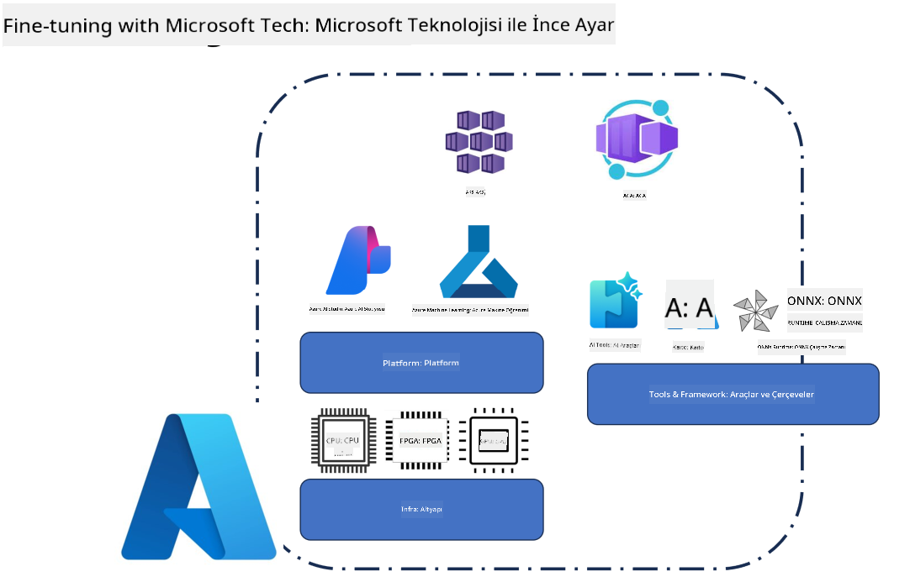
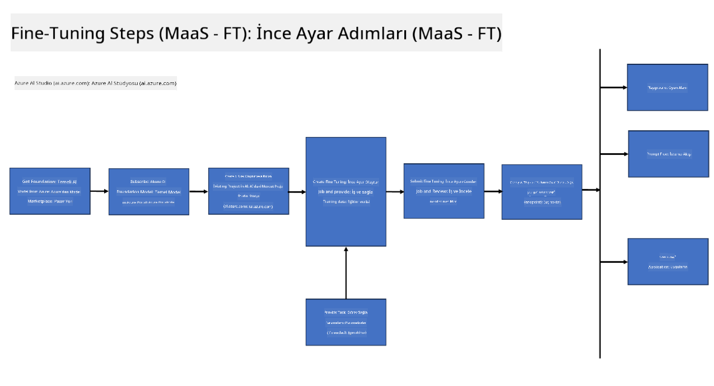
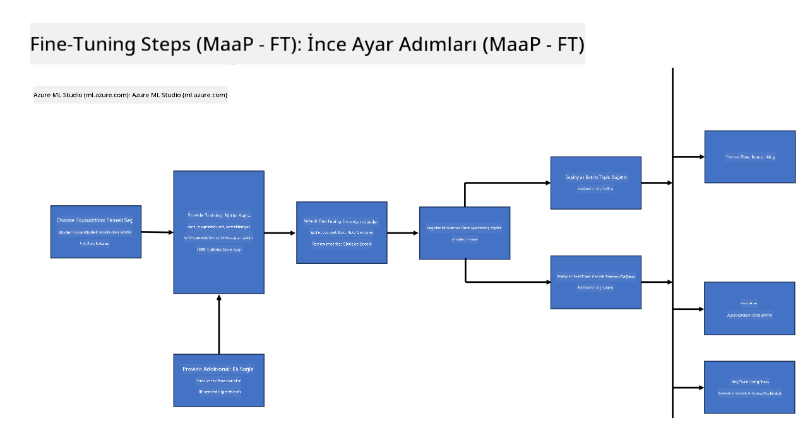
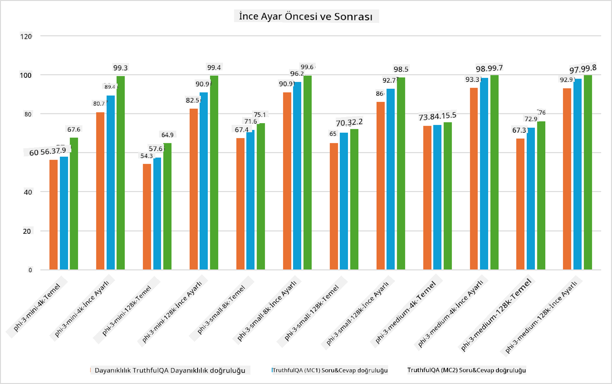

<!--
CO_OP_TRANSLATOR_METADATA:
{
  "original_hash": "cb5648935f63edc17e95ce38f23adc32",
  "translation_date": "2025-05-09T21:55:20+00:00",
  "source_file": "md/03.FineTuning/FineTuning_Scenarios.md",
  "language_code": "tr"
}
-->
## İnce Ayar Senaryoları

**Platform** Bu, Azure AI Foundry, Azure Machine Learning, AI Araçları, Kaito ve ONNX Runtime gibi çeşitli teknolojileri içerir.

**Altyapı** Bu, ince ayar süreci için gerekli olan CPU ve FPGA'yı kapsar. Her bir teknolojinin simgelerini göstereyim.

**Araçlar ve Çerçeve** Bu, ONNX Runtime'ı içerir. Her bir teknolojinin simgelerini göstereyim.  
[Insert icons for ONNX Runtime and ONNX Runtime]

Microsoft teknolojileriyle ince ayar süreci çeşitli bileşenler ve araçları içerir. Bu teknolojileri anlayıp kullanarak uygulamalarımızı etkili şekilde ince ayar yapabilir ve daha iyi çözümler oluşturabiliriz.

## Hizmet Olarak Model

Barındırılan ince ayar kullanarak modeli, hesaplama oluşturup yönetmeye gerek kalmadan ince ayarlayın.

Sunucusuz ince ayar, Phi-3-mini ve Phi-3-medium modelleri için mevcuttur; bu sayede geliştiriciler bulut ve uç senaryolar için modelleri hızlı ve kolayca özelleştirebilir, hesaplama ayarlamak zorunda kalmazlar. Ayrıca Phi-3-small modelinin artık Models-as-a-Service hizmetimiz üzerinden sunulduğunu duyurduk; böylece geliştiriciler altyapıyı yönetmeden hızlıca AI geliştirmeye başlayabilirler.

## Platform Olarak Model

Kullanıcılar, modellerini ince ayarlamak için kendi hesaplamalarını yönetirler.

[Fine Tuning Sample](https://github.com/Azure/azureml-examples/blob/main/sdk/python/foundation-models/system/finetune/chat-completion/chat-completion.ipynb)

## İnce Ayar Senaryoları

| | | | | | | |
|-|-|-|-|-|-|-|
|Senaryo|LoRA|QLoRA|PEFT|DeepSpeed|ZeRO|DORA|
|Önceden eğitilmiş LLM’leri belirli görev veya alanlara uyarlama|Evet|Evet|Evet|Evet|Evet|Evet|
|Metin sınıflandırma, isimlendirilmiş varlık tanıma ve makine çevirisi gibi NLP görevleri için ince ayar|Evet|Evet|Evet|Evet|Evet|Evet|
|Soru-cevap (QA) görevleri için ince ayar|Evet|Evet|Evet|Evet|Evet|Evet|
|Sohbet botlarında insan benzeri yanıtlar üretmek için ince ayar|Evet|Evet|Evet|Evet|Evet|Evet|
|Müzik, sanat veya diğer yaratıcı alanlar için ince ayar|Evet|Evet|Evet|Evet|Evet|Evet|
|Hesaplama ve maliyetleri azaltma|Evet|Evet|Hayır|Evet|Evet|Hayır|
|Bellek kullanımını azaltma|Hayır|Evet|Hayır|Evet|Evet|Evet|
|Verimli ince ayar için daha az parametre kullanma|Hayır|Evet|Evet|Hayır|Hayır|Evet|
|Tüm GPU cihazlarının toplam GPU belleğine erişim sağlayan bellek verimli veri paralelliği|Hayır|Hayır|Hayır|Evet|Evet|Evet|

## İnce Ayar Performans Örnekleri

**Feragatname**:  
Bu belge, AI çeviri hizmeti [Co-op Translator](https://github.com/Azure/co-op-translator) kullanılarak çevrilmiştir. Doğruluk için çaba gösterilse de, otomatik çevirilerin hatalar veya yanlışlıklar içerebileceğini lütfen unutmayınız. Orijinal belge, kendi ana dilinde yetkili kaynak olarak kabul edilmelidir. Kritik bilgiler için profesyonel insan çevirisi önerilir. Bu çevirinin kullanımı sonucunda ortaya çıkabilecek yanlış anlamalar veya yorum hatalarından sorumlu değiliz.