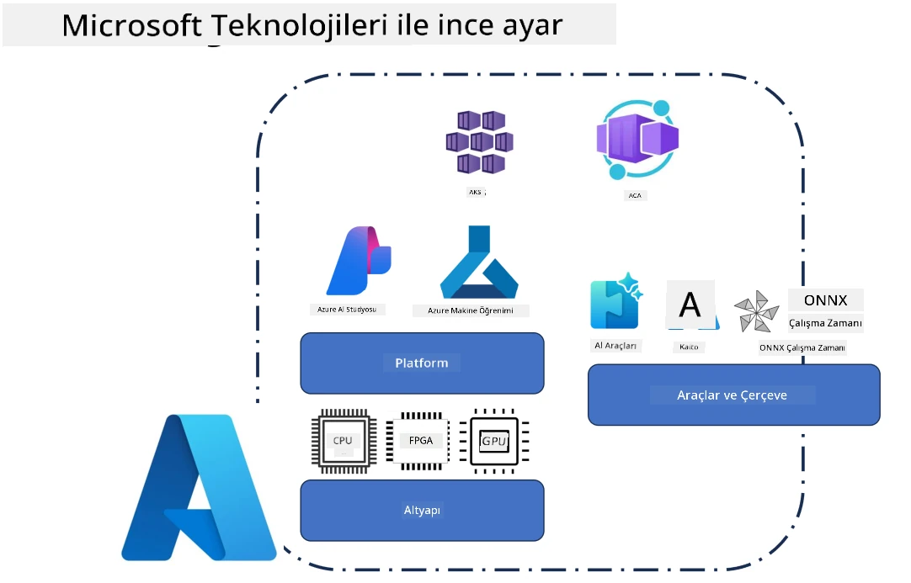
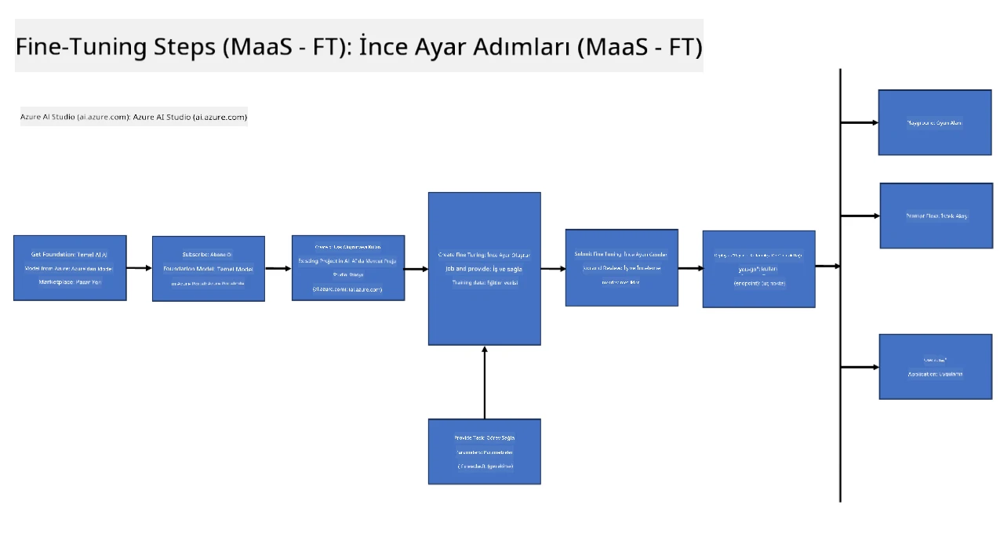
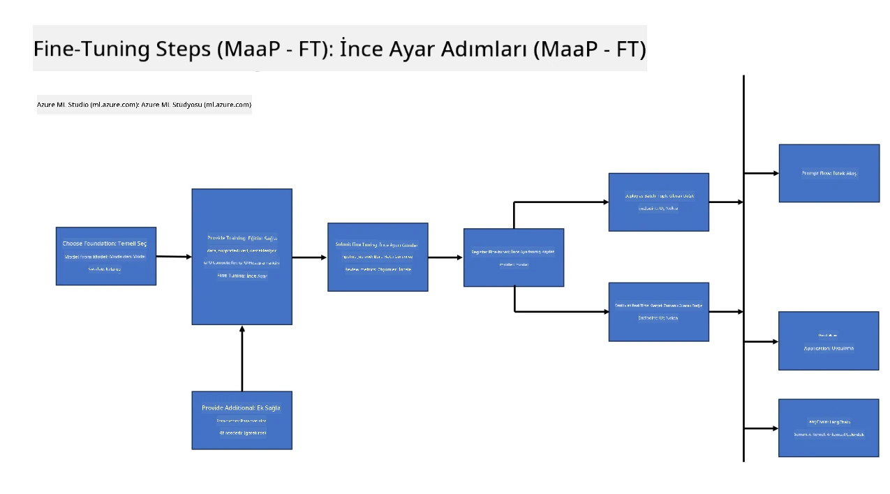
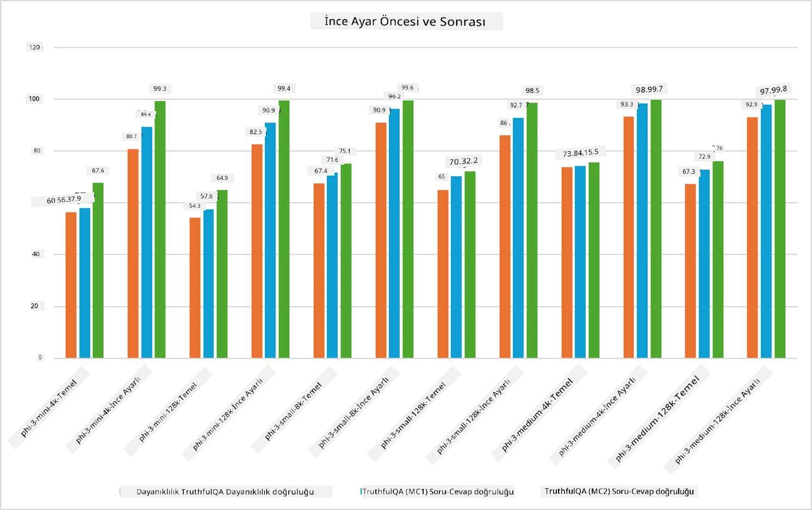

## İnce Ayar Senaryoları

Bu bölüm, Microsoft Foundry ve Azure ortamlarındaki ince ayar senaryolarına genel bir bakış sağlar; dağıtım modelleri, altyapı katmanları ve yaygın olarak kullanılan optimizasyon tekniklerini içerir.

**Platform**  
Bu, model yönetimi, orkestrasyon, deney takibi ve dağıtım iş akışları sağlayan Microsoft Foundry (eski adıyla Azure AI Foundry) ve Azure Machine Learning gibi yönetilen hizmetleri kapsar.

**Altyapı**  
İnce ayar ölçeklenebilir hesaplama kaynakları gerektirir. Azure ortamlarında bu tipik olarak GPU tabanlı sanal makineler ve hafif iş yükleri için CPU kaynakları ile veri setleri ve kontrol noktaları için ölçeklenebilir depolamayı içerir.

**Araçlar ve Çerçeve**  
İnce ayar iş akışları genellikle Hugging Face Transformers, DeepSpeed ve PEFT (Parametre Verimli İnce Ayar) gibi çerçevelere ve optimizasyon kütüphanelerine dayanır.

Microsoft teknolojileri ile ince ayar süreci platform hizmetleri, hesaplama altyapısı ve eğitim çerçevelerini kapsar. Bu bileşenlerin nasıl birlikte çalıştığını anlayarak, geliştiriciler temel modelleri belirli görevler ve üretim senaryolarına verimli şekilde uyarlayabilirler.

## Hizmet Olarak Model

Hesaplama oluşturup yönetmeye gerek kalmadan barındırılan ince ayar ile modeli ince ayarlayın.

Phi-3, Phi-3.5 ve Phi-4 model aileleri için sunucusuz ince ayar artık mevcuttur; geliştiricilerin modeli bulut ve uç senaryolara hızlı ve kolayca uyarlamasına olanak tanır.

## Platform Olarak Model

Kullanıcılar, modellerini ince ayarlamak için kendi hesaplama kaynaklarını yönetirler.

[İnce Ayar Örneği](https://github.com/Azure/azureml-examples/blob/main/sdk/python/foundation-models/system/finetune/chat-completion/chat-completion.ipynb)

## İnce Ayar Teknikleri Karşılaştırması

|Senaryo|LoRA|QLoRA|PEFT|DeepSpeed|ZeRO|DoRA|
|---|---|---|---|---|---|---|
|Önceden eğitilmiş LLM'leri belirli görev veya alanlara uyarlama|Evet|Evet|Evet|Evet|Evet|Evet|
|Metin sınıflandırma, adlandırılmış varlık tanıma ve makine çevirisi gibi NLP görevleri için ince ayar|Evet|Evet|Evet|Evet|Evet|Evet|
|Soru-cevap görevleri için ince ayar|Evet|Evet|Evet|Evet|Evet|Evet|
|Sohbet botlarında insan benzeri yanıtlar oluşturmak için ince ayar|Evet|Evet|Evet|Evet|Evet|Evet|
|Müzik, sanat veya diğer yaratıcı içerikler üretmek için ince ayar|Evet|Evet|Evet|Evet|Evet|Evet|
|Hesaplama ve finansal maliyetleri azaltma|Evet|Evet|Evet|Evet|Evet|Evet|
|Bellek kullanımını azaltma|Evet|Evet|Evet|Evet|Evet|Evet|
|Verimli ince ayar için daha az parametre kullanımı|Evet|Evet|Evet|Hayır|Hayır|Evet|
|Tüm GPU cihazlarının birikimli GPU belleğine erişim veren bellek verimli veri paralelliği|Hayır|Hayır|Hayır|Evet|Evet|Hayır|

> [!NOTE]
> LoRA, QLoRA, PEFT ve DoRA parametre-verimli ince ayar yöntemleridir, DeepSpeed ve ZeRO ise dağıtık eğitim ve bellek optimizasyonuna odaklanır.

## İnce Ayar Performans Örnekleri

---

<!-- CO-OP TRANSLATOR DISCLAIMER START -->
**Feragatname**:  
Bu belge, AI çeviri hizmeti [Co-op Translator](https://github.com/Azure/co-op-translator) kullanılarak çevrilmiştir. Doğruluk için çaba gösterilse de, otomatik çevirilerin hata veya yanlışlık içerebileceğini lütfen unutmayın. Orijinal belge, kendi dilinde yetkili kaynak olarak kabul edilmelidir. Kritik bilgiler için profesyonel insan çevirisi önerilir. Bu çevirinin kullanımı sonucu oluşabilecek yanlış anlamalar veya yorum hatalarından sorumlu değiliz.
<!-- CO-OP TRANSLATOR DISCLAIMER END -->