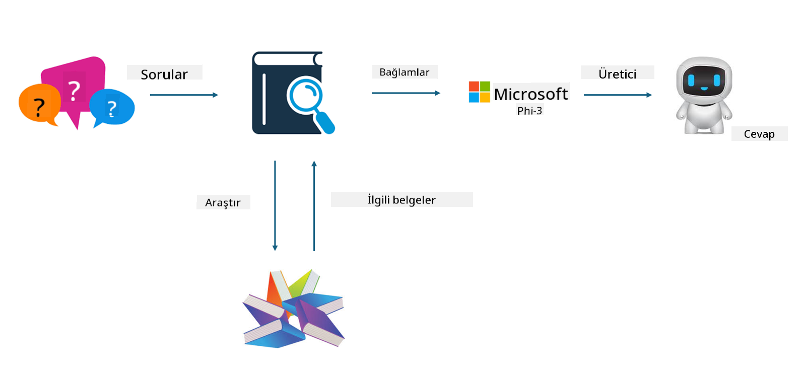

<!--
CO_OP_TRANSLATOR_METADATA:
{
  "original_hash": "e4e010400c2918557b36bb932a14004c",
  "translation_date": "2025-05-09T22:15:31+00:00",
  "source_file": "md/03.FineTuning/FineTuning_vs_RAG.md",
  "language_code": "tr"
}
-->
## İnce Ayar vs RAG

## Retrieval Augmented Generation

RAG, veri alma + metin üretimidir. Kuruluşun yapılandırılmış ve yapılandırılmamış verileri vektör veritabanında saklanır. İlgili içerik arandığında, ilgili özet ve içerik bulunarak bir bağlam oluşturulur ve LLM/SLM’nin metin tamamlama yeteneği ile birleştirilerek içerik üretilir.

## RAG Süreci

## İnce Ayar
İnce ayar, belirli bir modelin geliştirilmesine dayanır. Model algoritmasından başlanmasına gerek yoktur, ancak verilerin sürekli olarak birikmesi gerekir. Endüstri uygulamalarında daha hassas terimler ve dil kullanımı istiyorsanız, ince ayar sizin için daha iyi bir seçimdir. Ancak verileriniz sık sık değişiyorsa, ince ayar karmaşık hale gelebilir.

## Nasıl Seçilir
Cevabımızın dış veri kullanımını gerektirdiği durumlarda, RAG en iyi seçimdir.

Stabil ve kesin endüstri bilgisi vermeniz gerekiyorsa, ince ayar iyi bir tercih olacaktır. RAG, ilgili içeriği önceliklendirir ancak her zaman uzmanlık gerektiren nüansları tam olarak yakalayamayabilir.

İnce ayar yüksek kaliteli bir veri seti gerektirir ve eğer veri küçük bir alanı kapsıyorsa, çok büyük fark yaratmaz. RAG ise daha esnektir.

İnce ayar bir kara kutudur, metafiziktir ve iç mekanizmayı anlamak zordur. Ancak RAG, verinin kaynağını bulmayı kolaylaştırır, böylece halüsinasyonlar veya içerik hataları etkili bir şekilde düzeltilir ve daha iyi şeffaflık sağlanır.

**Feragatname**:  
Bu belge, AI çeviri hizmeti [Co-op Translator](https://github.com/Azure/co-op-translator) kullanılarak çevrilmiştir. Doğruluk için çaba göstersek de, otomatik çevirilerin hatalar veya yanlışlıklar içerebileceğini lütfen unutmayınız. Orijinal belge, kendi ana dilindeki haliyle yetkili kaynak olarak kabul edilmelidir. Kritik bilgiler için profesyonel insan çevirisi önerilir. Bu çevirinin kullanımı sonucu oluşabilecek yanlış anlamalar veya yorum hatalarından sorumlu değiliz.