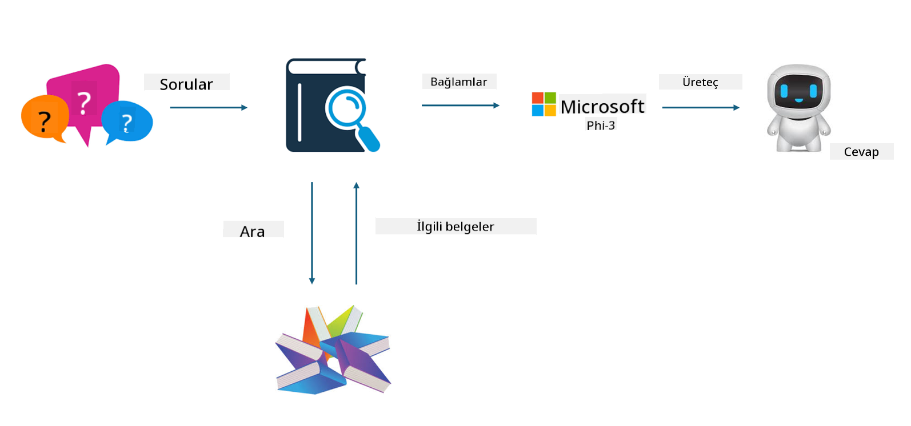

<!--
CO_OP_TRANSLATOR_METADATA:
{
  "original_hash": "e4e010400c2918557b36bb932a14004c",
  "translation_date": "2025-07-17T09:29:12+00:00",
  "source_file": "md/03.FineTuning/FineTuning_vs_RAG.md",
  "language_code": "tr"
}
-->
## İnce Ayar vs RAG

## Retrieval Augmented Generation

RAG, veri getirme + metin üretimidir. Kuruluşun yapılandırılmış ve yapılandırılmamış verileri vektör veritabanında saklanır. İlgili içerik arandığında, ilgili özet ve içerik bulunarak bir bağlam oluşturulur ve LLM/SLM’nin metin tamamlama yeteneği ile birleştirilerek içerik üretilir.

## RAG Süreci

## İnce Ayar
İnce ayar, belirli bir modelin geliştirilmesine dayanır. Model algoritmasıyla başlamak gerekmez, ancak verilerin sürekli birikmesi gerekir. Endüstri uygulamalarında daha hassas terimler ve dil ifadeleri istiyorsanız, ince ayar sizin için daha iyi bir seçenektir. Ancak verileriniz sık sık değişiyorsa, ince ayar karmaşık hale gelebilir.

## Nasıl Seçilir
Cevabımızın dış veri kullanımını gerektirdiği durumlarda, RAG en iyi seçenektir.

Sabit ve kesin endüstri bilgisi sunmanız gerekiyorsa, ince ayar iyi bir tercih olacaktır. RAG, ilgili içeriği çekmeye öncelik verir ancak her zaman uzmanlık gerektiren nüansları tam olarak yakalayamayabilir.

İnce ayar yüksek kaliteli bir veri seti gerektirir ve sadece küçük bir veri aralığı varsa çok fark yaratmaz. RAG daha esnektir.  
İnce ayar bir kara kutudur, metafiziktir ve iç mekanizmasını anlamak zordur. Ancak RAG, verinin kaynağını bulmayı kolaylaştırarak halüsinasyonları veya içerik hatalarını etkili şekilde düzeltmeyi ve daha iyi şeffaflık sağlamayı mümkün kılar.

**Feragatname**:  
Bu belge, AI çeviri servisi [Co-op Translator](https://github.com/Azure/co-op-translator) kullanılarak çevrilmiştir. Doğruluk için çaba göstersek de, otomatik çevirilerin hatalar veya yanlışlıklar içerebileceğini lütfen unutmayınız. Orijinal belge, kendi dilinde yetkili kaynak olarak kabul edilmelidir. Kritik bilgiler için profesyonel insan çevirisi önerilir. Bu çevirinin kullanımı sonucu oluşabilecek yanlış anlamalar veya yorum hatalarından sorumlu değiliz.