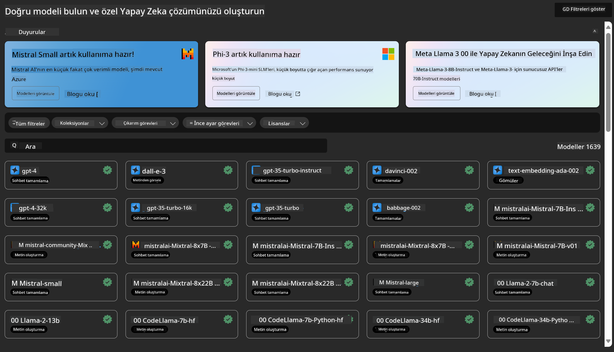
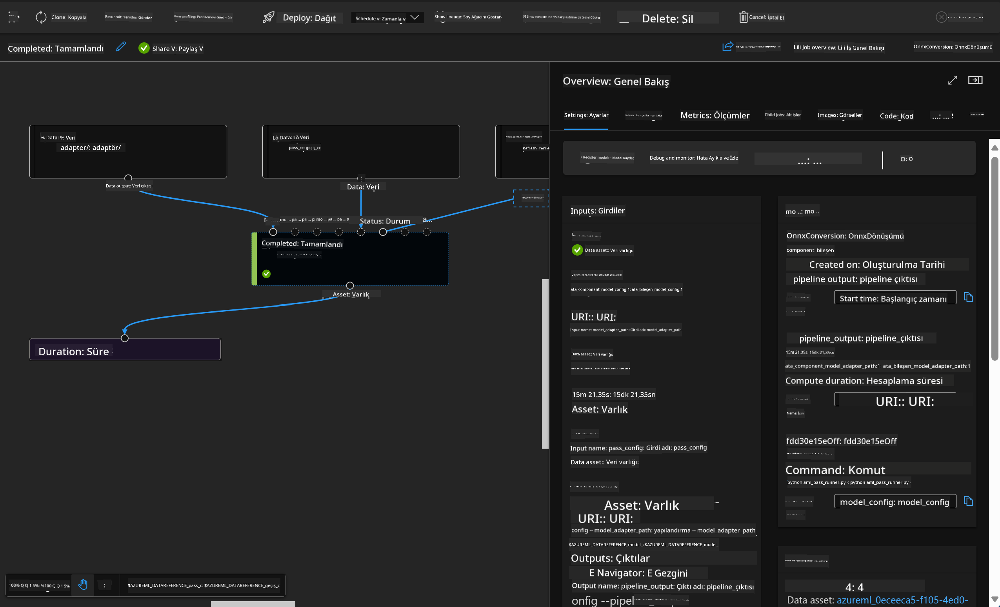

<!--
CO_OP_TRANSLATOR_METADATA:
{
  "original_hash": "7fe541373802e33568e94e13226d463c",
  "translation_date": "2025-05-09T22:19:57+00:00",
  "source_file": "md/03.FineTuning/Introduce_AzureML.md",
  "language_code": "tr"
}
-->
# **Azure Machine Learning Servisini Tanıtma**

[Azure Machine Learning](https://ml.azure.com?WT.mc_id=aiml-138114-kinfeylo), makine öğrenimi (ML) proje yaşam döngüsünü hızlandırmak ve yönetmek için bulut tabanlı bir hizmettir.

ML profesyonelleri, veri bilimcileri ve mühendisler günlük iş akışlarında şunları yapabilirler:

- Modelleri eğitmek ve dağıtmak.  
Makine öğrenimi operasyonlarını (MLOps) yönetmek.  
- Azure Machine Learning'de bir model oluşturabilir veya PyTorch, TensorFlow veya scikit-learn gibi açık kaynaklı platformlardan oluşturulmuş bir modeli kullanabilirsiniz.  
- MLOps araçları, modelleri izlemenize, yeniden eğitmenize ve yeniden dağıtmanıza yardımcı olur.

## Azure Machine Learning Kimler İçindir?

**Veri Bilimcileri ve ML Mühendisleri**

Günlük iş akışlarını hızlandırmak ve otomatikleştirmek için araçlar kullanabilirler.  
Azure ML, adalet, açıklanabilirlik, izleme ve denetlenebilirlik özellikleri sunar.  
Uygulama Geliştiricileri:  
Modelleri uygulamalara veya servislere sorunsuzca entegre edebilirler.

**Platform Geliştiricileri**

Dayanıklı Azure Resource Manager API’leri destekli güçlü araçlara erişimleri vardır.  
Bu araçlar gelişmiş ML araçları oluşturmayı sağlar.

**Kurumlar**

Microsoft Azure bulutunda çalışırken, tanıdık güvenlik ve rol tabanlı erişim kontrolünden faydalanırlar.  
Projeleri, korunan verilere ve belirli işlemlere erişimi kontrol edecek şekilde yapılandırabilirler.

## Takımdaki Herkes İçin Verimlilik  
ML projeleri genellikle farklı becerilere sahip bir ekip gerektirir.

Azure ML, şunları yapmanızı sağlayan araçlar sunar:  
- Paylaşılan not defterleri, hesaplama kaynakları, sunucusuz hesaplama, veri ve ortamlar aracılığıyla ekibinizle iş birliği yapmak.  
- Adalet, açıklanabilirlik, izleme ve denetlenebilirlik özellikleriyle modeller geliştirmek; soyutlama ve denetim uyumluluğu gereksinimlerini karşılamak.  
- ML modellerini hızlı ve kolayca ölçeklendirilmiş şekilde dağıtmak ve MLOps ile etkin biçimde yönetmek ve denetlemek.  
- Yerleşik yönetişim, güvenlik ve uyumluluk ile makine öğrenimi iş yüklerini her yerde çalıştırmak.

## Platformlar Arası Uyumluluk Araçları

ML ekibindeki herkes, işi tamamlamak için tercih ettiği araçları kullanabilir.  
Hızlı deneyler yürütmek, hiperparametre ayarı yapmak, boru hatları oluşturmak veya çıkarımları yönetmek fark etmez, tanıdık arayüzleri kullanabilirsiniz:  
- Azure Machine Learning Studio  
- Python SDK (v2)  
- Azure CLI (v2)  
- Azure Resource Manager REST API’leri  

Modelleri geliştirirken ve geliştirme süreci boyunca iş birliği yaparken, Azure Machine Learning studio UI içinde varlıkları, kaynakları ve metrikleri paylaşabilir ve bulabilirsiniz.

## **Azure ML’de LLM/SLM**

Azure ML, LLMOps ve SLMOps’u birleştirerek kurumsal çapta jeneratif yapay zeka teknolojisi platformu oluşturmak için birçok LLM/SLM ile ilgili fonksiyon ekledi.

### **Model Kataloğu**

Kurumsal kullanıcılar, farklı iş senaryolarına göre Model Kataloğu aracılığıyla farklı modelleri dağıtabilir ve Model as Service olarak kurumsal geliştiricilere veya kullanıcılara hizmet sağlayabilir.

Azure Machine Learning studio’daki Model Kataloğu, Jeneratif AI uygulamaları oluşturmanızı sağlayan çok çeşitli modelleri keşfetmek ve kullanmak için merkezdir. Model kataloğu, Azure OpenAI servisi, Mistral, Meta, Cohere, Nvidia, Hugging Face gibi model sağlayıcıları tarafından sunulan yüzlerce modeli içerir; ayrıca Microsoft tarafından eğitilmiş modeller de bulunur. Microsoft dışı sağlayıcılardan gelen modeller, Microsoft’un Ürün Koşullarında tanımlandığı gibi Microsoft Olmayan Ürünlerdir ve modelle birlikte sağlanan koşullara tabidir.

### **İş Boru Hattı**

Bir makine öğrenimi boru hattının temel amacı, tamamlanmış bir makine öğrenimi görevini çok adımlı bir iş akışına bölmektir. Her adım, ayrı ayrı geliştirilebilen, optimize edilebilen, yapılandırılabilen ve otomatikleştirilebilen yönetilebilir bir bileşendir. Adımlar iyi tanımlanmış arayüzlerle birbirine bağlanır. Azure Machine Learning boru hattı servisi, boru hattı adımları arasındaki tüm bağımlılıkları otomatik olarak düzenler.

SLM / LLM ince ayarında, verilerimizi, eğitim ve üretim süreçlerimizi Pipeline ile yönetebiliriz.

### **Prompt akışı**

Azure Machine Learning prompt flow kullanmanın faydaları  
Azure Machine Learning prompt flow, kullanıcıların fikir aşamasından deneylere ve nihayetinde üretime hazır LLM tabanlı uygulamalara geçişini kolaylaştıran çeşitli avantajlar sunar:

**Prompt mühendisliği çevikliği**

Etkileşimli yazım deneyimi: Azure Machine Learning prompt flow, akış yapısının görsel bir temsilini sağlar, böylece kullanıcılar projelerini kolayca anlayabilir ve gezinebilir. Ayrıca verimli akış geliştirme ve hata ayıklama için not defteri benzeri bir kodlama deneyimi sunar.  
Prompt ayarı için varyantlar: Kullanıcılar, birden fazla prompt varyantı oluşturabilir ve karşılaştırabilir, bu da yinelemeli bir iyileştirme sürecini kolaylaştırır.

Değerlendirme: Yerleşik değerlendirme akışları, kullanıcıların prompt ve akışlarının kalitesini ve etkinliğini ölçmesini sağlar.

Kapsamlı kaynaklar: Azure Machine Learning prompt flow, geliştirme için başlangıç noktası olan yerleşik araçlar, örnekler ve şablonlar kütüphanesi içerir; yaratıcılığı teşvik eder ve süreci hızlandırır.

**LLM tabanlı uygulamalar için kurumsal hazır olma**

İş birliği: Azure Machine Learning prompt flow, birden çok kullanıcının prompt mühendisliği projelerinde birlikte çalışmasına, bilgi paylaşmasına ve sürüm kontrolünü sağlamasına destek olur.

Hepsi bir arada platform: Azure Machine Learning prompt flow, geliştirme ve değerlendirmeden dağıtım ve izlemeye kadar tüm prompt mühendisliği sürecini kolaylaştırır. Kullanıcılar akışlarını Azure Machine Learning uç noktaları olarak zahmetsizce dağıtabilir ve performanslarını gerçek zamanlı izleyerek en iyi çalışmayı ve sürekli iyileştirmeyi sağlar.

Azure Machine Learning Kurumsal Hazırlık Çözümleri: Prompt flow, Azure Machine Learning’in güçlü kurumsal hazırlık çözümlerinden yararlanarak akışların geliştirilmesi, deneysel çalışması ve dağıtımı için güvenli, ölçeklenebilir ve güvenilir bir temel sunar.

Azure Machine Learning prompt flow ile kullanıcılar prompt mühendisliği çevikliklerini ortaya çıkarabilir, etkili iş birliği yapabilir ve başarılı LLM tabanlı uygulama geliştirme ve dağıtımı için kurumsal düzeyde çözümlerden faydalanabilirler.

Azure ML’in hesaplama gücünü, verilerini ve farklı bileşenlerini birleştirerek, kurumsal geliştiriciler kendi yapay zeka uygulamalarını kolayca oluşturabilirler.

**Feragatname**:  
Bu belge, [Co-op Translator](https://github.com/Azure/co-op-translator) adlı yapay zeka çeviri hizmeti kullanılarak çevrilmiştir. Doğruluk için çaba göstersek de, otomatik çevirilerin hatalar veya yanlışlıklar içerebileceğini lütfen unutmayınız. Orijinal belge, kendi dilinde yetkili kaynak olarak kabul edilmelidir. Kritik bilgiler için profesyonel insan çevirisi önerilir. Bu çevirinin kullanımı sonucu oluşabilecek yanlış anlamalar veya yanlış yorumlamalardan sorumlu değiliz.