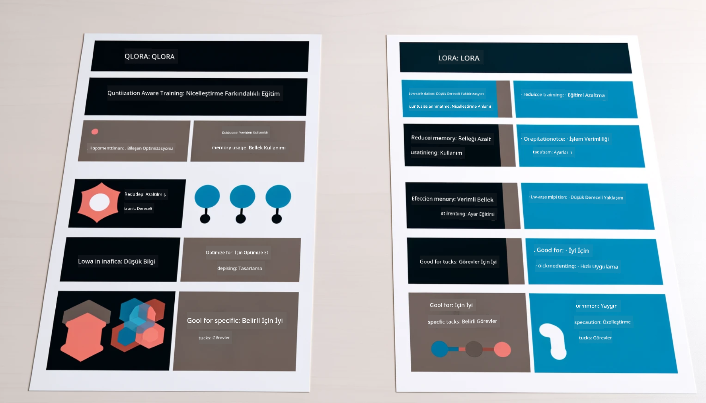

<!--
CO_OP_TRANSLATOR_METADATA:
{
  "original_hash": "743d7e9cb9c4e8ea642d77bee657a7fa",
  "translation_date": "2025-05-09T22:26:37+00:00",
  "source_file": "md/03.FineTuning/LetPhi3gotoIndustriy.md",
  "language_code": "tr"
}
-->
# **Phi-3’ün sektör uzmanı olmasını sağlamak**

Phi-3 modelini bir sektöre entegre etmek için, sektörle ilgili iş verilerini Phi-3 modeline eklemeniz gerekir. İki farklı seçeneğimiz var: ilki RAG (Retrieval Augmented Generation), ikincisi ise Fine Tuning.

## **RAG ve Fine-Tuning Karşılaştırması**

### **Retrieval Augmented Generation**

RAG, veri getirme + metin üretimidir. Kuruluşun yapılandırılmış ve yapılandırılmamış verileri vektör veritabanında saklanır. İlgili içerik arandığında, ilgili özet ve içerik bulunarak bir bağlam oluşturulur ve LLM/SLM’in metin tamamlama yeteneğiyle birleştirilerek içerik üretilir.

### **Fine-tuning**

Fine-tuning, belirli bir modelin geliştirilmesine dayanır. Model algoritmasıyla başlamak gerekmez, ancak veriler sürekli birikmelidir. Sektör uygulamalarında daha hassas terimler ve dil kullanımı istiyorsanız, fine-tuning daha iyi bir seçenektir. Ancak verileriniz sık sık değişiyorsa, fine-tuning karmaşık hale gelebilir.

### **Nasıl seçim yapılır**

1. Cevabımızın dış veri kullanmasını gerektiriyorsa, RAG en iyi seçenektir

2. Stabil ve hassas sektör bilgisi sunmanız gerekiyorsa, fine-tuning iyi bir tercih olur. RAG ilgili içeriği çekmeye öncelik verir ancak her zaman uzmanlık detaylarını yakalayamayabilir.

3. Fine-tuning yüksek kaliteli veri seti gerektirir ve sadece küçük bir veri aralığı varsa çok fark yaratmaz. RAG daha esnektir.

4. Fine-tuning bir kara kutudur, metafiziktir ve iç mekanizmasını anlamak zordur. Ancak RAG, verinin kaynağını bulmayı kolaylaştırır, böylece halüsinasyonlar veya içerik hataları daha etkili şekilde düzeltilir ve daha iyi şeffaflık sağlar.

### **Senaryolar**

1. Dikey sektörler özel profesyonel kelime ve ifadeler gerektirir, ***Fine-tuning*** en iyi seçenektir

2. Farklı bilgi noktalarının sentezini içeren SSS sistemi için, ***RAG*** en iyi seçenektir

3. Otomatik iş akışlarının kombinasyonu için ***RAG + Fine-tuning*** en iyi seçenektir

## **RAG nasıl kullanılır**

Vektör veritabanı, verilerin matematiksel formda saklandığı bir koleksiyondur. Vektör veritabanları, makine öğrenimi modellerinin önceki girdileri hatırlamasını kolaylaştırır ve arama, öneri ve metin üretimi gibi kullanım durumlarını desteklemek için makine öğreniminin kullanılmasını sağlar. Veriler, tam eşleşmeler yerine benzerlik ölçütlerine göre tanımlanabilir, böylece bilgisayar modelleri verinin bağlamını anlayabilir.

Vektör veritabanı, RAG’in gerçekleşmesinin anahtarıdır. Metin-embedding-3, jina-ai-embedding gibi vektör modelleri aracılığıyla verileri vektör depolamaya dönüştürebiliriz.

RAG uygulaması oluşturma hakkında daha fazla bilgi için [https://github.com/microsoft/Phi-3CookBook](https://github.com/microsoft/Phi-3CookBook?WT.mc_id=aiml-138114-kinfeylo) adresini ziyaret edin.

## **Fine-tuning nasıl kullanılır**

Fine-tuning’de yaygın kullanılan algoritmalar Lora ve QLora’dır. Nasıl seçilir?
- [Bu örnek defter ile daha fazla bilgi edinin](../../../../code/04.Finetuning/Phi_3_Inference_Finetuning.ipynb)
- [Python FineTuning örneği](../../../../code/04.Finetuning/FineTrainingScript.py)

### **Lora ve QLora**

LoRA (Low-Rank Adaptation) ve QLoRA (Quantized Low-Rank Adaptation), büyük dil modellerini (LLM’leri) Parametre Verimli İnce Ayar (PEFT) kullanarak ince ayar yapmak için kullanılan tekniklerdir. PEFT teknikleri, modelleri geleneksel yöntemlerden daha verimli şekilde eğitmek için tasarlanmıştır.  
LoRA, ağırlık güncelleme matrisine düşük rütbeli bir yaklaşım uygulayarak bellek kullanımını azaltan bağımsız bir ince ayar tekniğidir. Hızlı eğitim süreleri sunar ve geleneksel fine-tuning yöntemlerine yakın performans sağlar.

QLoRA, bellek kullanımını daha da azaltmak için kuantizasyon tekniklerini içeren LoRA’nın genişletilmiş bir versiyonudur. QLoRA, önceden eğitilmiş LLM’deki ağırlık parametrelerinin hassasiyetini 4-bit seviyesine kuantize eder, bu da LoRA’dan daha bellek verimlidir. Ancak, ek kuantizasyon ve dekuantizasyon adımları nedeniyle QLoRA eğitimi LoRA eğitiminden yaklaşık %30 daha yavaştır.

QLoRA, kuantizasyon sırasında oluşan hataları düzeltmek için LoRA’yı bir yardımcı olarak kullanır. QLoRA, milyarlarca parametreye sahip devasa modellerin nispeten küçük ve yaygın GPU’larda ince ayarını mümkün kılar. Örneğin, QLoRA 70B parametreli bir modeli 36 GPU gerektiren bir ortamda yalnızca 2 GPU ile ince ayar yapabilir.

**Feragatname**:  
Bu belge, AI çeviri hizmeti [Co-op Translator](https://github.com/Azure/co-op-translator) kullanılarak çevrilmiştir. Doğruluk için çaba göstersek de, otomatik çevirilerin hatalar veya yanlışlıklar içerebileceğini lütfen unutmayınız. Orijinal belge, kendi dilinde yetkili kaynak olarak kabul edilmelidir. Kritik bilgiler için profesyonel insan çevirisi önerilir. Bu çevirinin kullanımı sonucu ortaya çıkabilecek herhangi bir yanlış anlama veya yorumlama için sorumluluk kabul edilmemektedir.