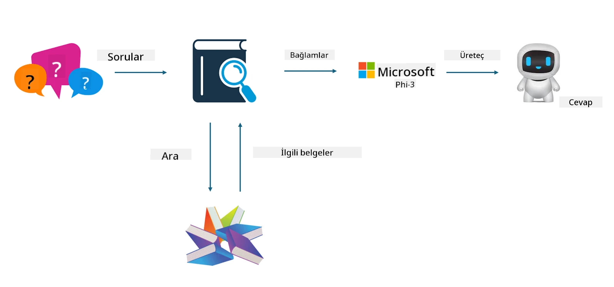

<!--
CO_OP_TRANSLATOR_METADATA:
{
  "original_hash": "743d7e9cb9c4e8ea642d77bee657a7fa",
  "translation_date": "2025-07-17T09:56:35+00:00",
  "source_file": "md/03.FineTuning/LetPhi3gotoIndustriy.md",
  "language_code": "tr"
}
-->
# **Phi-3'ü bir sektör uzmanı haline getirin**

Phi-3 modelini bir sektöre entegre etmek için, sektöre ait iş verilerini Phi-3 modeline eklemeniz gerekir. İki farklı seçeneğimiz var: ilki RAG (Retrieval Augmented Generation), ikincisi ise Fine Tuning (İnce Ayar).

## **RAG ve Fine-Tuning Karşılaştırması**

### **Retrieval Augmented Generation**

RAG, veri getirme + metin üretimidir. Kuruluşun yapılandırılmış ve yapılandırılmamış verileri vektör veritabanında saklanır. İlgili içerik arandığında, ilgili özet ve içerik bulunarak bir bağlam oluşturulur ve LLM/SLM’nin metin tamamlama yeteneği ile birleştirilerek içerik üretilir.

### **Fine-tuning**

Fine-tuning, belirli bir modelin geliştirilmesine dayanır. Model algoritmasıyla başlamak gerekmez, ancak veriler sürekli olarak biriktirilmelidir. Sektör uygulamalarında daha hassas terminoloji ve dil ifadesi istiyorsanız, fine-tuning daha iyi bir seçenektir. Ancak verileriniz sık sık değişiyorsa, fine-tuning karmaşık hale gelebilir.

### **Nasıl seçim yapılır**

1. Cevabımızda dış veri kullanımı gerekiyorsa, RAG en iyi seçenektir.

2. Kararlı ve kesin sektör bilgisi sunmanız gerekiyorsa, fine-tuning iyi bir tercih olur. RAG ilgili içeriği çekmeye öncelik verir ancak her zaman uzmanlık nüanslarını tam yakalayamayabilir.

3. Fine-tuning yüksek kaliteli bir veri seti gerektirir ve sadece küçük bir veri aralığı varsa çok fark yaratmaz. RAG daha esnektir.

4. Fine-tuning bir kara kutudur, metafizik gibidir ve iç mekanizmasını anlamak zordur. Ancak RAG, verinin kaynağını bulmayı kolaylaştırır, böylece halüsinasyonları veya içerik hatalarını etkili şekilde düzeltebilir ve daha iyi şeffaflık sağlar.

### **Senaryolar**

1. Dikey sektörler özel profesyonel kelime ve ifadeler gerektiriyorsa, ***Fine-tuning*** en iyi seçimdir.

2. Farklı bilgi noktalarının sentezini içeren Soru-Cevap sistemlerinde, ***RAG*** en iyi seçimdir.

3. Otomatik iş akışlarının birleşiminde ***RAG + Fine-tuning*** en iyi seçimdir.

## **RAG Nasıl Kullanılır**

Vektör veritabanı, verilerin matematiksel formda saklandığı bir koleksiyondur. Vektör veritabanları, makine öğrenimi modellerinin önceki girdileri hatırlamasını kolaylaştırır ve arama, öneri ve metin üretimi gibi kullanım senaryolarını desteklemek için makine öğreniminin kullanılmasını sağlar. Veriler, tam eşleşmeler yerine benzerlik ölçütlerine göre tanımlanabilir, böylece bilgisayar modelleri verinin bağlamını anlayabilir.

Vektör veritabanı, RAG’in gerçekleşmesinin anahtarıdır. Verileri text-embedding-3, jina-ai-embedding gibi vektör modelleri aracılığıyla vektör depolamaya dönüştürebiliriz.

RAG uygulaması oluşturma hakkında daha fazla bilgi edinin [https://github.com/microsoft/Phi-3CookBook](https://github.com/microsoft/Phi-3CookBook?WT.mc_id=aiml-138114-kinfeylo)

## **Fine-tuning Nasıl Kullanılır**

Fine-tuning’de yaygın kullanılan algoritmalar Lora ve QLora’dır. Nasıl seçilir?
- [Bu örnek defterle daha fazla öğrenin](../../../../code/04.Finetuning/Phi_3_Inference_Finetuning.ipynb)
- [Python FineTuning Örneği](../../../../code/04.Finetuning/FineTrainingScript.py)

### **Lora ve QLora**

LoRA (Low-Rank Adaptation) ve QLoRA (Quantized Low-Rank Adaptation), büyük dil modellerini (LLM) Parametre Verimli İnce Ayar (PEFT) kullanarak ince ayar yapmak için kullanılan tekniklerdir. PEFT teknikleri, modelleri geleneksel yöntemlere göre daha verimli eğitmek için tasarlanmıştır.  
LoRA, ağırlık güncelleme matrisine düşük dereceli bir yaklaşım uygulayarak bellek kullanımını azaltan bağımsız bir ince ayar tekniğidir. Hızlı eğitim süreleri sunar ve performansı geleneksel ince ayar yöntemlerine yakın tutar.

QLoRA, LoRA’nın genişletilmiş bir versiyonudur ve bellek kullanımını daha da azaltmak için kuantizasyon tekniklerini içerir. QLoRA, önceden eğitilmiş LLM’deki ağırlık parametrelerinin hassasiyetini 4-bit’e kuantize eder, bu da LoRA’dan daha bellek verimlidir. Ancak, QLoRA eğitimi, ek kuantizasyon ve dekuantizasyon adımları nedeniyle LoRA eğitiminden yaklaşık %30 daha yavaştır.

QLoRA, kuantizasyon sırasında oluşan hataları düzeltmek için LoRA’yı bir aksesuar olarak kullanır. QLoRA, milyarlarca parametreye sahip devasa modellerin nispeten küçük ve yaygın GPU’larda ince ayar yapılmasını sağlar. Örneğin, QLoRA 36 GPU gerektiren 70B parametreli bir modeli sadece 2 GPU ile ince ayar yapabilir.

**Feragatname**:  
Bu belge, AI çeviri servisi [Co-op Translator](https://github.com/Azure/co-op-translator) kullanılarak çevrilmiştir. Doğruluk için çaba göstersek de, otomatik çevirilerin hatalar veya yanlışlıklar içerebileceğini lütfen unutmayınız. Orijinal belge, kendi dilinde yetkili kaynak olarak kabul edilmelidir. Kritik bilgiler için profesyonel insan çevirisi önerilir. Bu çevirinin kullanımı sonucu oluşabilecek yanlış anlamalar veya yorum hatalarından sorumlu değiliz.