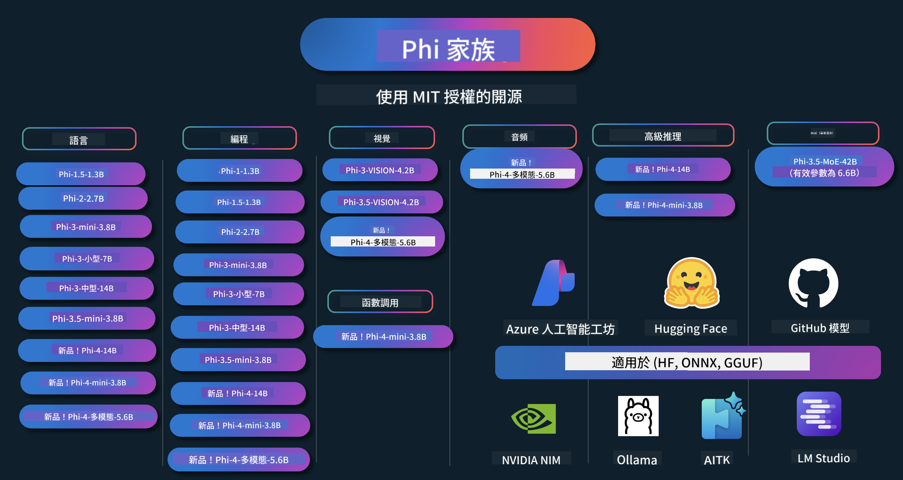

<!--
CO_OP_TRANSLATOR_METADATA:
{
  "original_hash": "10139744c0f1757a5ade1c66749e803f",
  "translation_date": "2025-05-04T13:38:34+00:00",
  "source_file": "README.md",
  "language_code": "tw"
}
-->
# Phi Cookbook: 使用 Microsoft Phi 模型的實作範例

Phi 是微軟開發的一系列開源 AI 模型。

Phi 目前是最強大且具成本效益的小型語言模型（SLM），在多語言、推理、文字/聊天生成、程式碼、影像、音訊及其他場景中都有優異的基準表現。

你可以將 Phi 部署到雲端或邊緣裝置，並且能輕鬆用有限的運算資源打造生成式 AI 應用。

按照以下步驟開始使用這些資源：
1. **Fork 這個儲存庫**：點擊 
2. **Clone 這個儲存庫**：   `git clone https://github.com/microsoft/PhiCookBook.git`
3. [**加入 Microsoft AI Discord 社群，與專家及其他開發者交流**](https://discord.com/invite/ByRwuEEgH4?WT.mc_id=aiml-137032-kinfeylo)

## 🌐 多語言支援
[法文](../fr/README.md) | [西班牙文](../es/README.md) | [德文](../de/README.md) | [俄文](../ru/README.md) | [阿拉伯文](../ar/README.md) | [波斯文 (法爾西語)](../fa/README.md) | [烏爾都文](../ur/README.md) | [中文 (簡體)](../zh/README.md) | [中文 (繁體，澳門)](../mo/README.md) | [中文 (繁體，香港)](../hk/README.md) | [中文 (繁體，台灣)](./README.md) | [日文](../ja/README.md) | [韓文](../ko/README.md) | [印地文](../hi/README.md) [孟加拉文](../bn/README.md) | [馬拉地文](../mr/README.md) | [尼泊爾文](../ne/README.md) | [旁遮普文 (古魯穆奇)](../pa/README.md) | [葡萄牙文 (葡萄牙)](../pt/README.md) | [葡萄牙文 (巴西)](../br/README.md) | [義大利文](../it/README.md) | [波蘭文](../pl/README.md) | [土耳其文](../tr/README.md) | [希臘文](../el/README.md) | [泰文](../th/README.md) | [瑞典文](../sv/README.md) | [丹麥文](../da/README.md) | [挪威文](../no/README.md) | [芬蘭文](../fi/README.md) | [荷蘭文](../nl/README.md) | [希伯來文](../he/README.md) | [越南文](../vi/README.md) | [印尼文](../id/README.md) | [馬來文](../ms/README.md) | [他加祿文 (菲律賓語)](../tl/README.md) | [斯瓦希里文](../sw/README.md) | [匈牙利文](../hu/README.md) | [捷克文](../cs/README.md) | [斯洛伐克文](../sk/README.md) | [羅馬尼亞文](../ro/README.md) | [保加利亞文](../bg/README.md) | [塞爾維亞文 (西里爾字母)](../sr/README.md) | [克羅埃西亞文](../hr/README.md) | [斯洛維尼亞文](../sl/README.md)請從左到右書寫輸出。

[法文](../fr/README.md) | [西班牙文](../es/README.md) | [德文](../de/README.md) | [俄文](../ru/README.md) | [阿拉伯文](../ar/README.md) | [波斯文 (法爾西語)](../fa/README.md) | [烏爾都文](../ur/README.md) | [中文 (簡體)](../zh/README.md) | [中文 (繁體，澳門)](../mo/README.md) | [中文 (繁體，香港)](../hk/README.md) | [中文 (繁體，台灣)](./README.md) | [日文](../ja/README.md) | [韓文](../ko/README.md) | [印地文](../hi/README.md) [孟加拉文](../bn/README.md) | [馬拉地文](../mr/README.md) | [尼泊爾文](../ne/README.md) | [旁遮普文 (古魯穆奇)](../pa/README.md) | [葡萄牙文 (葡萄牙)](../pt/README.md) | [葡萄牙文 (巴西)](../br/README.md) | [義大利文](../it/README.md) | [波蘭文](../pl/README.md) | [土耳其文](../tr/README.md) | [希臘文](../el/README.md) | [泰文](../th/README.md) | [瑞典文](../sv/README.md) | [丹麥文](../da/README.md) | [挪威文](../no/README.md) | [芬蘭文](../fi/README.md) | [荷蘭文](../nl/README.md) | [希伯來文](../he/README.md) | [越南文](../vi/README.md) | [印尼文](../id/README.md) | [馬來文](../ms/README.md) | [他加祿文 (菲律賓語)](../tl/README.md) | [斯瓦希里文](../sw/README.md) | [匈牙利文](../hu/README.md) | [捷克文](../cs/README.md) | [斯洛伐克文](../sk/README.md) | [羅馬尼亞文](../ro/README.md) | [保加利亞文](../bg/README.md) | [塞爾維亞文 (西里爾字母)](../sr/README.md) | [克羅埃西亞文](../hr/README.md) | [斯洛維尼亞文](../sl/README.md)
## 目錄

- 介紹
  - [歡迎加入 Phi 家族](./md/01.Introduction/01/01.PhiFamily.md)
  - [設定你的環境](./md/01.Introduction/01/01.EnvironmentSetup.md)
  - [理解關鍵技術](./md/01.Introduction/01/01.Understandingtech.md)
  - [Phi 模型的 AI 安全](./md/01.Introduction/01/01.AISafety.md)
  - [Phi 硬體支援](./md/01.Introduction/01/01.Hardwaresupport.md)
  - [Phi 模型與各平台可用性](./md/01.Introduction/01/01.Edgeandcloud.md)
  - [使用 Guidance-ai 與 Phi](./md/01.Introduction/01/01.Guidance.md)
  - [GitHub Marketplace 模型](https://github.com/marketplace/models)
  - [Azure AI 模型目錄](https://ai.azure.com)

- 在不同環境中推論 Phi
    -  [Hugging face](./md/01.Introduction/02/01.HF.md)
    -  [GitHub 模型](./md/01.Introduction/02/02.GitHubModel.md)
    -  [Azure AI Foundry 模型目錄](./md/01.Introduction/02/03.AzureAIFoundry.md)
    -  [Ollama](./md/01.Introduction/02/04.Ollama.md)
    -  [AI Toolkit VSCode (AITK)](./md/01.Introduction/02/05.AITK.md)
    -  [NVIDIA NIM](./md/01.Introduction/02/06.NVIDIA.md)

- Phi 家族推論
    - [在 iOS 上推論 Phi](./md/01.Introduction/03/iOS_Inference.md)
    - [在 Android 上推論 Phi](./md/01.Introduction/03/Android_Inference.md)
    - [在 Jetson 上推論 Phi](./md/01.Introduction/03/Jetson_Inference.md)
    - [在 AI PC 上推論 Phi](./md/01.Introduction/03/AIPC_Inference.md)
    - [使用 Apple MLX Framework 推論 Phi](./md/01.Introduction/03/MLX_Inference.md)
    - [在本地伺服器推論 Phi](./md/01.Introduction/03/Local_Server_Inference.md)
    - [使用 AI Toolkit 在遠端伺服器推論 Phi](./md/01.Introduction/03/Remote_Interence.md)
    - [使用 Rust 推論 Phi](./md/01.Introduction/03/Rust_Inference.md)
    - [本地端 Phi--Vision 推論](./md/01.Introduction/03/Vision_Inference.md)
    - [使用 Kaito AKS、Azure Containers（官方支援）推論 Phi](./md/01.Introduction/03/Kaito_Inference.md)
-  [Phi 家族量化](./md/01.Introduction/04/QuantifyingPhi.md)
    - [使用 llama.cpp 量化 Phi-3.5 / 4](./md/01.Introduction/04/UsingLlamacppQuantifyingPhi.md)
    - [使用 onnxruntime 的生成式 AI 擴充功能量化 Phi-3.5 / 4](./md/01.Introduction/04/UsingORTGenAIQuantifyingPhi.md)
    - [使用 Intel OpenVINO 量化 Phi-3.5 / 4](./md/01.Introduction/04/UsingIntelOpenVINOQuantifyingPhi.md)
    - [使用 Apple MLX Framework 量化 Phi-3.5 / 4](./md/01.Introduction/04/UsingAppleMLXQuantifyingPhi.md)

-  Phi 評估
- [Response AI](./md/01.Introduction/05/ResponsibleAI.md)
    - [Azure AI Foundry 用於評估](./md/01.Introduction/05/AIFoundry.md)
    - [使用 Promptflow 進行評估](./md/01.Introduction/05/Promptflow.md)
 
- 使用 Azure AI Search 的 RAG
    - [如何搭配 Azure AI Search 使用 Phi-4-mini 和 Phi-4-multimodal(RAG)](https://github.com/microsoft/PhiCookBook/blob/main/code/06.E2E/E2E_Phi-4-RAG-Azure-AI-Search.ipynb)

- Phi 應用開發範例
  - 文字與聊天應用
    - Phi-4 範例 🆕
      - [📓] [與 Phi-4-mini ONNX 模型聊天](./md/02.Application/01.TextAndChat/Phi4/ChatWithPhi4ONNX/README.md)
      - [使用本地 Phi-4 ONNX 模型的聊天 .NET 應用](../../md/04.HOL/dotnet/src/LabsPhi4-Chat-01OnnxRuntime)
      - [使用 Semantic Kernel 的 Phi-4 ONNX 聊天 .NET 控制台應用](../../md/04.HOL/dotnet/src/LabsPhi4-Chat-02SK)
    - Phi-3 / 3.5 範例
      - [使用 Phi3、ONNX Runtime Web 和 WebGPU 在瀏覽器中建立本地聊天機器人](https://github.com/microsoft/onnxruntime-inference-examples/tree/main/js/chat)
      - [OpenVino 聊天](./md/02.Application/01.TextAndChat/Phi3/E2E_OpenVino_Chat.md)
      - [多模型 - 互動式 Phi-3-mini 與 OpenAI Whisper](./md/02.Application/01.TextAndChat/Phi3/E2E_Phi-3-mini_with_whisper.md)
      - [MLFlow - 建立包裝器並使用 Phi-3 搭配 MLFlow](./md//02.Application/01.TextAndChat/Phi3/E2E_Phi-3-MLflow.md)
      - [模型優化 - 如何用 Olive 為 ONNX Runtime Web 優化 Phi-3-mini 模型](https://github.com/microsoft/Olive/tree/main/examples/phi3)
      - [使用 Phi-3 mini-4k-instruct-onnx 的 WinUI3 應用](https://github.com/microsoft/Phi3-Chat-WinUI3-Sample/)
      - [WinUI3 多模型 AI 助力筆記應用範例](https://github.com/microsoft/ai-powered-notes-winui3-sample)
      - [使用 Prompt flow 微調並整合自訂 Phi-3 模型](./md/02.Application/01.TextAndChat/Phi3/E2E_Phi-3-FineTuning_PromptFlow_Integration.md)
      - [在 Azure AI Foundry 中使用 Prompt flow 微調並整合自訂 Phi-3 模型](./md/02.Application/01.TextAndChat/Phi3/E2E_Phi-3-FineTuning_PromptFlow_Integration_AIFoundry.md)
      - [在 Azure AI Foundry 評估微調後的 Phi-3 / Phi-3.5 模型，聚焦於微軟的 Responsible AI 原則](./md/02.Application/01.TextAndChat/Phi3/E2E_Phi-3-Evaluation_AIFoundry.md)
      - [📓] [Phi-3.5-mini-instruct 語言預測範例（中/英）](../../md/02.Application/01.TextAndChat/Phi3/phi3-instruct-demo.ipynb)
      - [Phi-3.5-Instruct WebGPU RAG 聊天機器人](./md/02.Application/01.TextAndChat/Phi3/WebGPUWithPhi35Readme.md)
      - [使用 Windows GPU 建立 Phi-3.5-Instruct ONNX 的 Prompt flow 解決方案](./md/02.Application/01.TextAndChat/Phi3/UsingPromptFlowWithONNX.md)
      - [使用 Microsoft Phi-3.5 tflite 建立 Android 應用](./md/02.Application/01.TextAndChat/Phi3/UsingPhi35TFLiteCreateAndroidApp.md)
      - [使用本地 ONNX Phi-3 模型搭配 Microsoft.ML.OnnxRuntime 的 Q&A .NET 範例](../../md/04.HOL/dotnet/src/LabsPhi301)
      - [使用 Semantic Kernel 與 Phi-3 的 .NET 控制台聊天應用](../../md/04.HOL/dotnet/src/LabsPhi302)

  - 基於 Azure AI 推論 SDK 的程式碼範例 
    - Phi-4 範例 🆕
      - [📓] [使用 Phi-4-multimodal 產生專案程式碼](./md/02.Application/02.Code/Phi4/GenProjectCode/README.md)
    - Phi-3 / 3.5 範例
      - [使用 Microsoft Phi-3 家族打造自己的 Visual Studio Code GitHub Copilot Chat](./md/02.Application/02.Code/Phi3/VSCodeExt/README.md)
      - [使用 GitHub 模型打造自己的 Visual Studio Code Chat Copilot Agent（Phi-3.5）](/md/02.Application/02.Code/Phi3/CreateVSCodeChatAgentWithGitHubModels.md)

  - 進階推理範例
    - Phi-4 範例 🆕
      - [📓] [Phi-4-mini 推理或 Phi-4 推理範例](./md/02.Application/03.AdvancedReasoning/Phi4/AdvancedResoningPhi4mini/README.md)
      - [📓] [使用 Microsoft Olive 微調 Phi-4-mini 推理模型](../../md/02.Application/03.AdvancedReasoning/Phi4/AdvancedResoningPhi4mini/olive_ft_phi_4_reasoning_with_medicaldata.ipynb)
      - [📓] [使用 Apple MLX 微調 Phi-4-mini 推理模型](../../md/02.Application/03.AdvancedReasoning/Phi4/AdvancedResoningPhi4mini/mlx_ft_phi_4_reasoning_with_medicaldata.ipynb)
      - [📓] [使用 GitHub 模型的 Phi-4-mini 推理](../../md/02.Application/02.Code/Phi4r/github_models_inference.ipynb)
- [📓] [Phi-4-mini 結合 Azure AI Foundry 模型推理](../../md/02.Application/02.Code/Phi4r/azure_models_inference.ipynb)
  - 範例展示
      - [Phi-4-mini 範例展示，託管於 Hugging Face Spaces](https://huggingface.co/spaces/microsoft/phi-4-mini?WT.mc_id=aiml-137032-kinfeylo)
      - [Phi-4-multimodal 範例展示，託管於 Hugging Face Spaces](https://huggingface.co/spaces/microsoft/phi-4-multimodal?WT.mc_id=aiml-137032-kinfeylo)
  - 視覺範例
    - Phi-4 範例 🆕
      - [📓] [使用 Phi-4-multimodal 讀取圖片並生成程式碼](./md/02.Application/04.Vision/Phi4/CreateFrontend/README.md) 
    - Phi-3 / 3.5 範例
      -  [📓][Phi-3-vision 圖像文字轉文字](../../md/02.Application/04.Vision/Phi3/E2E_Phi-3-vision-image-text-to-text-online-endpoint.ipynb)
      - [Phi-3-vision-ONNX](https://onnxruntime.ai/docs/genai/tutorials/phi3-v.html)
      - [📓][Phi-3-vision CLIP 嵌入](../../md/02.Application/04.Vision/Phi3/E2E_Phi-3-vision-image-text-to-text-online-endpoint.ipynb)
      - [DEMO: Phi-3 回收](https://github.com/jennifermarsman/PhiRecycling/)
      - [Phi-3-vision - 視覺語言助理 - 結合 Phi3-Vision 與 OpenVINO](https://docs.openvino.ai/nightly/notebooks/phi-3-vision-with-output.html)
      - [Phi-3 Vision Nvidia NIM](./md/02.Application/04.Vision/Phi3/E2E_Nvidia_NIM_Vision.md)
      - [Phi-3 Vision OpenVino](./md/02.Application/04.Vision/Phi3/E2E_OpenVino_Phi3Vision.md)
      - [📓][Phi-3.5 Vision 多幀或多圖像範例](../../md/02.Application/04.Vision/Phi3/phi3-vision-demo.ipynb)
      - [Phi-3 Vision 本地 ONNX 模型，使用 Microsoft.ML.OnnxRuntime .NET](../../md/04.HOL/dotnet/src/LabsPhi303)
      - [菜單式 Phi-3 Vision 本地 ONNX 模型，使用 Microsoft.ML.OnnxRuntime .NET](../../md/04.HOL/dotnet/src/LabsPhi304)

  - 音訊範例
    - Phi-4 範例 🆕
      - [📓] [使用 Phi-4-multimodal 擷取音訊轉錄內容](./md/02.Application/05.Audio/Phi4/Transciption/README.md)
      - [📓] [Phi-4-multimodal 音訊範例](../../md/02.Application/05.Audio/Phi4/Siri/demo.ipynb)
      - [📓] [Phi-4-multimodal 語音翻譯範例](../../md/02.Application/05.Audio/Phi4/Translate/demo.ipynb)
      - [.NET 主控台應用程式，使用 Phi-4-multimodal 音訊分析音訊檔並生成轉錄文字](../../md/04.HOL/dotnet/src/LabsPhi4-MultiModal-02Audio)

  - MOE 範例
    - Phi-3 / 3.5 範例
      - [📓] [Phi-3.5 混合專家模型 (MoEs) 社群媒體範例](../../md/02.Application/06.MoE/Phi3/phi3_moe_demo.ipynb)
      - [📓] [使用 NVIDIA NIM Phi-3 MOE、Azure AI Search 與 LlamaIndex 建立檢索增強生成 (RAG) 流程](../../md/02.Application/06.MoE/Phi3/azure-ai-search-nvidia-rag.ipynb)
  - 函式呼叫範例
    - Phi-4 範例 🆕
      -  [📓] [在 Phi-4-mini 中使用函式呼叫](./md/02.Application/07.FunctionCalling/Phi4/FunctionCallingBasic/README.md)
      -  [📓] [使用函式呼叫建立多代理人，搭配 Phi-4-mini](../../md/02.Application/07.FunctionCalling/Phi4/Multiagents/Phi_4_mini_multiagent.ipynb)
      -  [📓] [在 Ollama 中使用函式呼叫](../../md/02.Application/07.FunctionCalling/Phi4/Ollama/ollama_functioncalling.ipynb)
  - 多模態混合範例
    - Phi-4 範例 🆕
      -  [📓] [使用 Phi-4-multimodal 擔任科技記者](../../md/02.Application/08.Multimodel/Phi4/TechJournalist/phi_4_mm_audio_text_publish_news.ipynb)
      - [.NET 主控台應用程式，使用 Phi-4-multimodal 分析圖片](../../md/04.HOL/dotnet/src/LabsPhi4-MultiModal-01Images)

- Phi 微調範例
  - [微調情境](./md/03.FineTuning/FineTuning_Scenarios.md)
  - [微調與 RAG 比較](./md/03.FineTuning/FineTuning_vs_RAG.md)
  - [微調讓 Phi-3 成為產業專家](./md/03.FineTuning/LetPhi3gotoIndustriy.md)
  - [使用 AI Toolkit for VS Code 微調 Phi-3](./md/03.FineTuning/Finetuning_VSCodeaitoolkit.md)
  - [使用 Azure Machine Learning Service 微調 Phi-3](./md/03.FineTuning/Introduce_AzureML.md)
- [用 Lora 微調 Phi-3](./md/03.FineTuning/FineTuning_Lora.md)
  - [用 QLora 微調 Phi-3](./md/03.FineTuning/FineTuning_Qlora.md)
  - [用 Azure AI Foundry 微調 Phi-3](./md/03.FineTuning/FineTuning_AIFoundry.md)
  - [用 Azure ML CLI/SDK 微調 Phi-3](./md/03.FineTuning/FineTuning_MLSDK.md)
  - [用 Microsoft Olive 微調](./md/03.FineTuning/FineTuning_MicrosoftOlive.md)
  - [Microsoft Olive 實作實驗室微調](./md/03.FineTuning/olive-lab/readme.md)
  - [用 Weights and Bias 微調 Phi-3-vision](./md/03.FineTuning/FineTuning_Phi-3-visionWandB.md)
  - [用 Apple MLX Framework 微調 Phi-3](./md/03.FineTuning/FineTuning_MLX.md)
  - [Phi-3-vision 微調（官方支援）](./md/03.FineTuning/FineTuning_Vision.md)
  - [用 Kaito AKS、Azure Containers 微調 Phi-3（官方支援）](./md/03.FineTuning/FineTuning_Kaito.md)
  - [Phi-3 與 3.5 Vision 微調](https://github.com/2U1/Phi3-Vision-Finetune)

- 實作實驗室
  - [探索尖端模型：LLMs、SLMs、本地開發等](https://github.com/microsoft/aitour-exploring-cutting-edge-models)
  - [發掘 NLP 潛力：用 Microsoft Olive 微調](https://github.com/azure/Ignite_FineTuning_workshop)

- 學術研究論文與出版品
  - [Textbooks Are All You Need II: phi-1.5 技術報告](https://arxiv.org/abs/2309.05463)
  - [Phi-3 技術報告：在你手機上運行的高效能語言模型](https://arxiv.org/abs/2404.14219)
  - [Phi-4 技術報告](https://arxiv.org/abs/2412.08905)
  - [Phi-4-Mini 技術報告：透過 Mixture-of-LoRAs 建立小巧卻強大的多模態語言模型](https://arxiv.org/abs/2503.01743)
  - [優化車載小型語言模型的函式呼叫功能](https://arxiv.org/abs/2501.02342)
  - [(WhyPHI) 用於多選題問答的 PHI-3 微調：方法論、結果與挑戰](https://arxiv.org/abs/2501.01588)
  - [Phi-4 推理技術報告](https://www.microsoft.com/en-us/research/wp-content/uploads/2025/04/phi_4_reasoning.pdf)
  - [Phi-4-mini 推理技術報告](https://huggingface.co/microsoft/Phi-4-mini-reasoning/blob/main/Phi-4-Mini-Reasoning.pdf)

## 使用 Phi 模型

### 在 Azure AI Foundry 使用 Phi

你可以學習如何使用 Microsoft Phi，並在不同硬體設備上打造端對端解決方案。想親自體驗 Phi，可以先玩玩模型，並利用 [Azure AI Foundry Azure AI Model Catalog](https://aka.ms/phi3-azure-ai) 根據你的場景自訂 Phi，更多資訊請參考入門指南 [Azure AI Foundry](/md/02.QuickStart/AzureAIFoundry_QuickStart.md)

**遊樂場**
每個模型都有專屬的遊樂場可以測試模型 [Azure AI Playground](https://aka.ms/try-phi3)。

### 在 GitHub Models 使用 Phi

你可以學習如何使用 Microsoft Phi，並在不同硬體設備上打造端對端解決方案。想親自體驗 Phi，可以先玩玩模型，並利用 [GitHub Model Catalog](https://github.com/marketplace/models?WT.mc_id=aiml-137032-kinfeylo) 根據你的場景自訂 Phi，更多資訊請參考入門指南 [GitHub Model Catalog](/md/02.QuickStart/GitHubModel_QuickStart.md)

**遊樂場**
每個模型都有專屬的[遊樂場可以測試模型](/md/02.QuickStart/GitHubModel_QuickStart.md)。

### 在 Hugging Face 使用 Phi

你也可以在 [Hugging Face](https://huggingface.co/microsoft) 找到這些模型

**遊樂場**
[Hugging Chat 遊樂場](https://huggingface.co/chat/models/microsoft/Phi-3-mini-4k-instruct)

## 負責任的 AI

Microsoft 致力於協助客戶負責任地使用我們的 AI 產品，分享我們的經驗，並透過透明度說明與影響評估等工具建立信任合作關係。許多相關資源可在 [https://aka.ms/RAI](https://aka.ms/RAI) 找到。
Microsoft 的負責任 AI 方針建立在公平性、可靠性與安全性、隱私與安全、包容性、透明度以及問責制等 AI 原則上。
大型自然語言、影像和語音模型——就像這個範例中使用的模型——可能會以不公平、不可靠或冒犯的方式表現，進而造成傷害。請參考 [Azure OpenAI service Transparency note](https://learn.microsoft.com/legal/cognitive-services/openai/transparency-note?tabs=text) 以了解相關風險與限制。

建議的風險緩解方法是在您的架構中包含一個安全系統，能夠偵測並防止有害行為。[Azure AI Content Safety](https://learn.microsoft.com/azure/ai-services/content-safety/overview) 提供獨立的保護層，能在應用程式和服務中偵測使用者產生和 AI 產生的有害內容。Azure AI Content Safety 包含文字和影像 API，讓您能偵測有害素材。在 Azure AI Foundry 中，Content Safety 服務讓您能查看、探索並試用跨不同模態偵測有害內容的範例程式碼。以下的 [quickstart documentation](https://learn.microsoft.com/azure/ai-services/content-safety/quickstart-text?tabs=visual-studio%2Clinux&pivots=programming-language-rest) 將引導您如何向服務發送請求。

另一個需要考慮的面向是整體應用程式的效能。對於多模態和多模型的應用程式，我們認為效能是指系統的表現符合您和使用者的期望，包括不產生有害輸出。評估整體應用程式的效能時，使用 [Performance and Quality and Risk and Safety evaluators](https://learn.microsoft.com/azure/ai-studio/concepts/evaluation-metrics-built-in) 非常重要。您也可以使用 [custom evaluators](https://learn.microsoft.com/azure/ai-studio/how-to/develop/evaluate-sdk#custom-evaluators) 來建立和評估。

您可以在開發環境中使用 [Azure AI Evaluation SDK](https://microsoft.github.io/promptflow/index.html) 評估您的 AI 應用程式。無論是測試資料集或目標，您的生成式 AI 應用程式的產出都會透過內建或自訂的評估器進行量化測量。若要開始使用 azure ai evaluation sdk 評估系統，您可以參考 [quickstart guide](https://learn.microsoft.com/azure/ai-studio/how-to/develop/flow-evaluate-sdk)。執行評估後，您可以在 [Azure AI Foundry](https://learn.microsoft.com/azure/ai-studio/how-to/evaluate-flow-results) 中視覺化結果。

## Trademarks

本專案可能包含專案、產品或服務的商標或標誌。授權使用 Microsoft 商標或標誌需遵守並依據 [Microsoft's Trademark & Brand Guidelines](https://www.microsoft.com/legal/intellectualproperty/trademarks/usage/general) 規定。
在本專案修改版本中使用 Microsoft 商標或標誌，不得造成混淆或暗示 Microsoft 贊助。任何第三方商標或標誌的使用，均須遵守該第三方的相關政策。

**免責聲明**：  
本文件係使用 AI 翻譯服務 [Co-op Translator](https://github.com/Azure/co-op-translator) 進行翻譯。雖然我們致力於提供準確的翻譯，但請注意，自動翻譯可能包含錯誤或不準確之處。原始文件的母語版本應視為權威來源。對於重要資訊，建議採用專業人工翻譯。我們不對因使用本翻譯而產生的任何誤解或誤譯負責。