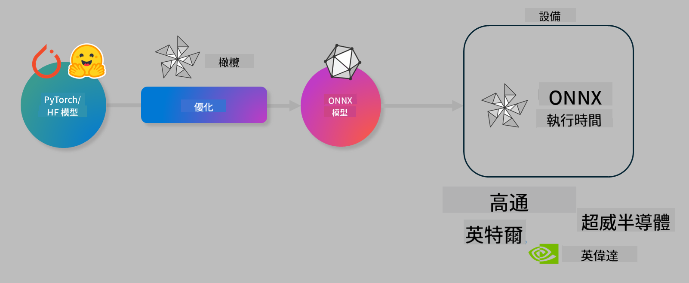

<!--
CO_OP_TRANSLATOR_METADATA:
{
  "original_hash": "6bbe47de3b974df7eea29dfeccf6032b",
  "translation_date": "2025-05-08T06:40:03+00:00",
  "source_file": "code/03.Finetuning/olive-lab/readme.md",
  "language_code": "tw"
}
-->
# Lab. 優化 AI 模型以進行裝置端推論

## 介紹

> [!IMPORTANT]  
> 本實驗需具備 **Nvidia A10 或 A100 GPU** 及對應驅動程式與 CUDA 工具包（版本 12 以上）。

> [!NOTE]  
> 這是一個 **35 分鐘** 的實驗，將帶你實際體驗如何使用 OLIVE 來優化模型，以利裝置端推論的核心概念。

## 學習目標

完成本實驗後，你將能使用 OLIVE 來：

- 使用 AWQ 量化方法對 AI 模型進行量化。
- 針對特定任務微調 AI 模型。
- 產生 LoRA 適配器（微調模型），以便在 ONNX Runtime 上高效進行裝置端推論。

### 什麼是 Olive

Olive (*O*NNX *live*) 是一套模型優化工具包，搭配 CLI，可幫助你為 ONNX runtime +++https://onnxruntime.ai+++ 打包具備品質與效能的模型。



Olive 的輸入通常是 PyTorch 或 Hugging Face 模型，輸出則是優化後的 ONNX 模型，會在執行 ONNX runtime 的裝置（部署目標）上執行。Olive 會針對部署目標的 AI 加速器（NPU、GPU、CPU）進行模型優化，這些硬體加速器可能來自 Qualcomm、AMD、Nvidia 或 Intel 等供應商。

Olive 執行一個 *工作流程*，這是由一連串稱為 *passes* 的模型優化任務依序組成。範例 passes 包括：模型壓縮、圖形捕捉、量化、圖形優化。每個 pass 有一組可調參數，可用來達到最佳指標，例如準確度和延遲，這些會由相應的評估器評估。Olive 採用搜尋策略，使用搜尋演算法依序或同時自動調整每個 pass。

#### Olive 的優點

- **減少嘗試錯誤的挫折與時間**，透過自動化尋找最佳模型，免去手動嘗試不同圖形優化、壓縮和量化技術的繁瑣。只要定義品質與效能限制，Olive 就會幫你找出最佳模型。
- **內建 40+ 種模型優化組件**，涵蓋量化、壓縮、圖形優化與微調的前沿技術。
- **簡易使用的 CLI**，方便執行常見模型優化任務，例如 olive quantize、olive auto-opt、olive finetune。
- 內建模型打包與部署功能。
- 支援產生用於 **多重 LoRA 服務** 的模型。
- 可使用 YAML/JSON 建構工作流程，協調模型優化與部署任務。
- 與 **Hugging Face** 及 **Azure AI** 整合。
- 內建 **快取** 機制，幫助 **節省成本**。

## 實驗指示

> [!NOTE]  
> 請確保已依照實驗 1 的指示，完成 Azure AI Hub 和專案的設定，並配置 A100 計算資源。

### 步驟 0：連接到你的 Azure AI 計算資源

你將透過 **VS Code** 的遠端功能連接到 Azure AI 計算資源。

1. 開啟你的 **VS Code** 桌面應用程式：
1. 使用 **Shift+Ctrl+P** 開啟 **命令面板**。
1. 在命令面板中搜尋 **AzureML - remote: Connect to compute instance in New Window**。
1. 依照螢幕指示連接計算資源，過程中需選擇你的 Azure 訂閱、資源群組、專案與你在實驗 1 中設定的計算名稱。
1. 連接成功後，會在 **Visual Code 左下角** 顯示你的 Azure ML 計算節點 `><Azure ML: Compute Name`。

### 步驟 1：複製此儲存庫

在 VS Code 中，你可以用 **Ctrl+J** 開啟新的終端機，並複製此儲存庫：

終端機中會出現提示

```
azureuser@computername:~/cloudfiles/code$ 
```  
複製解決方案  

```bash
cd ~/localfiles
git clone https://github.com/microsoft/phi-3cookbook.git
```

### 步驟 2：在 VS Code 開啟資料夾

執行以下指令在終端機中開啟 VS Code 至相關資料夾，將會開啟新視窗：

```bash
code phi-3cookbook/code/04.Finetuning/Olive-lab
```

或者，你也可以從選單選擇 **檔案** > **開啟資料夾**。

### 步驟 3：安裝相依套件

在 VS Code 的 Azure AI 計算資源中開啟終端機（提示：**Ctrl+J**），執行以下指令安裝相依套件：

```bash
conda create -n olive-ai python=3.11 -y
conda activate olive-ai
pip install -r requirements.txt
az extension remove -n azure-cli-ml
az extension add -n ml
```

> [!NOTE]  
> 安裝所有相依套件約需花費 5 分鐘。

在本實驗中，你會下載並上傳模型到 Azure AI 模型目錄。為了能存取模型目錄，你需要先登入 Azure：

```bash
az login
```

> [!NOTE]  
> 登入時會要求你選擇訂閱，請務必設定為本實驗所提供的訂閱。

### 步驟 4：執行 Olive 指令

在 VS Code 的 Azure AI 計算資源中開啟終端機（提示：**Ctrl+J**），並確定已啟用 `olive-ai` conda 環境：

```bash
conda activate olive-ai
```

接著，在命令列執行以下 Olive 指令。

1. **檢視資料：** 本範例中，你將微調 Phi-3.5-Mini 模型，使其專門回答旅遊相關問題。以下程式碼會顯示資料集前幾筆記錄，格式為 JSON lines：
   
    ```bash
    head data/data_sample_travel.jsonl
    ```
1. **量化模型：** 在訓練前，先用下列指令量化模型，使用名為 Active Aware Quantization (AWQ) +++https://arxiv.org/abs/2306.00978+++ 的技術。AWQ 會考慮推論過程中產生的激活值來量化模型權重，這表示量化過程會參考激活值的實際資料分布，能比傳統權重量化方法更好地保留模型準確度。
    
    ```bash
    olive quantize \
       --model_name_or_path microsoft/Phi-3.5-mini-instruct \
       --trust_remote_code \
       --algorithm awq \
       --output_path models/phi/awq \
       --log_level 1
    ```
    
    AWQ 量化約需 **8 分鐘**，可將模型大小從約 7.5GB 縮小至約 2.5GB。
   
   本實驗示範如何從 Hugging Face 輸入模型（例如：`microsoft/Phi-3.5-mini-instruct`). However, Olive also allows you to input models from the Azure AI catalog by updating the `model_name_or_path` argument to an Azure AI asset ID (for example:  `azureml://registries/azureml/models/Phi-3.5-mini-instruct/versions/4`). 

1. **Train the model:** Next, the `olive finetune` 指令會微調已量化模型）。在微調前先量化模型，通常能獲得較佳準確度，因為微調過程會補償量化帶來的部分損失。
    
    ```bash
    olive finetune \
        --method lora \
        --model_name_or_path models/phi/awq \
        --data_files "data/data_sample_travel.jsonl" \
        --data_name "json" \
        --text_template "<|user|>\n{prompt}<|end|>\n<|assistant|>\n{response}<|end|>" \
        --max_steps 100 \
        --output_path ./models/phi/ft \
        --log_level 1
    ```
    
    微調（100 步）約需 **6 分鐘**。

1. **優化：** 模型訓練完成後，使用 Olive 的 `auto-opt` command, which will capture the ONNX graph and automatically perform a number of optimizations to improve the model performance for CPU by compressing the model and doing fusions. It should be noted, that you can also optimize for other devices such as NPU or GPU by just updating the `--device` and `--provider` 參數優化模型，但本實驗中我們使用 CPU。

    ```bash
    olive auto-opt \
       --model_name_or_path models/phi/ft/model \
       --adapter_path models/phi/ft/adapter \
       --device cpu \
       --provider CPUExecutionProvider \
       --use_ort_genai \
       --output_path models/phi/onnx-ao \
       --log_level 1
    ```
    
    優化約需 **5 分鐘**。

### 步驟 5：模型推論快速測試

為了測試模型推論，請在資料夾內建立一個名為 **app.py** 的 Python 檔案，並貼上以下程式碼：

```python
import onnxruntime_genai as og
import numpy as np

print("loading model and adapters...", end="", flush=True)
model = og.Model("models/phi/onnx-ao/model")
adapters = og.Adapters(model)
adapters.load("models/phi/onnx-ao/model/adapter_weights.onnx_adapter", "travel")
print("DONE!")

tokenizer = og.Tokenizer(model)
tokenizer_stream = tokenizer.create_stream()

params = og.GeneratorParams(model)
params.set_search_options(max_length=100, past_present_share_buffer=False)
user_input = "what is the best thing to see in chicago"
params.input_ids = tokenizer.encode(f"<|user|>\n{user_input}<|end|>\n<|assistant|>\n")

generator = og.Generator(model, params)

generator.set_active_adapter(adapters, "travel")

print(f"{user_input}")

while not generator.is_done():
    generator.compute_logits()
    generator.generate_next_token()

    new_token = generator.get_next_tokens()[0]
    print(tokenizer_stream.decode(new_token), end='', flush=True)

print("\n")
```

執行程式碼：

```bash
python app.py
```

### 步驟 6：將模型上傳到 Azure AI

將模型上傳至 Azure AI 模型庫，能讓你的開發團隊成員共享模型，並且方便管理版本。上傳模型請執行以下指令：

> [!NOTE]  
> 請更新 `{}` placeholders with the name of your resource group and Azure AI Project Name. 

To find your resource group `"resourceGroup"` 及 Azure AI 專案名稱後執行以下指令

```
az ml workspace show
```

或是透過 +++ai.azure.com+++，選擇 **管理中心** > **專案** > **概覽**

將 `{}` 佔位符更新為你的資源群組名稱與 Azure AI 專案名稱。

```bash
az ml model create \
    --name ft-for-travel \
    --version 1 \
    --path ./models/phi/onnx-ao \
    --resource-group {RESOURCE_GROUP_NAME} \
    --workspace-name {PROJECT_NAME}
```  
接著，你就能在 https://ml.azure.com/model/list 查看並部署上傳的模型。

**免責聲明**：  
本文件係使用 AI 翻譯服務 [Co-op Translator](https://github.com/Azure/co-op-translator) 所翻譯。雖然我們努力追求準確性，但請注意，自動翻譯可能包含錯誤或不準確之處。原始文件的母語版本應視為權威來源。對於重要資訊，建議採用專業人工翻譯。我們不對因使用本翻譯所產生之任何誤解或誤譯負責。