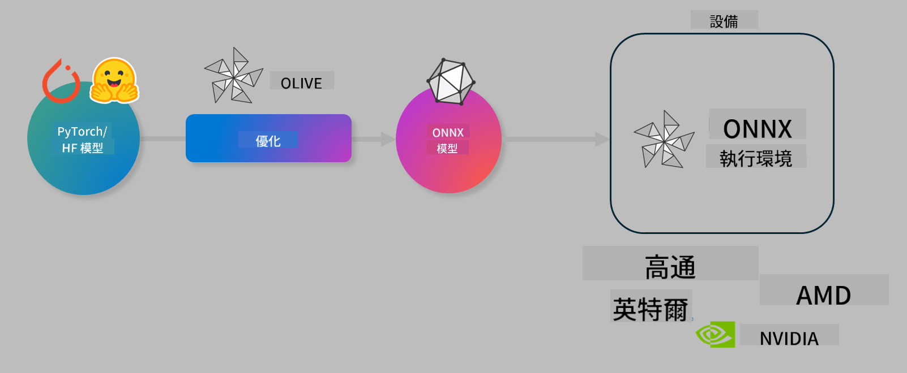

<!--
CO_OP_TRANSLATOR_METADATA:
{
  "original_hash": "76956c0c22e5686908a6d85ec72126af",
  "translation_date": "2025-04-04T05:21:45+00:00",
  "source_file": "code\\03.Finetuning\\olive-lab\\readme.md",
  "language_code": "tw"
}
-->
# Lab. 優化 AI 模型以進行設備端推理

## 簡介

> [!IMPORTANT]
> 本實驗需要 **Nvidia A10 或 A100 GPU**，並安裝相關驅動程序和 CUDA 工具包（版本 12 以上）。

> [!NOTE]
> 本實驗為 **35 分鐘**，將帶您實際操作並介紹使用 OLIVE 優化設備端推理模型的核心概念。

## 學習目標

完成本實驗後，您將能夠使用 OLIVE：

- 使用 AWQ 量化方法對 AI 模型進行量化。
- 對 AI 模型進行特定任務的微調。
- 為 ONNX Runtime 生成 LoRA 適配器（微調模型），以提高設備端推理效率。

### Olive 是什麼

Olive (*O*NNX *live*) 是一款模型優化工具包，配有 CLI，幫助您生成適用於 ONNX Runtime +++https://onnxruntime.ai+++ 的高質量、高性能模型。



Olive 的輸入通常是 PyTorch 或 Hugging Face 模型，輸出則是優化過的 ONNX 模型，可在運行 ONNX Runtime 的設備（部署目標）上執行。Olive 會根據硬體供應商（如 Qualcomm、AMD、Nvidia 或 Intel）提供的 AI 加速器（NPU、GPU、CPU）優化模型。

Olive 執行 *工作流程*，即一系列有序的模型優化任務，稱為 *passes*。例如，模型壓縮、圖捕獲、量化、圖優化等。每個 pass 都有一組可調參數，用於實現最佳指標（如準確性和延遲），並由相應的評估器進行評估。Olive 使用搜索算法逐一或組合地自動調整每個 pass，實現最佳優化。

#### Olive 的優勢

- **減少挫折感和時間**：避免手動嘗試各種圖優化、壓縮和量化技術的繁瑣過程。定義您的質量和性能約束，讓 Olive 自動找到最佳模型。
- **40+ 內建模型優化元件**：涵蓋量化、壓縮、圖優化和微調的前沿技術。
- **簡易 CLI**：處理常見模型優化任務，例如 olive quantize、olive auto-opt、olive finetune。
- 內建模型打包和部署功能。
- 支援生成 **多 LoRA 服務** 的模型。
- 使用 YAML/JSON 構建工作流程，編排模型優化和部署任務。
- **Hugging Face** 和 **Azure AI** 集成。
- 內建 **緩存機制**，可 **節省成本**。

## 實驗步驟
> [!NOTE]
> 請確保您已根據 Lab 1 配置好 Azure AI Hub 和專案，並設置好 A100 計算資源。

### 步驟 0：連接到 Azure AI 計算資源

您將使用 **VS Code** 的遠端功能連接到 Azure AI 計算資源。

1. 打開 **VS Code** 桌面應用程式：
1. 使用 **Shift+Ctrl+P** 打開 **命令面板**。
1. 在命令面板中搜尋 **AzureML - remote: Connect to compute instance in New Window**。
1. 按螢幕指示連接到計算資源，這包括選擇您在 Lab 1 中設置的 Azure 訂閱、資源組、專案和計算名稱。
1. 成功連接到 Azure ML 計算節點後，您會在 **VS Code 左下角** 看到顯示 `><Azure ML: Compute Name`。

### 步驟 1：克隆此存儲庫

在 VS Code 中，使用 **Ctrl+J** 開啟新終端並克隆此存儲庫：

在終端中您應看到提示：

```
azureuser@computername:~/cloudfiles/code$ 
```
克隆解決方案：

```bash
cd ~/localfiles
git clone https://github.com/microsoft/phi-3cookbook.git
```

### 步驟 2：在 VS Code 中打開文件夾

在終端中執行以下命令以在相關文件夾中打開 VS Code，此命令將開啟新窗口：

```bash
code phi-3cookbook/code/04.Finetuning/Olive-lab
```

或者，您也可以通過選擇 **文件** > **打開文件夾** 打開文件夾。

### 步驟 3：安裝依賴項

在 VS Code 的 Azure AI 計算節點中打開終端窗口（提示：**Ctrl+J**），執行以下命令以安裝依賴項：

```bash
conda create -n olive-ai python=3.11 -y
conda activate olive-ai
pip install -r requirements.txt
az extension remove -n azure-cli-ml
az extension add -n ml
```

> [!NOTE]
> 安裝所有依賴項約需 **5 分鐘**。

在本實驗中，您將下載並上傳模型到 Azure AI 模型目錄。為了訪問模型目錄，您需要登錄 Azure：

```bash
az login
```

> [!NOTE]
> 登錄時系統會要求您選擇訂閱。請確保選擇實驗提供的訂閱。

### 步驟 4：執行 Olive 命令

在 VS Code 的 Azure AI 計算節點中打開終端窗口（提示：**Ctrl+J**），確保已激活 `olive-ai` conda 環境：

```bash
conda activate olive-ai
```

接下來，在命令行中執行以下 Olive 命令：

1. **檢查數據**：在此示例中，您將微調 Phi-3.5-Mini 模型，使其專門回答與旅行相關的問題。以下代碼顯示數據集的前幾條記錄，格式為 JSON 行：
   
    ```bash
    head data/data_sample_travel.jsonl
    ```
1. **量化模型**：在訓練模型之前，首先使用以下命令進行量化，此命令使用一種稱為 Active Aware Quantization (AWQ) +++https://arxiv.org/abs/2306.00978+++ 的技術。AWQ 根據推理過程中生成的激活值量化模型權重，這意味著量化過程考慮了激活中的實際數據分佈，與傳統權重量化方法相比，能更好地保留模型準確性。
    
    ```bash
    olive quantize \
       --model_name_or_path microsoft/Phi-3.5-mini-instruct \
       --trust_remote_code \
       --algorithm awq \
       --output_path models/phi/awq \
       --log_level 1
    ```
    
    AWQ 量化約需 **8 分鐘**，可將模型大小從 **約 7.5GB 減少到約 2.5GB**。
   
   在本實驗中，我們將展示如何從 Hugging Face 導入模型（例如：`microsoft/Phi-3.5-mini-instruct`). However, Olive also allows you to input models from the Azure AI catalog by updating the `model_name_or_path` argument to an Azure AI asset ID (for example:  `azureml://registries/azureml/models/Phi-3.5-mini-instruct/versions/4`). 

1. **Train the model:** Next, the `olive finetune` 命令微調量化模型。先量化模型再微調比事後量化能夠獲得更好的準確性，因為微調過程能恢復部分量化損失。
    
    ```bash
    olive finetune \
        --method lora \
        --model_name_or_path models/phi/awq \
        --data_files "data/data_sample_travel.jsonl" \
        --data_name "json" \
        --text_template "<|user|>\n{prompt}<|end|>\n<|assistant|>\n{response}<|end|>" \
        --max_steps 100 \
        --output_path ./models/phi/ft \
        --log_level 1
    ```
    
    微調約需 **6 分鐘**（100 步）。

1. **優化**：訓練模型後，您可以使用 Olive 的 `auto-opt` command, which will capture the ONNX graph and automatically perform a number of optimizations to improve the model performance for CPU by compressing the model and doing fusions. It should be noted, that you can also optimize for other devices such as NPU or GPU by just updating the `--device` and `--provider` 參數進行模型優化。但在本實驗中，我們將使用 CPU。

    ```bash
    olive auto-opt \
       --model_name_or_path models/phi/ft/model \
       --adapter_path models/phi/ft/adapter \
       --device cpu \
       --provider CPUExecutionProvider \
       --use_ort_genai \
       --output_path models/phi/onnx-ao \
       --log_level 1
    ```
    
    優化約需 **5 分鐘**。

### 步驟 5：快速測試模型推理

為測試模型推理，請在您的文件夾中創建一個名為 **app.py** 的 Python 文件，並將以下代碼複製粘貼進去：

```python
import onnxruntime_genai as og
import numpy as np

print("loading model and adapters...", end="", flush=True)
model = og.Model("models/phi/onnx-ao/model")
adapters = og.Adapters(model)
adapters.load("models/phi/onnx-ao/model/adapter_weights.onnx_adapter", "travel")
print("DONE!")

tokenizer = og.Tokenizer(model)
tokenizer_stream = tokenizer.create_stream()

params = og.GeneratorParams(model)
params.set_search_options(max_length=100, past_present_share_buffer=False)
user_input = "what is the best thing to see in chicago"
params.input_ids = tokenizer.encode(f"<|user|>\n{user_input}<|end|>\n<|assistant|>\n")

generator = og.Generator(model, params)

generator.set_active_adapter(adapters, "travel")

print(f"{user_input}")

while not generator.is_done():
    generator.compute_logits()
    generator.generate_next_token()

    new_token = generator.get_next_tokens()[0]
    print(tokenizer_stream.decode(new_token), end='', flush=True)

print("\n")
```

使用以下命令執行代碼：

```bash
python app.py
```

### 步驟 6：將模型上傳至 Azure AI

將模型上傳到 Azure AI 模型存儲庫，可以讓開發團隊中的其他成員共享模型，並且便於模型版本控制。要上傳模型，請執行以下命令：

> [!NOTE]
> 更新 `{}` 中的 `resourceGroup` 和 Azure AI 專案名稱，執行以下命令：

```
az ml workspace show
```

或者，您可以前往 +++ai.azure.com+++，選擇 **管理中心** > **專案** > **概覽**。

更新 `{}` 佔位符為您的資源組和 Azure AI 專案名稱。

```bash
az ml model create \
    --name ft-for-travel \
    --version 1 \
    --path ./models/phi/onnx-ao \
    --resource-group {RESOURCE_GROUP_NAME} \
    --workspace-name {PROJECT_NAME}
```
您可以在 https://ml.azure.com/model/list 查看已上傳的模型並進行部署。

**免責聲明**:  
本文件使用 AI 翻譯服務 [Co-op Translator](https://github.com/Azure/co-op-translator) 進行翻譯。儘管我們努力確保翻譯的準確性，但請注意，自動翻譯可能包含錯誤或不準確之處。應以原始語言的文件作為權威來源。對於關鍵資訊，建議尋求專業人工翻譯。我們對於使用此翻譯而引起的任何誤解或誤讀不承擔責任。