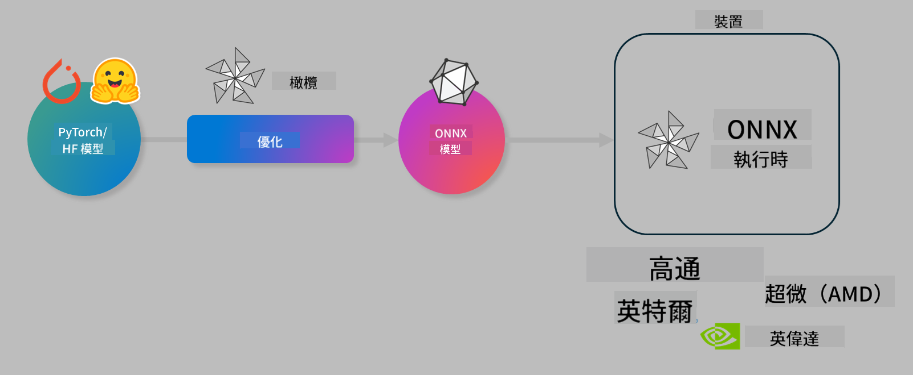

<!--
CO_OP_TRANSLATOR_METADATA:
{
  "original_hash": "6bbe47de3b974df7eea29dfeccf6032b",
  "translation_date": "2025-05-08T06:33:26+00:00",
  "source_file": "code/04.Finetuning/olive-lab/readme.md",
  "language_code": "tw"
}
-->
# Lab. 優化 AI 模型以進行裝置端推論

## 介紹

> [!IMPORTANT]
> 本實驗需要安裝有對應驅動程式及 CUDA 工具包（版本 12 以上）的 **Nvidia A10 或 A100 GPU**。

> [!NOTE]
> 這是一個 **35 分鐘** 的實驗，將帶你實際體驗使用 OLIVE 進行裝置端推論模型優化的核心概念。

## 學習目標

完成本實驗後，你將能使用 OLIVE 來：

- 使用 AWQ 量化方法對 AI 模型進行量化。
- 針對特定任務微調 AI 模型。
- 生成 LoRA 適配器（微調後模型），以便在 ONNX Runtime 上有效進行裝置端推論。

### 什麼是 Olive

Olive（*O*NNX *live*）是一套模型優化工具包，搭配 CLI，能讓你為 ONNX runtime +++https://onnxruntime.ai+++ 發佈具備品質與效能的模型。



Olive 的輸入通常是 PyTorch 或 Hugging Face 模型，輸出則是針對裝置（部署目標）執行 ONNX runtime 的優化 ONNX 模型。Olive 會根據硬體廠商（如 Qualcomm、AMD、Nvidia 或 Intel）提供的 AI 加速器（NPU、GPU、CPU）來優化模型。

Olive 執行一個稱為 *workflow* 的工作流程，這是由一連串稱為 *passes* 的模型優化任務所組成——例如模型壓縮、圖形捕捉、量化、圖形優化等。每個 pass 有一組可調參數，用以達成最佳指標，例如準確度和延遲，這些指標由相應的評估器評估。Olive 採用搜尋策略，利用搜尋演算法自動調整每個 pass 或多個 passes 的參數。

#### Olive 的優點

- **減少手動嘗試錯誤的挫折與時間**，不論是圖形優化、壓縮或量化技術。設定你的品質與效能限制，讓 Olive 自動幫你找到最佳模型。
- **內建 40+ 個模型優化元件**，涵蓋量化、壓縮、圖形優化及微調等前沿技術。
- **易用的 CLI**，適用於常見模型優化任務。例如 olive quantize、olive auto-opt、olive finetune。
- 內建模型封裝與部署功能。
- 支援生成 **Multi LoRA 服務** 的模型。
- 可使用 YAML/JSON 建構工作流程，協調模型優化與部署任務。
- 整合 **Hugging Face** 與 **Azure AI**。
- 內建 **快取** 機制，幫助 **節省成本**。

## 實驗說明
> [!NOTE]
> 請確認你已依照實驗 1 完成 Azure AI Hub 與專案的設定，並配置好 A100 運算資源。

### 步驟 0：連接到你的 Azure AI Compute

你將透過 **VS Code** 的遠端功能連接 Azure AI 運算資源。

1. 開啟你的 **VS Code** 桌面應用程式：
2. 使用 **Shift+Ctrl+P** 開啟 **指令面板**。
3. 在指令面板中搜尋 **AzureML - remote: Connect to compute instance in New Window**。
4. 按照畫面指示連接 Compute，過程中需選擇你的 Azure 訂閱、資源群組、專案和你在實驗 1 中設定的 Compute 名稱。
5. 連接成功後，會在 **Visual Code 左下角** 顯示連線狀態 `><Azure ML: Compute Name`。

### 步驟 1：複製此 repo

在 VS Code 中，使用 **Ctrl+J** 開啟新終端機，並複製此 repo：

終端機中會顯示提示

```
azureuser@computername:~/cloudfiles/code$ 
```
複製解決方案

```bash
cd ~/localfiles
git clone https://github.com/microsoft/phi-3cookbook.git
```

### 步驟 2：在 VS Code 中開啟資料夾

在終端機輸入以下指令以在新視窗中開啟資料夾：

```bash
code phi-3cookbook/code/04.Finetuning/Olive-lab
```

或者你也可以透過選單選擇 **File** > **Open Folder** 來開啟。

### 步驟 3：安裝相依套件

在 VS Code 中的 Azure AI Compute 實例內開啟終端機（提示：**Ctrl+J**），執行以下指令安裝相依套件：

```bash
conda create -n olive-ai python=3.11 -y
conda activate olive-ai
pip install -r requirements.txt
az extension remove -n azure-cli-ml
az extension add -n ml
```

> [!NOTE]
> 安裝所有相依套件大約需要 5 分鐘。

本實驗中你會下載並上傳模型到 Azure AI 模型目錄。為了存取模型目錄，你需要登入 Azure：

```bash
az login
```

> [!NOTE]
> 登入時會要求選擇訂閱，請務必選擇本實驗提供的訂閱。

### 步驟 4：執行 Olive 指令

在 VS Code 中的 Azure AI Compute 實例內開啟終端機（提示：**Ctrl+J**），並確定已啟用 `olive-ai` conda 環境：

```bash
conda activate olive-ai
```

接著，在指令列執行以下 Olive 指令。

1. **檢視資料：** 本範例將微調 Phi-3.5-Mini 模型，使其專門回答旅遊相關問題。以下程式碼會顯示資料集中前幾筆記錄，格式為 JSON lines：

    ```bash
    head data/data_sample_travel.jsonl
    ```
2. **量化模型：** 在訓練模型前，先用以下指令進行量化，採用稱為 Active Aware Quantization (AWQ) +++https://arxiv.org/abs/2306.00978+++ 的技術。AWQ 在量化模型權重時會考慮推論期間產生的激活值，這代表量化過程會依據激活的實際資料分布，較傳統權重量化法能更好地保留模型準確度。

    ```bash
    olive quantize \
       --model_name_or_path microsoft/Phi-3.5-mini-instruct \
       --trust_remote_code \
       --algorithm awq \
       --output_path models/phi/awq \
       --log_level 1
    ```
    
    AWQ 量化約需 **8 分鐘**，可將模型大小從約 7.5GB 減少到約 2.5GB。
   
   本實驗示範如何從 Hugging Face 輸入模型（例如：`microsoft/Phi-3.5-mini-instruct`). However, Olive also allows you to input models from the Azure AI catalog by updating the `model_name_or_path` argument to an Azure AI asset ID (for example:  `azureml://registries/azureml/models/Phi-3.5-mini-instruct/versions/4`). 

1. **Train the model:** Next, the `olive finetune` 指令微調量化後模型）。在微調前先量化比事後量化能取得更佳準確度，因為微調過程會補償部分量化帶來的損失。

    ```bash
    olive finetune \
        --method lora \
        --model_name_or_path models/phi/awq \
        --data_files "data/data_sample_travel.jsonl" \
        --data_name "json" \
        --text_template "<|user|>\n{prompt}<|end|>\n<|assistant|>\n{response}<|end|>" \
        --max_steps 100 \
        --output_path ./models/phi/ft \
        --log_level 1
    ```
    
    微調（100 步）約需 **6 分鐘**。

3. **優化：** 模型訓練完成後，使用 Olive 的 `auto-opt` command, which will capture the ONNX graph and automatically perform a number of optimizations to improve the model performance for CPU by compressing the model and doing fusions. It should be noted, that you can also optimize for other devices such as NPU or GPU by just updating the `--device` and `--provider` 參數優化模型——但本實驗以 CPU 為例。

    ```bash
    olive auto-opt \
       --model_name_or_path models/phi/ft/model \
       --adapter_path models/phi/ft/adapter \
       --device cpu \
       --provider CPUExecutionProvider \
       --use_ort_genai \
       --output_path models/phi/onnx-ao \
       --log_level 1
    ```
    
    優化約需 **5 分鐘**。

### 步驟 5：模型推論快速測試

要測試模型推論，在你的資料夾中建立一個名為 **app.py** 的 Python 檔案，並貼上以下程式碼：

```python
import onnxruntime_genai as og
import numpy as np

print("loading model and adapters...", end="", flush=True)
model = og.Model("models/phi/onnx-ao/model")
adapters = og.Adapters(model)
adapters.load("models/phi/onnx-ao/model/adapter_weights.onnx_adapter", "travel")
print("DONE!")

tokenizer = og.Tokenizer(model)
tokenizer_stream = tokenizer.create_stream()

params = og.GeneratorParams(model)
params.set_search_options(max_length=100, past_present_share_buffer=False)
user_input = "what is the best thing to see in chicago"
params.input_ids = tokenizer.encode(f"<|user|>\n{user_input}<|end|>\n<|assistant|>\n")

generator = og.Generator(model, params)

generator.set_active_adapter(adapters, "travel")

print(f"{user_input}")

while not generator.is_done():
    generator.compute_logits()
    generator.generate_next_token()

    new_token = generator.get_next_tokens()[0]
    print(tokenizer_stream.decode(new_token), end='', flush=True)

print("\n")
```

使用以下指令執行程式：

```bash
python app.py
```

### 步驟 6：將模型上傳至 Azure AI

將模型上傳到 Azure AI 模型庫，讓團隊其他成員可以共享模型，並且方便模型版本管理。執行以下指令上傳模型：

> [!NOTE]
> 請更新 `{}` 中的 `resourceGroup` 和 Azure AI 專案名稱後執行指令。

```
az ml workspace show
```

或者你也可以前往 +++ai.azure.com+++，選擇 **管理中心** > **專案** > **總覽**。

將 `{}` 佔位符替換為你的資源群組名稱與 Azure AI 專案名稱。

```bash
az ml model create \
    --name ft-for-travel \
    --version 1 \
    --path ./models/phi/onnx-ao \
    --resource-group {RESOURCE_GROUP_NAME} \
    --workspace-name {PROJECT_NAME}
```
你可以在 https://ml.azure.com/model/list 查看已上傳的模型並進行部署。

**免責聲明**：  
本文件係使用 AI 翻譯服務 [Co-op Translator](https://github.com/Azure/co-op-translator) 進行翻譯。雖然我們致力於確保翻譯的準確性，但請注意自動翻譯可能包含錯誤或不準確之處。原始文件的母語版本應視為權威來源。對於重要資訊，建議採用專業人工翻譯。我們不對因使用本翻譯而產生的任何誤解或曲解負責。