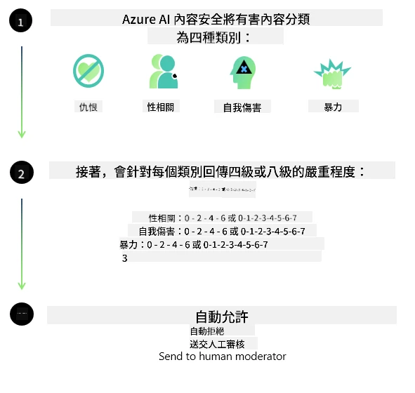

<!--
CO_OP_TRANSLATOR_METADATA:
{
  "original_hash": "839ccc4b3886ef10cfd4e64977f5792d",
  "translation_date": "2026-01-05T17:32:57+00:00",
  "source_file": "md/01.Introduction/01/01.AISafety.md",
  "language_code": "tw"
}
-->
# Phi 模型的 AI 安全性
Phi 系列模型是依據 [Microsoft Responsible AI Standard](https://www.microsoft.com/ai/principles-and-approach#responsible-ai-standard) 開發，這是一套基於以下六項原則的公司範圍要求：問責制、透明度、公平性、可靠性與安全性、隱私與安全性及包容性，構成了 [Microsoft 的負責任 AI 原則](https://www.microsoft.com/ai/responsible-ai)。

如同先前的 Phi 模型，採用了多面向的安全評估及訓練後安全策略，並針對本次發行的多語言能力採取了額外措施。我們的安全訓練與評估方法涵蓋多語言以及多風險類別，詳見 [Phi Safety Post-Training Paper](https://arxiv.org/abs/2407.13833)。雖然 Phi 模型受益於此方法，開發者仍應採用負責任 AI 的最佳實務，包括針對其特定使用案例及文化語言背景，繪製、衡量及減緩相關風險。

## 最佳實務

如其他模型，Phi 系列模型可能表現出不公平、不可靠或冒犯性的方式。

您應注意的一些 SLM 和 LLM 限制行為包括：

- **服務品質：** Phi 模型主要基於英文文本訓練。非英語語言的效能會較差，在訓練資料中代表性較低的英語變體，效能可能會比標準美式英語更差。
- **傷害呈現與刻板印象延續：** 這些模型可能過度或不足地呈現某些族群、抹消某些族群的存在，或強化某些貶低或負面的刻板印象。儘管經過安全後訓練，這些限制仍可能存在，原因包括不同族群的代表性差異及訓練資料中存在反映現實世界模式與社會偏見的負面刻板印象範例。
- **不當或冒犯內容：** 這些模型可能產出其他類型的不當或冒犯內容，若無針對特定用例的額外緩解措施，可能不適合在敏感情境部署。
資訊可靠性：語言模型可能生成無意義內容或捏造可能聽起來合理但不正確或過時的內容。
- **程式碼使用範圍有限：** Phi-3 大部分訓練資料基於 Python 且使用常見套件如 "typing, math, random, collections, datetime, itertools"。若模型生成的 Python 腳本使用其他套件或其他語言腳本，強烈建議使用者手動驗證所有 API 使用情況。

開發者應採用負責任 AI 的最佳實務，並負責確保特定使用案例遵守相關法律與法規（例如隱私、貿易等）。

## 負責任 AI 的考量

如其他語言模型，Phi 系列模型可能表現出不公平、不可靠或冒犯性的行為。以下是應該注意的一些限制行為：

**服務品質：** Phi 模型主要基於英文文本訓練。非英語語言的效能會較差。在訓練資料中代表性較低的英語變體，效能可能會比標準美式英語更差。

**傷害呈現與刻板印象延續：** 這些模型可能過度或不足地呈現某些族群、抹消某些族群的存在，或強化某些貶低或負面的刻板印象。儘管安全後訓練已施行，這些限制仍可能存在，原因包括不同族群的代表性差異及訓練資料中存在反映現實世界模式與社會偏見的負面刻板印象範例。

**不當或冒犯內容：** 這些模型可能產生其他類型的不當或冒犯內容，在沒有特定用例額外緩解的情況下，不適合用於敏感場景。
資訊可靠性：語言模型可能生成無意義或捏造內容，聽起來合理但不正確或已過時。

**程式碼使用範圍有限：** Phi-3 大部分訓練資料基於 Python 且使用常見套件如 "typing, math, random, collections, datetime, itertools"。若模型生成的 Python 腳本使用其他套件或其他語言腳本，強烈建議用戶手動驗證所有 API 用法。

開發者應採用負責任 AI 最佳實務，並確保其特定使用案例符合相關法律與法規（例如隱私、貿易等）。重要考量範疇包括：

**配置分配：** 模型不適合用於可能對法律地位或資源與生命機會分配有重大影響的場景（例如住屋、就業、信用等），此類情況需進一步評估及額外去偏技術。

**高風險場景：** 開發者應評估模型在高風險場景的適用性，避免產生不公平、不可靠或冒犯輸出所造成極大成本或傷害。此類場景包含需精確與可靠建議的敏感或專業領域（例如法律或健康建議）。應依據部署情境，在應用層實施額外保障。

**錯誤資訊：** 模型可能產生不正確資訊。開發者應遵循透明度最佳實務，告知最終用戶他們正在與 AI 系統互動。於應用層，開發者可建立回饋機制與管線，以根據用例特定且具情境資訊的資料做為回應基礎，此技術稱為 Retrieval Augmented Generation (RAG)。

**有害內容生成：** 開發者應評估輸出內容的情境，並利用現有安全分類器或適用於其用例的自訂解決方案。

**濫用：** 其他濫用形式如詐騙、垃圾郵件或惡意軟體製作皆有可能，開發者應確保其應用不違反相關法律與法規。

### 微調與 AI 內容安全

在微調模型後，我們強烈建議利用 [Azure AI Content Safety](https://learn.microsoft.com/azure/ai-services/content-safety/overview) 來監控模型產生的內容，識別並阻擋潛在風險、威脅與品質問題。

[Azure AI Content Safety](https://learn.microsoft.com/azure/ai-services/content-safety/overview) 支援文字與影像內容，可部署於雲端、離線容器和邊緣/嵌入式裝置。

## Azure AI 內容安全概述

Azure AI Content Safety 並非萬用解決方案；它可以客製化以符合企業的具體政策。此外，其多語言模型能同時理解多種語言。

- **Azure AI Content Safety**
- **Microsoft Developer**
- **5 支影片**

Azure AI Content Safety 服務可偵測應用程式與服務中有害的用戶生成及 AI 生成內容，包含文字與影像 API，可檢測有害或不當素材。

[AI Content Safety Playlist](https://www.youtube.com/playlist?list=PLlrxD0HtieHjaQ9bJjyp1T7FeCbmVcPkQ)

---

<!-- CO-OP TRANSLATOR DISCLAIMER START -->
**免責聲明**：
本文件使用 AI 翻譯服務 [Co-op Translator](https://github.com/Azure/co-op-translator) 進行翻譯。雖然我們力求準確，但請注意自動翻譯可能包含錯誤或不準確之處。原始文件所使用的語言版本應被視為權威來源。對於關鍵資訊，建議採用專業人工翻譯。我們不對因使用本翻譯所產生的任何誤解或誤釋負責。
<!-- CO-OP TRANSLATOR DISCLAIMER END -->