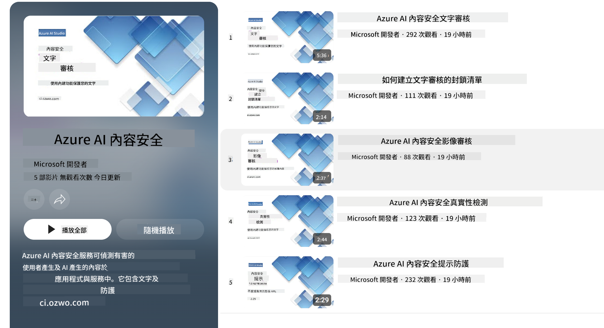

<!--
CO_OP_TRANSLATOR_METADATA:
{
  "original_hash": "c8273672cc57df2be675407a1383aaf0",
  "translation_date": "2025-07-16T17:44:04+00:00",
  "source_file": "md/01.Introduction/01/01.AISafety.md",
  "language_code": "tw"
}
-->
# Phi 模型的 AI 安全性  
Phi 系列模型的開發遵循了 [Microsoft Responsible AI Standard](https://query.prod.cms.rt.microsoft.com/cms/api/am/binary/RE5cmFl)，這是一套公司層級的要求，基於以下六大原則：問責制、透明度、公平性、可靠性與安全性、隱私與安全，以及包容性，這些構成了 [Microsoft 的負責任 AI 原則](https://www.microsoft.com/ai/responsible-ai)。

與先前的 Phi 模型相同，我們採用了多面向的安全評估與安全後訓練方法，並針對本次版本的多語言能力採取了額外措施。我們在 [Phi Safety Post-Training Paper](https://arxiv.org/abs/2407.13833) 中說明了安全訓練與評估的方法，包括跨多語言與風險類別的測試。雖然 Phi 模型受益於此方法，開發者仍應採用負責任 AI 的最佳實踐，針對其特定使用案例及文化與語言背景，進行風險的映射、衡量與緩解。

## 最佳實踐  

與其他模型一樣，Phi 系列模型可能會表現出不公平、不可靠或冒犯性的行為。

您應該注意的 SLM 和 LLM 的一些限制行為包括：

- **服務品質：** Phi 模型主要以英文文本訓練。非英語語言的表現會較差，且在訓練資料中代表性較低的英語變體，表現可能不如標準美式英語。
- **傷害表現與刻板印象延續：** 這些模型可能會過度或不足地呈現某些族群，抹除部分族群的代表性，或強化貶低或負面的刻板印象。儘管有安全後訓練，這些限制仍可能存在，原因包括不同族群的代表性差異，或訓練資料中反映現實世界模式與社會偏見的負面刻板印象範例的普遍性。
- **不當或冒犯性內容：** 這些模型可能產生其他類型的不當或冒犯性內容，若未針對特定使用案例採取額外緩解措施，可能不適合在敏感情境中部署。
- **資訊可靠性：** 語言模型可能生成無意義的內容，或捏造聽起來合理但不準確或過時的資訊。
- **程式碼範圍有限：** Phi-3 大部分訓練資料基於 Python，並使用常見套件如 "typing, math, random, collections, datetime, itertools"。若模型生成使用其他套件或其他語言的程式碼，強烈建議使用者手動驗證所有 API 的使用。

開發者應採用負責任 AI 的最佳實踐，並負責確保特定使用案例符合相關法律與規範（例如隱私、貿易等）。

## 負責任 AI 的考量  

與其他語言模型一樣，Phi 系列模型可能會表現出不公平、不可靠或冒犯性的行為。應注意的限制行為包括：

**服務品質：** Phi 模型主要以英文文本訓練。非英語語言的表現會較差。訓練資料中代表性較低的英語變體，表現可能不如標準美式英語。

**傷害表現與刻板印象延續：** 這些模型可能會過度或不足地呈現某些族群，抹除部分族群的代表性，或強化貶低或負面的刻板印象。儘管有安全後訓練，這些限制仍可能存在，原因包括不同族群的代表性差異，或訓練資料中反映現實世界模式與社會偏見的負面刻板印象範例的普遍性。

**不當或冒犯性內容：** 這些模型可能產生其他類型的不當或冒犯性內容，若未針對特定使用案例採取額外緩解措施，可能不適合在敏感情境中部署。  
資訊可靠性：語言模型可能生成無意義的內容，或捏造聽起來合理但不準確或過時的資訊。

**程式碼範圍有限：** Phi-3 大部分訓練資料基於 Python，並使用常見套件如 "typing, math, random, collections, datetime, itertools"。若模型生成使用其他套件或其他語言的程式碼，強烈建議使用者手動驗證所有 API 的使用。

開發者應採用負責任 AI 的最佳實踐，並負責確保特定使用案例符合相關法律與規範（例如隱私、貿易等）。重要考量包括：

**分配：** 模型可能不適合用於可能對法律地位、資源或生活機會分配（例如：住房、就業、信用等）產生重大影響的情境，除非進行進一步評估與額外去偏見技術。

**高風險情境：** 開發者應評估模型在高風險情境中的適用性，因為不公平、不可靠或冒犯性的輸出可能造成極大損失或傷害。這包括在敏感或專業領域提供建議，這些領域對準確性與可靠性要求極高（例如：法律或健康建議）。應根據部署情境，在應用層面實施額外的安全防護措施。

**錯誤資訊：** 模型可能產生不準確的資訊。開發者應遵循透明度最佳實踐，告知最終用戶他們正在與 AI 系統互動。在應用層面，開發者可建立回饋機制與管線，將回應根據特定使用案例的上下文資訊進行基礎化，這種技術稱為檢索增強生成（Retrieval Augmented Generation, RAG）。

**有害內容生成：** 開發者應根據上下文評估輸出，並使用可用的安全分類器或適合其使用案例的自訂解決方案。

**濫用：** 其他濫用形式如詐騙、垃圾郵件或惡意軟體產生皆有可能，開發者應確保其應用不違反適用法律與規範。

### 微調與 AI 內容安全  

微調模型後，我們強烈建議利用 [Azure AI Content Safety](https://learn.microsoft.com/azure/ai-services/content-safety/overview) 措施，監控模型生成的內容，識別並阻擋潛在風險、威脅與品質問題。

[Azure AI Content Safety](https://learn.microsoft.com/azure/ai-services/content-safety/overview) 支援文字與影像內容，可部署於雲端、離線容器及邊緣/嵌入式裝置。

## Azure AI Content Safety 概覽  

Azure AI Content Safety 並非一套通用解決方案；它可根據企業的特定政策進行客製化。此外，其多語言模型能同時理解多種語言。

- **Azure AI Content Safety**  
- **Microsoft Developer**  
- **5 支影片**

Azure AI Content Safety 服務可偵測應用程式與服務中有害的用戶生成及 AI 生成內容。它包含文字與影像 API，能協助偵測有害或不當的素材。

[AI Content Safety 播放清單](https://www.youtube.com/playlist?list=PLlrxD0HtieHjaQ9bJjyp1T7FeCbmVcPkQ)

**免責聲明**：  
本文件係使用 AI 翻譯服務 [Co-op Translator](https://github.com/Azure/co-op-translator) 進行翻譯。雖然我們力求準確，但請注意，自動翻譯可能包含錯誤或不準確之處。原始文件的母語版本應視為權威來源。對於重要資訊，建議採用專業人工翻譯。我們不對因使用本翻譯而產生的任何誤解或誤釋負責。