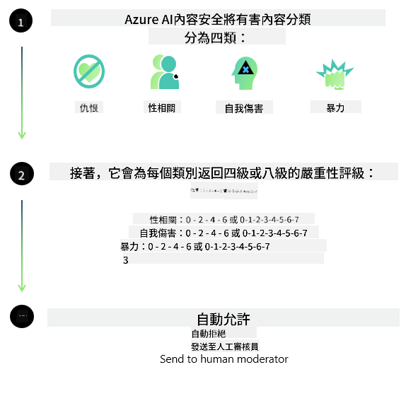
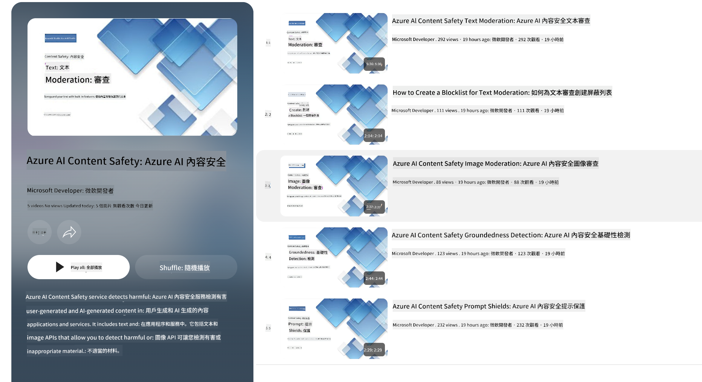

<!--
CO_OP_TRANSLATOR_METADATA:
{
  "original_hash": "1f6b561a224336bd4f413176ec40d994",
  "translation_date": "2025-04-04T05:37:43+00:00",
  "source_file": "md\\01.Introduction\\01\\01.AISafety.md",
  "language_code": "tw"
}
-->
# Phi 模型的 AI 安全性

Phi 模型系列是根據 [Microsoft 負責任 AI 標準](https://query.prod.cms.rt.microsoft.com/cms/api/am/binary/RE5cmFl) 開發的，該標準是一套公司範圍內的要求，基於以下六項原則：問責、透明、公平、可靠與安全、隱私與安全性，以及包容性，這些原則共同構成了 [Microsoft 的負責任 AI 原則](https://www.microsoft.com/ai/responsible-ai)。

與之前的 Phi 模型類似，此次也採用了多方面的安全評估和安全後訓練方法，並額外考慮了此版本的多語言能力。我們的安全訓練與評估方法，包括針對多種語言和風險類別的測試，詳見 [Phi 安全後訓練論文](https://arxiv.org/abs/2407.13833)。雖然 Phi 模型受益於這種方法，但開發者仍應採用負責任 AI 的最佳實踐，包括針對其具體使用案例及文化與語言背景進行風險映射、測量和緩解。

## 最佳實踐

與其他模型類似，Phi 模型系列可能會表現出不公平、不可靠或冒犯性的行為。

需要注意的一些 SLM 和 LLM 的限制行為包括：

- **服務質量：** Phi 模型主要基於英語文本進行訓練。非英語語言的性能可能較差，而訓練數據中代表性較低的英語變體（例如某些地區的方言）可能比標準美式英語的性能更差。
- **傷害的表現與刻板印象的延續：** 這些模型可能過度或不足地代表某些群體，抹去某些群體的代表性，或加強貶低性或負面的刻板印象。儘管進行了安全後訓練，這些限制仍可能存在，原因包括不同群體的代表性差異或訓練數據中反映現實世界模式和社會偏見的負面刻板印象示例的普遍性。
- **不當或冒犯性內容：** 這些模型可能生成其他類型的不當或冒犯性內容，因此在敏感情境中部署時，應採取特定於使用案例的額外緩解措施。
- **信息可靠性：** 語言模型可能生成無意義的內容，或捏造聽起來合理但實際上不準確或過時的內容。
- **代碼範圍有限：** Phi-3 的大部分訓練數據基於 Python 並使用常見的套件，例如 "typing, math, random, collections, datetime, itertools"。如果模型生成的 Python 腳本使用其他套件或其他語言的腳本，我們強烈建議用戶手動驗證所有 API 的使用。

開發者應採用負責任 AI 的最佳實踐，並確保具體使用案例符合相關法律和法規（例如隱私、貿易等）。

## 負責任 AI 的考量

與其他語言模型一樣，Phi 系列模型可能會表現出不公平、不可靠或冒犯性的行為。需要注意的一些限制行為包括：

**服務質量：** Phi 模型主要基於英語文本進行訓練。非英語語言的性能可能較差，而訓練數據中代表性較低的英語變體（例如某些地區的方言）可能比標準美式英語的性能更差。

**傷害的表現與刻板印象的延續：** 這些模型可能過度或不足地代表某些群體，抹去某些群體的代表性，或加強貶低性或負面的刻板印象。儘管進行了安全後訓練，這些限制仍可能存在，原因包括不同群體的代表性差異或訓練數據中反映現實世界模式和社會偏見的負面刻板印象示例的普遍性。

**不當或冒犯性內容：** 這些模型可能生成其他類型的不當或冒犯性內容，因此在敏感情境中部署時，應採取特定於使用案例的額外緩解措施。

**信息可靠性：** 語言模型可能生成無意義的內容，或捏造聽起來合理但實際上不準確或過時的內容。

**代碼範圍有限：** Phi-3 的大部分訓練數據基於 Python 並使用常見的套件，例如 "typing, math, random, collections, datetime, itertools"。如果模型生成的 Python 腳本使用其他套件或其他語言的腳本，我們強烈建議用戶手動驗證所有 API 的使用。

開發者應採用負責任 AI 的最佳實踐，並確保具體使用案例符合相關法律和法規（例如隱私、貿易等）。需要考慮的重要領域包括：

**資源分配：** 模型可能不適合對法律地位或資源或生活機會分配（例如住房、就業、信貸等）有重大影響的場景，除非進行進一步的評估和額外的去偏方法。

**高風險場景：** 開發者應評估在高風險場景中使用模型的適用性，例如不公平、不可靠或冒犯性輸出可能帶來極高成本或造成傷害的情況。這包括在需要高度準確性和可靠性的敏感或專業領域提供建議（例如法律或健康建議）。應根據部署環境在應用層面實施額外的保護措施。

**錯誤信息：** 模型可能生成不準確的信息。開發者應遵循透明度的最佳實踐，告知最終用戶他們正在與 AI 系統互動。在應用層面，開發者可以構建反饋機制和管道，將回應基於具體使用案例的上下文信息進行校正，這種技術稱為檢索增強生成（Retrieval Augmented Generation，RAG）。

**有害內容的生成：** 開發者應根據上下文評估輸出，並使用適合其使用案例的可用安全分類器或自定義解決方案。

**濫用：** 其他形式的濫用（例如欺詐、垃圾郵件或惡意軟件生產）可能發生，開發者應確保其應用程序不違反適用的法律和法規。

### 微調與 AI 內容安全性

在微調模型後，我們強烈建議利用 [Azure AI Content Safety](https://learn.microsoft.com/azure/ai-services/content-safety/overview) 措施來監控模型生成的內容，識別並阻止潛在的風險、威脅和質量問題。

[Azure AI Content Safety](https://learn.microsoft.com/azure/ai-services/content-safety/overview) 支援文本和圖像內容。它可以部署在雲端、離線容器以及邊緣/嵌入式設備上。

## Azure AI 內容安全概述

Azure AI Content Safety 不是一種一刀切的解決方案；它可以根據企業的具體政策進行自訂。此外，其多語言模型使其能夠同時理解多種語言。

- **Azure AI Content Safety**
- **Microsoft 開發者**
- **5 部影片**

Azure AI Content Safety 服務可檢測應用程序和服務中的有害用戶生成內容和 AI 生成內容。它包括文本和圖像 API，允許檢測有害或不當的材料。

[AI 內容安全播放清單](https://www.youtube.com/playlist?list=PLlrxD0HtieHjaQ9bJjyp1T7FeCbmVcPkQ)

**免責聲明**：  
本文檔使用 AI 翻譯服務 [Co-op Translator](https://github.com/Azure/co-op-translator) 進行翻譯。雖然我們努力確保翻譯的準確性，但請注意，自動翻譯可能包含錯誤或不準確之處。應以原文檔的原始語言版本作為權威來源。對於關鍵信息，建議使用專業人工翻譯。我們對因使用此翻譯而引起的任何誤解或錯誤解釋不承擔責任。