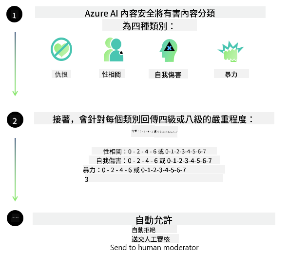

<!--
CO_OP_TRANSLATOR_METADATA:
{
  "original_hash": "c8273672cc57df2be675407a1383aaf0",
  "translation_date": "2025-05-08T06:13:38+00:00",
  "source_file": "md/01.Introduction/01/01.AISafety.md",
  "language_code": "tw"
}
-->
# Phi 模型的 AI 安全性
Phi 系列模型是依照 [Microsoft Responsible AI Standard](https://query.prod.cms.rt.microsoft.com/cms/api/am/binary/RE5cmFl) 開發，這是一套公司層級的要求，基於以下六大原則：問責制、透明度、公平性、可靠性與安全性、隱私與安全，以及包容性，這些構成了 [Microsoft 的負責任 AI 原則](https://www.microsoft.com/ai/responsible-ai)。

和先前的 Phi 模型一樣，我們採用了多面向的安全評估與訓練後安全措施，並針對本次發布的多語言能力做了額外調整。我們在 [Phi Safety Post-Training Paper](https://arxiv.org/abs/2407.13833) 中說明了安全訓練與評估的方法，包括跨多種語言和風險類別的測試。雖然 Phi 模型受惠於這些方法，開發者仍應採用負責任 AI 的最佳實務，針對其特定使用案例及文化與語言背景進行風險的對應、衡量與緩解。

## 最佳實務

和其他模型一樣，Phi 系列模型有可能表現出不公平、不可靠或冒犯性的行為。

您應該注意的 SLM 和 LLM 限制行為包括：

- **服務品質：** Phi 模型主要以英文文本訓練。非英語語言的表現可能較差。訓練資料中代表性較少的英語變體，表現可能不如標準美式英語。
- **傷害表現與刻板印象延續：** 這些模型可能會過度或不足地呈現某些族群，抹去部分族群的代表性，或強化貶低或負面的刻板印象。儘管有安全訓練後的措施，這些限制仍可能存在，因為不同族群的代表性差異，或訓練資料中反映現實世界模式與社會偏見的負面刻板印象案例普遍存在。
- **不當或冒犯性內容：** 這些模型可能產生其他類型的不當或冒犯性內容，若無針對使用案例的額外緩解措施，可能不適合用於敏感場景。
- **資訊可靠性：** 語言模型可能產生無意義內容，或捏造聽起來合理但不準確或過時的資訊。
- **程式碼範圍有限：** Phi-3 大部分訓練資料基於 Python，使用常見套件如 "typing, math, random, collections, datetime, itertools"。若模型產生使用其他套件或其他語言的腳本，強烈建議用戶手動驗證所有 API 的使用。

開發者應採用負責任 AI 的最佳實務，並負責確保特定使用案例符合相關法律與規範（例如隱私、貿易等）。

## 負責任 AI 考量

和其他語言模型一樣，Phi 系列模型可能表現出不公平、不可靠或冒犯性的行為。應注意的限制行為包括：

**服務品質：** Phi 模型主要以英文文本訓練。非英語語言表現較差。訓練資料中代表性較少的英語變體表現可能不如標準美式英語。

**傷害表現與刻板印象延續：** 這些模型可能過度或不足呈現某些族群，抹去部分族群代表性，或強化貶低或負面刻板印象。儘管有安全訓練後措施，這些限制仍可能存在，因為不同族群代表性差異或訓練資料中反映現實世界模式與社會偏見的負面刻板印象案例普遍存在。

**不當或冒犯性內容：** 這些模型可能產生其他類型不當或冒犯性內容，若無針對使用案例的額外緩解措施，可能不適合用於敏感場景。

資訊可靠性：語言模型可能產生無意義內容或捏造聽起來合理但不準確或過時的資訊。

**程式碼範圍有限：** Phi-3 大部分訓練資料基於 Python，使用常見套件如 "typing, math, random, collections, datetime, itertools"。若模型產生使用其他套件或其他語言的腳本，強烈建議用戶手動驗證所有 API 使用。

開發者應採用負責任 AI 最佳實務，並負責確保特定使用案例符合相關法律與規範（例如隱私、貿易等）。重要考量領域包括：

**分配：** 模型可能不適用於會對法律地位或資源、生命機會分配（例如：住房、就業、信用等）產生重大影響的情境，除非進行進一步評估與額外去偏技術。

**高風險情境：** 開發者應評估模型用於高風險情境的適用性，因為不公平、不可靠或冒犯性輸出可能帶來極大代價或傷害。這包括在敏感或專業領域提供建議，且準確性與可靠性至關重要（例如法律或健康建議）。應根據部署情境，在應用層面實施額外保障措施。

**錯誤資訊：** 模型可能產生不準確資訊。開發者應遵循透明度最佳實務，告知終端用戶他們正在與 AI 系統互動。在應用層面，開發者可建立回饋機制與管線，將回應基於特定使用案例的上下文資訊，此技術稱為 Retrieval Augmented Generation (RAG)。

**有害內容產生：** 開發者應根據上下文評估輸出，並使用可用的安全分類器或針對使用案例的自訂解決方案。

**濫用：** 其他濫用形式如詐騙、垃圾郵件或惡意軟體產生可能存在，開發者應確保應用不違反相關法律與規範。

### 微調與 AI 內容安全

微調模型後，我們強烈建議利用 [Azure AI Content Safety](https://learn.microsoft.com/azure/ai-services/content-safety/overview) 措施，監控模型產生的內容，識別並阻擋潛在風險、威脅與品質問題。

[Azure AI Content Safety](https://learn.microsoft.com/azure/ai-services/content-safety/overview) 支援文字與影像內容，可部署於雲端、離線容器及邊緣/嵌入式裝置。

## Azure AI Content Safety 概述

Azure AI Content Safety 並非一套通用解決方案；它可依企業特定政策客製化。此外，其多語言模型能同時理解多種語言。

- **Azure AI Content Safety**
- **Microsoft Developer**
- **5 部影片**

Azure AI Content Safety 服務能偵測應用與服務中的有害用戶生成與 AI 生成內容。它包含文字與影像 API，允許偵測有害或不當素材。

[AI Content Safety Playlist](https://www.youtube.com/playlist?list=PLlrxD0HtieHjaQ9bJjyp1T7FeCbmVcPkQ)

**免責聲明**：  
本文件係使用 AI 翻譯服務 [Co-op Translator](https://github.com/Azure/co-op-translator) 進行翻譯。雖然我們力求準確，但請注意，自動翻譯可能包含錯誤或不準確之處。原始文件之母語版本應視為權威來源。對於重要資訊，建議採用專業人工翻譯。我們不對因使用本翻譯而產生之任何誤解或誤譯負責。