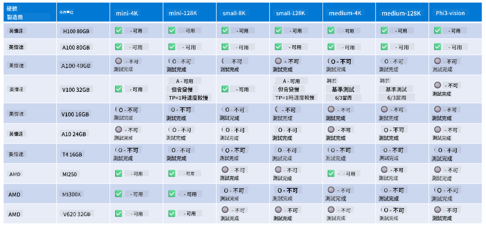

<!--
CO_OP_TRANSLATOR_METADATA:
{
  "original_hash": "c4afa6ffd13f29eb34e5f204b94310ff",
  "translation_date": "2025-04-04T05:42:45+00:00",
  "source_file": "md\\01.Introduction\\01\\01.Hardwaresupport.md",
  "language_code": "tw"
}
-->
# Phi 硬體支援

Microsoft Phi 已針對 ONNX Runtime 進行優化，並支援 Windows DirectML。它在各種硬體類型上表現良好，包括 GPU、CPU，甚至是行動裝置。

## 裝置硬體
具體支援的硬體包括：

- GPU 型號：RTX 4090 (DirectML)
- GPU 型號：1 A100 80GB (CUDA)
- CPU 型號：Standard F64s v2 (64 vCPUs, 128 GiB 記憶體)

## 行動裝置型號

- Android - Samsung Galaxy S21
- Apple iPhone 14 或更新型號 A16/A17 處理器

## Phi 硬體規格

- 最低配置要求：
- Windows：支援 DirectX 12 的 GPU，且至少擁有 4GB 的整體 RAM

CUDA：NVIDIA GPU，計算能力 >= 7.02



## 在多個 GPU 上執行 onnxruntime

目前提供的 Phi ONNX 模型僅支援 1 個 GPU。Phi 模型有可能支援多 GPU，但使用 ORT 配合 2 個 GPU 不保證能比 2 個獨立的 ORT 實例提供更高的吞吐量。請參考 [ONNX Runtime](https://onnxruntime.ai/) 以獲取最新更新。

在 [Build 2024 的 GenAI ONNX 團隊](https://youtu.be/WLW4SE8M9i8?si=EtG04UwDvcjunyfC) 宣佈他們已啟用 Phi 模型的多實例，而非多 GPU。

目前，這使得您可以使用 CUDA_VISIBLE_DEVICES 環境變數以如下方式運行一個 onnxruntime 或 onnxruntime-genai 實例。

```Python
CUDA_VISIBLE_DEVICES=0 python infer.py
CUDA_VISIBLE_DEVICES=1 python infer.py
```

歡迎在 [Azure AI Foundry](https://ai.azure.com) 中進一步探索 Phi。

**免責聲明**：  
本文件使用 AI 翻譯服務 [Co-op Translator](https://github.com/Azure/co-op-translator) 進行翻譯。我們努力確保翻譯的準確性，但請注意，機器翻譯可能包含錯誤或不精確之處。應以原始語言版本的文件作為權威來源。對於重要信息，建議尋求專業人工翻譯。我們不對因使用此翻譯而引起的任何誤解或誤釋承擔責任。