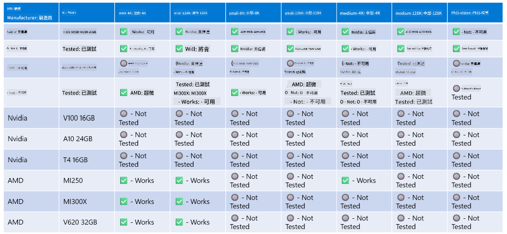

<!--
CO_OP_TRANSLATOR_METADATA:
{
  "original_hash": "8cdc17ce0f10535da30b53d23fe1a795",
  "translation_date": "2025-05-08T06:14:34+00:00",
  "source_file": "md/01.Introduction/01/01.Hardwaresupport.md",
  "language_code": "tw"
}
-->
# Phi 硬體支援

Microsoft Phi 已針對 ONNX Runtime 進行優化，並支援 Windows DirectML。它能良好運作於多種硬體類型，包括 GPU、CPU，甚至行動裝置。

## 裝置硬體  
具體支援的硬體包括：

- GPU SKU：RTX 4090（DirectML）
- GPU SKU：1 A100 80GB（CUDA）
- CPU SKU：Standard F64s v2（64 vCPU，128 GiB 記憶體）

## 行動裝置 SKU

- Android - Samsung Galaxy S21
- Apple iPhone 14 或更新款 A16/A17 處理器

## Phi 硬體規格

- 最低需求配置。
- Windows：支援 DirectX 12 的 GPU，且合計記憶體至少 4GB

CUDA：NVIDIA GPU，計算能力 >= 7.02



## 在多 GPU 上執行 onnxruntime

目前可用的 Phi ONNX 模型僅支援單 GPU。Phi 模型理論上可支援多 GPU，但使用兩張 GPU 的 ORT 不保證效能會比執行兩個獨立的 ORT 實例更好。請參考 [ONNX Runtime](https://onnxruntime.ai/) 以取得最新資訊。

在 [Build 2024 the GenAI ONNX Team](https://youtu.be/WLW4SE8M9i8?si=EtG04UwDvcjunyfC) 宣布，他們已針對 Phi 模型啟用多實例（multi-instance）而非多 GPU。

目前你可以使用 CUDA_VISIBLE_DEVICES 環境變數，像這樣執行一個 onnxruntime 或 onnxruntime-genai 實例。

```Python
CUDA_VISIBLE_DEVICES=0 python infer.py
CUDA_VISIBLE_DEVICES=1 python infer.py
```

歡迎在 [Azure AI Foundry](https://ai.azure.com) 進一步探索 Phi。

**免責聲明**：  
本文件係使用 AI 翻譯服務 [Co-op Translator](https://github.com/Azure/co-op-translator) 所翻譯。雖然我們致力於提供準確的翻譯，但請注意自動翻譯可能會包含錯誤或不準確之處。原始文件之母語版本應視為權威來源。對於重要資訊，建議採用專業人工翻譯。我們不對因使用本翻譯而產生的任何誤解或誤譯負責。