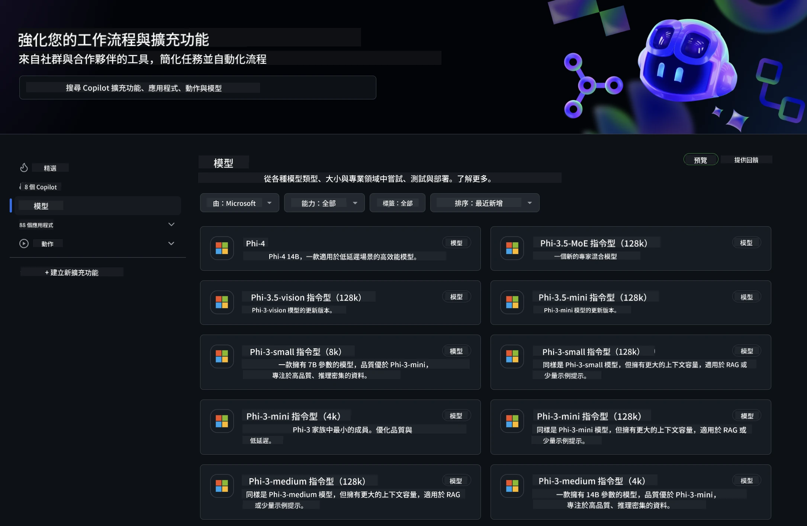
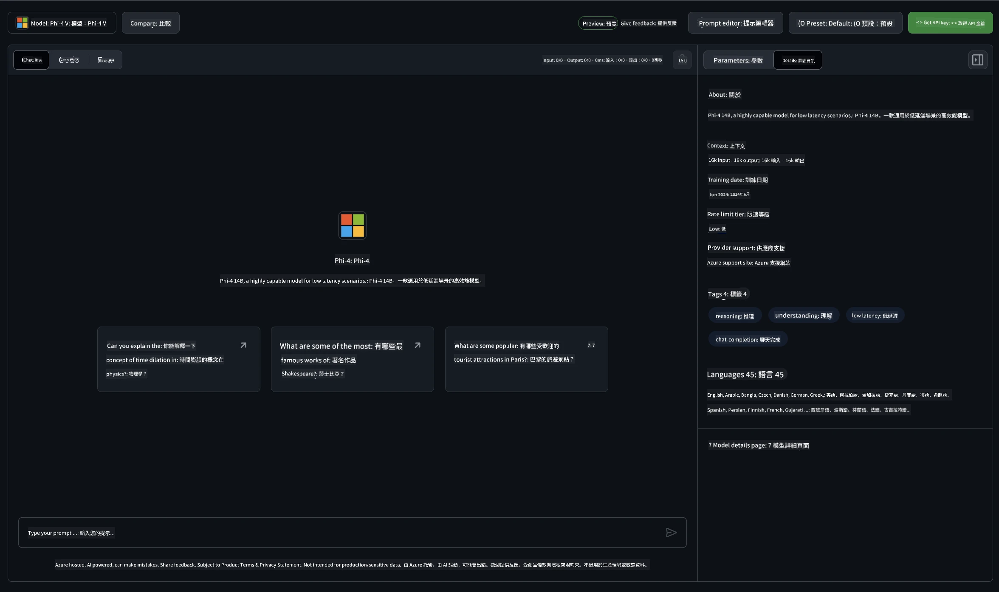
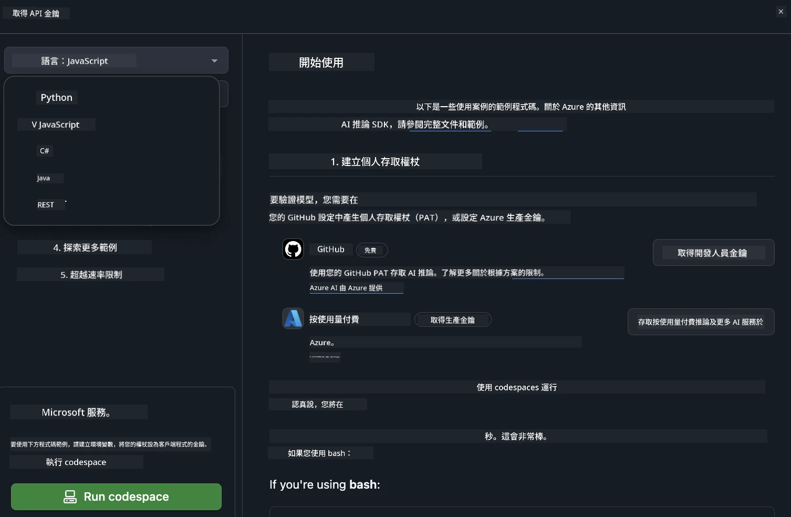
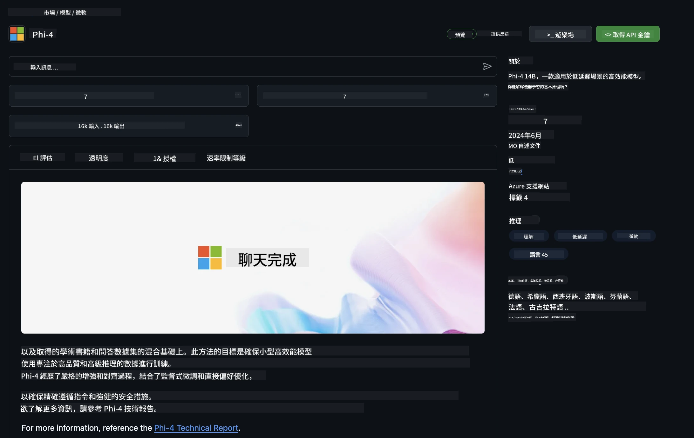

<!--
CO_OP_TRANSLATOR_METADATA:
{
  "original_hash": "fb67a08b9fc911a10ed58081fadef416",
  "translation_date": "2025-07-16T18:58:21+00:00",
  "source_file": "md/01.Introduction/02/02.GitHubModel.md",
  "language_code": "tw"
}
-->
## GitHub Models 中的 Phi 系列

歡迎來到 [GitHub Models](https://github.com/marketplace/models)！我們已經準備好讓你探索在 Azure AI 上託管的 AI 模型。



想了解更多 GitHub Models 上可用的模型，請參考 [GitHub Model Marketplace](https://github.com/marketplace/models)

## 可用模型

每個模型都有專屬的 playground 和範例程式碼



### GitHub Model Catalog 中的 Phi 系列

- [Phi-4](https://github.com/marketplace/models/azureml/Phi-4)

- [Phi-3.5-MoE instruct (128k)](https://github.com/marketplace/models/azureml/Phi-3-5-MoE-instruct)

- [Phi-3.5-vision instruct (128k)](https://github.com/marketplace/models/azureml/Phi-3-5-vision-instruct)

- [Phi-3.5-mini instruct (128k)](https://github.com/marketplace/models/azureml/Phi-3-5-mini-instruct)

- [Phi-3-Medium-128k-Instruct](https://github.com/marketplace/models/azureml/Phi-3-medium-128k-instruct)

- [Phi-3-medium-4k-instruct](https://github.com/marketplace/models/azureml/Phi-3-medium-4k-instruct)

- [Phi-3-mini-128k-instruct](https://github.com/marketplace/models/azureml/Phi-3-mini-128k-instruct)

- [Phi-3-mini-4k-instruct](https://github.com/marketplace/models/azureml/Phi-3-mini-4k-instruct)

- [Phi-3-small-128k-instruct](https://github.com/marketplace/models/azureml/Phi-3-small-128k-instruct)

- [Phi-3-small-8k-instruct](https://github.com/marketplace/models/azureml/Phi-3-small-8k-instruct)

## 快速開始

這裡有一些基本範例已經準備好讓你執行。你可以在 samples 目錄中找到它們。如果你想直接使用你喜歡的程式語言，以下是支援的語言範例：

- Python
- JavaScript
- C#
- Java
- cURL

此外，也有專門的 Codespaces 環境用來執行範例和模型。



## 範例程式碼

以下是幾個使用案例的範例程式碼片段。想了解更多關於 Azure AI Inference SDK 的資訊，請參考完整文件和範例。

## 設定

1. 建立個人存取權杖  
你不需要為權杖設定任何權限。請注意，權杖會傳送到 Microsoft 服務。

要使用以下程式碼片段，請建立環境變數，將你的權杖設為用戶端程式碼的金鑰。

如果你使用 bash：  
```
export GITHUB_TOKEN="<your-github-token-goes-here>"
```  
如果你使用 powershell：  

```
$Env:GITHUB_TOKEN="<your-github-token-goes-here>"
```  

如果你使用 Windows 命令提示字元：  

```
set GITHUB_TOKEN=<your-github-token-goes-here>
```  

## Python 範例

### 安裝相依套件  
使用 pip 安裝 Azure AI Inference SDK（需求：Python >=3.8）：

```
pip install azure-ai-inference
```  
### 執行基本範例程式碼

此範例示範如何呼叫 chat completion API。它使用 GitHub AI 模型推論端點和你的 GitHub 權杖。呼叫為同步方式。

```python
import os
from azure.ai.inference import ChatCompletionsClient
from azure.ai.inference.models import SystemMessage, UserMessage
from azure.core.credentials import AzureKeyCredential

endpoint = "https://models.inference.ai.azure.com"
model_name = "Phi-4"
token = os.environ["GITHUB_TOKEN"]

client = ChatCompletionsClient(
    endpoint=endpoint,
    credential=AzureKeyCredential(token),
)

response = client.complete(
    messages=[
        UserMessage(content="I have $20,000 in my savings account, where I receive a 4% profit per year and payments twice a year. Can you please tell me how long it will take for me to become a millionaire? Also, can you please explain the math step by step as if you were explaining it to an uneducated person?"),
    ],
    temperature=0.4,
    top_p=1.0,
    max_tokens=2048,
    model=model_name
)

print(response.choices[0].message.content)
```

### 執行多輪對話

此範例示範如何使用 chat completion API 進行多輪對話。當你用模型做聊天應用時，需要管理對話歷史並將最新訊息傳給模型。

```
import os
from azure.ai.inference import ChatCompletionsClient
from azure.ai.inference.models import AssistantMessage, SystemMessage, UserMessage
from azure.core.credentials import AzureKeyCredential

token = os.environ["GITHUB_TOKEN"]
endpoint = "https://models.inference.ai.azure.com"
# Replace Model_Name
model_name = "Phi-4"

client = ChatCompletionsClient(
    endpoint=endpoint,
    credential=AzureKeyCredential(token),
)

messages = [
    SystemMessage(content="You are a helpful assistant."),
    UserMessage(content="What is the capital of France?"),
    AssistantMessage(content="The capital of France is Paris."),
    UserMessage(content="What about Spain?"),
]

response = client.complete(messages=messages, model=model_name)

print(response.choices[0].message.content)
```

### 串流輸出

為了更好的使用者體驗，你會想串流模型的回應，讓第一個 token 盡早出現，避免等待過久的回應。

```
import os
from azure.ai.inference import ChatCompletionsClient
from azure.ai.inference.models import SystemMessage, UserMessage
from azure.core.credentials import AzureKeyCredential

token = os.environ["GITHUB_TOKEN"]
endpoint = "https://models.inference.ai.azure.com"
# Replace Model_Name
model_name = "Phi-4"

client = ChatCompletionsClient(
    endpoint=endpoint,
    credential=AzureKeyCredential(token),
)

response = client.complete(
    stream=True,
    messages=[
        SystemMessage(content="You are a helpful assistant."),
        UserMessage(content="Give me 5 good reasons why I should exercise every day."),
    ],
    model=model_name,
)

for update in response:
    if update.choices:
        print(update.choices[0].delta.content or "", end="")

client.close()
```

## GitHub Models 的免費使用與速率限制



[playground 和免費 API 使用的速率限制](https://docs.github.com/en/github-models/prototyping-with-ai-models#rate-limits) 是為了幫助你試驗模型和快速開發 AI 應用。若超出這些限制，並想將應用擴展到生產環境，必須從 Azure 帳戶配置資源，並從那裡進行驗證，而非使用 GitHub 個人存取權杖。你不需要更改程式碼的其他部分。請使用此連結了解如何突破 Azure AI 的免費層限制。

### 免責聲明

請記得，與模型互動時，你是在嘗試 AI 技術，因此內容可能會有錯誤。

此功能有多種限制（包括每分鐘請求數、每日請求數、每次請求的 token 數量，以及同時請求數），並非設計用於生產環境。

GitHub Models 採用 Azure AI Content Safety。這些過濾器無法在 GitHub Models 體驗中關閉。如果你選擇透過付費服務使用模型，請自行設定內容過濾器以符合你的需求。

此服務遵循 GitHub 的預發布條款。

**免責聲明**：  
本文件係使用 AI 翻譯服務 [Co-op Translator](https://github.com/Azure/co-op-translator) 進行翻譯。雖然我們致力於確保翻譯的準確性，但請注意，自動翻譯可能包含錯誤或不準確之處。原始文件的母語版本應視為權威來源。對於重要資訊，建議採用專業人工翻譯。我們不對因使用本翻譯而產生的任何誤解或誤釋負責。