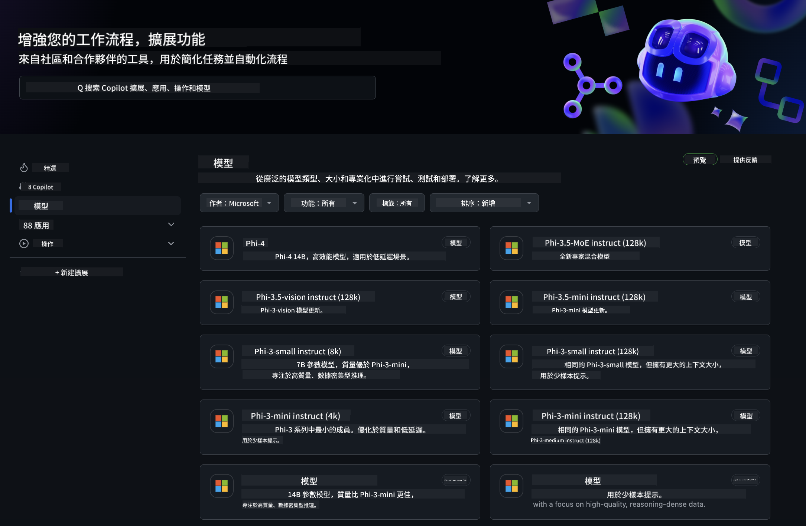
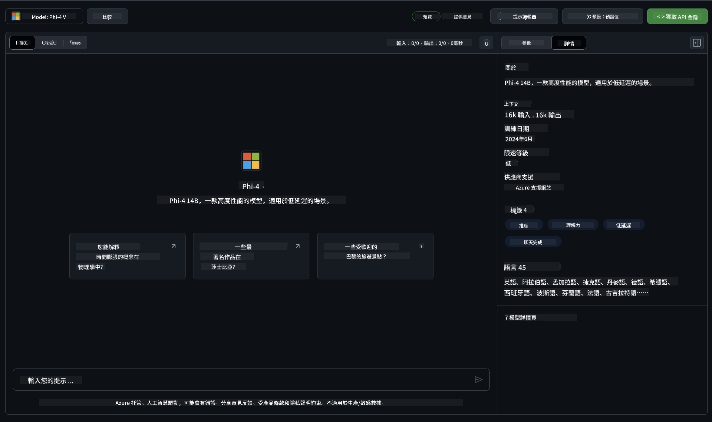
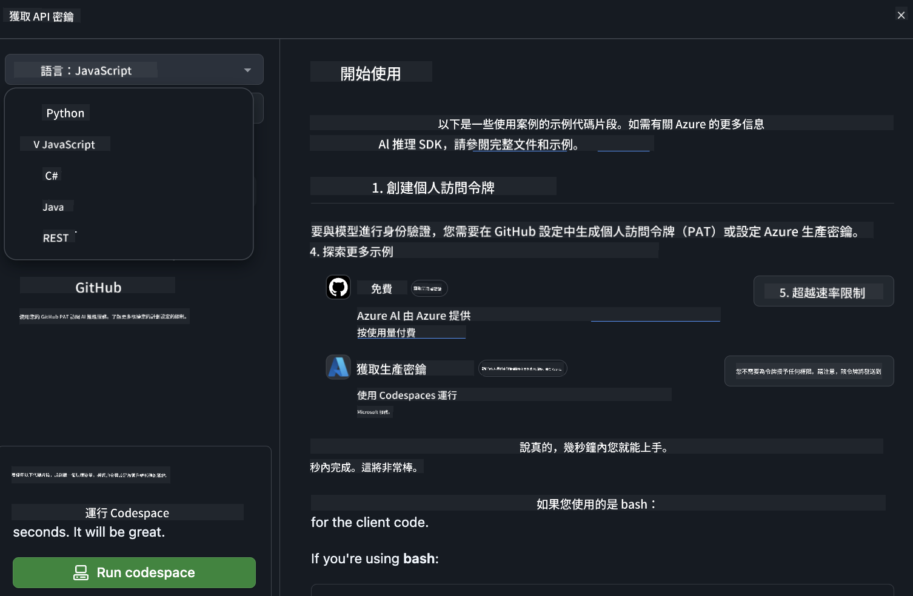
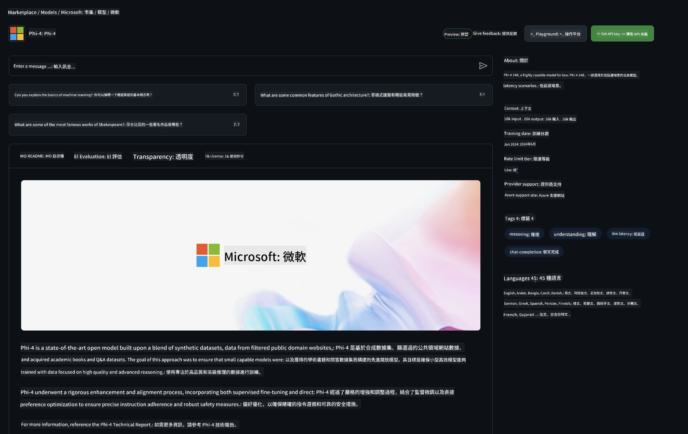

<!--
CO_OP_TRANSLATOR_METADATA:
{
  "original_hash": "fa5cdbc832e5bcffebb25ce25ec1a3c3",
  "translation_date": "2025-04-04T05:46:48+00:00",
  "source_file": "md\\01.Introduction\\02\\02.GitHubModel.md",
  "language_code": "tw"
}
-->
## Phi 家族於 GitHub Models

歡迎來到 [GitHub Models](https://github.com/marketplace/models)！我們已經為您準備好探索 Azure AI 上托管的 AI 模型。



想了解更多 GitHub Models 上提供的模型，請查看 [GitHub Model Marketplace](https://github.com/marketplace/models)。

## 可用模型

每個模型都有專屬的測試平台和範例代碼。



### GitHub Model Catalog 中的 Phi 家族

- [Phi-4](https://github.com/marketplace/models/azureml/Phi-4)

- [Phi-3.5-MoE instruct (128k)](https://github.com/marketplace/models/azureml/Phi-3-5-MoE-instruct)

- [Phi-3.5-vision instruct (128k)](https://github.com/marketplace/models/azureml/Phi-3-5-vision-instruct)

- [Phi-3.5-mini instruct (128k)](https://github.com/marketplace/models/azureml/Phi-3-5-mini-instruct)

- [Phi-3-Medium-128k-Instruct](https://github.com/marketplace/models/azureml/Phi-3-medium-128k-instruct)

- [Phi-3-medium-4k-instruct](https://github.com/marketplace/models/azureml/Phi-3-medium-4k-instruct)

- [Phi-3-mini-128k-instruct](https://github.com/marketplace/models/azureml/Phi-3-mini-128k-instruct)

- [Phi-3-mini-4k-instruct](https://github.com/marketplace/models/azureml/Phi-3-mini-4k-instruct)

- [Phi-3-small-128k-instruct](https://github.com/marketplace/models/azureml/Phi-3-small-128k-instruct)

- [Phi-3-small-8k-instruct](https://github.com/marketplace/models/azureml/Phi-3-small-8k-instruct)

## 入門指南

我們已準備了一些基本範例，供您直接執行。您可以在 samples 目錄中找到它們。如果您想直接跳到自己偏好的語言，以下是提供的範例：

- Python
- JavaScript
- C#
- Java
- cURL

此外，我們還提供專屬的 Codespaces 環境來執行範例和模型。



## 範例代碼 

以下是一些使用案例的範例代碼片段。若需更多 Azure AI Inference SDK 的詳細資訊，請參閱完整文檔和範例。

## 設置 

1. 建立個人訪問令牌  
您不需要為令牌授予任何權限。請注意，令牌將會被發送到 Microsoft 的服務。

要使用以下代碼片段，請建立一個環境變數，將令牌設置為客戶端代碼的密鑰。

如果您使用的是 bash：
```
export GITHUB_TOKEN="<your-github-token-goes-here>"
```  
如果您使用的是 powershell：

```
$Env:GITHUB_TOKEN="<your-github-token-goes-here>"
```  

如果您使用的是 Windows 命令提示符：

```
set GITHUB_TOKEN=<your-github-token-goes-here>
```  

## Python 範例

### 安裝依賴項
使用 pip 安裝 Azure AI Inference SDK（需求：Python >=3.8）：

```
pip install azure-ai-inference
```  

### 執行基本代碼範例

此範例展示了如何使用聊天完成 API 進行基本調用。它利用 GitHub AI 模型推理端點和您的 GitHub 令牌。該調用是同步的。

```python
import os
from azure.ai.inference import ChatCompletionsClient
from azure.ai.inference.models import SystemMessage, UserMessage
from azure.core.credentials import AzureKeyCredential

endpoint = "https://models.inference.ai.azure.com"
model_name = "Phi-4"
token = os.environ["GITHUB_TOKEN"]

client = ChatCompletionsClient(
    endpoint=endpoint,
    credential=AzureKeyCredential(token),
)

response = client.complete(
    messages=[
        UserMessage(content="I have $20,000 in my savings account, where I receive a 4% profit per year and payments twice a year. Can you please tell me how long it will take for me to become a millionaire? Also, can you please explain the math step by step as if you were explaining it to an uneducated person?"),
    ],
    temperature=0.4,
    top_p=1.0,
    max_tokens=2048,
    model=model_name
)

print(response.choices[0].message.content)
```  

### 執行多輪對話

此範例展示了如何使用聊天完成 API 進行多輪對話。當您將模型用於聊天應用時，需管理該對話的歷史記錄並將最新的消息發送至模型。

```
import os
from azure.ai.inference import ChatCompletionsClient
from azure.ai.inference.models import AssistantMessage, SystemMessage, UserMessage
from azure.core.credentials import AzureKeyCredential

token = os.environ["GITHUB_TOKEN"]
endpoint = "https://models.inference.ai.azure.com"
# Replace Model_Name
model_name = "Phi-4"

client = ChatCompletionsClient(
    endpoint=endpoint,
    credential=AzureKeyCredential(token),
)

messages = [
    SystemMessage(content="You are a helpful assistant."),
    UserMessage(content="What is the capital of France?"),
    AssistantMessage(content="The capital of France is Paris."),
    UserMessage(content="What about Spain?"),
]

response = client.complete(messages=messages, model=model_name)

print(response.choices[0].message.content)
```  

### 流式輸出

為了提供更好的使用體驗，您可能希望流式接收模型的響應，這樣第一個 token 可以更早顯示，避免等待過長的回應。

```
import os
from azure.ai.inference import ChatCompletionsClient
from azure.ai.inference.models import SystemMessage, UserMessage
from azure.core.credentials import AzureKeyCredential

token = os.environ["GITHUB_TOKEN"]
endpoint = "https://models.inference.ai.azure.com"
# Replace Model_Name
model_name = "Phi-4"

client = ChatCompletionsClient(
    endpoint=endpoint,
    credential=AzureKeyCredential(token),
)

response = client.complete(
    stream=True,
    messages=[
        SystemMessage(content="You are a helpful assistant."),
        UserMessage(content="Give me 5 good reasons why I should exercise every day."),
    ],
    model=model_name,
)

for update in response:
    if update.choices:
        print(update.choices[0].delta.content or "", end="")

client.close()
```  

## GitHub Models 的免費使用和速率限制



[遊樂場和免費 API 使用的速率限制](https://docs.github.com/en/github-models/prototyping-with-ai-models#rate-limits)旨在幫助您試驗模型並原型化您的 AI 應用。若需超出這些限制的使用，並將您的應用擴展到生產級別，您需要從 Azure 帳戶中配置資源，並從該處進行身份驗證，而非使用 GitHub 的個人訪問令牌。您無需更改代碼中的其他內容。使用此鏈接了解如何突破 Azure AI 的免費層限制。

### 注意事項

請記住，與模型交互時，您正在試驗 AI，因此可能會出現內容錯誤。

此功能受多種限制（包括每分鐘請求數、每天請求數、每次請求的 token 數量及並發請求數），且不適用於生產環境。

GitHub Models 使用 Azure AI Content Safety。這些過濾器無法在 GitHub Models 的使用體驗中關閉。如果您決定通過付費服務使用模型，請根據您的需求配置內容過濾器。

此服務受 GitHub 的預發布條款約束。

**免責聲明**：  
本文檔使用 AI 翻譯服務 [Co-op Translator](https://github.com/Azure/co-op-translator) 進行翻譯。儘管我們努力確保翻譯的準確性，但請注意，自動翻譯可能包含錯誤或不精確之處。原始語言的文件應被視為具有權威性的來源。對於重要信息，建議尋求專業人工翻譯。我們對因使用此翻譯而導致的任何誤解或錯誤解釋不承擔責任。