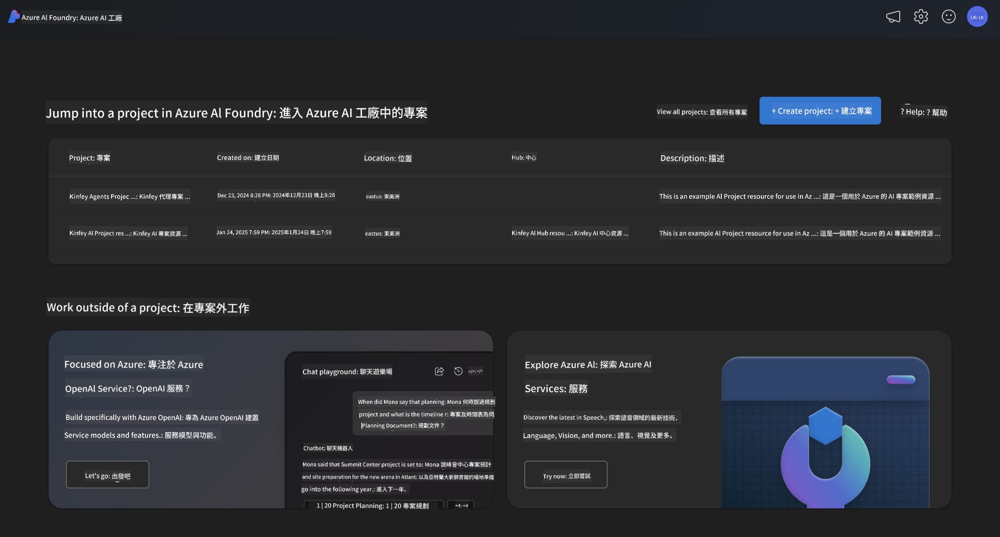
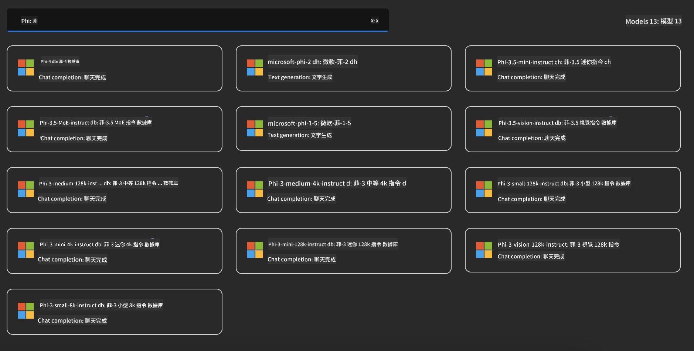

<!--
CO_OP_TRANSLATOR_METADATA:
{
  "original_hash": "3ae21dc5554e888defbe57946ee995ee",
  "translation_date": "2025-07-16T19:07:41+00:00",
  "source_file": "md/01.Introduction/02/03.AzureAIFoundry.md",
  "language_code": "tw"
}
-->
## Azure AI Foundry 中的 Phi 系列

[Azure AI Foundry](https://ai.azure.com) 是一個值得信賴的平台，讓開發者能夠以安全、可靠且負責任的方式，推動創新並塑造 AI 的未來。

[Azure AI Foundry](https://ai.azure.com) 專為開發者設計，能夠：

- 在企業級平台上構建生成式 AI 應用程式。
- 利用先進的 AI 工具和機器學習模型，探索、建置、測試及部署，並以負責任的 AI 實踐為基礎。
- 與團隊協作，涵蓋應用程式開發的完整生命週期。

透過 Azure AI Foundry，您可以探索多種模型、服務和功能，並開始打造最符合您目標的 AI 應用程式。Azure AI Foundry 平台支援擴展性，輕鬆將概念驗證轉化為完整的生產應用程式。持續監控與優化助您長期成功。



除了在 Azure AI Foundry 使用 Azure AOAI Service 外，您也可以在 Azure AI Foundry 模型目錄中使用第三方模型。如果您想將 Azure AI Foundry 作為 AI 解決方案平台，這是個不錯的選擇。

我們可以透過 Azure AI Foundry 的模型目錄快速部署 Phi 系列模型

[Microsoft Phi Models in Azure AI Foundry Models](https://ai.azure.com/explore/models/?selectedCollection=phi)



### **在 Azure AI Foundry 部署 Phi-4**


### **在 Azure AI Foundry Playground 測試 Phi-4**


### **執行 Python 程式碼呼叫 Azure AI Foundry Phi-4**

```python

import os  
import base64
from openai import AzureOpenAI  
from azure.identity import DefaultAzureCredential, get_bearer_token_provider  
        
endpoint = os.getenv("ENDPOINT_URL", "Your Azure AOAI Service Endpoint")  
deployment = os.getenv("DEPLOYMENT_NAME", "Phi-4")  
      
token_provider = get_bearer_token_provider(  
    DefaultAzureCredential(),  
    "https://cognitiveservices.azure.com/.default"  
)  
  
client = AzureOpenAI(  
    azure_endpoint=endpoint,  
    azure_ad_token_provider=token_provider,  
    api_version="2024-05-01-preview",  
)  
  

chat_prompt = [
    {
        "role": "system",
        "content": "You are an AI assistant that helps people find information."
    },
    {
        "role": "user",
        "content": "can you introduce yourself"
    }
] 
    
# Include speech result if speech is enabled  
messages = chat_prompt 

completion = client.chat.completions.create(  
    model=deployment,  
    messages=messages,
    max_tokens=800,  
    temperature=0.7,  
    top_p=0.95,  
    frequency_penalty=0,  
    presence_penalty=0,
    stop=None,  
    stream=False  
)  
  
print(completion.to_json())  

```

**免責聲明**：  
本文件係使用 AI 翻譯服務 [Co-op Translator](https://github.com/Azure/co-op-translator) 進行翻譯。雖然我們致力於確保翻譯的準確性，但請注意，自動翻譯可能包含錯誤或不準確之處。原始文件的母語版本應視為權威來源。對於重要資訊，建議採用專業人工翻譯。我們不對因使用本翻譯而產生的任何誤解或誤釋負責。