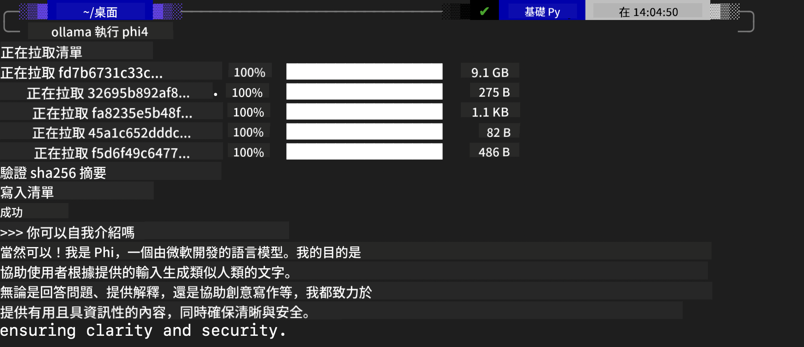
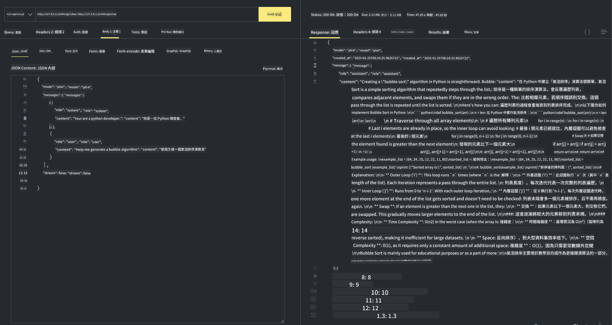

<!--
CO_OP_TRANSLATOR_METADATA:
{
  "original_hash": "0b38834693bb497f96bf53f0d941f9a1",
  "translation_date": "2025-07-16T19:13:52+00:00",
  "source_file": "md/01.Introduction/02/04.Ollama.md",
  "language_code": "tw"
}
-->
## Ollama 中的 Phi 系列


[Ollama](https://ollama.com) 讓更多人能夠透過簡單的腳本直接部署開源的 LLM 或 SLM，也能建立 API 來協助本地 Copilot 的應用場景。

## **1. 安裝**

Ollama 支援在 Windows、macOS 和 Linux 上運行。你可以透過這個連結安裝 Ollama（[https://ollama.com/download](https://ollama.com/download)）。安裝成功後，可以直接在終端機視窗使用 Ollama 腳本呼叫 Phi-3。你可以查看所有 [Ollama 中可用的模型](https://ollama.com/library)。如果你在 Codespace 中開啟此倉庫，Ollama 已經預先安裝好了。

```bash

ollama run phi4

```

> [!NOTE]
> 第一次執行時會先下載模型，當然你也可以直接指定已下載的 Phi-4 模型。我們以 WSL 為例來執行指令。模型下載完成後，就能直接在終端機互動。



## **2. 從 Ollama 呼叫 phi-4 API**

如果你想呼叫 Ollama 產生的 Phi-4 API，可以在終端機使用以下指令啟動 Ollama 伺服器。

```bash

ollama serve

```

> [!NOTE]
> 如果你使用 macOS 或 Linux，可能會遇到以下錯誤 **"Error: listen tcp 127.0.0.1:11434: bind: address already in use"**，這通常表示伺服器已經在運行。你可以忽略這個錯誤，或者停止並重新啟動 Ollama：

**macOS**

```bash

brew services restart ollama

```

**Linux**

```bash

sudo systemctl stop ollama

```

Ollama 支援兩種 API：generate 和 chat。你可以根據需求，向本地執行於 11434 埠口的服務發送請求，呼叫 Ollama 提供的模型 API。

**Chat**

```bash

curl http://127.0.0.1:11434/api/chat -d '{
  "model": "phi3",
  "messages": [
    {
      "role": "system",
      "content": "Your are a python developer."
    },
    {
      "role": "user",
      "content": "Help me generate a bubble algorithm"
    }
  ],
  "stream": false
  
}'

This is the result in Postman



## Additional Resources

Check the list of available models in Ollama in [their library](https://ollama.com/library).

Pull your model from the Ollama server using this command

```bash
ollama pull phi4
```

Run the model using this command

```bash
ollama run phi4
```

***Note:*** Visit this link [https://github.com/ollama/ollama/blob/main/docs/api.md](https://github.com/ollama/ollama/blob/main/docs/api.md) to learn more

## Calling Ollama from Python

You can use `requests` or `urllib3` to make requests to the local server endpoints used above. However, a popular way to use Ollama in Python is via the [openai](https://pypi.org/project/openai/) SDK, since Ollama provides OpenAI-compatible server endpoints as well.

Here is an example for phi3-mini:

```python
import openai

client = openai.OpenAI(
    base_url="http://localhost:11434/v1",
    api_key="nokeyneeded",
)

response = client.chat.completions.create(
    model="phi4",
    temperature=0.7,
    n=1,
    messages=[
        {"role": "system", "content": "You are a helpful assistant."},
        {"role": "user", "content": "Write a haiku about a hungry cat"},
    ],
)

print("Response:")
print(response.choices[0].message.content)
```

## Calling Ollama from JavaScript 

```javascript
// 使用 Phi-4 摘要檔案的範例
script({
    model: "ollama:phi4",
    title: "使用 Phi-4 摘要",
    system: ["system"],
})

// 摘要範例
const file = def("FILE", env.files)
$`Summarize ${file} in a single paragraph.`
```

## Calling Ollama from C#

Create a new C# Console application and add the following NuGet package:

```bash
dotnet add package Microsoft.SemanticKernel --version 1.34.0
```

Then replace this code in the `Program.cs` file

```csharp
using Microsoft.SemanticKernel;
using Microsoft.SemanticKernel.ChatCompletion;

// 使用本地 Ollama 伺服器端點新增聊天完成服務
#pragma warning disable SKEXP0001, SKEXP0003, SKEXP0010, SKEXP0011, SKEXP0050, SKEXP0052
builder.AddOpenAIChatCompletion(
    modelId: "phi4",
    endpoint: new Uri("http://localhost:11434/"),
    apiKey: "non required");

// 呼叫聊天服務並傳送簡單提示
string prompt = "Write a joke about kittens";
var response = await kernel.InvokePromptAsync(prompt);
Console.WriteLine(response.GetValue<string>());
```

Run the app with the command:

```bash
dotnet run


**免責聲明**：  
本文件係使用 AI 翻譯服務 [Co-op Translator](https://github.com/Azure/co-op-translator) 進行翻譯。雖然我們致力於確保翻譯的準確性，但請注意，自動翻譯可能包含錯誤或不準確之處。原始文件的母語版本應視為權威來源。對於重要資訊，建議採用專業人工翻譯。我們不對因使用本翻譯而產生的任何誤解或誤譯負責。