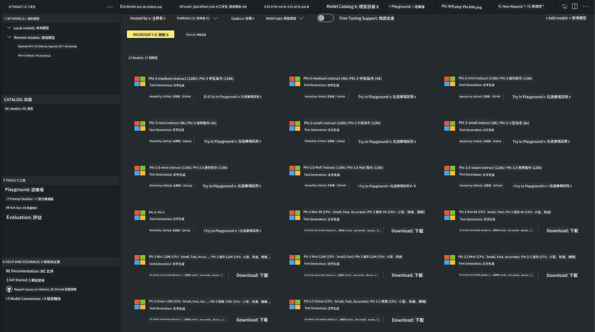

<!--
CO_OP_TRANSLATOR_METADATA:
{
  "original_hash": "4951d458c0b60c02cd1e751b40903877",
  "translation_date": "2025-05-08T06:20:03+00:00",
  "source_file": "md/01.Introduction/02/05.AITK.md",
  "language_code": "tw"
}
-->
# Phi Family in AITK

[AI Toolkit for VS Code](https://marketplace.visualstudio.com/items?itemName=ms-windows-ai-studio.windows-ai-studio) 讓生成式 AI 應用開發更簡單，整合了來自 Azure AI Foundry Catalog 以及像 Hugging Face 等其他目錄的先進 AI 開發工具和模型。你可以瀏覽由 GitHub Models 和 Azure AI Foundry Model Catalogs 提供的 AI 模型目錄，下載到本地或遠端，進行微調、測試並在你的應用程式中使用它們。

AI Toolkit 預覽版會在本地運行。是否能本地推論或微調，取決於你選擇的模型，可能需要有像 NVIDIA CUDA GPU 這樣的 GPU。你也可以直接用 AITK 執行 GitHub Models。

## 開始使用

[了解如何安裝 Windows 子系統 Linux](https://learn.microsoft.com/windows/wsl/install?WT.mc_id=aiml-137032-kinfeylo)

以及[更改預設發行版](https://learn.microsoft.com/windows/wsl/install#change-the-default-linux-distribution-installed)。

[AI Tooklit GitHub Repo](https://github.com/microsoft/vscode-ai-toolkit/)

- Windows、Linux、macOS
  
- 在 Windows 和 Linux 上進行微調都需要 Nvidia GPU。此外，**Windows** 需要安裝 Ubuntu 18.4 以上版本的 Linux 子系統。 [了解如何安裝 Windows 子系統 Linux](https://learn.microsoft.com/windows/wsl/install) 以及 [更改預設發行版](https://learn.microsoft.com/windows/wsl/install#change-the-default-linux-distribution-installed)。

### 安裝 AI Toolkit

AI Toolkit 以 [Visual Studio Code 擴充套件](https://code.visualstudio.com/docs/setup/additional-components#_vs-code-extensions) 形式發佈，所以你需要先安裝 [VS Code](https://code.visualstudio.com/docs/setup/windows?WT.mc_id=aiml-137032-kinfeylo)，然後從 [VS Marketplace](https://marketplace.visualstudio.com/items?itemName=ms-windows-ai-studio.windows-ai-studio) 下載 AI Toolkit。  
[AI Toolkit 在 Visual Studio Marketplace](https://marketplace.visualstudio.com/items?itemName=ms-windows-ai-studio.windows-ai-studio) 上可用，安裝方式和其他 VS Code 擴充套件一樣。

如果你不熟悉如何安裝 VS Code 擴充套件，請依照以下步驟：

### 登入

1. 在 VS Code 的活動列選擇 **Extensions**
1. 在擴充套件搜尋欄輸入 "AI Toolkit"
1. 選擇 "AI Toolkit for Visual Studio code"
1. 點選 **Install**

現在你已準備好使用這個擴充套件！

系統會要求你登入 GitHub，請點選「Allow」繼續。你會被導向 GitHub 登入頁面。

請登入並依照流程操作，完成後會回到 VS Code。

安裝完成後，你會在活動列看到 AI Toolkit 的圖示。

讓我們來看看可用的功能吧！

### 可用功能

AI Toolkit 的主側邊欄分成

- **Models**
- **Resources**
- **Playground**  
- **Fine-tuning**
- **Evaluation**

這些功能都在 Resources 區塊。開始時請選擇 **Model Catalog**。

### 從目錄下載模型

從 VS Code 側邊欄啟動 AI Toolkit 後，你可以選擇以下選項：



- 從 **Model Catalog** 找到支援的模型並下載到本地
- 在 **Model Playground** 測試模型推論
- 在 **Model Fine-tuning** 本地或遠端微調模型
- 透過 AI Toolkit 指令面板將微調後模型部署到雲端
- 評估模型

> [!NOTE]
>
> **GPU 與 CPU**
>
> 你會看到模型卡片會顯示模型大小、平台和加速器類型（CPU、GPU）。若要在**有至少一張 GPU 的 Windows 裝置**上獲得最佳效能，請選擇只針對 Windows 的模型版本。
>
> 這能確保你使用的是針對 DirectML 加速器優化的模型。
>
> 模型名稱格式為
>
> - `{model_name}-{accelerator}-{quantization}-{format}`。
>
>要查看你的 Windows 裝置是否有 GPU，請開啟 **工作管理員**，並切換到 **效能** 標籤。若有 GPU，會列在像是 "GPU 0" 或 "GPU 1" 的名稱下。

### 在 playground 執行模型

設定好所有參數後，點選 **Generate Project**。

模型下載完成後，在目錄的模型卡片上選擇 **Load in Playground**：

- 啟動模型下載
- 安裝所有必要前置作業和相依性
- 建立 VS Code 工作區


### 在你的應用程式中使用 REST API

AI Toolkit 內建本地 REST API 網頁伺服器，**埠號為 5272**，使用 [OpenAI chat completions 格式](https://platform.openai.com/docs/api-reference/chat/create)。

這讓你可以在本地測試應用程式，無需依賴雲端 AI 模型服務。例如，下面的 JSON 檔展示如何設定請求的內容：

```json
{
    "model": "Phi-4",
    "messages": [
        {
            "role": "user",
            "content": "what is the golden ratio?"
        }
    ],
    "temperature": 0.7,
    "top_p": 1,
    "top_k": 10,
    "max_tokens": 100,
    "stream": true
}
```

你可以用像是 [Postman](https://www.postman.com/) 或 CURL (Client URL) 工具來測試 REST API：

```bash
curl -vX POST http://127.0.0.1:5272/v1/chat/completions -H 'Content-Type: application/json' -d @body.json
```

### 使用 Python 的 OpenAI 客戶端函式庫

```python
from openai import OpenAI

client = OpenAI(
    base_url="http://127.0.0.1:5272/v1/", 
    api_key="x" # required for the API but not used
)

chat_completion = client.chat.completions.create(
    messages=[
        {
            "role": "user",
            "content": "what is the golden ratio?",
        }
    ],
    model="Phi-4",
)

print(chat_completion.choices[0].message.content)
```

### 使用 .NET 的 Azure OpenAI 客戶端函式庫

透過 NuGet 在你的專案中加入 [Azure OpenAI client library for .NET](https://www.nuget.org/packages/Azure.AI.OpenAI/)：

```bash
dotnet add {project_name} package Azure.AI.OpenAI --version 1.0.0-beta.17
```

新增一個名為 **OverridePolicy.cs** 的 C# 檔案，並貼上以下程式碼：

```csharp
// OverridePolicy.cs
using Azure.Core.Pipeline;
using Azure.Core;

internal partial class OverrideRequestUriPolicy(Uri overrideUri)
    : HttpPipelineSynchronousPolicy
{
    private readonly Uri _overrideUri = overrideUri;

    public override void OnSendingRequest(HttpMessage message)
    {
        message.Request.Uri.Reset(_overrideUri);
    }
}
```

接著在你的 **Program.cs** 檔案貼上以下程式碼：

```csharp
// Program.cs
using Azure.AI.OpenAI;

Uri localhostUri = new("http://localhost:5272/v1/chat/completions");

OpenAIClientOptions clientOptions = new();
clientOptions.AddPolicy(
    new OverrideRequestUriPolicy(localhostUri),
    Azure.Core.HttpPipelinePosition.BeforeTransport);
OpenAIClient client = new(openAIApiKey: "unused", clientOptions);

ChatCompletionsOptions options = new()
{
    DeploymentName = "Phi-4",
    Messages =
    {
        new ChatRequestSystemMessage("You are a helpful assistant. Be brief and succinct."),
        new ChatRequestUserMessage("What is the golden ratio?"),
    }
};

StreamingResponse<StreamingChatCompletionsUpdate> streamingChatResponse
    = await client.GetChatCompletionsStreamingAsync(options);

await foreach (StreamingChatCompletionsUpdate chatChunk in streamingChatResponse)
{
    Console.Write(chatChunk.ContentUpdate);
}
```


## 使用 AI Toolkit 進行微調

- 從模型探索與 playground 開始。
- 使用本地運算資源進行模型微調與推論。
- 使用 Azure 資源進行遠端微調與推論。

[Fine Tuning with AI Toolkit](../../03.FineTuning/Finetuning_VSCodeaitoolkit.md)

## AI Toolkit 問答資源

請參考我們的 [Q&A 頁面](https://github.com/microsoft/vscode-ai-toolkit/blob/main/archive/QA.md) 了解常見問題與解決方法。

**免責聲明**：  
本文件係使用 AI 翻譯服務 [Co-op Translator](https://github.com/Azure/co-op-translator) 進行翻譯。雖然我們致力於翻譯的準確性，但請注意，自動翻譯可能會包含錯誤或不精確之處。原始文件的母語版本應視為權威來源。對於重要資訊，建議採用專業人工翻譯。我們不對因使用本翻譯所產生的任何誤解或誤釋負責。