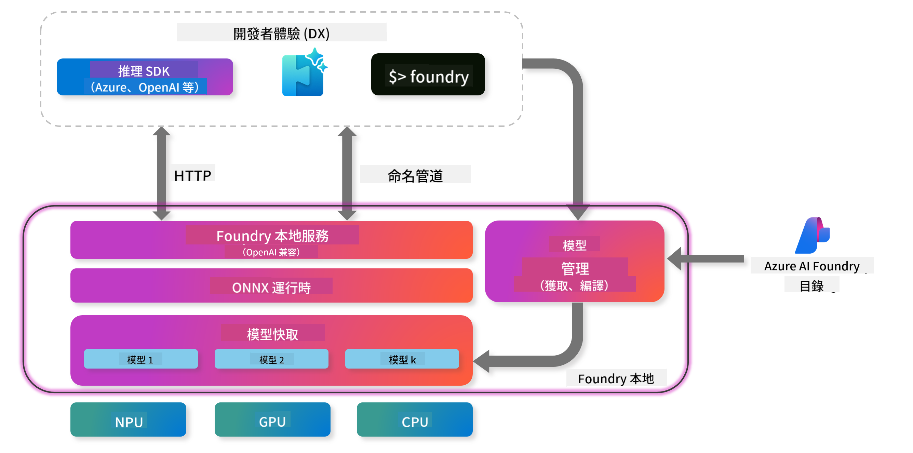

<!--
CO_OP_TRANSLATOR_METADATA:
{
  "original_hash": "52973a5680a65a810aa80b7036afd31f",
  "translation_date": "2025-06-27T13:35:44+00:00",
  "source_file": "md/01.Introduction/02/07.FoundryLocal.md",
  "language_code": "tw"
}
-->
## 在 Foundry Local 上開始使用 Phi-Family 模型

### Foundry Local 介紹

Foundry Local 是一個強大的本地裝置 AI 推論解決方案，能將企業級 AI 能力直接帶到您的本地硬體。這個教學將引導您如何設定並使用 Foundry Local 的 Phi-Family 模型，讓您在掌控 AI 工作負載的同時，確保隱私並降低成本。

Foundry Local 透過在您的裝置上本地執行 AI 模型，提供效能、隱私、自訂化及成本上的優勢。它能透過直覺的 CLI、SDK 和 REST API 無縫整合到您現有的工作流程與應用中。



### 為什麼選擇 Foundry Local？

了解 Foundry Local 的優勢，有助於您做出更明智的 AI 部署決策：

- **本地推論：** 在您自己的硬體上本地執行模型，降低成本，同時確保所有資料留在裝置中。
- **模型自訂化：** 從預設模型中選擇，或使用您自己的模型以滿足特定需求與應用場景。
- **成本效益：** 利用現有硬體，免除持續的雲端服務費用，讓 AI 更加普及。
- **無縫整合：** 透過 SDK、API 端點或 CLI 與您的應用連接，並可隨需求成長輕鬆擴展至 Azure AI Foundry。

> **入門提示：** 本教學著重於透過 CLI 和 SDK 介面使用 Foundry Local，您將學習兩種方式，幫助您選擇最適合的使用方法。

## 第一部分：設定 Foundry Local CLI

### 步驟 1：安裝

Foundry Local CLI 是您管理與本地執行 AI 模型的入口。讓我們先在系統上安裝它。

**支援平台：** Windows 和 macOS

詳細安裝說明請參考 [官方 Foundry Local 文件](https://github.com/microsoft/Foundry-Local/blob/main/README.md)。

### 步驟 2：探索可用模型

安裝好 Foundry Local CLI 後，您可以查看有哪些模型可用於您的應用。執行以下指令來顯示所有支援的模型：

```bash
foundry model list
```

### 步驟 3：認識 Phi Family 模型

Phi Family 提供多款針對不同應用及硬體配置優化的模型。以下是 Foundry Local 支援的 Phi 模型：

**可用的 Phi 模型：**

- **phi-3.5-mini** - 適合基本任務的輕量模型
- **phi-3-mini-128k** - 支援更長對話的延伸上下文版本
- **phi-3-mini-4k** - 一般用途的標準上下文模型
- **phi-4** - 具備更強功能的進階模型
- **phi-4-mini** - Phi-4 的輕量版本
- **phi-4-mini-reasoning** - 專門用於複雜推理任務

> **硬體相容性：** 每款模型可依系統能力配置不同硬體加速（CPU、GPU）。

### 步驟 4：執行您的第一個 Phi 模型

讓我們從實作範例開始，執行擅長逐步解決複雜問題的 `phi-4-mini-reasoning` 模型。

**執行模型的指令：**

```bash
foundry model run Phi-4-mini-reasoning-generic-cpu
```

> **首次設定提醒：** 第一次執行模型時，Foundry Local 會自動下載模型至本地裝置。下載時間依網路速度而異，請耐心等待初始設定完成。

### 步驟 5：使用真實問題測試模型

現在讓我們用一個經典邏輯問題測試模型，看看它如何進行逐步推理：

**範例問題：**

```txt
Please calculate the following step by step: Now there are pheasants and rabbits in the same cage, there are thirty-five heads on top and ninety-four legs on the bottom, how many pheasants and rabbits are there?
```

**預期表現：** 模型應將問題拆解為邏輯步驟，利用野雞有兩條腿、兔子有四條腿的事實，解出聯立方程式。

**執行結果：**


## 第二部分：使用 Foundry Local SDK 建立應用程式

### 為什麼要使用 SDK？

CLI 非常適合測試與快速互動，而 SDK 則讓您能以程式方式將 Foundry Local 整合到應用中，開啟以下可能性：

- 建立自訂 AI 應用
- 創建自動化工作流程
- 將 AI 能力整合到現有系統
- 開發聊天機器人及互動工具

### 支援的程式語言

Foundry Local 提供多種程式語言的 SDK，以符合您的開發偏好：

**📦 可用 SDK：**

- **C# (.NET)：** [SDK 文件與範例](https://github.com/microsoft/Foundry-Local/tree/main/sdk/cs)
- **Python：** [SDK 文件與範例](https://github.com/microsoft/Foundry-Local/tree/main/sdk/python)
- **JavaScript：** [SDK 文件與範例](https://github.com/microsoft/Foundry-Local/tree/main/sdk/js)
- **Rust：** [SDK 文件與範例](https://github.com/microsoft/Foundry-Local/tree/main/sdk/rust)

### 下一步

1. **根據開發環境選擇適合的 SDK**
2. **參考 SDK 專屬文件，了解詳細實作指南**
3. **先從簡單範例開始，再進階到複雜應用**
4. **探索各 SDK 倉庫中提供的範例程式碼**

## 結語

您已學會如何：
- ✅ 安裝與設定 Foundry Local CLI
- ✅ 探索並執行 Phi Family 模型
- ✅ 使用實際問題測試模型
- ✅ 了解 SDK 選項並進行應用開發

Foundry Local 為您打造強大的基礎，將 AI 能力直接帶到本地環境，讓您掌控效能、隱私與成本，同時保有隨時擴展至雲端解決方案的彈性。

**免責聲明**：  
本文件係使用 AI 翻譯服務 [Co-op Translator](https://github.com/Azure/co-op-translator) 進行翻譯。雖然我們力求準確，但請注意自動翻譯可能包含錯誤或不準確之處。原始文件之母語版本應視為權威來源。對於重要資訊，建議採用專業人工翻譯。我們不對因使用本翻譯而產生之任何誤解或誤譯負責。