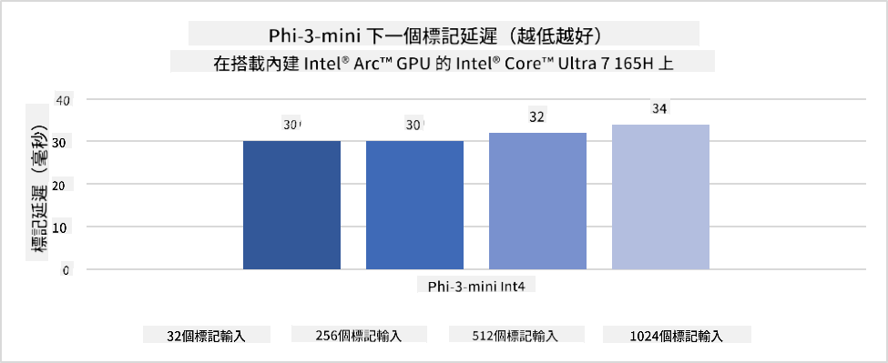
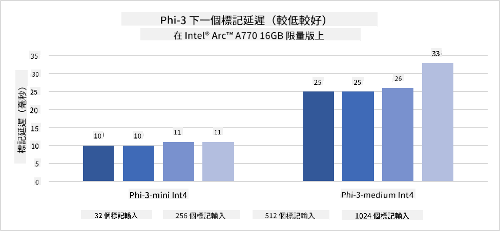
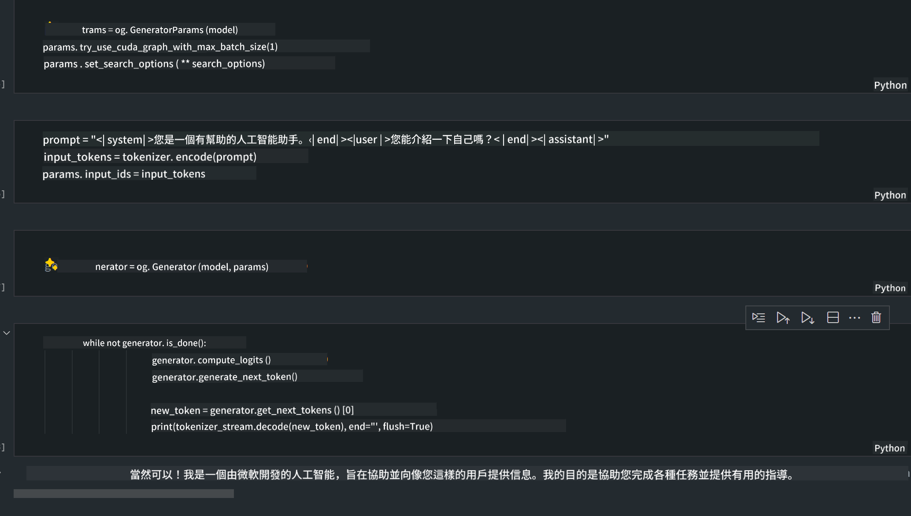
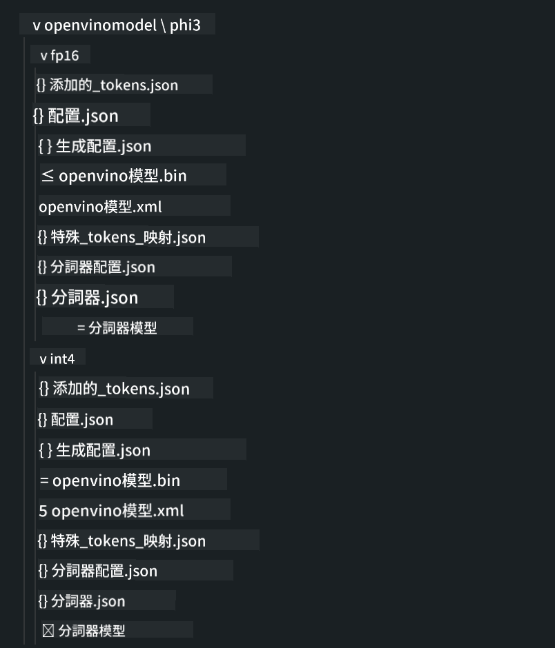

<!--
CO_OP_TRANSLATOR_METADATA:
{
  "original_hash": "5ca6ea8da7aa1335ef287124462b2833",
  "translation_date": "2025-04-04T05:52:12+00:00",
  "source_file": "md\\01.Introduction\\03\\AIPC_Inference.md",
  "language_code": "tw"
}
-->
# **AI PC 上推理 Phi-3**

隨著生成式 AI 的進步以及邊緣設備硬體性能的提升，越來越多的生成式 AI 模型可以整合到使用者的自帶設備（BYOD）中。AI PC 就是其中的一種模式。從 2024 年開始，Intel、AMD 和 Qualcomm 與 PC 製造商合作，通過硬體改造推出 AI PC，以支持在本地部署生成式 AI 模型。在本篇討論中，我們將聚焦於 Intel AI PC，並探討如何在 Intel AI PC 上部署 Phi-3。

### 什麼是 NPU

NPU（神經處理單元）是一種專用處理器或處理單元，集成於較大的 SoC 上，專為加速神經網路運算和 AI 任務而設計。與通用的 CPU 和 GPU 不同，NPU 專為數據驅動的並行計算而優化，使其能高效處理大量的多媒體數據，如影片和圖片，以及神經網路所需的數據。NPU 尤其擅長處理 AI 相關任務，例如語音識別、影片通話中的背景模糊，以及物件檢測等照片或影片編輯流程。

## NPU vs GPU

雖然許多 AI 和機器學習工作負載都運行在 GPU 上，但 GPU 與 NPU 之間存在重要區別。
GPU 以其並行計算能力而聞名，但並非所有 GPU 在圖形處理之外都同樣高效。另一方面，NPU 則專為神經網路運算中涉及的複雜計算而打造，使其在處理 AI 任務時極為高效。

總而言之，NPU 是加速 AI 計算的數學高手，並在 AI PC 的新興時代中扮演著重要角色！

***此範例基於 Intel 最新的 Intel Core Ultra 處理器***

## **1. 使用 NPU 運行 Phi-3 模型**

Intel® NPU 設備是一種 AI 推理加速器，集成於 Intel 客戶端 CPU 中，從 Intel® Core™ Ultra 系列（之前稱為 Meteor Lake）開始。它支持能效優化的人工神經網路任務執行。





**Intel NPU 加速庫**

Intel NPU 加速庫 [https://github.com/intel/intel-npu-acceleration-library](https://github.com/intel/intel-npu-acceleration-library) 是一個 Python 庫，旨在利用 Intel 神經處理單元（NPU）的強大運算能力，對兼容硬體進行高速計算，從而提升應用程序的效率。

基於 Intel® Core™ Ultra 處理器的 AI PC 上運行 Phi-3-mini 的範例。


使用 pip 安裝 Python 庫

```bash

   pip install intel-npu-acceleration-library

```

***注意*** 該專案仍在開發中，但參考模型已非常完整。

### **使用 Intel NPU 加速庫運行 Phi-3**

通過 Intel NPU 加速，該庫不會影響傳統編碼流程。只需使用該庫對原始 Phi-3 模型進行量化，如 FP16、INT8、INT4 等。

```python
from transformers import AutoTokenizer, pipeline,TextStreamer
from intel_npu_acceleration_library import NPUModelForCausalLM, int4
from intel_npu_acceleration_library.compiler import CompilerConfig
import warnings

model_id = "microsoft/Phi-3-mini-4k-instruct"

compiler_conf = CompilerConfig(dtype=int4)
model = NPUModelForCausalLM.from_pretrained(
    model_id, use_cache=True, config=compiler_conf, attn_implementation="sdpa"
).eval()

tokenizer = AutoTokenizer.from_pretrained(model_id)

text_streamer = TextStreamer(tokenizer, skip_prompt=True)
```

量化成功後，繼續執行以調用 NPU 運行 Phi-3 模型。

```python
generation_args = {
   "max_new_tokens": 1024,
   "return_full_text": False,
   "temperature": 0.3,
   "do_sample": False,
   "streamer": text_streamer,
}

pipe = pipeline(
   "text-generation",
   model=model,
   tokenizer=tokenizer,
)

query = "<|system|>You are a helpful AI assistant.<|end|><|user|>Can you introduce yourself?<|end|><|assistant|>"

with warnings.catch_warnings():
    warnings.simplefilter("ignore")
    pipe(query, **generation_args)
```

執行代碼時，我們可以通過任務管理器查看 NPU 的運行狀態。


***範例*** : [AIPC_NPU_DEMO.ipynb](../../../../../code/03.Inference/AIPC/AIPC_NPU_DEMO.ipynb)

## **2. 使用 DirectML + ONNX Runtime 運行 Phi-3 模型**

### **什麼是 DirectML**

[DirectML](https://github.com/microsoft/DirectML) 是一種高性能、硬體加速的 DirectX 12 機器學習庫。DirectML 為常見的機器學習任務提供 GPU 加速，支持範圍廣泛的硬體和驅動，包括 AMD、Intel、NVIDIA 和 Qualcomm 的所有 DirectX 12 兼容 GPU。

獨立使用時，DirectML API 是一個低階 DirectX 12 庫，適合高性能、低延遲的應用程序，例如框架、遊戲以及其他即時應用程序。DirectML 與 Direct3D 12 的無縫互操作性，以及其低開銷和硬體上的一致性，使其非常適合在需要高性能和硬體結果可靠性與可預測性時加速機器學習。

***注意*** : 最新的 DirectML 已支持 NPU (https://devblogs.microsoft.com/directx/introducing-neural-processor-unit-npu-support-in-directml-developer-preview/)

### DirectML 和 CUDA 的能力與性能對比：

**DirectML** 是由 Microsoft 開發的機器學習庫，專為在 Windows 設備（包括桌面、筆記本和邊緣設備）上加速機器學習工作負載而設計。
- 基於 DX12：DirectML 構建於 DirectX 12 (DX12) 之上，提供廣泛的硬體支持，涵蓋 NVIDIA 和 AMD 的 GPU。
- 更廣泛的支持：由於使用 DX12，DirectML 可以在任何支持 DX12 的 GPU 上運行，包括集成 GPU。
- 圖像處理：DirectML 使用神經網路處理圖像和其他數據，非常適合圖像識別、物件檢測等任務。
- 易於設置：設置 DirectML 非常簡單，不需要 GPU 製造商的特定 SDK 或庫。
- 性能：在某些情況下，DirectML 的性能表現良好，甚至可能比 CUDA 更快，尤其是針對某些工作負載。
- 限制：然而，在處理浮點型大批量數據時，DirectML 可能會較慢。

**CUDA** 是 NVIDIA 的平行計算平台和編程模型。它允許開發者利用 NVIDIA GPU 的能力進行通用計算，包括機器學習和科學模擬。
- NVIDIA 專屬：CUDA 與 NVIDIA GPU 緊密集成，專為其設計。
- 高度優化：針對 GPU 加速任務提供卓越性能，尤其是在使用 NVIDIA GPU 時。
- 廣泛使用：許多機器學習框架和庫（如 TensorFlow 和 PyTorch）都支持 CUDA。
- 可定制性：開發者可以針對特定任務微調 CUDA 設定，從而實現最佳性能。
- 限制：但 CUDA 依賴於 NVIDIA 硬體，如果需要更廣泛的兼容性，可能會有所限制。

### 如何選擇 DirectML 和 CUDA

在選擇 DirectML 或 CUDA 時，需根據具體使用場景、硬體可用性以及偏好進行考量。
如果需要更廣泛的兼容性和簡單的設置，DirectML 可能是個不錯的選擇。然而，如果擁有 NVIDIA GPU 並需要高度優化的性能，CUDA 仍然是強有力的競爭者。總而言之，DirectML 和 CUDA 各有優勢，選擇時需考慮需求和硬體情況。

### **使用 ONNX Runtime 的生成式 AI**

在 AI 時代，AI 模型的可移植性非常重要。ONNX Runtime 可以輕鬆將訓練好的模型部署到不同設備上。開發者無需關注推理框架，只需使用統一的 API 完成模型推理。在生成式 AI 時代，ONNX Runtime 也進行了代碼優化 (https://onnxruntime.ai/docs/genai/)。通過優化的 ONNX Runtime，可以在不同終端上推理量化後的生成式 AI 模型。在使用 ONNX Runtime 的生成式 AI 中，可以通過 Python、C#、C / C++ 進行模型推理。當然，部署到 iPhone 時也可以利用 C++ 的 ONNX Runtime API。

[範例代碼](https://github.com/Azure-Samples/Phi-3MiniSamples/tree/main/onnx)

***編譯生成式 AI 與 ONNX Runtime 庫***

```bash

winget install --id=Kitware.CMake  -e

git clone https://github.com/microsoft/onnxruntime.git

cd .\onnxruntime\

./build.bat --build_shared_lib --skip_tests --parallel --use_dml --config Release

cd ../

git clone https://github.com/microsoft/onnxruntime-genai.git

cd .\onnxruntime-genai\

mkdir ort

cd ort

mkdir include

mkdir lib

copy ..\onnxruntime\include\onnxruntime\core\providers\dml\dml_provider_factory.h ort\include

copy ..\onnxruntime\include\onnxruntime\core\session\onnxruntime_c_api.h ort\include

copy ..\onnxruntime\build\Windows\Release\Release\*.dll ort\lib

copy ..\onnxruntime\build\Windows\Release\Release\onnxruntime.lib ort\lib

python build.py --use_dml


```

**安裝庫**

```bash

pip install .\onnxruntime_genai_directml-0.3.0.dev0-cp310-cp310-win_amd64.whl

```

運行結果如下



***範例*** : [AIPC_DirectML_DEMO.ipynb](../../../../../code/03.Inference/AIPC/AIPC_DirectML_DEMO.ipynb)

## **3. 使用 Intel OpenVINO 運行 Phi-3 模型**

### **什麼是 OpenVINO**

[OpenVINO](https://github.com/openvinotoolkit/openvino) 是一款開源工具包，用於優化和部署深度學習模型。它能提升視覺、音頻和語言模型的深度學習性能，支持 TensorFlow、PyTorch 等流行框架的模型。開始使用 OpenVINO。OpenVINO 也可以與 CPU 和 GPU 結合使用來運行 Phi-3 模型。

***注意***: 目前 OpenVINO 尚不支持 NPU。

### **安裝 OpenVINO 庫**

```bash

 pip install git+https://github.com/huggingface/optimum-intel.git

 pip install git+https://github.com/openvinotoolkit/nncf.git

 pip install openvino-nightly

```

### **使用 OpenVINO 運行 Phi-3**

與 NPU 類似，OpenVINO 通過運行量化後的模型來完成生成式 AI 模型的調用。我們需要先對 Phi-3 模型進行量化，並通過命令行使用 optimum-cli 完成模型量化。

**INT4**

```bash

optimum-cli export openvino --model "microsoft/Phi-3-mini-4k-instruct" --task text-generation-with-past --weight-format int4 --group-size 128 --ratio 0.6  --sym  --trust-remote-code ./openvinomodel/phi3/int4

```

**FP16**

```bash

optimum-cli export openvino --model "microsoft/Phi-3-mini-4k-instruct" --task text-generation-with-past --weight-format fp16 --trust-remote-code ./openvinomodel/phi3/fp16

```

轉換後的格式如下



通過 OVModelForCausalLM 加載模型路徑（model_dir）、相關配置（ov_config = {"PERFORMANCE_HINT": "LATENCY", "NUM_STREAMS": "1", "CACHE_DIR": ""}）和硬體加速設備（GPU.0）。

```python

ov_model = OVModelForCausalLM.from_pretrained(
     model_dir,
     device='GPU.0',
     ov_config=ov_config,
     config=AutoConfig.from_pretrained(model_dir, trust_remote_code=True),
     trust_remote_code=True,
)

```

執行代碼時，我們可以通過任務管理器查看 GPU 的運行狀態。


***範例*** : [AIPC_OpenVino_Demo.ipynb](../../../../../code/03.Inference/AIPC/AIPC_OpenVino_Demo.ipynb)

### ***注意*** : 以上三種方法各有其優勢，但建議在 AI PC 推理中使用 NPU 加速。

**免責聲明**：  
本文件使用 AI 翻譯服務 [Co-op Translator](https://github.com/Azure/co-op-translator) 進行翻譯。我們致力於提供準確的翻譯，但請注意，自動翻譯可能包含錯誤或不精確之處。應以原始語言的文件作為權威來源。對於關鍵資訊，建議尋求專業人工翻譯。我們對因使用此翻譯而產生的任何誤解或誤釋不承擔責任。