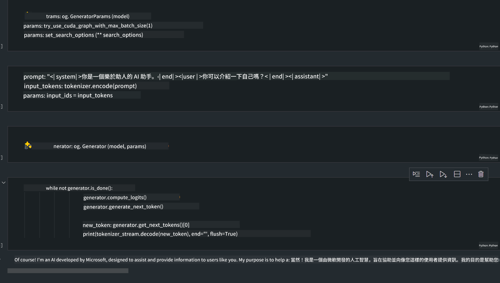

<!--
CO_OP_TRANSLATOR_METADATA:
{
  "original_hash": "e08ce816e23ad813244a09ca34ebb8ac",
  "translation_date": "2025-07-16T19:56:28+00:00",
  "source_file": "md/01.Introduction/03/AIPC_Inference.md",
  "language_code": "tw"
}
-->
# **在 AI PC 上進行 Phi-3 推論**

隨著生成式 AI 的進步以及邊緣裝置硬體能力的提升，越來越多的生成式 AI 模型能夠整合到使用者的自帶裝置（BYOD）中。AI PC 就是其中一種。從 2024 年開始，Intel、AMD 與 Qualcomm 與 PC 製造商合作，透過硬體改良推出 AI PC，方便在本地部署生成式 AI 模型。本文將聚焦於 Intel AI PC，探討如何在 Intel AI PC 上部署 Phi-3。

### 什麼是 NPU

NPU（神經網路處理器）是集成於大型 SoC 中的專用處理器，專門用來加速神經網路運算和 AI 任務。與通用 CPU 和 GPU 不同，NPU 針對資料驅動的平行運算進行優化，能高效處理大量多媒體資料，如影片和影像，以及神經網路的資料處理。它們特別擅長處理 AI 相關任務，例如語音辨識、視訊通話中的背景模糊，以及物件偵測等照片或影片編輯流程。

## NPU 與 GPU 的差異

雖然許多 AI 和機器學習工作負載都在 GPU 上執行，但 GPU 與 NPU 之間有著關鍵差異。GPU 以其平行運算能力聞名，但並非所有 GPU 在處理圖形以外的任務時效率都相同。NPU 則是專為神經網路運算中複雜計算打造，使其在 AI 任務上表現非常出色。

總結來說，NPU 就是加速 AI 運算的數學高手，並在 AI PC 的新時代中扮演重要角色！

***本範例基於 Intel 最新的 Intel Core Ultra 處理器***

## **1. 使用 NPU 執行 Phi-3 模型**

Intel® NPU 裝置是整合於 Intel 客戶端 CPU 中的 AI 推論加速器，從 Intel® Core™ Ultra 世代 CPU（前稱 Meteor Lake）開始支援。它能以節能方式執行人工神經網路任務。


**Intel NPU 加速函式庫**

Intel NPU Acceleration Library [https://github.com/intel/intel-npu-acceleration-library](https://github.com/intel/intel-npu-acceleration-library) 是一個 Python 函式庫，旨在利用 Intel 神經網路處理器（NPU）的運算能力，提升應用程式在相容硬體上的高速運算效率。

以下為在搭載 Intel® Core™ Ultra 處理器的 AI PC 上執行 Phi-3-mini 的範例。


使用 pip 安裝 Python 函式庫

```bash

   pip install intel-npu-acceleration-library

```

***注意*** 專案仍在開發中，但參考模型已相當完整。

### **使用 Intel NPU Acceleration Library 執行 Phi-3**

利用 Intel NPU 加速時，此函式庫不會影響傳統的編碼流程。您只需使用此函式庫對原始 Phi-3 模型進行量化，例如 FP16、INT8、INT4，如下所示：

```python
from transformers import AutoTokenizer, pipeline,TextStreamer
from intel_npu_acceleration_library import NPUModelForCausalLM, int4
from intel_npu_acceleration_library.compiler import CompilerConfig
import warnings

model_id = "microsoft/Phi-3-mini-4k-instruct"

compiler_conf = CompilerConfig(dtype=int4)
model = NPUModelForCausalLM.from_pretrained(
    model_id, use_cache=True, config=compiler_conf, attn_implementation="sdpa"
).eval()

tokenizer = AutoTokenizer.from_pretrained(model_id)

text_streamer = TextStreamer(tokenizer, skip_prompt=True)
```

量化成功後，繼續執行呼叫 NPU 運行 Phi-3 模型。

```python
generation_args = {
   "max_new_tokens": 1024,
   "return_full_text": False,
   "temperature": 0.3,
   "do_sample": False,
   "streamer": text_streamer,
}

pipe = pipeline(
   "text-generation",
   model=model,
   tokenizer=tokenizer,
)

query = "<|system|>You are a helpful AI assistant.<|end|><|user|>Can you introduce yourself?<|end|><|assistant|>"

with warnings.catch_warnings():
    warnings.simplefilter("ignore")
    pipe(query, **generation_args)
```

執行程式時，可透過工作管理員查看 NPU 的運行狀態。


***範例*** : [AIPC_NPU_DEMO.ipynb](../../../../../code/03.Inference/AIPC/AIPC_NPU_DEMO.ipynb)

## **2. 使用 DirectML + ONNX Runtime 執行 Phi-3 模型**

### **什麼是 DirectML**

[DirectML](https://github.com/microsoft/DirectML) 是一個高效能、硬體加速的 DirectX 12 機器學習函式庫。DirectML 為廣泛支援的硬體和驅動程式提供 GPU 加速，包括 AMD、Intel、NVIDIA 和 Qualcomm 等廠商所有支援 DirectX 12 的 GPU。

獨立使用時，DirectML API 是一個低階的 DirectX 12 函式庫，適合用於高效能、低延遲的應用，如框架、遊戲及其他即時應用。DirectML 與 Direct3D 12 的無縫互通性、低開銷及跨硬體的一致性，使其成為在追求高效能且需確保結果可靠與可預測的機器學習加速理想選擇。

***注意***：最新版本的 DirectML 已支援 NPU（https://devblogs.microsoft.com/directx/introducing-neural-processor-unit-npu-support-in-directml-developer-preview/）

### DirectML 與 CUDA 的能力與效能比較：

**DirectML** 是微軟開發的機器學習函式庫，設計用於加速 Windows 裝置上的機器學習工作負載，包括桌機、筆電及邊緣裝置。
- 基於 DX12：DirectML 建構於 DirectX 12 之上，支援廣泛 GPU，包括 NVIDIA 與 AMD。
- 支援範圍廣：因為利用 DX12，DirectML 可在任何支援 DX12 的 GPU 上運作，甚至是整合型 GPU。
- 影像處理：DirectML 使用神經網路處理影像及其他資料，適合影像辨識、物件偵測等任務。
- 設定簡單：DirectML 安裝設定簡便，不需特定 GPU 廠商的 SDK 或函式庫。
- 效能：在某些情況下，DirectML 表現良好，甚至比 CUDA 更快，尤其是特定工作負載。
- 限制：不過在 float16 大批量資料處理時，DirectML 可能較慢。

**CUDA** 是 NVIDIA 的平行運算平台與程式模型，讓開發者能利用 NVIDIA GPU 的運算能力進行通用運算，包括機器學習與科學模擬。
- NVIDIA 專屬：CUDA 與 NVIDIA GPU 緊密整合，專為其設計。
- 高度優化：在 GPU 加速任務上提供優異效能，特別是 NVIDIA GPU。
- 廣泛使用：許多機器學習框架與函式庫（如 TensorFlow、PyTorch）支援 CUDA。
- 可自訂化：開發者可針對特定任務調整 CUDA 設定，達到最佳效能。
- 限制：CUDA 依賴 NVIDIA 硬體，若需跨多種 GPU 相容性則有限制。

### 選擇 DirectML 或 CUDA

選擇 DirectML 或 CUDA 取決於您的使用需求、硬體可用性與偏好。若追求更廣泛的相容性與簡易設定，DirectML 是不錯的選擇；若擁有 NVIDIA GPU 且需要高度優化效能，CUDA 仍是強力方案。總結來說，兩者各有優缺點，請依需求與硬體條件做決策。

### **使用 ONNX Runtime 進行生成式 AI**

在 AI 時代，AI 模型的可攜性非常重要。ONNX Runtime 能輕鬆將訓練好的模型部署到不同裝置。開發者無需關注推論框架，透過統一 API 即可完成模型推論。在生成式 AI 時代，ONNX Runtime 也進行了程式碼優化（https://onnxruntime.ai/docs/genai/）。透過優化後的 ONNX Runtime，量化的生成式 AI 模型能在不同終端推論。使用 ONNX Runtime 進行生成式 AI，可透過 Python、C#、C/C++ 呼叫 AI 模型 API，當然在 iPhone 部署時也能利用 C++ 的 ONNX Runtime API。

[範例程式碼](https://github.com/Azure-Samples/Phi-3MiniSamples/tree/main/onnx)

***編譯生成式 AI 與 ONNX Runtime 函式庫***

```bash

winget install --id=Kitware.CMake  -e

git clone https://github.com/microsoft/onnxruntime.git

cd .\onnxruntime\

./build.bat --build_shared_lib --skip_tests --parallel --use_dml --config Release

cd ../

git clone https://github.com/microsoft/onnxruntime-genai.git

cd .\onnxruntime-genai\

mkdir ort

cd ort

mkdir include

mkdir lib

copy ..\onnxruntime\include\onnxruntime\core\providers\dml\dml_provider_factory.h ort\include

copy ..\onnxruntime\include\onnxruntime\core\session\onnxruntime_c_api.h ort\include

copy ..\onnxruntime\build\Windows\Release\Release\*.dll ort\lib

copy ..\onnxruntime\build\Windows\Release\Release\onnxruntime.lib ort\lib

python build.py --use_dml


```

**安裝函式庫**

```bash

pip install .\onnxruntime_genai_directml-0.3.0.dev0-cp310-cp310-win_amd64.whl

```

以下為執行結果



***範例*** : [AIPC_DirectML_DEMO.ipynb](../../../../../code/03.Inference/AIPC/AIPC_DirectML_DEMO.ipynb)

## **3. 使用 Intel OpenVINO 執行 Phi-3 模型**

### **什麼是 OpenVINO**

[OpenVINO](https://github.com/openvinotoolkit/openvino) 是一套開源工具包，用於優化與部署深度學習模型。它能提升來自 TensorFlow、PyTorch 等熱門框架的視覺、音訊與語言模型的深度學習效能。開始使用 OpenVINO。OpenVINO 也能結合 CPU 與 GPU 執行 Phi-3 模型。

***注意***：目前 OpenVINO 尚不支援 NPU。

### **安裝 OpenVINO 函式庫**

```bash

 pip install git+https://github.com/huggingface/optimum-intel.git

 pip install git+https://github.com/openvinotoolkit/nncf.git

 pip install openvino-nightly

```

### **使用 OpenVINO 執行 Phi-3**

與 NPU 類似，OpenVINO 透過執行量化模型來呼叫生成式 AI 模型。我們需要先對 Phi-3 模型進行量化，並透過 optimum-cli 在命令列完成模型量化。

**INT4**

```bash

optimum-cli export openvino --model "microsoft/Phi-3-mini-4k-instruct" --task text-generation-with-past --weight-format int4 --group-size 128 --ratio 0.6  --sym  --trust-remote-code ./openvinomodel/phi3/int4

```

**FP16**

```bash

optimum-cli export openvino --model "microsoft/Phi-3-mini-4k-instruct" --task text-generation-with-past --weight-format fp16 --trust-remote-code ./openvinomodel/phi3/fp16

```

轉換後的格式如下圖所示


透過 OVModelForCausalLM 載入模型路徑（model_dir）、相關設定（ov_config = {"PERFORMANCE_HINT": "LATENCY", "NUM_STREAMS": "1", "CACHE_DIR": ""}）及硬體加速裝置（GPU.0）

```python

ov_model = OVModelForCausalLM.from_pretrained(
     model_dir,
     device='GPU.0',
     ov_config=ov_config,
     config=AutoConfig.from_pretrained(model_dir, trust_remote_code=True),
     trust_remote_code=True,
)

```

執行程式時，可透過工作管理員查看 GPU 的運行狀態。


***範例*** : [AIPC_OpenVino_Demo.ipynb](../../../../../code/03.Inference/AIPC/AIPC_OpenVino_Demo.ipynb)

### ***注意***：上述三種方法各有優勢，但建議 AI PC 推論時優先使用 NPU 加速。

**免責聲明**：  
本文件係使用 AI 翻譯服務 [Co-op Translator](https://github.com/Azure/co-op-translator) 進行翻譯。雖然我們力求準確，但請注意，自動翻譯可能包含錯誤或不準確之處。原始文件的母語版本應視為權威來源。對於重要資訊，建議採用專業人工翻譯。我們不對因使用本翻譯而產生的任何誤解或誤釋負責。