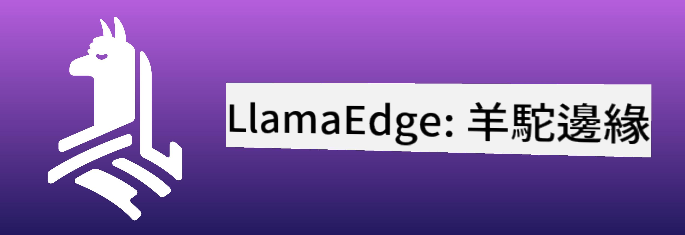

<!--
CO_OP_TRANSLATOR_METADATA:
{
  "original_hash": "be4101a30d98e95a71d42c276e8bcd37",
  "translation_date": "2025-07-16T20:40:16+00:00",
  "source_file": "md/01.Introduction/03/Jetson_Inference.md",
  "language_code": "tw"
}
-->
# **在 Nvidia Jetson 上推論 Phi-3**

Nvidia Jetson 是 Nvidia 推出的一系列嵌入式運算板。Jetson TK1、TX1 和 TX2 型號皆搭載 Nvidia 的 Tegra 處理器（或 SoC），內建 ARM 架構的中央處理器（CPU）。Jetson 是一款低功耗系統，專為加速機器學習應用而設計。Nvidia Jetson 被專業開發者用來打造各行各業的突破性 AI 產品，也被學生和愛好者用於實作 AI 學習與創作精彩專案。SLM 部署於 Jetson 等邊緣裝置，能促進工業生成式 AI 應用場景的更佳實現。

## 在 NVIDIA Jetson 上部署：
從事自主機器人和嵌入式裝置開發的工程師可以利用 Phi-3 Mini。Phi-3 體積相對小巧，非常適合邊緣部署。訓練過程中參數經過細緻調校，確保回應的高準確度。

### TensorRT-LLM 優化：
NVIDIA 的 [TensorRT-LLM 函式庫](https://github.com/NVIDIA/TensorRT-LLM?WT.mc_id=aiml-138114-kinfeylo) 專為大型語言模型推論進行優化。它支援 Phi-3 Mini 的長上下文視窗，提升吞吐量與延遲表現。優化技術包括 LongRoPE、FP8 以及 inflight 批次處理等。

### 可用性與部署：
開發者可在 [NVIDIA 的 AI 頁面](https://www.nvidia.com/en-us/ai-data-science/generative-ai/) 探索支援 128K 上下文視窗的 Phi-3 Mini。它以 NVIDIA NIM 形式包裝，為具標準 API 的微服務，可部署於任何環境。此外，相關的 [TensorRT-LLM GitHub 實作](https://github.com/NVIDIA/TensorRT-LLM) 也可參考。

## **1. 準備工作**

a. Jetson Orin NX / Jetson NX

b. JetPack 5.1.2+

c. Cuda 11.8

d. Python 3.8+

## **2. 在 Jetson 上執行 Phi-3**

我們可以選擇 [Ollama](https://ollama.com) 或 [LlamaEdge](https://llamaedge.com)

如果想同時在雲端和邊緣裝置使用 gguf，LlamaEdge 可視為 WasmEdge（WasmEdge 是一個輕量、高效且可擴展的 WebAssembly 執行環境，適用於雲原生、邊緣及去中心化應用。它支援無伺服器應用、嵌入式函式、微服務、智慧合約及物聯網裝置）。你可以透過 LlamaEdge 將 gguf 的量化模型部署到邊緣裝置和雲端。



以下是使用步驟：

1. 安裝並下載相關函式庫與檔案

```bash

curl -sSf https://raw.githubusercontent.com/WasmEdge/WasmEdge/master/utils/install.sh | bash -s -- --plugin wasi_nn-ggml

curl -LO https://github.com/LlamaEdge/LlamaEdge/releases/latest/download/llama-api-server.wasm

curl -LO https://github.com/LlamaEdge/chatbot-ui/releases/latest/download/chatbot-ui.tar.gz

tar xzf chatbot-ui.tar.gz

```

**注意**：llama-api-server.wasm 與 chatbot-ui 需放在同一目錄下

2. 在終端機執行腳本

```bash

wasmedge --dir .:. --nn-preload default:GGML:AUTO:{Your gguf path} llama-api-server.wasm -p phi-3-chat

```

以下是執行結果


***範例程式碼*** [Phi-3 mini WASM Notebook 範例](https://github.com/Azure-Samples/Phi-3MiniSamples/tree/main/wasm)

總結來說，Phi-3 Mini 在語言模型領域帶來重大突破，結合了效率、上下文感知能力與 NVIDIA 的優化技術。無論你是在打造機器人還是邊緣應用，Phi-3 Mini 都是值得關注的強大工具。

**免責聲明**：  
本文件係使用 AI 翻譯服務 [Co-op Translator](https://github.com/Azure/co-op-translator) 進行翻譯。雖然我們致力於確保翻譯的準確性，但請注意，自動翻譯可能包含錯誤或不準確之處。原始文件的母語版本應視為權威來源。對於重要資訊，建議採用專業人工翻譯。我們不對因使用本翻譯而產生的任何誤解或誤釋負責。