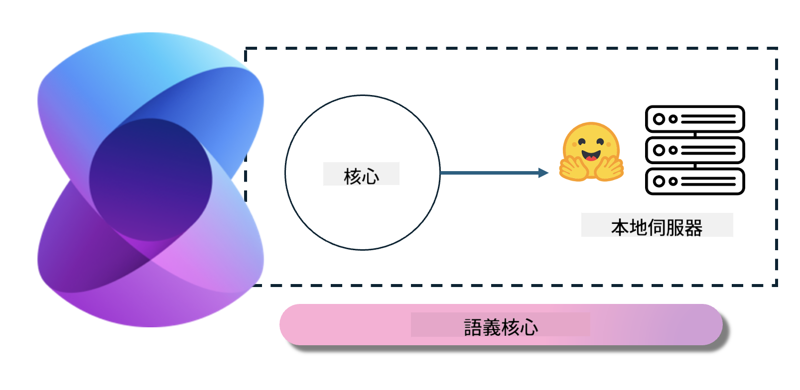
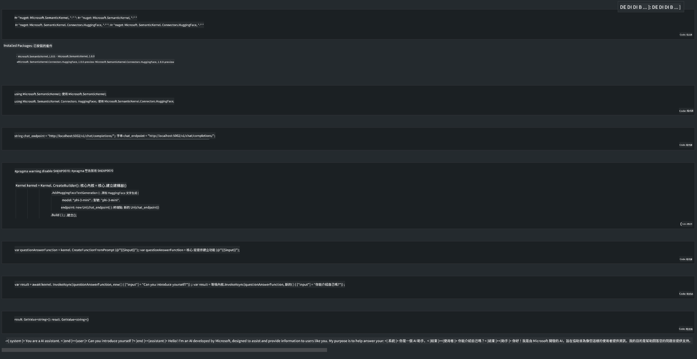

<!--
CO_OP_TRANSLATOR_METADATA:
{
  "original_hash": "12c0d9afaa23861ad5be655fcff4f71d",
  "translation_date": "2025-04-04T05:58:44+00:00",
  "source_file": "md\\01.Introduction\\03\\Local_Server_Inference.md",
  "language_code": "tw"
}
-->
# **在本地伺服器上推論 Phi-3**

我們可以在本地伺服器上部署 Phi-3。使用者可以選擇 [Ollama](https://ollama.com) 或 [LM Studio](https://llamaedge.com) 解決方案，或者自行撰寫程式碼。您可以透過 [Semantic Kernel](https://github.com/microsoft/semantic-kernel?WT.mc_id=aiml-138114-kinfeylo) 或 [Langchain](https://www.langchain.com/) 連接 Phi-3 的本地服務，來構建 Copilot 應用程式。

## **使用 Semantic Kernel 存取 Phi-3-mini**

在 Copilot 應用程式中，我們透過 Semantic Kernel / LangChain 建立應用程式。這類應用程式框架通常與 Azure OpenAI Service / OpenAI 模型相容，也可以支援 Hugging Face 上的開源模型以及本地模型。如果我們想使用 Semantic Kernel 存取 Phi-3-mini，該怎麼做呢？以 .NET 為例，我們可以將其與 Semantic Kernel 中的 Hugging Face Connector 結合。預設情況下，它可以對應 Hugging Face 上的模型 ID（首次使用時，模型會從 Hugging Face 下載，這需要較長時間）。此外，您也可以連接到自建的本地服務。相比之下，我們建議使用後者，因為它在企業應用中具有更高的自主性。

從圖中可以看出，透過 Semantic Kernel 存取本地服務，可以輕鬆連接到自建的 Phi-3-mini 模型伺服器。以下是執行結果：

***範例程式碼*** https://github.com/kinfey/Phi3MiniSamples/tree/main/semantickernel

**免責聲明**:  
本文件已使用 AI 翻譯服務 [Co-op Translator](https://github.com/Azure/co-op-translator) 進行翻譯。我們致力於提供準確的翻譯，但請注意，機器翻譯可能包含錯誤或不精確之處。原始語言版本應被視為具有權威性的來源。對於關鍵信息，建議使用專業人工翻譯。我們對因使用本翻譯而引起的任何誤解或錯誤解釋不承擔責任。