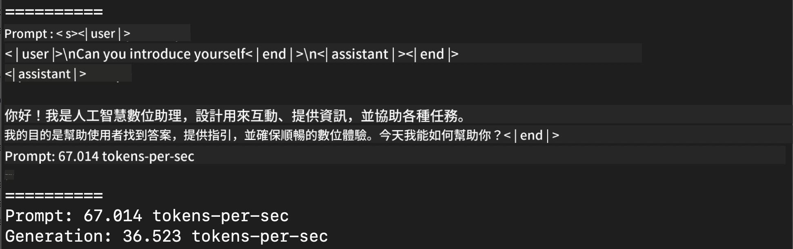
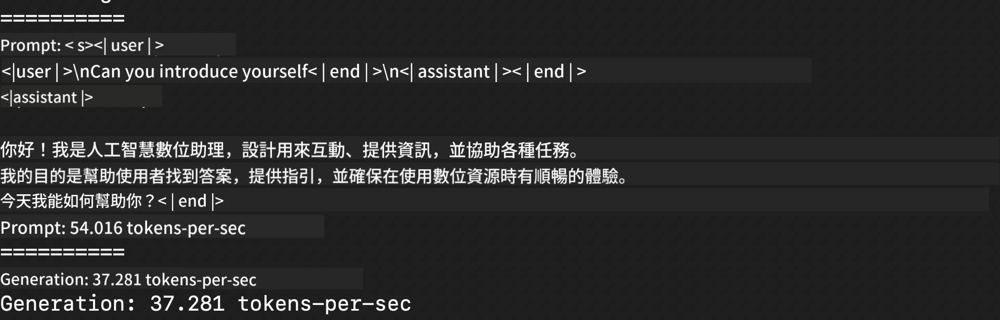

<!--
CO_OP_TRANSLATOR_METADATA:
{
  "original_hash": "dcb656f3d206fc4968e236deec5d4384",
  "translation_date": "2025-05-08T06:01:06+00:00",
  "source_file": "md/01.Introduction/03/MLX_Inference.md",
  "language_code": "tw"
}
-->
# **使用 Apple MLX Framework 推論 Phi-3**

## **什麼是 MLX Framework**

MLX 是 Apple Silicon 上用於機器學習研究的陣列框架，由 Apple 機器學習研究團隊開發。

MLX 是由機器學習研究者為機器學習研究者設計的。這個框架旨在對使用者友善，同時在訓練與部署模型時保持高效率。框架本身的設計也相當簡潔明瞭。我們希望讓研究者能輕鬆擴充和改進 MLX，快速探索新點子。

LLM 可以透過 MLX 在 Apple Silicon 裝置上加速，且模型能夠非常方便地在本地運行。

## **使用 MLX 推論 Phi-3-mini**

### **1. 設定你的 MLX 環境**

1. Python 3.11.x  
2. 安裝 MLX 函式庫


```bash

pip install mlx-lm

```

### **2. 在終端機使用 MLX 執行 Phi-3-mini**


```bash

python -m mlx_lm.generate --model microsoft/Phi-3-mini-4k-instruct --max-token 2048 --prompt  "<|user|>\nCan you introduce yourself<|end|>\n<|assistant|>"

```

結果（我的環境是 Apple M1 Max, 64GB）如下



### **3. 在終端機使用 MLX 量化 Phi-3-mini**


```bash

python -m mlx_lm.convert --hf-path microsoft/Phi-3-mini-4k-instruct

```

***Note：*** 模型可以透過 mlx_lm.convert 進行量化，預設的量化方式是 INT4。這個範例是將 Phi-3-mini 量化成 INT4。

模型可以透過 mlx_lm.convert 量化，預設是 INT4。這個範例是將 Phi-3-mini 量化成 INT4。量化後會儲存在預設目錄 ./mlx_model

我們可以從終端機測試使用 MLX 量化後的模型


```bash

python -m mlx_lm.generate --model ./mlx_model/ --max-token 2048 --prompt  "<|user|>\nCan you introduce yourself<|end|>\n<|assistant|>"

```

結果是




### **4. 在 Jupyter Notebook 使用 MLX 執行 Phi-3-mini**


***Note:*** 請閱讀這個範例 [點此連結](../../../../../code/03.Inference/MLX/MLX_DEMO.ipynb)


## **資源**

1. 了解 Apple MLX Framework [https://ml-explore.github.io](https://ml-explore.github.io/mlx/build/html/index.html)

2. Apple MLX GitHub Repo [https://github.com/ml-explore](https://github.com/ml-explore)

**免責聲明**：  
本文件係使用 AI 翻譯服務 [Co-op Translator](https://github.com/Azure/co-op-translator) 進行翻譯。雖然我們致力於提供準確的翻譯，但請注意自動翻譯可能包含錯誤或不準確之處。原始文件之母語版本應視為權威來源。對於重要資訊，建議採用專業人工翻譯。我們不對因使用本翻譯所導致之任何誤解或誤譯負責。