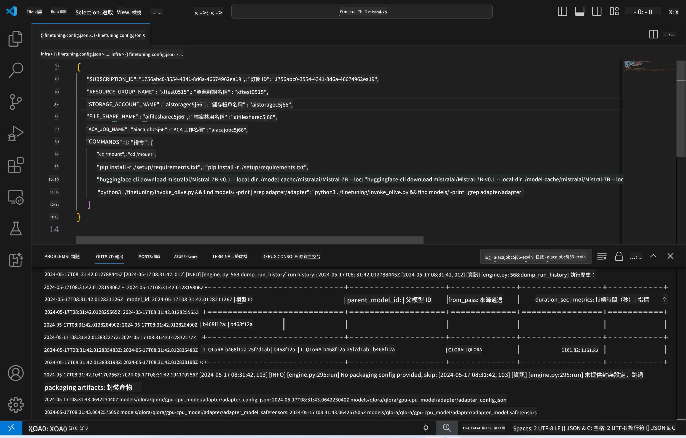
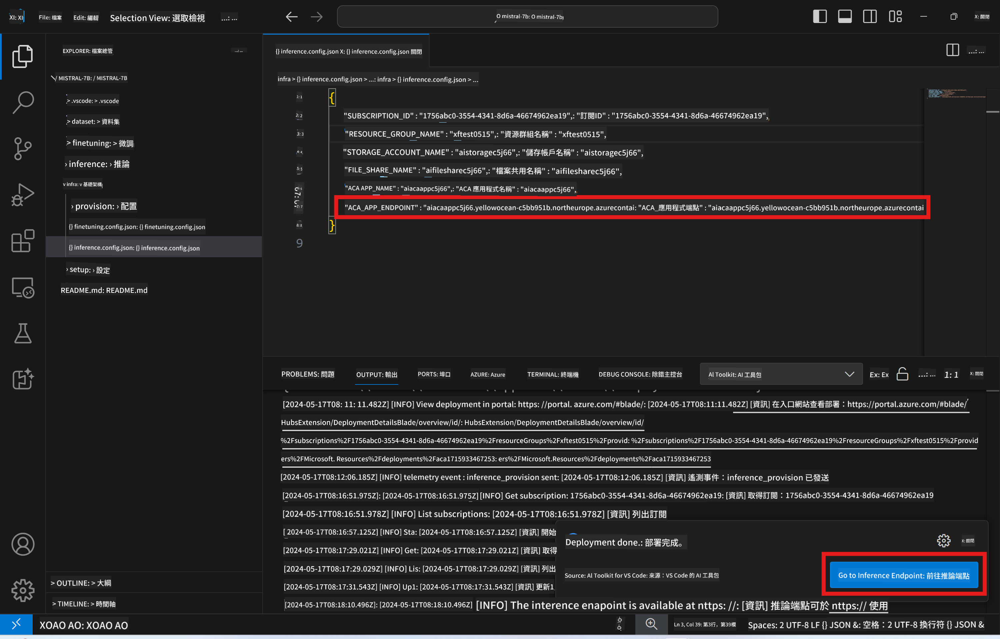

<!--
CO_OP_TRANSLATOR_METADATA:
{
  "original_hash": "a54cd3d65b6963e4e8ce21e143c3ab04",
  "translation_date": "2025-05-08T05:58:07+00:00",
  "source_file": "md/01.Introduction/03/Remote_Interence.md",
  "language_code": "tw"
}
-->
# 使用微調模型進行遠端推論

在遠端環境訓練完 adapters 後，可以使用簡單的 Gradio 應用程式與模型互動。



### 配置 Azure 資源
你需要透過命令面板執行 `AI Toolkit: Provision Azure Container Apps for inference` 來設定遠端推論的 Azure 資源。設定過程中會要求你選擇 Azure 訂閱和資源群組。  

   
預設情況下，推論所使用的訂閱和資源群組應該與微調時使用的相同。推論將使用相同的 Azure Container App 環境，並存取在微調步驟中產生、存放於 Azure Files 的模型及模型 adapter。

## 使用 AI Toolkit 

### 推論部署  
如果你想修改推論程式碼或重新載入推論模型，請執行 `AI Toolkit: Deploy for inference` 指令。這會將你的最新程式碼同步到 ACA 並重啟副本。


部署成功後，模型即可透過此端點進行評估。

### 存取推論 API

你可以點擊 VSCode 通知中顯示的「*Go to Inference Endpoint*」按鈕來存取推論 API。或者，也可以在 `./infra/inference.config.json` 中的 `ACA_APP_ENDPOINT` 以及輸出面板找到 Web API 端點。



> **Note:** 推論端點可能需要幾分鐘時間才能完全啟用。

## 範本中包含的推論元件
 
| 資料夾 | 內容 |
| ------ |--------- |
| `infra` | 包含遠端作業所需的所有設定。 |
| `infra/provision/inference.parameters.json` | 存放 bicep 範本參數，用於配置推論的 Azure 資源。 |
| `infra/provision/inference.bicep` | 包含用於配置推論 Azure 資源的範本。 |
| `infra/inference.config.json` | 由 `AI Toolkit: Provision Azure Container Apps for inference` 指令產生的設定檔，作為其他遠端命令面板的輸入。 |

### 使用 AI Toolkit 配置 Azure 資源配置
設定 [AI Toolkit](https://marketplace.visualstudio.com/items?itemName=ms-windows-ai-studio.windows-ai-studio)

為推論配置 Azure Container Apps，修改 ` command.

You can find configuration parameters in `./infra/provision/inference.parameters.json` file. Here are the details:
| Parameter | Description |
| --------- |------------ |
| `defaultCommands` | This is the commands to initiate a web API. |
| `maximumInstanceCount` | This parameter sets the maximum capacity of GPU instances. |
| `location` | This is the location where Azure resources are provisioned. The default value is the same as the chosen resource group's location. |
| `storageAccountName`, `fileShareName` `acaEnvironmentName`, `acaEnvironmentStorageName`, `acaAppName`,  `acaLogAnalyticsName` | These parameters are used to name the Azure resources for provision. By default, they will be same to the fine-tuning resource name. You can input a new, unused resource name to create your own custom-named resources, or you can input the name of an already existing Azure resource if you'd prefer to use that. For details, refer to the section [Using existing Azure Resources](../../../../../md/01.Introduction/03). |

### Using Existing Azure Resources

By default, the inference provision use the same Azure Container App Environment, Storage Account, Azure File Share, and Azure Log Analytics that were used for fine-tuning. A separate Azure Container App is created solely for the inference API. 

If you have customized the Azure resources during the fine-tuning step or want to use your own existing Azure resources for inference, specify their names in the `./infra/inference.parameters.json` 檔案。接著，從命令面板執行 `AI Toolkit: Provision Azure Container Apps for inference` 指令。此指令會更新指定的資源，並建立缺少的資源。

舉例來說，如果你已有現成的 Azure container 環境，你的 `./infra/finetuning.parameters.json` 應該長這樣：

```json
{
    "$schema": "https://schema.management.azure.com/schemas/2019-04-01/deploymentParameters.json#",
    "contentVersion": "1.0.0.0",
    "parameters": {
      ...
      "acaEnvironmentName": {
        "value": "<your-aca-env-name>"
      },
      "acaEnvironmentStorageName": {
        "value": null
      },
      ...
    }
  }
```

### 手動配置  
如果你想手動設定 Azure 資源，可以使用 `./infra/provision` folders. If you have already set up and configured all the Azure resources without using the AI Toolkit command palette, you can simply enter the resource names in the `inference.config.json` 檔案中的 bicep 檔案。

範例如下：

```json
{
  "SUBSCRIPTION_ID": "<your-subscription-id>",
  "RESOURCE_GROUP_NAME": "<your-resource-group-name>",
  "STORAGE_ACCOUNT_NAME": "<your-storage-account-name>",
  "FILE_SHARE_NAME": "<your-file-share-name>",
  "ACA_APP_NAME": "<your-aca-name>",
  "ACA_APP_ENDPOINT": "<your-aca-endpoint>"
}
```

**免責聲明**：  
本文件係使用 AI 翻譯服務 [Co-op Translator](https://github.com/Azure/co-op-translator) 進行翻譯。雖然我們致力於確保翻譯的準確性，但請注意，自動翻譯可能包含錯誤或不精確之處。原始文件的母語版本應視為權威來源。對於重要資訊，建議採用專業人工翻譯。我們對因使用本翻譯所導致的任何誤解或誤釋不負任何責任。