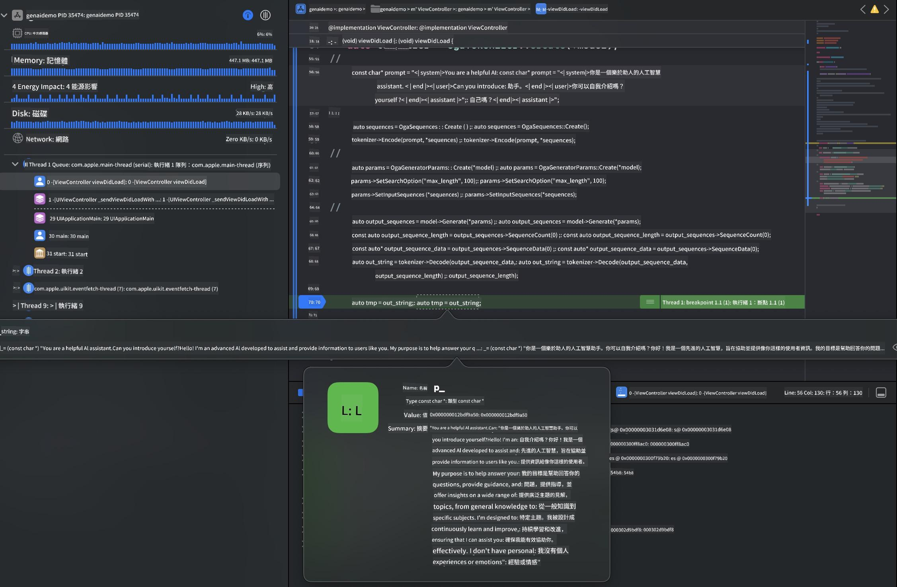

<!--
CO_OP_TRANSLATOR_METADATA:
{
  "original_hash": "82af197df38d25346a98f1f0e84d1698",
  "translation_date": "2025-05-08T05:56:07+00:00",
  "source_file": "md/01.Introduction/03/iOS_Inference.md",
  "language_code": "tw"
}
-->
# **在 iOS 上進行 Phi-3 推論**

Phi-3-mini 是微軟推出的新一代模型系列，能夠讓大型語言模型（LLMs）部署在邊緣裝置和物聯網裝置上。Phi-3-mini 支援 iOS、Android 以及邊緣裝置部署，讓生成式 AI 能夠在 BYOD 環境中運行。以下範例示範如何在 iOS 上部署 Phi-3-mini。

## **1. 準備工作**

- **a.** macOS 14 以上
- **b.** Xcode 15 以上
- **c.** iOS SDK 17.x（iPhone 14 A16 或更新版本）
- **d.** 安裝 Python 3.10 以上（建議使用 Conda）
- **e.** 安裝 Python 函式庫：`python-flatbuffers`
- **f.** 安裝 CMake

### Semantic Kernel 與推論

Semantic Kernel 是一個應用框架，可以讓你建立與 Azure OpenAI Service、OpenAI 模型甚至本地模型相容的應用程式。透過 Semantic Kernel 存取本地服務，能輕鬆整合自架的 Phi-3-mini 模型伺服器。

### 使用 Ollama 或 LlamaEdge 呼叫量化模型

許多用戶偏好使用量化模型在本地執行。 [Ollama](https://ollama.com) 和 [LlamaEdge](https://llamaedge.com) 允許用戶呼叫不同的量化模型：

#### **Ollama**

你可以直接執行 `ollama run phi3`，或離線設定。建立一個 Modelfile，並指定 `gguf` 檔案路徑。以下是執行 Phi-3-mini 量化模型的範例程式碼：

```gguf
FROM {Add your gguf file path}
TEMPLATE \"\"\"<|user|> .Prompt<|end|> <|assistant|>\"\"\"
PARAMETER stop <|end|>
PARAMETER num_ctx 4096
```

#### **LlamaEdge**

如果想同時在雲端與邊緣裝置使用 `gguf`，LlamaEdge 是不錯的選擇。

## **2. 為 iOS 編譯 ONNX Runtime**

```bash

git clone https://github.com/microsoft/onnxruntime.git

cd onnxruntime

./build.sh --build_shared_lib --ios --skip_tests --parallel --build_dir ./build_ios --ios --apple_sysroot iphoneos --osx_arch arm64 --apple_deploy_target 17.5 --cmake_generator Xcode --config Release

cd ../

```

### **注意事項**

- **a.** 編譯前，請確認 Xcode 已正確設定，並在終端機中將其設為活躍開發者目錄：

    ```bash
    sudo xcode-select -switch /Applications/Xcode.app/Contents/Developer
    ```

- **b.** ONNX Runtime 需要針對不同平台編譯。對 iOS 而言，可以編譯 `arm64` or `x86_64`。

- **c.** 建議使用最新版 iOS SDK 進行編譯，但若需要與舊版 SDK 相容，也可使用舊版。

## **3. 使用 ONNX Runtime 為 iOS 編譯生成式 AI**

> **Note:** 由於使用 ONNX Runtime 的生成式 AI 尚在預覽階段，請注意可能會有變動。

```bash

git clone https://github.com/microsoft/onnxruntime-genai
 
cd onnxruntime-genai
 
mkdir ort
 
cd ort
 
mkdir include
 
mkdir lib
 
cd ../
 
cp ../onnxruntime/include/onnxruntime/core/session/onnxruntime_c_api.h ort/include
 
cp ../onnxruntime/build_ios/Release/Release-iphoneos/libonnxruntime*.dylib* ort/lib
 
export OPENCV_SKIP_XCODEBUILD_FORCE_TRYCOMPILE_DEBUG=1
 
python3 build.py --parallel --build_dir ./build_ios --ios --ios_sysroot iphoneos --ios_arch arm64 --ios_deployment_target 17.5 --cmake_generator Xcode --cmake_extra_defines CMAKE_XCODE_ATTRIBUTE_CODE_SIGNING_ALLOWED=NO

```

## **4. 在 Xcode 中建立 App 應用程式**

我選擇用 Objective-C 來開發 App，因為使用 ONNX Runtime C++ API 呼叫生成式 AI 時，Objective-C 兼容性較佳。當然，也可以透過 Swift bridging 完成相關呼叫。


## **5. 將 ONNX 量化 INT4 模型複製到 App 專案中**

我們需要匯入 ONNX 格式的 INT4 量化模型，必須先下載該模型。


下載後，需將它加入 Xcode 專案的 Resources 目錄中。


## **6. 在 ViewControllers 中加入 C++ API**

> **注意：**

- **a.** 將對應的 C++ 標頭檔加入專案。

  

- **b.** 引入 `onnxruntime-genai` dynamic library in Xcode.

  

- **c.** Use the C Samples code for testing. You can also add additional features like ChatUI for more functionality.

- **d.** Since you need to use C++ in your project, rename `ViewController.m` to `ViewController.mm`，以啟用 Objective-C++ 支援。

```objc

    NSString *llmPath = [[NSBundle mainBundle] resourcePath];
    char const *modelPath = llmPath.cString;

    auto model =  OgaModel::Create(modelPath);

    auto tokenizer = OgaTokenizer::Create(*model);

    const char* prompt = "<|system|>You are a helpful AI assistant.<|end|><|user|>Can you introduce yourself?<|end|><|assistant|>";

    auto sequences = OgaSequences::Create();
    tokenizer->Encode(prompt, *sequences);

    auto params = OgaGeneratorParams::Create(*model);
    params->SetSearchOption("max_length", 100);
    params->SetInputSequences(*sequences);

    auto output_sequences = model->Generate(*params);
    const auto output_sequence_length = output_sequences->SequenceCount(0);
    const auto* output_sequence_data = output_sequences->SequenceData(0);
    auto out_string = tokenizer->Decode(output_sequence_data, output_sequence_length);
    
    auto tmp = out_string;

```

## **7. 執行應用程式**

設定完成後，即可執行應用程式，查看 Phi-3-mini 模型推論結果。



欲取得更多範例程式碼及詳細說明，請造訪 [Phi-3 Mini Samples repository](https://github.com/Azure-Samples/Phi-3MiniSamples/tree/main/ios)。

**免責聲明**：  
本文件係使用 AI 翻譯服務 [Co-op Translator](https://github.com/Azure/co-op-translator) 進行翻譯。雖然我們力求準確，但請注意，自動翻譯可能會有錯誤或不準確之處。原始文件之母語版本應視為權威來源。對於重要資訊，建議採用專業人工翻譯。我們不對因使用本翻譯所產生之任何誤解或誤譯負責。