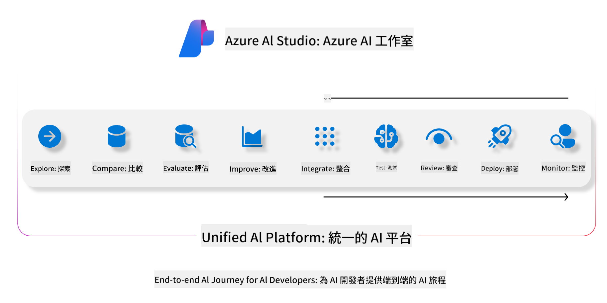
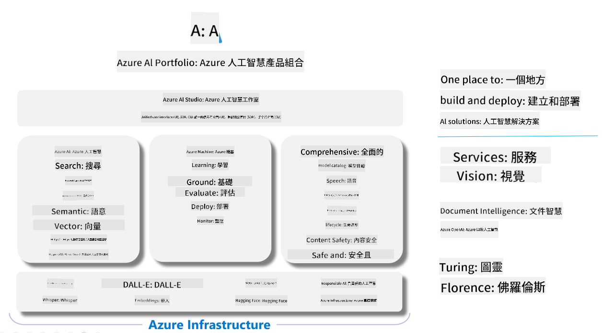

<!--
CO_OP_TRANSLATOR_METADATA:
{
  "original_hash": "5dfb4983a2e74e4b5e8317eb16fc2154",
  "translation_date": "2025-04-04T06:10:13+00:00",
  "source_file": "md\\01.Introduction\\05\\AIFoundry.md",
  "language_code": "tw"
}
-->
# **使用 Azure AI Foundry 進行評估**

如何使用 [Azure AI Foundry](https://ai.azure.com?WT.mc_id=aiml-138114-kinfeylo) 評估您的生成式 AI 應用程式。不論是單輪對話還是多輪對話，Azure AI Foundry 都提供工具來評估模型的性能和安全性。

## 使用 Azure AI Foundry 評估生成式 AI 應用程式
如需更詳細的指導，請參閱 [Azure AI Foundry 文件](https://learn.microsoft.com/azure/ai-studio/how-to/evaluate-generative-ai-app?WT.mc_id=aiml-138114-kinfeylo)。

以下是入門的步驟：

## 在 Azure AI Foundry 中評估生成式 AI 模型

**先決條件**

- 一個以 CSV 或 JSON 格式保存的測試數據集。
- 一個已部署的生成式 AI 模型（例如 Phi-3、GPT 3.5、GPT 4 或 Davinci 模型）。
- 一個運行時環境，並擁有執行評估所需的計算實例。

## 內建評估指標

Azure AI Foundry 支援評估單輪對話以及複雜的多輪對話。
對於基於特定數據的檢索增強生成（RAG）場景，您可以使用內建評估指標來評估性能。
此外，您還可以評估一般的單輪問答場景（非 RAG）。

## 創建評估執行

在 Azure AI Foundry 的使用者介面中，導航至「Evaluate」頁面或「Prompt Flow」頁面。
按照評估創建向導設置評估執行。您可以選擇為您的評估提供一個可選的名稱。
選擇符合您應用程式目標的場景。
選擇一個或多個評估指標來評估模型的輸出。

## 自訂評估流程（可選）

如果需要更大的靈活性，您可以建立自訂的評估流程。根據您的特定需求調整評估過程。

## 查看結果

完成評估後，您可以在 Azure AI Foundry 中記錄、查看並分析詳細的評估指標。深入了解您的應用程式的能力和限制。

**注意** Azure AI Foundry 目前處於公開預覽階段，因此僅用於實驗和開發用途。對於生產工作負載，請考慮其他選項。探索官方 [AI Foundry 文件](https://learn.microsoft.com/azure/ai-studio/?WT.mc_id=aiml-138114-kinfeylo) 以獲取更多詳細信息和分步指導。

**免責聲明**：  
本文檔使用 AI 翻譯服務 [Co-op Translator](https://github.com/Azure/co-op-translator) 進行翻譯。我們致力於提供準確的翻譯，但請注意，機器翻譯可能包含錯誤或不準確之處。原始語言的文件應被視為具有權威性的來源。對於關鍵信息，建議使用專業人工翻譯。我們對使用此翻譯可能引起的任何誤解或錯誤解釋不承擔責任。