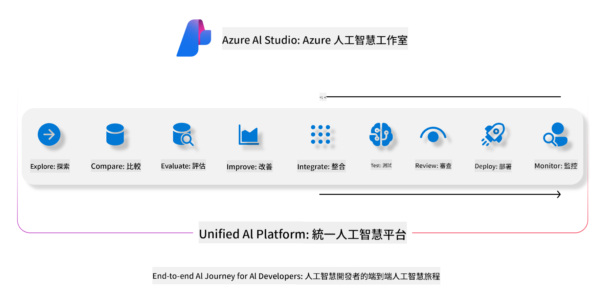
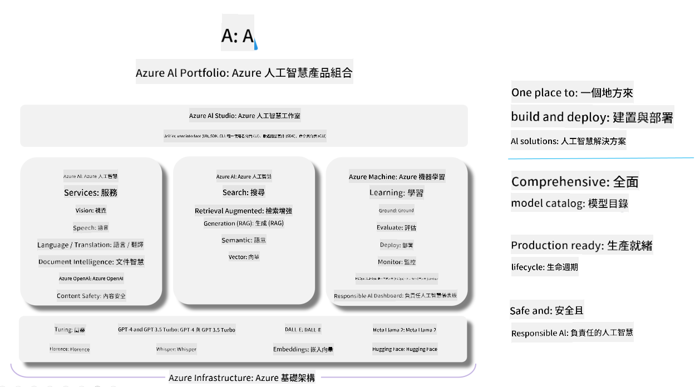

<!--
CO_OP_TRANSLATOR_METADATA:
{
  "original_hash": "7b4235159486df4000e16b7b46ddfec3",
  "translation_date": "2025-05-08T06:05:04+00:00",
  "source_file": "md/01.Introduction/05/AIFoundry.md",
  "language_code": "tw"
}
-->
# **使用 Azure AI Foundry 進行評估**

如何使用 [Azure AI Foundry](https://ai.azure.com?WT.mc_id=aiml-138114-kinfeylo) 評估你的生成式 AI 應用。無論你是在評估單輪還是多輪對話，Azure AI Foundry 都提供了評估模型效能與安全性的工具。

## 如何用 Azure AI Foundry 評估生成式 AI 應用
更多詳細說明請參考 [Azure AI Foundry 文件](https://learn.microsoft.com/azure/ai-studio/how-to/evaluate-generative-ai-app?WT.mc_id=aiml-138114-kinfeylo)

以下是開始的步驟：

## 在 Azure AI Foundry 評估生成式 AI 模型

**先決條件**

- 一份 CSV 或 JSON 格式的測試資料集。
- 一個已部署的生成式 AI 模型（例如 Phi-3、GPT 3.5、GPT 4 或 Davinci 模型）。
- 一個具備運算資源的執行環境，用來執行評估。

## 內建評估指標

Azure AI Foundry 支援評估單輪與複雜的多輪對話。
針對以特定資料為基礎的 Retrieval Augmented Generation (RAG) 情境，可以使用內建評估指標來評估效能。
此外，也能評估一般的單輪問答情境（非 RAG）。

## 建立評估執行

從 Azure AI Foundry 的介面，前往 Evaluate 頁面或 Prompt Flow 頁面。
依照評估建立精靈完成評估執行設定，並可選擇為評估命名。
選擇符合你應用目標的情境。
挑選一個或多個評估指標來評估模型輸出。

## 自訂評估流程（選用）

若需要更彈性的操作，可以建立自訂評估流程，根據你的需求調整評估過程。

## 查看結果

完成評估後，在 Azure AI Foundry 中記錄、檢視並分析詳細的評估指標。深入了解你的應用能力與限制。

**Note** Azure AI Foundry 目前處於公開預覽階段，建議用於實驗與開發。正式生產環境請考慮其他方案。更多細節與逐步教學請參考官方 [AI Foundry 文件](https://learn.microsoft.com/azure/ai-studio/?WT.mc_id=aiml-138114-kinfeylo)。

**免責聲明**：  
本文件係使用 AI 翻譯服務 [Co-op Translator](https://github.com/Azure/co-op-translator) 進行翻譯。雖然我們致力於確保翻譯的準確性，但請注意自動翻譯可能包含錯誤或不準確之處。原始文件的母語版本應視為權威來源。對於重要資訊，建議採用專業人工翻譯。我們不對因使用此翻譯所產生的任何誤解或誤譯負責。