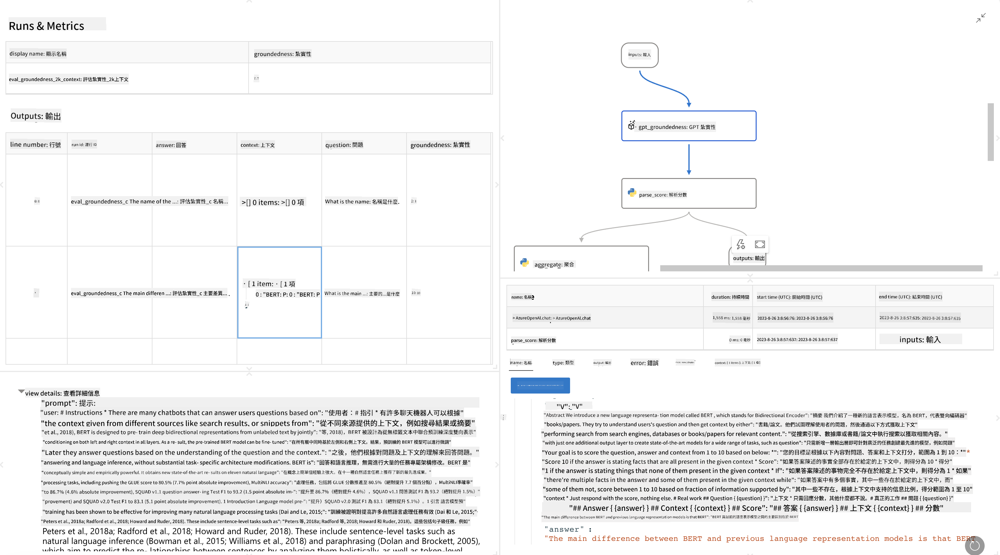

<!--
CO_OP_TRANSLATOR_METADATA:
{
  "original_hash": "01a5ee7478befb159e2b7ded29832206",
  "translation_date": "2025-04-04T06:11:13+00:00",
  "source_file": "md\\01.Introduction\\05\\Promptflow.md",
  "language_code": "tw"
}
-->
# **介紹 Promptflow**

[Microsoft Prompt Flow](https://microsoft.github.io/promptflow/index.html?WT.mc_id=aiml-138114-kinfeylo) 是一款視覺化的工作流程自動化工具，讓使用者能透過預建模板和自訂連接器來建立自動化工作流程。該工具旨在幫助開發者和業務分析師快速構建自動化流程，適用於資料管理、協作以及流程優化等任務。使用 Prompt Flow，使用者可以輕鬆連接不同的服務、應用程式和系統，並自動化複雜的業務流程。

Microsoft Prompt Flow 專為簡化基於大型語言模型 (LLM) 的 AI 應用程式開發全流程而設計。不論是構思、原型設計、測試、評估或部署 LLM 應用程式，Prompt Flow 都能簡化流程，助您打造具備生產品質的 LLM 應用程式。

## 以下是使用 Microsoft Prompt Flow 的主要功能和優勢：

**互動式編輯體驗**

Prompt Flow 提供工作流程結構的視覺化呈現，讓您能輕鬆理解並導航專案。
它提供類似筆記本的編碼體驗，提升工作流程開發和調試效率。

**提示變體與調整**

建立並比較多個提示變體，方便進行迭代優化。評估不同提示的表現並選擇最有效的選項。

**內建評估流程**
使用內建評估工具，評估提示和工作流程的品質與效能。
了解基於 LLM 的應用程式表現如何。

**全面資源**

Prompt Flow 包括內建工具、範例和模板庫。這些資源既是開發的起點，也能激發創意，加速開發過程。

**協作與企業級準備**

支持團隊協作，允許多位使用者共同參與提示工程專案。
維護版本控制並有效分享知識。簡化提示工程的整個流程，包括開發、評估、部署及監控。

## 在 Prompt Flow 中進行評估

在 Microsoft Prompt Flow 中，評估對於了解 AI 模型的效能至關重要。以下是如何在 Prompt Flow 中自訂評估流程和指標：

**了解 Prompt Flow 中的評估**

在 Prompt Flow 中，工作流程代表一系列處理輸入並生成輸出的節點。評估流程是一種特殊的工作流程，用於根據特定標準和目標評估執行的效能。

**評估流程的主要特點**

通常在被測試的工作流程執行後運行，使用其輸出。它們計算分數或指標來衡量被測試工作流程的效能。指標可以包括準確性、相關性分數或其他相關測量。

### 自訂評估流程

**定義輸入**

評估流程需要使用被測試流程的輸出。定義輸入方式與標準工作流程類似。
例如，若評估 QnA 流程，可命名輸入為 "answer"；若評估分類流程，可命名輸入為 "category"。可能還需要真實值輸入（如實際標籤）。

**輸出與指標**

評估流程生成衡量被測試流程效能的結果。指標可透過 Python 或 LLM (大型語言模型) 計算。使用 log_metric() 函數記錄相關指標。

**使用自訂評估流程**

根據您的特定任務和目標開發專屬評估流程。根據評估目標自訂指標。
將此自訂評估流程應用於批量執行以進行大規模測試。

## 內建評估方法

Prompt Flow 也提供內建評估方法。
您可以提交批量執行並使用這些方法評估工作流程在大型資料集上的表現。
查看評估結果，比較指標並根據需要進行迭代。
請記住，評估對於確保您的 AI 模型符合預期標準和目標至關重要。詳細的開發和使用評估流程指導，請參考官方文檔。

總結來說，Microsoft Prompt Flow 通過簡化提示工程並提供強大的開發環境，幫助開發者打造高品質的 LLM 應用程式。如果您正在使用 LLM，Prompt Flow 是值得探索的工具。詳細的開發和使用評估流程指導，請參考 [Prompt Flow 評估文檔](https://learn.microsoft.com/azure/machine-learning/prompt-flow/how-to-develop-an-evaluation-flow?view=azureml-api-2?WT.mc_id=aiml-138114-kinfeylo)。

**免責聲明**：  
本文檔是使用 AI 翻譯服務 [Co-op Translator](https://github.com/Azure/co-op-translator) 翻譯的。我們致力於提供準確的翻譯，但請注意，自動翻譯可能包含錯誤或不準確之處。應以原文檔的原始語言版本作為權威來源。對於關鍵資訊，建議尋求專業人工翻譯。我們對因使用此翻譯而產生的任何誤解或錯誤解讀概不負責。