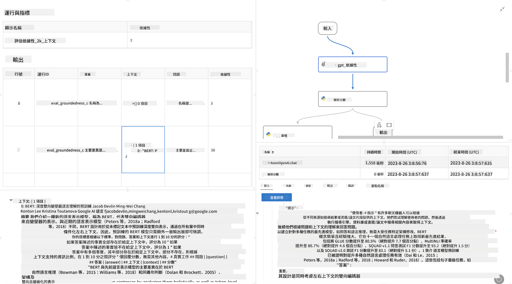

<!--
CO_OP_TRANSLATOR_METADATA:
{
  "original_hash": "3cbe7629d254f1043193b7fe22524d55",
  "translation_date": "2025-05-08T06:07:45+00:00",
  "source_file": "md/01.Introduction/05/Promptflow.md",
  "language_code": "tw"
}
-->
# **介紹 Promptflow**

[Microsoft Prompt Flow](https://microsoft.github.io/promptflow/index.html?WT.mc_id=aiml-138114-kinfeylo) 是一個視覺化的工作流程自動化工具，讓使用者能利用預建範本和自訂連接器來建立自動化流程。它設計的目標是幫助開發者和業務分析師快速打造自動化流程，用於資料管理、協作及流程優化等任務。透過 Prompt Flow，使用者可以輕鬆連接不同服務、應用程式與系統，並自動化複雜的商業流程。

Microsoft Prompt Flow 專為簡化由大型語言模型（LLMs）驅動的 AI 應用程式的端到端開發週期而設計。無論你是在構思、原型設計、測試、評估或部署基於 LLM 的應用程式，Prompt Flow 都能簡化流程，讓你能打造具備生產品質的 LLM 應用。

## 以下是使用 Microsoft Prompt Flow 的主要特色與優勢：

**互動式撰寫體驗**

Prompt Flow 提供流程結構的視覺化呈現，讓你更容易理解並瀏覽專案。
它還提供類似筆記本的程式碼撰寫體驗，有助於高效率的流程開發與除錯。

**提示變體與調校**

建立並比較多個提示變體，促進反覆精進的過程。評估不同提示的表現，選擇最有效的版本。

**內建評估流程**

利用內建的評估工具，檢視提示和流程的品質與效能。
了解你的基於 LLM 的應用程式表現如何。

**豐富的資源庫**

Prompt Flow 包含內建工具、範例與範本的資源庫。這些資源可作為開發起點，激發創意並加速流程。

**協作與企業就緒**

支援團隊協作，允許多位使用者共同參與提示工程專案。
維護版本控制並有效分享知識。從開發、評估到部署與監控，優化整個提示工程流程。

## Prompt Flow 中的評估

在 Microsoft Prompt Flow 中，評估扮演評估 AI 模型表現的重要角色。讓我們來看看如何在 Prompt Flow 中自訂評估流程和指標：

**理解 Prompt Flow 的評估**

在 Prompt Flow 中，流程代表一連串節點，負責處理輸入並產生輸出。評估流程是專門設計用來根據特定標準和目標評估執行結果的特殊流程。

**評估流程的主要特色**

它們通常在被測試流程執行後運行，並使用該流程的輸出。評估流程會計算分數或指標，以衡量被測流程的表現。指標可能包括準確率、相關性分數或其他相關衡量標準。

### 自訂評估流程

**定義輸入**

評估流程需要接收被測流程的輸出。輸入的定義方式與一般流程相同。
例如，若評估的是 QnA 流程，輸入可命名為 "answer"。若評估分類流程，輸入可命名為 "category"。有時也需要提供實際標籤（ground truth）作為輸入。

**輸出與指標**

評估流程會產生衡量被測流程表現的結果。指標可以透過 Python 或 LLM（大型語言模型）來計算。使用 log_metric() 函式來記錄相關指標。

**使用自訂評估流程**

開發符合你特定任務和目標的自訂評估流程。根據你的評估需求調整指標。
將此自訂評估流程應用於批次執行，以進行大規模測試。

## 內建評估方法

Prompt Flow 也提供內建的評估方法。
你可以提交批次執行，並利用這些方法來評估流程在大型資料集上的表現。
檢視評估結果、比較指標並依需求反覆調整。
請記得，評估是確保 AI 模型達成預期標準與目標的關鍵。建議參考官方文件，取得關於在 Microsoft Prompt Flow 中開發與使用評估流程的詳細指引。

總結來說，Microsoft Prompt Flow 讓開發者能簡化提示工程，並提供完善的開發環境，打造高品質的 LLM 應用。如果你正在使用 LLM，Prompt Flow 是一個值得探索的重要工具。請參考[Prompt Flow 評估文件](https://learn.microsoft.com/azure/machine-learning/prompt-flow/how-to-develop-an-evaluation-flow?view=azureml-api-2?WT.mc_id=aiml-138114-kinfeylo)，了解如何在 Microsoft Prompt Flow 中開發與使用評估流程的詳細說明。

**免責聲明**：  
本文件係使用 AI 翻譯服務 [Co-op Translator](https://github.com/Azure/co-op-translator) 進行翻譯。雖然我們力求準確，但請注意自動翻譯可能包含錯誤或不準確之處。原始文件之母語版本應視為權威來源。對於重要資訊，建議採用專業人工翻譯。我們不對因使用本翻譯而產生之任何誤解或誤譯負責。