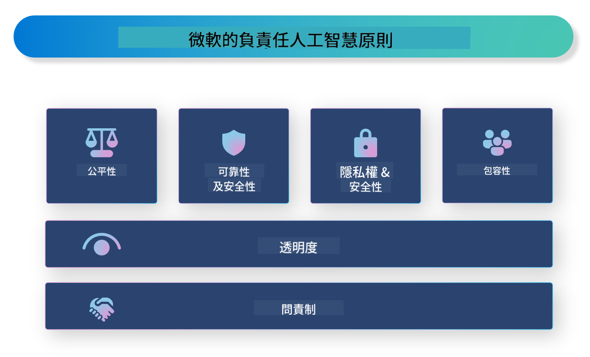

<!--
CO_OP_TRANSLATOR_METADATA:
{
  "original_hash": "805b96b20152936d8f4c587d90d6e06e",
  "translation_date": "2025-05-08T06:06:02+00:00",
  "source_file": "md/01.Introduction/05/ResponsibleAI.md",
  "language_code": "tw"
}
-->
# **介紹負責任的 AI**

[Microsoft Responsible AI](https://www.microsoft.com/ai/responsible-ai?WT.mc_id=aiml-138114-kinfeylo) 是一項旨在協助開發者和組織打造透明、值得信賴且負責任的 AI 系統的計畫。該計畫提供指引和資源，協助開發符合隱私、公平性和透明度等倫理原則的負責任 AI 解決方案。我們也將探討構建負責任 AI 系統時面臨的一些挑戰和最佳實踐。

## Microsoft Responsible AI 概述

**倫理原則**

Microsoft Responsible AI 以一套倫理原則為指導，包括隱私、公平、透明、問責和安全性。這些原則旨在確保 AI 系統的開發符合倫理且負責任的標準。

**透明的 AI**

Microsoft Responsible AI 強調 AI 系統透明度的重要性，包括清楚說明 AI 模型的運作方式，並確保資料來源和演算法公開可得。

**問責的 AI**

[Microsoft Responsible AI](https://www.microsoft.com/ai/responsible-ai?WT.mc_id=aiml-138114-kinfeylo) 推動開發具備問責性的 AI 系統，能夠提供 AI 模型決策過程的洞見，幫助使用者理解並信任 AI 的輸出結果。

**包容性**

AI 系統應設計成讓所有人受益。Microsoft 致力打造包容性的 AI，考量多元觀點，避免偏見或歧視。

**可靠性與安全性**

確保 AI 系統的可靠性與安全性至關重要。Microsoft 著重建構穩健的模型，能持續穩定運作並避免造成傷害。

**AI 公平性**

Microsoft Responsible AI 承認 AI 系統若以有偏見的資料或演算法訓練，可能會延續偏見。該計畫提供指引，協助開發不因種族、性別或年齡等因素而歧視的公平 AI 系統。

**隱私與安全**

Microsoft Responsible AI 強調在 AI 系統中保護使用者隱私與資料安全的重要性，包括實施強化的資料加密和存取控制，並定期審核 AI 系統的安全漏洞。

**問責與責任**

Microsoft Responsible AI 推動 AI 開發與部署的問責與責任，確保開發者和組織了解 AI 系統可能帶來的風險，並採取措施降低這些風險。

## 建構負責任 AI 系統的最佳實踐

**使用多元資料集開發 AI 模型**

為避免 AI 系統出現偏見，重要的是使用涵蓋多元觀點與經驗的多元資料集。

**運用可解釋的 AI 技術**

可解釋的 AI 技術能幫助使用者理解 AI 模型的決策過程，增進系統的信任度。

**定期審核 AI 系統的安全漏洞**

定期對 AI 系統進行審核，有助於發現並解決潛在的風險與漏洞。

**實施強化的資料加密與存取控制**

資料加密與存取控制能保護 AI 系統中使用者的隱私與安全。

**遵循 AI 開發的倫理原則**

遵循公平、透明和問責等倫理原則，有助於建立 AI 系統的信任，並確保其負責任的開發。

## 使用 AI Foundry 促進負責任 AI

[Azure AI Foundry](https://ai.azure.com?WT.mc_id=aiml-138114-kinfeylo) 是一個強大的平台，讓開發者和組織能快速打造智慧、先進、市場就緒且負責任的應用程式。以下是 Azure AI Foundry 的一些主要功能與特色：

**現成的 API 與模型**

Azure AI Foundry 提供預建和可自訂的 API 與模型，涵蓋生成式 AI、自然語言處理（用於對話）、搜尋、監控、翻譯、語音、視覺和決策等多種 AI 任務。

**Prompt Flow**

Azure AI Foundry 的 Prompt Flow 讓你能創建對話式 AI 體驗，設計並管理對話流程，方便打造聊天機器人、虛擬助理及其他互動應用。

**檢索增強生成 (RAG)**

RAG 是結合檢索式與生成式方法的技術，透過同時利用既有知識（檢索）和創造性生成（生成），提升回應品質。

**生成式 AI 的評估與監控指標**

Azure AI Foundry 提供評估與監控生成式 AI 模型的工具，能評估其效能、公平性及其他重要指標，確保負責任的部署。此外，若你已建立儀表板，可以使用 Azure Machine Learning Studio 的無程式碼介面，自訂並生成基於 [Responsible AI Toolbox](https://responsibleaitoolbox.ai/?WT.mc_id=aiml-138114-kinfeylo) Python 函式庫的負責任 AI 儀表板與相關評分卡。此評分卡有助於與技術及非技術利害關係人分享公平性、特徵重要性及其他負責任部署的關鍵洞見。

使用 AI Foundry 進行負責任 AI 時，可遵循以下最佳實踐：

**定義 AI 系統的問題與目標**

在開發前，明確定義 AI 系統欲解決的問題或目標，有助於識別所需的資料、演算法與資源，打造有效的模型。

**收集並預處理相關資料**

訓練 AI 系統所用的資料品質與數量會大幅影響模型表現，因此需收集相關資料，清理並預處理，確保其能代表目標族群或問題。

**選擇合適的評估方法**

市面上有多種評估演算法，應根據資料和問題挑選最適合的演算法。

**評估並解讀模型**

建立模型後，需使用適當指標評估其效能，並以透明的方式解讀結果，有助於辨識偏見或限制，並進行必要改進。

**確保透明度與可解釋性**

AI 系統應具備透明度與可解釋性，讓使用者了解系統運作及決策過程，這對於醫療、金融、法律等對人類生活有重大影響的應用尤其重要。

**持續監控並更新模型**

AI 系統應持續監控與更新，確保長期保持準確與有效，這需要持續的維護、測試與再訓練。

總結來說，Microsoft Responsible AI 是一項協助開發者與組織打造透明、可信且負責任 AI 系統的計畫。負責任的 AI 實踐至關重要，而 Azure AI Foundry 則致力讓組織能夠實際應用。透過遵循倫理原則與最佳實踐，我們能確保 AI 系統的開發與部署，對整個社會帶來正面效益。

**免責聲明**：  
本文件係使用 AI 翻譯服務 [Co-op Translator](https://github.com/Azure/co-op-translator) 進行翻譯。雖然我們力求準確，但請注意自動翻譯可能包含錯誤或不準確之處。原始文件之母語版本應視為權威來源。對於重要資訊，建議採用專業人工翻譯。我們不對因使用本翻譯而產生之任何誤解或誤譯負責。