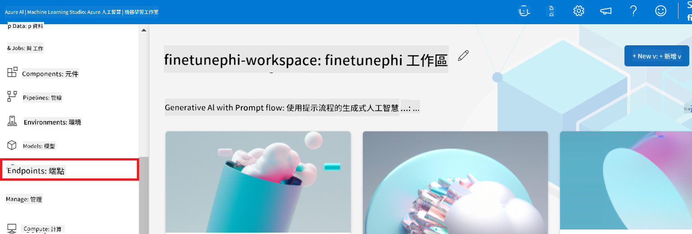
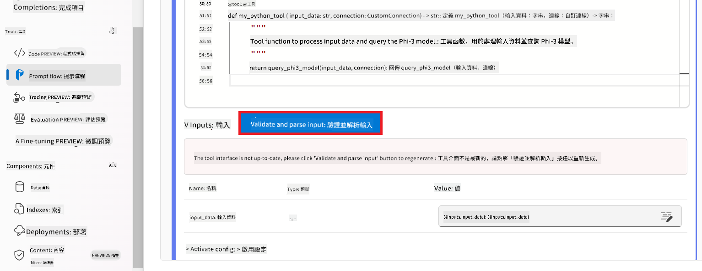
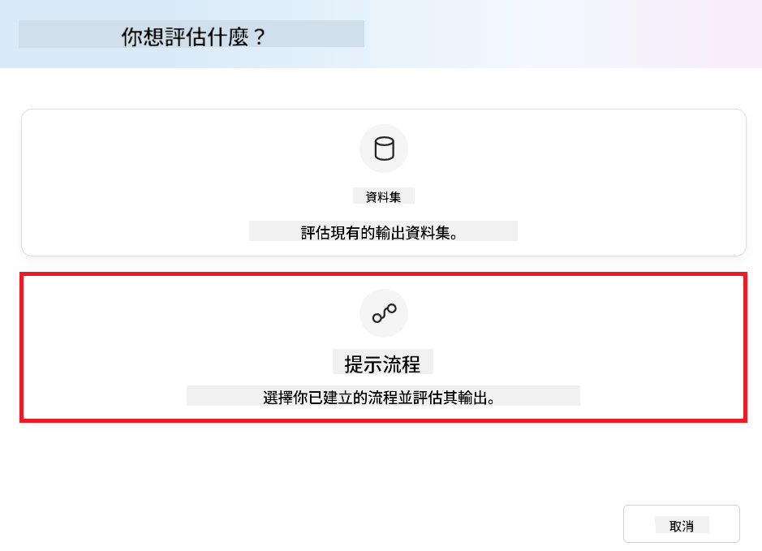
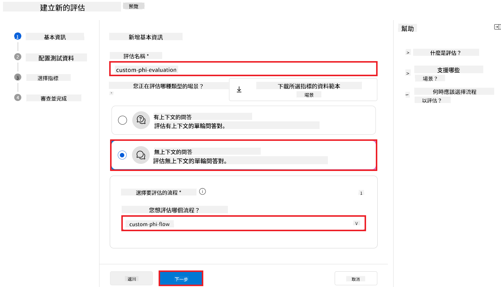
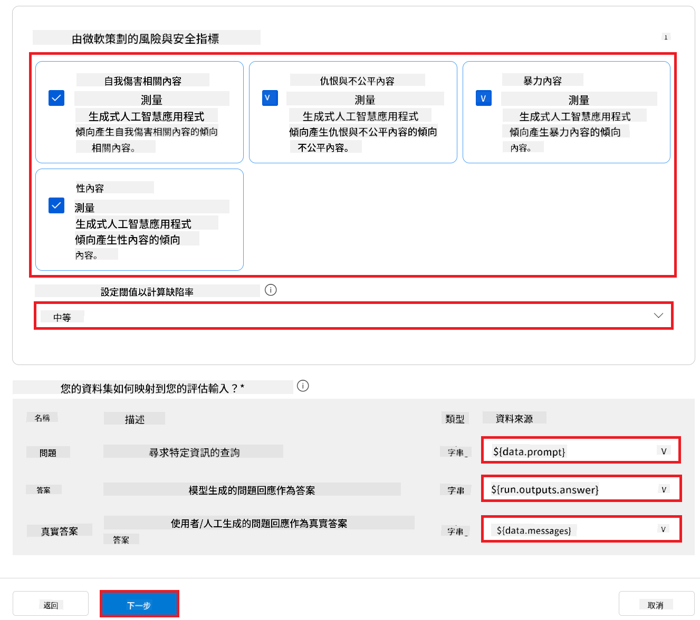

<!--
CO_OP_TRANSLATOR_METADATA:
{
  "original_hash": "80a853c08e4ee25ef9b4bfcedd8990da",
  "translation_date": "2025-07-16T23:23:18+00:00",
  "source_file": "md/02.Application/01.TextAndChat/Phi3/E2E_Phi-3-Evaluation_AIFoundry.md",
  "language_code": "tw"
}
-->
# 在 Azure AI Foundry 中評估微調後的 Phi-3 / Phi-3.5 模型，聚焦於微軟的負責任 AI 原則

此端對端（E2E）範例基於微軟技術社群的指南「[Evaluate Fine-tuned Phi-3 / 3.5 Models in Azure AI Foundry Focusing on Microsoft's Responsible AI](https://techcommunity.microsoft.com/blog/educatordeveloperblog/evaluate-fine-tuned-phi-3--3-5-models-in-azure-ai-studio-focusing-on-microsofts-/4227850?WT.mc_id=aiml-137032-kinfeylo)」。

## 概覽

### 如何在 Azure AI Foundry 中評估微調後的 Phi-3 / Phi-3.5 模型的安全性與效能？

微調模型有時可能導致意外或不理想的回應。為確保模型保持安全且有效，評估模型產生有害內容的可能性，以及其產生準確、相關且連貫回應的能力非常重要。在本教學中，您將學習如何評估整合於 Azure AI Foundry 中 Prompt flow 的微調 Phi-3 / Phi-3.5 模型的安全性與效能。

以下是 Azure AI Foundry 的評估流程。


*圖片來源：[Evaluation of generative AI applications](https://learn.microsoft.com/azure/ai-studio/concepts/evaluation-approach-gen-ai?wt.mc_id%3Dstudentamb_279723)*

> [!NOTE]
>
> 欲了解更詳細資訊及探索更多 Phi-3 / Phi-3.5 的資源，請參考 [Phi-3CookBook](https://github.com/microsoft/Phi-3CookBook?wt.mc_id=studentamb_279723)。

### 先決條件

- [Python](https://www.python.org/downloads)
- [Azure 訂閱](https://azure.microsoft.com/free?wt.mc_id=studentamb_279723)
- [Visual Studio Code](https://code.visualstudio.com)
- 微調後的 Phi-3 / Phi-3.5 模型

### 目錄

1. [**情境 1：Azure AI Foundry 的 Prompt flow 評估介紹**](../../../../../../md/02.Application/01.TextAndChat/Phi3)

    - [安全性評估介紹](../../../../../../md/02.Application/01.TextAndChat/Phi3)
    - [效能評估介紹](../../../../../../md/02.Application/01.TextAndChat/Phi3)

1. [**情境 2：在 Azure AI Foundry 中評估 Phi-3 / Phi-3.5 模型**](../../../../../../md/02.Application/01.TextAndChat/Phi3)

    - [開始之前](../../../../../../md/02.Application/01.TextAndChat/Phi3)
    - [部署 Azure OpenAI 以評估 Phi-3 / Phi-3.5 模型](../../../../../../md/02.Application/01.TextAndChat/Phi3)
    - [使用 Azure AI Foundry 的 Prompt flow 評估微調後的 Phi-3 / Phi-3.5 模型](../../../../../../md/02.Application/01.TextAndChat/Phi3)

1. [恭喜！](../../../../../../md/02.Application/01.TextAndChat/Phi3)

## **情境 1：Azure AI Foundry 的 Prompt flow 評估介紹**

### 安全性評估介紹

為確保您的 AI 模型符合倫理且安全，評估其是否符合微軟的負責任 AI 原則至關重要。在 Azure AI Foundry 中，安全性評估可幫助您檢視模型是否容易遭受越獄攻擊，以及其產生有害內容的潛力，這與這些原則直接相關。


*圖片來源：[Evaluation of generative AI applications](https://learn.microsoft.com/azure/ai-studio/concepts/evaluation-approach-gen-ai?wt.mc_id%3Dstudentamb_279723)*

#### 微軟的負責任 AI 原則

在開始技術步驟前，理解微軟的負責任 AI 原則非常重要。這是一套倫理框架，旨在指導 AI 系統的負責任開發、部署與運作。這些原則引導 AI 系統的設計、開發與部署，確保 AI 技術以公平、透明且包容的方式建構。這些原則是評估 AI 模型安全性的基礎。

微軟的負責任 AI 原則包括：

- **公平與包容**：AI 系統應公平對待每個人，避免對相似情況的群體產生不同影響。例如，當 AI 系統提供醫療建議、貸款申請或就業指導時，應對擁有相似症狀、財務狀況或專業資格的人給予相同建議。

- **可靠性與安全性**：為建立信任，AI 系統必須可靠、安全且一致地運作。這些系統應能依設計運作，對未預期狀況做出安全回應，並抵抗有害操控。其行為及能處理的多樣狀況反映開發者在設計與測試時預期的情境範圍。

- **透明度**：當 AI 系統協助做出對人們生活有重大影響的決策時，讓人們了解決策過程至關重要。例如，銀行可能使用 AI 系統判斷個人信用；公司可能用 AI 系統挑選最合適的應徵者。

- **隱私與安全**：隨著 AI 越來越普及，保護隱私及個人與商業資訊安全變得更重要且複雜。AI 需要存取資料以做出準確且有根據的預測與決策，因此隱私與資料安全需特別關注。

- **問責制**：設計與部署 AI 系統的人必須對系統運作負責。組織應依據產業標準制定
> [!NOTE]  
> 如果你是按照「[Fine-Tune and Integrate Custom Phi-3 Models with Prompt Flow in Azure AI Foundry](https://techcommunity.microsoft.com/t5/educator-developer-blog/fine-tune-and-integrate-custom-phi-3-models-with-prompt-flow-in/ba-p/4191726?wt.mc_id=studentamb_279723)」中描述的低程式碼方法進行，可以跳過此練習，直接進入下一個。  
> 不過，如果你是依照「[Fine-Tune and Integrate Custom Phi-3 Models with Prompt Flow: Step-by-Step Guide](https://techcommunity.microsoft.com/t5/educator-developer-blog/fine-tune-and-integrate-custom-phi-3-models-with-prompt-flow/ba-p/4178612?wt.mc_id=studentamb_279723)」中所述的以程式碼為主的方法來微調並部署你的 Phi-3 / Phi-3.5 模型，將模型連接到 Prompt flow 的流程會稍有不同。你會在本練習中學習這個流程。
要繼續，您需要將微調後的 Phi-3 / Phi-3.5 模型整合到 Azure AI Foundry 的 Prompt flow 中。

#### 建立 Azure AI Foundry Hub

在建立專案之前，您需要先建立一個 Hub。Hub 類似於資源群組，讓您能在 Azure AI Foundry 中組織和管理多個專案。

1. 登入 [Azure AI Foundry](https://ai.azure.com/?wt.mc_id=studentamb_279723)。

1. 從左側標籤選擇 **All hubs**。

1. 從導覽選單選擇 **+ New hub**。

    

1. 執行以下操作：

    - 輸入 **Hub name**，必須是唯一值。
    - 選擇您的 Azure **Subscription**。
    - 選擇要使用的 **Resource group**（如有需要可新建）。
    - 選擇您想使用的 **Location**。
    - 選擇要連接的 **Connect Azure AI Services**（如有需要可新建）。
    - 選擇 **Connect Azure AI Search**，並選擇 **Skip connecting**。

    

1. 選擇 **Next**。

#### 建立 Azure AI Foundry 專案

1. 在您建立的 Hub 中，從左側標籤選擇 **All projects**。

1. 從導覽選單選擇 **+ New project**。

    

1. 輸入 **Project name**，必須是唯一值。

    

1. 選擇 **Create a project**。

#### 為微調後的 Phi-3 / Phi-3.5 模型新增自訂連線

要將您的自訂 Phi-3 / Phi-3.5 模型整合到 Prompt flow，您需要將模型的端點和金鑰儲存在自訂連線中。此設定可確保 Prompt flow 能存取您的自訂模型。

#### 設定微調後 Phi-3 / Phi-3.5 模型的 api key 和 endpoint uri

1. 前往 [Azure ML Studio](https://ml.azure.com/home?wt.mc_id=studentamb_279723)。

1. 導覽至您建立的 Azure 機器學習工作區。

1. 從左側標籤選擇 **Endpoints**。

    

1. 選擇您建立的端點。

    

1. 從導覽選單選擇 **Consume**。

1. 複製您的 **REST endpoint** 和 **Primary key**。

    

#### 新增自訂連線

1. 前往 [Azure AI Foundry](https://ai.azure.com/?wt.mc_id=studentamb_279723)。

1. 導覽至您建立的 Azure AI Foundry 專案。

1. 在您建立的專案中，從左側標籤選擇 **Settings**。

1. 選擇 **+ New connection**。

    

1. 從導覽選單選擇 **Custom keys**。

    

1. 執行以下操作：

    - 選擇 **+ Add key value pairs**。
    - 在鍵名稱輸入 **endpoint**，並將您從 Azure ML Studio 複製的端點貼到值欄位。
    - 再次選擇 **+ Add key value pairs**。
    - 在鍵名稱輸入 **key**，並將您從 Azure ML Studio 複製的金鑰貼到值欄位。
    - 新增完鍵值後，選擇 **is secret**，以防止金鑰外洩。

    

1. 選擇 **Add connection**。

#### 建立 Prompt flow

您已在 Azure AI Foundry 新增自訂連線。接下來，讓我們依照以下步驟建立 Prompt flow，然後將此 Prompt flow 連接到自訂連線，以便在 Prompt flow 中使用微調後的模型。

1. 導覽至您建立的 Azure AI Foundry 專案。

1. 從左側標籤選擇 **Prompt flow**。

1. 從導覽選單選擇 **+ Create**。

    

1. 從導覽選單選擇 **Chat flow**。

    

1. 輸入要使用的 **Folder name**。

    

1. 選擇 **Create**。

#### 設定 Prompt flow 與您的自訂 Phi-3 / Phi-3.5 模型對話

您需要將微調後的 Phi-3 / Phi-3.5 模型整合到 Prompt flow 中。但現有的 Prompt flow 並非為此設計，因此您必須重新設計 Prompt flow 以啟用自訂模型的整合。

1. 在 Prompt flow 中，執行以下操作以重建現有流程：

    - 選擇 **Raw file mode**。
    - 刪除 *flow.dag.yml* 檔案中所有現有程式碼。
    - 將以下程式碼加入 *flow.dag.yml*。

        ```yml
        inputs:
          input_data:
            type: string
            default: "Who founded Microsoft?"

        outputs:
          answer:
            type: string
            reference: ${integrate_with_promptflow.output}

        nodes:
        - name: integrate_with_promptflow
          type: python
          source:
            type: code
            path: integrate_with_promptflow.py
          inputs:
            input_data: ${inputs.input_data}
        ```

    - 選擇 **Save**。

    

1. 將以下程式碼加入 *integrate_with_promptflow.py*，以在 Prompt flow 中使用自訂 Phi-3 / Phi-3.5 模型。

    ```python
    import logging
    import requests
    from promptflow import tool
    from promptflow.connections import CustomConnection

    # Logging setup
    logging.basicConfig(
        format="%(asctime)s - %(levelname)s - %(name)s - %(message)s",
        datefmt="%Y-%m-%d %H:%M:%S",
        level=logging.DEBUG
    )
    logger = logging.getLogger(__name__)

    def query_phi3_model(input_data: str, connection: CustomConnection) -> str:
        """
        Send a request to the Phi-3 / Phi-3.5 model endpoint with the given input data using Custom Connection.
        """

        # "connection" is the name of the Custom Connection, "endpoint", "key" are the keys in the Custom Connection
        endpoint_url = connection.endpoint
        api_key = connection.key

        headers = {
            "Content-Type": "application/json",
            "Authorization": f"Bearer {api_key}"
        }
    data = {
        "input_data": [input_data],
        "params": {
            "temperature": 0.7,
            "max_new_tokens": 128,
            "do_sample": True,
            "return_full_text": True
            }
        }
        try:
            response = requests.post(endpoint_url, json=data, headers=headers)
            response.raise_for_status()
            
            # Log the full JSON response
            logger.debug(f"Full JSON response: {response.json()}")

            result = response.json()["output"]
            logger.info("Successfully received response from Azure ML Endpoint.")
            return result
        except requests.exceptions.RequestException as e:
            logger.error(f"Error querying Azure ML Endpoint: {e}")
            raise

    @tool
    def my_python_tool(input_data: str, connection: CustomConnection) -> str:
        """
        Tool function to process input data and query the Phi-3 / Phi-3.5 model.
        """
        return query_phi3_model(input_data, connection)

    ```

    

> [!NOTE]
> 如需在 Azure AI Foundry 使用 Prompt flow 的詳細資訊，請參考 [Prompt flow in Azure AI Foundry](https://learn.microsoft.com/azure/ai-studio/how-to/prompt-flow)。

1. 選擇 **Chat input**、**Chat output**，以啟用與模型的對話功能。

    

1. 現在您已準備好與自訂 Phi-3 / Phi-3.5 模型對話。在下一個練習中，您將學習如何啟動 Prompt flow 並使用它與微調後的模型聊天。

> [!NOTE]
>
> 重建後的流程應該如下圖所示：
>
> 
>

#### 啟動 Prompt flow

1. 選擇 **Start compute sessions** 以啟動 Prompt flow。

    

1. 選擇 **Validate and parse input** 以更新參數。

    

1. 選擇 **connection** 的 **Value**，並選擇您建立的自訂連線，例如 *connection*。

    

#### 與您的自訂 Phi-3 / Phi-3.5 模型聊天

1. 選擇 **Chat**。

    

1. 以下是範例結果：現在您可以與自訂的 Phi-3 / Phi-3.5 模型聊天。建議根據用於微調的資料來提問。

    

### 部署 Azure OpenAI 以評估 Phi-3 / Phi-3.5 模型

要在 Azure AI Foundry 中評估 Phi-3 / Phi-3.5 模型，您需要部署一個 Azure OpenAI 模型。此模型將用於評估 Phi-3 / Phi-3.5 模型的效能。

#### 部署 Azure OpenAI

1. 登入 [Azure AI Foundry](https://ai.azure.com/?wt.mc_id=studentamb_279723)。

1. 導覽至您建立的 Azure AI Foundry 專案。

    

1. 在您建立的專案中，從左側標籤選擇 **Deployments**。

1. 從導覽選單選擇 **+ Deploy model**。

1. 選擇 **Deploy base model**。

    

1. 選擇您想使用的 Azure OpenAI 模型，例如 **gpt-4o**。

    

1. 選擇 **Confirm**。

### 使用 Azure AI Foundry 的 Prompt flow 評估微調後的 Phi-3 / Phi-3.5 模型

### 開始新的評估

1. 前往 [Azure AI Foundry](https://ai.azure.com/?wt.mc_id=studentamb_279723)。

1. 導覽至您建立的 Azure AI Foundry 專案。

    

1. 在您建立的專案中，從左側標籤選擇 **Evaluation**。

1. 從導覽選單選擇 **+ New evaluation**。

    

1. 選擇 **Prompt flow** 評估。

    

1. 執行以下操作：

    - 輸入評估名稱，必須是唯一值。
    - 選擇任務類型為 **Question and answer without context**，因為本教學使用的 **ULTRACHAT_200k** 資料集不包含上下文。
    - 選擇您想評估的 prompt flow。

    

1. 選擇 **Next**。

1. 執行以下操作：

    - 選擇 **Add your dataset** 上傳資料集。例如，您可以上傳測試資料集檔案，如下載的 **ULTRACHAT_200k** 資料集內附的 *test_data.json1*。
    - 選擇與您的資料集相符的 **Dataset column**。例如，使用 **ULTRACHAT_200k** 資料集時，選擇 **${data.prompt}** 作為資料欄位。

    

1. 選擇 **Next**。

1. 執行以下操作以設定效能與品質指標：

    - 選擇您想使用的效能與品質指標。
    - 選擇您為評估建立的 Azure OpenAI 模型，例如 **gpt-4o**。

    

1. 執行以下操作以設定風險與安全指標：

    - 選擇您想使用的風險與安全指標。
    - 選擇用於計算缺陷率的門檻值，例如選擇 **Medium**。
    - 對於 **question**，將 **Data source** 設為 **{$data.prompt}**。
    - 對於 **answer**，將 **Data source** 設為 **{$run.outputs.answer}**。
    - 對於 **ground_truth**，將 **Data source** 設為 **{$data.message}**。

    

1. 選擇 **Next**。

1. 選擇 **Submit** 以開始評估。

1. 評估過程需要一些時間完成，您可以在 **Evaluation** 標籤中監控進度。

### 檢視評估結果
> [!NOTE]  
> 以下結果僅用來說明評估過程。在本教學中，我們使用的是在相對較小資料集上微調的模型，因此結果可能不盡理想。實際結果會因所用資料集的規模、品質與多樣性，以及模型的具體設定而有顯著差異。
完成評估後，您可以檢視性能和安全指標的結果。

1. 性能與品質指標：

    - 評估模型在生成連貫、流暢且相關回應的效能。

    

1. 風險與安全指標：

    - 確保模型輸出安全，符合 Responsible AI 原則，避免任何有害或冒犯性內容。

    

1. 您可以向下捲動查看**詳細指標結果**。

    

1. 透過對自訂的 Phi-3 / Phi-3.5 模型進行性能與安全指標的評估，您可以確認模型不僅有效，且遵守負責任的 AI 實務，準備好投入實際應用。

## 恭喜！

### 您已完成本教學

您已成功評估整合 Prompt flow 的微調 Phi-3 模型於 Azure AI Foundry。這是確保您的 AI 模型不僅表現優異，還符合 Microsoft 負責任 AI 原則的重要步驟，幫助您打造值得信賴且可靠的 AI 應用。


## 清理 Azure 資源

請清理您的 Azure 資源，以避免產生額外費用。請前往 Azure 入口網站並刪除以下資源：

- Azure Machine learning 資源。
- Azure Machine learning 模型端點。
- Azure AI Foundry 專案資源。
- Azure AI Foundry Prompt flow 資源。

### 下一步

#### 文件資源

- [使用 Responsible AI 儀表板評估 AI 系統](https://learn.microsoft.com/azure/machine-learning/concept-responsible-ai-dashboard?view=azureml-api-2&source=recommendations?wt.mc_id=studentamb_279723)
- [生成式 AI 的評估與監控指標](https://learn.microsoft.com/azure/ai-studio/concepts/evaluation-metrics-built-in?tabs=definition?wt.mc_id=studentamb_279723)
- [Azure AI Foundry 文件](https://learn.microsoft.com/azure/ai-studio/?wt.mc_id=studentamb_279723)
- [Prompt flow 文件](https://microsoft.github.io/promptflow/?wt.mc_id=studentamb_279723)

#### 訓練內容

- [Microsoft 負責任 AI 方法介紹](https://learn.microsoft.com/training/modules/introduction-to-microsofts-responsible-ai-approach/?source=recommendations?wt.mc_id=studentamb_279723)
- [Azure AI Foundry 介紹](https://learn.microsoft.com/training/modules/introduction-to-azure-ai-studio/?wt.mc_id=studentamb_279723)

### 參考資料

- [什麼是 Responsible AI？](https://learn.microsoft.com/azure/machine-learning/concept-responsible-ai?view=azureml-api-2?wt.mc_id=studentamb_279723)
- [宣布 Azure AI 新工具，助您打造更安全且值得信賴的生成式 AI 應用](https://azure.microsoft.com/blog/announcing-new-tools-in-azure-ai-to-help-you-build-more-secure-and-trustworthy-generative-ai-applications/?wt.mc_id=studentamb_279723)
- [生成式 AI 應用的評估](https://learn.microsoft.com/azure/ai-studio/concepts/evaluation-approach-gen-ai?wt.mc_id%3Dstudentamb_279723)

**免責聲明**：  
本文件係使用 AI 翻譯服務 [Co-op Translator](https://github.com/Azure/co-op-translator) 進行翻譯。雖然我們致力於確保翻譯的準確性，但請注意，自動翻譯可能包含錯誤或不準確之處。原始文件的母語版本應視為權威來源。對於重要資訊，建議採用專業人工翻譯。我們不對因使用本翻譯而產生的任何誤解或誤釋負責。