<!--
CO_OP_TRANSLATOR_METADATA:
{
  "original_hash": "80a853c08e4ee25ef9b4bfcedd8990da",
  "translation_date": "2025-05-08T05:51:54+00:00",
  "source_file": "md/02.Application/01.TextAndChat/Phi3/E2E_Phi-3-Evaluation_AIFoundry.md",
  "language_code": "tw"
}
-->
# Evaluate the Fine-tuned Phi-3 / Phi-3.5 Model in Azure AI Foundry Focusing on Microsoft's Responsible AI Principles

這個端對端（E2E）範例是基於 Microsoft Tech Community 上的指南「[Evaluate Fine-tuned Phi-3 / 3.5 Models in Azure AI Foundry Focusing on Microsoft's Responsible AI](https://techcommunity.microsoft.com/blog/educatordeveloperblog/evaluate-fine-tuned-phi-3--3-5-models-in-azure-ai-studio-focusing-on-microsofts-/4227850?WT.mc_id=aiml-137032-kinfeylo)」。

## 概覽

### 如何在 Azure AI Foundry 評估微調後的 Phi-3 / Phi-3.5 模型的安全性與效能？

微調模型有時可能導致意料之外或不理想的回應。為確保模型仍然安全且有效，評估模型產生有害內容的可能性，以及其產生準確、相關且連貫回應的能力非常重要。在本教學中，你將學習如何評估整合在 Azure AI Foundry Prompt flow 中的微調 Phi-3 / Phi-3.5 模型的安全性與效能。

以下是 Azure AI Foundry 的評估流程。

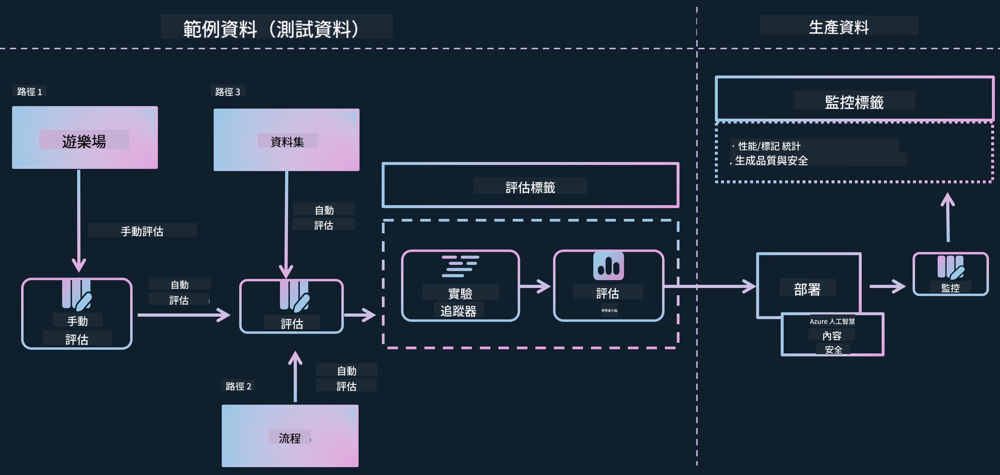

*圖片來源：[Evaluation of generative AI applications](https://learn.microsoft.com/azure/ai-studio/concepts/evaluation-approach-gen-ai?wt.mc_id%3Dstudentamb_279723)*

> [!NOTE]
>
> 想了解更多關於 Phi-3 / Phi-3.5 的詳細資訊及相關資源，請參考 [Phi-3CookBook](https://github.com/microsoft/Phi-3CookBook?wt.mc_id=studentamb_279723)。

### 先決條件

- [Python](https://www.python.org/downloads)
- [Azure 訂閱](https://azure.microsoft.com/free?wt.mc_id=studentamb_279723)
- [Visual Studio Code](https://code.visualstudio.com)
- 微調後的 Phi-3 / Phi-3.5 模型

### 目錄

1. [**情境 1：Azure AI Foundry 的 Prompt flow 評估介紹**](../../../../../../md/02.Application/01.TextAndChat/Phi3)

    - [安全性評估介紹](../../../../../../md/02.Application/01.TextAndChat/Phi3)
    - [效能評估介紹](../../../../../../md/02.Application/01.TextAndChat/Phi3)

1. [**情境 2：在 Azure AI Foundry 評估 Phi-3 / Phi-3.5 模型**](../../../../../../md/02.Application/01.TextAndChat/Phi3)

    - [開始之前](../../../../../../md/02.Application/01.TextAndChat/Phi3)
    - [部署 Azure OpenAI 以評估 Phi-3 / Phi-3.5 模型](../../../../../../md/02.Application/01.TextAndChat/Phi3)
    - [使用 Azure AI Foundry 的 Prompt flow 評估微調後的 Phi-3 / Phi-3.5 模型](../../../../../../md/02.Application/01.TextAndChat/Phi3)

1. [恭喜！](../../../../../../md/02.Application/01.TextAndChat/Phi3)

## **情境 1：Azure AI Foundry 的 Prompt flow 評估介紹**

### 安全性評估介紹

為確保你的 AI 模型符合倫理且安全，評估其是否符合 Microsoft 的 Responsible AI Principles（負責任 AI 原則）非常重要。在 Azure AI Foundry 中，安全性評估讓你能評估模型對越獄攻擊的脆弱性及產生有害內容的可能性，這與上述原則直接相關。


*圖片來源：[Evaluation of generative AI applications](https://learn.microsoft.com/azure/ai-studio/concepts/evaluation-approach-gen-ai?wt.mc_id%3Dstudentamb_279723)*

#### Microsoft 的 Responsible AI Principles

在開始技術步驟前，理解 Microsoft 的 Responsible AI Principles 是必要的。這是一套用來指導 AI 系統負責任開發、部署與運作的倫理框架。這些原則指引 AI 系統的設計、開發及部署，確保 AI 技術公平、透明且包容。這些原則也是評估 AI 模型安全性的基礎。

Microsoft 的 Responsible AI Principles 包括：

- **公平與包容性**：AI 系統應公平對待所有人，避免對相似群體有不同影響。例如，當 AI 系統提供醫療建議、貸款申請或就業相關指引時，應對所有有相似症狀、財務狀況或專業資格的人給出相同建議。

- **可靠性與安全性**：為建立信任，AI 系統必須可靠、安全且一致地運作。這些系統應能如設計般運作，安全應對未預期狀況，並抵抗有害操控。其行為及可處理的條件反映了開發者在設計與測試時預期的各種情境。

- **透明度**：當 AI 系統協助做出對人生活有重大影響的決策時，使用者必須了解決策過程。例如，銀行可能用 AI 判斷信用資格，公司可能用 AI 選擇最合適的候選人。

- **隱私與安全**：隨著 AI 越來越普及，保護隱私與資訊安全變得更重要且複雜。AI 需要存取資料來做出準確且有根據的預測與決策，因此隱私與資料安全需特別注意。

- **問責制**：設計與部署 AI 系統的人必須對系統運作負責。組織應依據產業標準建立問責規範，確保 AI 系統不會成為影響人們生活決策的最終權威，也確保人類能對高度自主的 AI 系統保持實質控制。


*圖片來源：[What is Responsible AI?](https://learn.microsoft.com/azure/machine-learning/concept-responsible-ai?view=azureml-api-2&viewFallbackFrom=azureml-api-2%253fwt.mc_id%3Dstudentamb_279723)*

> [!NOTE]
> 想深入了解 Microsoft 的 Responsible AI Principles，請參考 [What is Responsible AI?](https://learn.microsoft.com/azure/machine-learning/concept-responsible-ai?view=azureml-api-2?wt.mc_id=studentamb_279723)。

#### 安全性指標

本教學中，你將使用 Azure AI Foundry 的安全性指標來評估微調後 Phi-3 模型的安全性。這些指標幫助你評估模型產生有害內容的可能性及其對越獄攻擊的脆弱度。安全性指標包括：

- **自我傷害相關內容**：評估模型是否傾向產生自我傷害相關內容。
- **仇恨與不公平內容**：評估模型是否傾向產生仇恨或不公平內容。
- **暴力內容**：評估模型是否傾向產生暴力內容。
- **性內容**：評估模型是否傾向產生不適當的性內容。

評估這些面向能確保 AI 模型不會產生有害或冒犯性的內容，符合社會價值與法規標準。


### 效能評估介紹

為確保你的 AI 模型達到預期表現，評估其效能指標非常重要。在 Azure AI Foundry 中，效能評估讓你能評估模型產生準確、相關且連貫回應的能力。

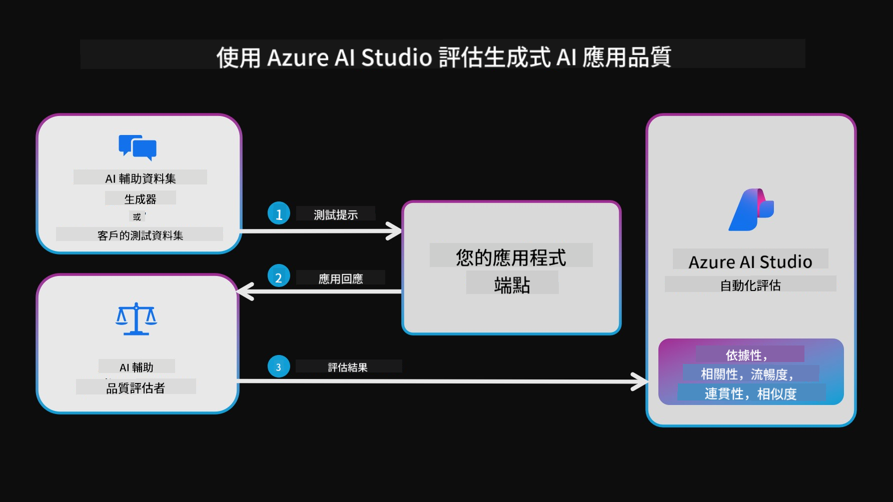

*圖片來源：[Evaluation of generative AI applications](https://learn.microsoft.com/azure/ai-studio/concepts/evaluation-approach-gen-ai?wt.mc_id%3Dstudentamb_279723)*

#### 效能指標

本教學中，你將使用 Azure AI Foundry 的效能指標來評估微調後 Phi-3 / Phi-3.5 模型的效能。這些指標幫助你評估模型產生準確、相關且連貫回應的能力。效能指標包括：

- **依據性（Groundedness）**：評估生成答案與輸入來源資訊的符合程度。
- **相關性（Relevance）**：評估生成回應與提問的相關程度。
- **連貫性（Coherence）**：評估生成文字流暢度、自然度及類似人類語言的程度。
- **流暢度（Fluency）**：評估生成文字的語言能力。
- **GPT 相似度（GPT Similarity）**：比較生成回應與真實答案的相似度。
- **F1 分數（F1 Score）**：計算生成回應與來源資料間共享詞彙的比例。

這些指標幫助你評估模型產生準確、相關且連貫回應的效能。

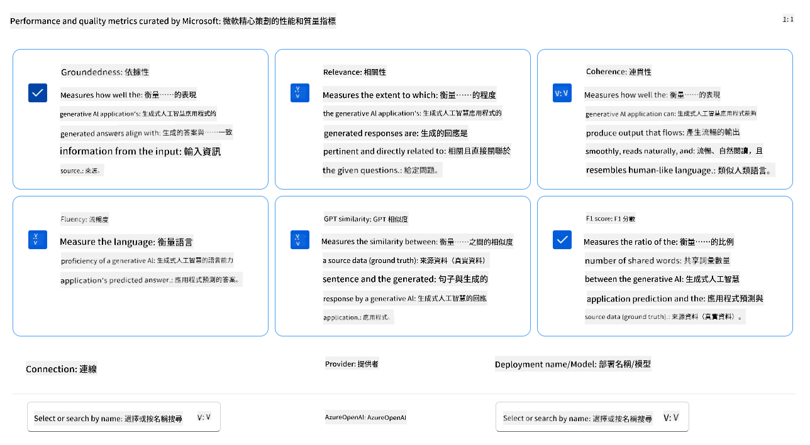

## **情境 2：在 Azure AI Foundry 評估 Phi-3 / Phi-3.5 模型**

### 開始之前

本教學是接續之前的部落格文章「[Fine-Tune and Integrate Custom Phi-3 Models with Prompt Flow: Step-by-Step Guide](https://techcommunity.microsoft.com/t5/educator-developer-blog/fine-tune-and-integrate-custom-phi-3-models-with-prompt-flow/ba-p/4178612?wt.mc_id=studentamb_279723)」與「[Fine-Tune and Integrate Custom Phi-3 Models with Prompt Flow in Azure AI Foundry](https://techcommunity.microsoft.com/t5/educator-developer-blog/fine-tune-and-integrate-custom-phi-3-models-with-prompt-flow-in/ba-p/4191726?wt.mc_id=studentamb_279723)」。這些文章帶你完成在 Azure AI Foundry 中微調 Phi-3 / Phi-3.5 模型並整合到 Prompt flow 的過程。

在本教學中，你將部署 Azure OpenAI 模型作為 Azure AI Foundry 的評估器，並用它來評估你的微調 Phi-3 / Phi-3.5 模型。

開始本教學前，請確認你已具備先前教學中提及的先決條件：

1. 已準備好用於評估微調 Phi-3 / Phi-3.5 模型的資料集。
1. 已微調並部署到 Azure Machine Learning 的 Phi-3 / Phi-3.5 模型。
1. 已在 Azure AI Foundry 中整合微調 Phi-3 / Phi-3.5 模型的 Prompt flow。

> [!NOTE]
> 你將使用先前部落格文章下載的 **ULTRACHAT_200k** 資料集中的 *test_data.jsonl* 檔案，作為評估微調 Phi-3 / Phi-3.5 模型的資料集。

#### 在 Azure AI Foundry 中以程式碼優先方式整合自訂 Phi-3 / Phi-3.5 模型與 Prompt flow

> [!NOTE]
> 如果你是依據「[Fine-Tune and Integrate Custom Phi-3 Models with Prompt Flow in Azure AI Foundry](https://techcommunity.microsoft.com/t5/educator-developer-blog/fine-tune-and-integrate-custom-phi-3-models-with-prompt-flow-in/ba-p/4191726?wt.mc_id=studentamb_279723)」中描述的低程式碼方式操作，可以跳過本練習，直接進入下一步。
> 但如果你是依據「[Fine-Tune and Integrate Custom Phi-3 Models with Prompt Flow: Step-by-Step Guide](https://techcommunity.microsoft.com/t5/educator-developer-blog/fine-tune-and-integrate-custom-phi-3-models-with-prompt-flow/ba-p/4178612?wt.mc_id=studentamb_279723)」中描述的程式碼優先方式微調並部署 Phi-3 / Phi-3.5 模型，連接模型到 Prompt flow 的流程會稍有不同。你將在此練習中學習該流程。

接下來，你需要將微調後的 Phi-3 / Phi-3.5 模型整合到 Azure AI Foundry 的 Prompt flow 中。

#### 建立 Azure AI Foundry Hub

在建立 Project 前，你需要先建立 Hub。Hub 類似資源群組，讓你能在 Azure AI Foundry 中組織並管理多個 Project。

1. 登入 [Azure AI Foundry](https://ai.azure.com/?wt.mc_id=studentamb_279723)。

1. 從左側標籤選擇 **All hubs**。

1. 從導覽選單選擇 **+ New hub**。

    

1. 執行以下操作：

    - 輸入 **Hub name**，必須是唯一值。
    - 選擇你的 Azure **Subscription**。
    - 選擇要使用的 **Resource group**（如有需要可新建）。
    - 選擇想使用的 **Location**。
    - 選擇要使用的 **Connect Azure AI Services**（如有需要可新建）。
    - 選擇 **Connect Azure AI Search**，並選擇 **Skip connecting**。
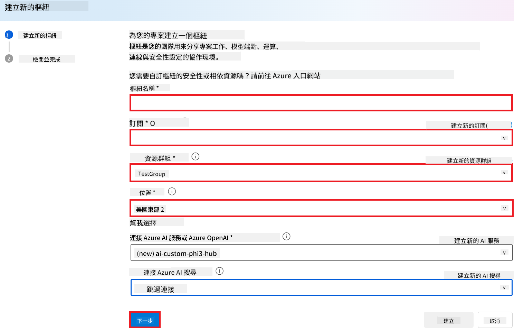

1. 選擇 **Next**。

#### 建立 Azure AI Foundry 專案

1. 在你建立的 Hub 中，從左側分頁選擇 **All projects**。

1. 從導覽選單選擇 **+ New project**。

    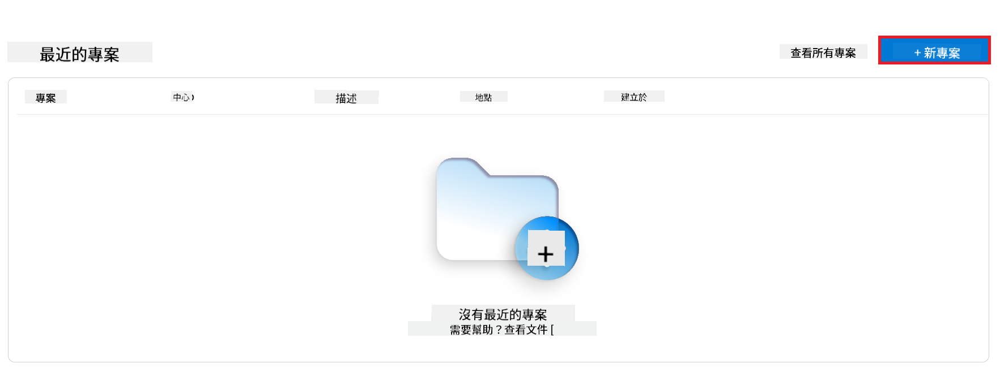

1. 輸入 **Project name**，此名稱必須唯一。

    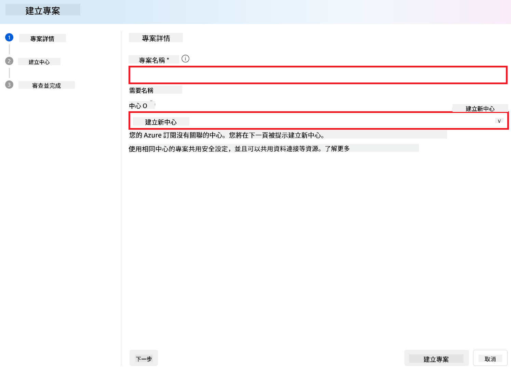

1. 選擇 **Create a project**。

#### 為微調過的 Phi-3 / Phi-3.5 模型新增自訂連線

要將你的自訂 Phi-3 / Phi-3.5 模型整合到 Prompt flow，需要將模型的端點與金鑰儲存在自訂連線中。這樣設定才能在 Prompt flow 中存取你的自訂 Phi-3 / Phi-3.5 模型。

#### 設定微調 Phi-3 / Phi-3.5 模型的 api key 與 endpoint uri

1. 前往 [Azure ML Studio](https://ml.azure.com/home?wt.mc_id=studentamb_279723)。

1. 導覽至你建立的 Azure Machine learning 工作區。

1. 從左側分頁選擇 **Endpoints**。

    

1. 選擇你建立的 endpoint。

    

1. 從導覽選單選擇 **Consume**。

1. 複製你的 **REST endpoint** 和 **Primary key**。

    

#### 新增自訂連線

1. 前往 [Azure AI Foundry](https://ai.azure.com/?wt.mc_id=studentamb_279723)。

1. 導覽至你建立的 Azure AI Foundry 專案。

1. 在你建立的專案中，從左側分頁選擇 **Settings**。

1. 選擇 **+ New connection**。

    

1. 從導覽選單選擇 **Custom keys**。

    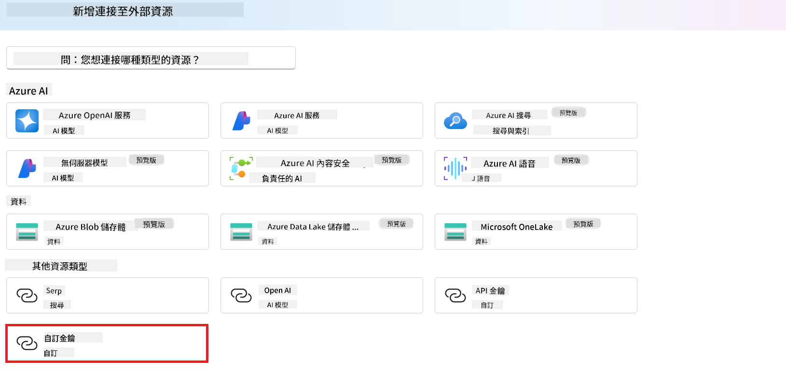

1. 執行以下操作：

    - 選擇 **+ Add key value pairs**。
    - 鍵名稱輸入 **endpoint**，並將從 Azure ML Studio 複製的 endpoint 貼到值欄位。
    - 再次選擇 **+ Add key value pairs**。
    - 鍵名稱輸入 **key**，並將從 Azure ML Studio 複製的 key 貼到值欄位。
    - 新增完金鑰後，選擇 **is secret** 以防止金鑰外洩。

    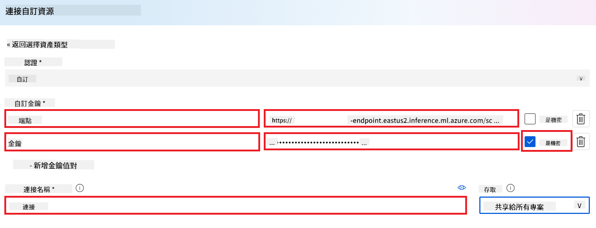

1. 選擇 **Add connection**。

#### 建立 Prompt flow

你已在 Azure AI Foundry 中新增自訂連線。接下來，透過以下步驟建立 Prompt flow，然後將此 Prompt flow 連結到自訂連線，以便在 Prompt flow 中使用微調模型。

1. 導覽至你建立的 Azure AI Foundry 專案。

1. 從左側分頁選擇 **Prompt flow**。

1. 從導覽選單選擇 **+ Create**。

    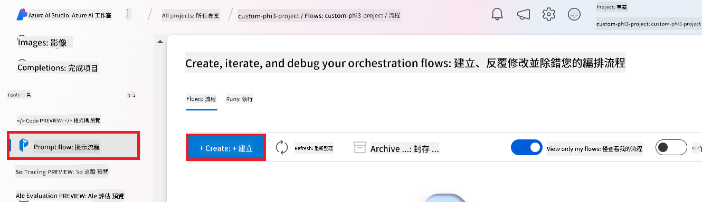

1. 從導覽選單選擇 **Chat flow**。

    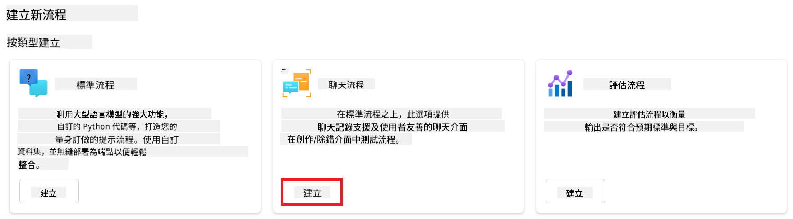

1. 輸入要使用的 **Folder name**。

    

1. 選擇 **Create**。

#### 設定 Prompt flow 與你的自訂 Phi-3 / Phi-3.5 模型聊天

你需要將微調過的 Phi-3 / Phi-3.5 模型整合到 Prompt flow。但現有的 Prompt flow 並非為此設計，因此必須重新設計 Prompt flow 以便整合自訂模型。

1. 在 Prompt flow 中，執行以下步驟重建現有流程：

    - 選擇 **Raw file mode**。
    - 刪除 *flow.dag.yml* 檔案中所有現有程式碼。
    - 將以下程式碼加入 *flow.dag.yml*。

        ```yml
        inputs:
          input_data:
            type: string
            default: "Who founded Microsoft?"

        outputs:
          answer:
            type: string
            reference: ${integrate_with_promptflow.output}

        nodes:
        - name: integrate_with_promptflow
          type: python
          source:
            type: code
            path: integrate_with_promptflow.py
          inputs:
            input_data: ${inputs.input_data}
        ```

    - 選擇 **Save**。

    

1. 將以下程式碼加入 *integrate_with_promptflow.py*，以在 Prompt flow 中使用自訂 Phi-3 / Phi-3.5 模型。

    ```python
    import logging
    import requests
    from promptflow import tool
    from promptflow.connections import CustomConnection

    # Logging setup
    logging.basicConfig(
        format="%(asctime)s - %(levelname)s - %(name)s - %(message)s",
        datefmt="%Y-%m-%d %H:%M:%S",
        level=logging.DEBUG
    )
    logger = logging.getLogger(__name__)

    def query_phi3_model(input_data: str, connection: CustomConnection) -> str:
        """
        Send a request to the Phi-3 / Phi-3.5 model endpoint with the given input data using Custom Connection.
        """

        # "connection" is the name of the Custom Connection, "endpoint", "key" are the keys in the Custom Connection
        endpoint_url = connection.endpoint
        api_key = connection.key

        headers = {
            "Content-Type": "application/json",
            "Authorization": f"Bearer {api_key}"
        }
    data = {
        "input_data": [input_data],
        "params": {
            "temperature": 0.7,
            "max_new_tokens": 128,
            "do_sample": True,
            "return_full_text": True
            }
        }
        try:
            response = requests.post(endpoint_url, json=data, headers=headers)
            response.raise_for_status()
            
            # Log the full JSON response
            logger.debug(f"Full JSON response: {response.json()}")

            result = response.json()["output"]
            logger.info("Successfully received response from Azure ML Endpoint.")
            return result
        except requests.exceptions.RequestException as e:
            logger.error(f"Error querying Azure ML Endpoint: {e}")
            raise

    @tool
    def my_python_tool(input_data: str, connection: CustomConnection) -> str:
        """
        Tool function to process input data and query the Phi-3 / Phi-3.5 model.
        """
        return query_phi3_model(input_data, connection)

    ```

    

> [!NOTE]
> 如需在 Azure AI Foundry 中使用 Prompt flow 的詳細資訊，請參考 [Prompt flow in Azure AI Foundry](https://learn.microsoft.com/azure/ai-studio/how-to/prompt-flow)。

1. 選擇 **Chat input**、**Chat output**，以啟用與模型的聊天功能。

    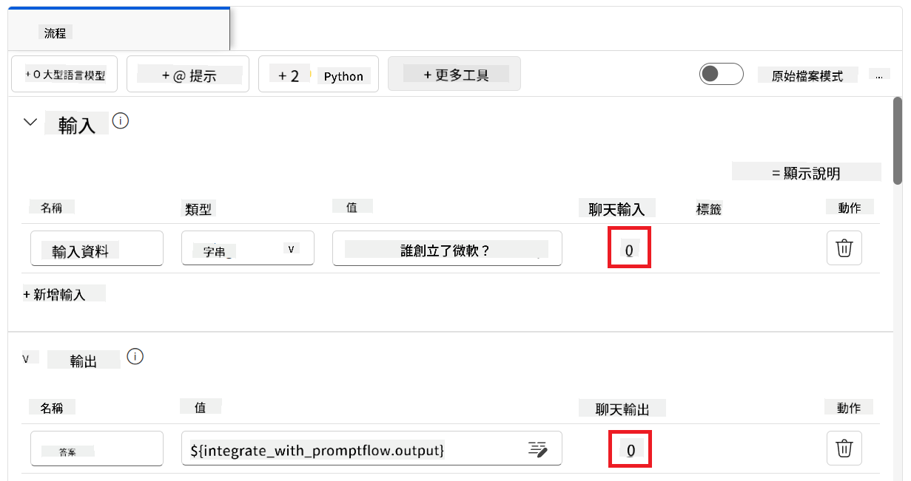

1. 現在你已準備好與自訂 Phi-3 / Phi-3.5 模型聊天。下一個練習中，你將學習如何啟動 Prompt flow 並使用它與微調模型聊天。

> [!NOTE]
>
> 重建後的流程應該長得像下面這張圖：
>
> 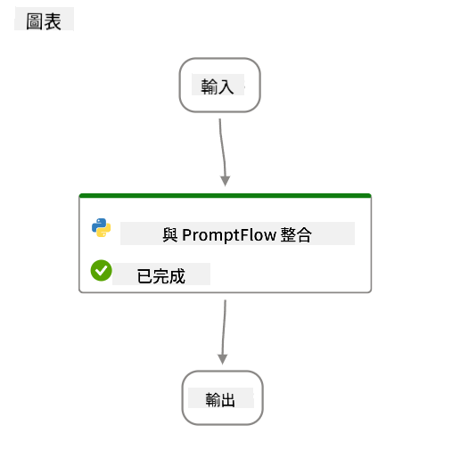
>

#### 啟動 Prompt flow

1. 選擇 **Start compute sessions** 以啟動 Prompt flow。

    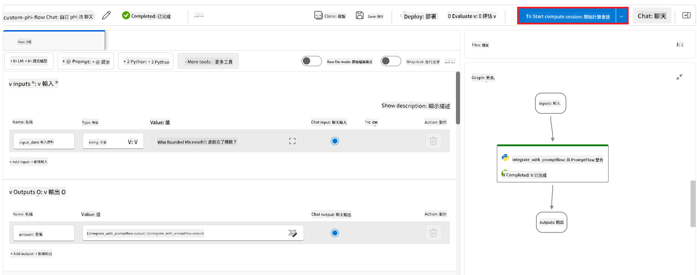

1. 選擇 **Validate and parse input** 以更新參數。

    

1. 選擇 **connection** 的 **Value**，連接到你建立的自訂連線，例如 *connection*。

    

#### 與你的自訂 Phi-3 / Phi-3.5 模型聊天

1. 選擇 **Chat**。

    

1. 以下是結果範例：現在你可以與自訂的 Phi-3 / Phi-3.5 模型聊天。建議根據用於微調的資料來提問。

    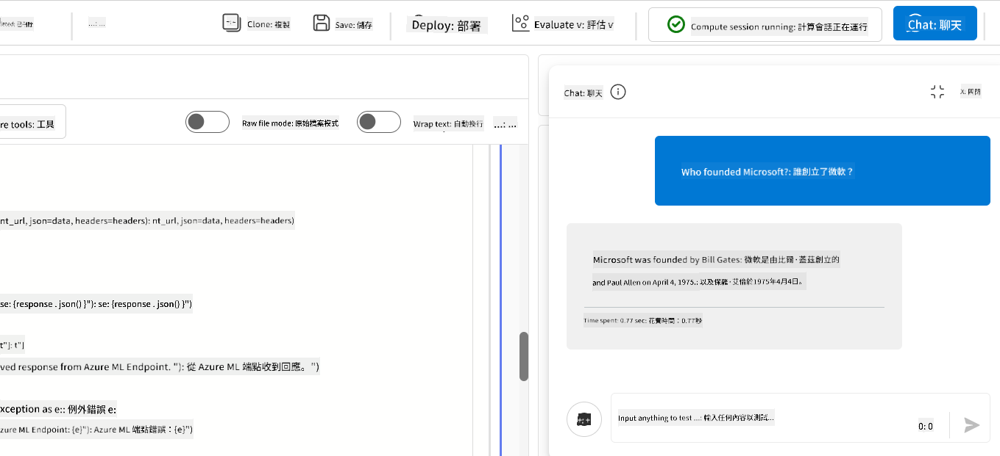

### 部署 Azure OpenAI 以評估 Phi-3 / Phi-3.5 模型

要在 Azure AI Foundry 評估 Phi-3 / Phi-3.5 模型，需要部署 Azure OpenAI 模型。此模型將用來評估 Phi-3 / Phi-3.5 模型的效能。

#### 部署 Azure OpenAI

1. 登入 [Azure AI Foundry](https://ai.azure.com/?wt.mc_id=studentamb_279723)。

1. 導覽至你建立的 Azure AI Foundry 專案。

    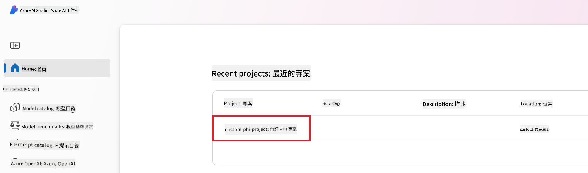

1. 在你建立的專案中，從左側分頁選擇 **Deployments**。

1. 從導覽選單選擇 **+ Deploy model**。

1. 選擇 **Deploy base model**。

    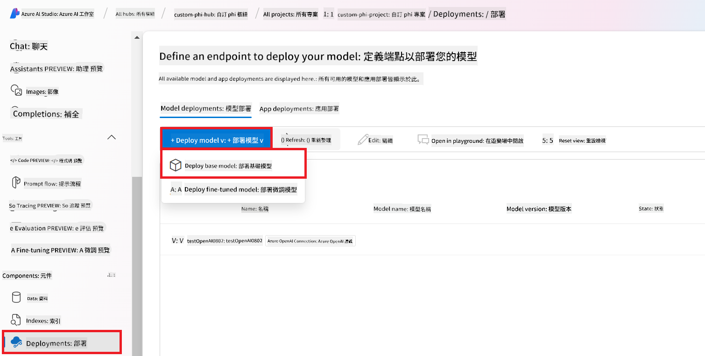

1. 選擇你想使用的 Azure OpenAI 模型，例如 **gpt-4o**。

    

1. 選擇 **Confirm**。

### 使用 Azure AI Foundry 的 Prompt flow 評估微調的 Phi-3 / Phi-3.5 模型

### 開始新的評估

1. 前往 [Azure AI Foundry](https://ai.azure.com/?wt.mc_id=studentamb_279723)。

1. 導覽至你建立的 Azure AI Foundry 專案。

    

1. 在你建立的專案中，從左側分頁選擇 **Evaluation**。

1. 從導覽選單選擇 **+ New evaluation**。
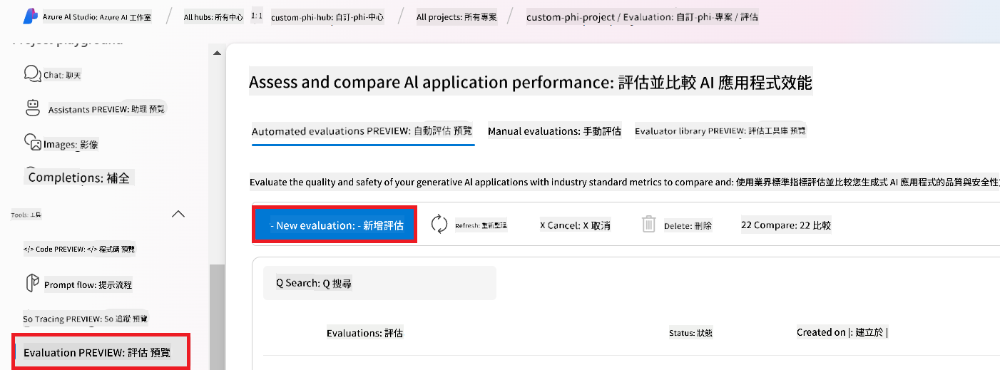

1. 選擇 **Prompt flow** 評估。

    

1. 執行以下步驟：

    - 輸入評估名稱，必須是唯一值。
    - 選擇 **Question and answer without context** 作為任務類型，因為本教學中使用的 **UlTRACHAT_200k** 資料集不包含上下文。
    - 選擇你想要評估的 prompt flow。

    

1. 選擇 **Next**。

1. 執行以下步驟：

    - 選擇 **Add your dataset** 來上傳資料集。例如，你可以上傳測試資料集檔案，如下載 **ULTRACHAT_200k** 資料集時附帶的 *test_data.json1*。
    - 選擇與你的資料集相符的 **Dataset column**。例如，使用 **ULTRACHAT_200k** 資料集時，選擇 **${data.prompt}** 作為資料欄位。

    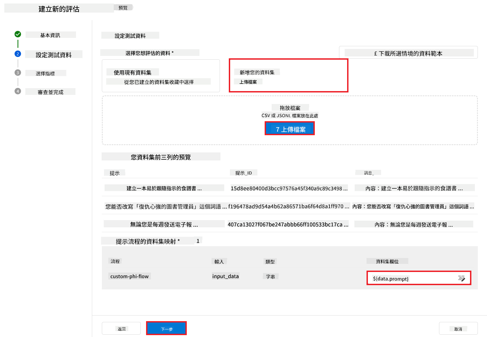

1. 選擇 **Next**。

1. 執行以下步驟來設定效能與品質指標：

    - 選擇你想使用的效能與品質指標。
    - 選擇你為評估建立的 Azure OpenAI 模型。例如，選擇 **gpt-4o**。

    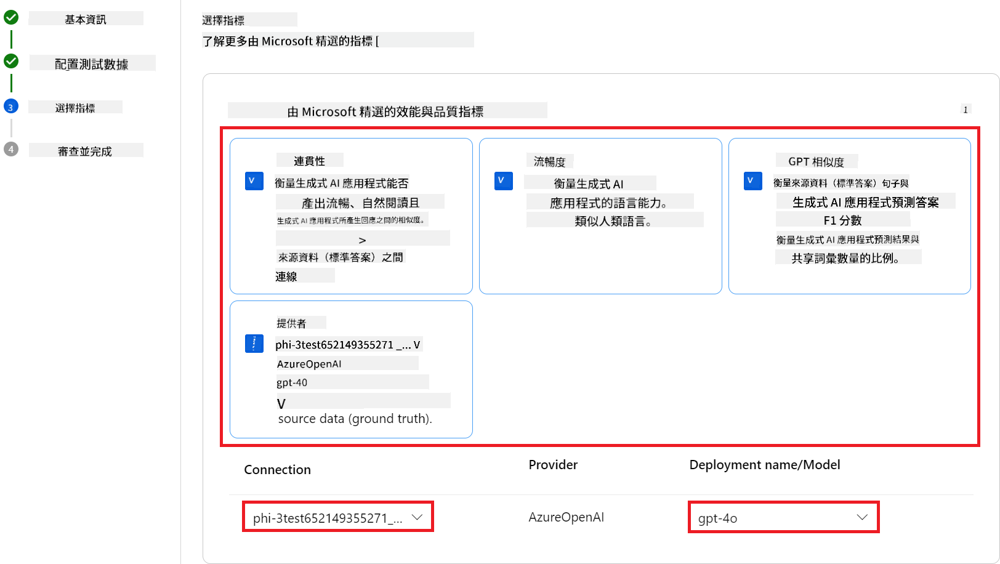

1. 執行以下步驟來設定風險與安全指標：

    - 選擇你想使用的風險與安全指標。
    - 選擇用來計算缺陷率的門檻值。例如，選擇 **Medium**。
    - 對於 **question**，將 **Data source** 設為 **{$data.prompt}**。
    - 對於 **answer**，將 **Data source** 設為 **{$run.outputs.answer}**。
    - 對於 **ground_truth**，將 **Data source** 設為 **{$data.message}**。

    

1. 選擇 **Next**。

1. 選擇 **Submit** 開始評估。

1. 評估過程需要一些時間完成，你可以在 **Evaluation** 頁籤中監控進度。

### 檢視評估結果

> [!NOTE]
> 以下呈現的結果僅用來說明評估流程。本教學中使用的模型是基於相對較小的資料集微調，可能導致結果不夠理想。實際結果會因資料集的大小、品質、多樣性，以及模型的具體設定而有顯著差異。

評估完成後，你可以查看效能和安全指標的結果。

1. 效能與品質指標：

    - 評估模型生成連貫、流暢且相關回應的能力。

    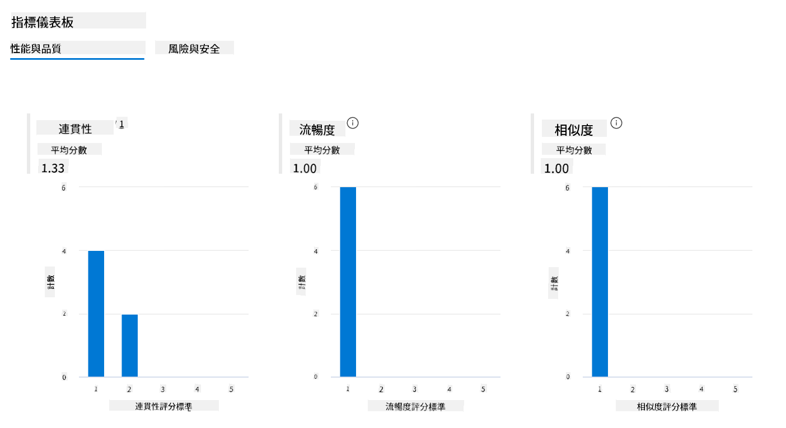

1. 風險與安全指標：

    - 確保模型輸出安全，符合負責任 AI 原則，避免任何有害或冒犯性內容。

    

1. 你可以向下捲動查看 **Detailed metrics result**。

    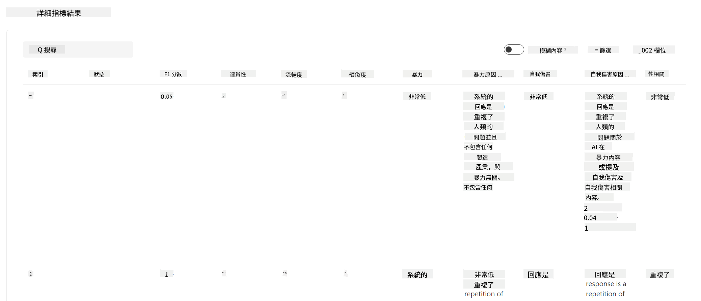

1. 透過對自訂 Phi-3 / Phi-3.5 模型進行效能與安全指標評估，你可以確認模型不僅有效，還遵守負責任 AI 實務，準備好投入實際應用。

## 恭喜！

### 你已完成本教學

你已成功評估整合於 Azure AI Foundry 中的微調 Phi-3 模型。這是確保 AI 模型不僅具備良好效能，還符合 Microsoft 負責任 AI 原則，幫助你打造值得信賴且可靠的 AI 應用的重要步驟。


## 清理 Azure 資源

請清理你的 Azure 資源以避免產生額外費用。前往 Azure 入口網站並刪除以下資源：

- Azure Machine learning 資源。
- Azure Machine learning 模型端點。
- Azure AI Foundry 專案資源。
- Azure AI Foundry Prompt flow 資源。

### 下一步

#### 文件

- [Assess AI systems by using the Responsible AI dashboard](https://learn.microsoft.com/azure/machine-learning/concept-responsible-ai-dashboard?view=azureml-api-2&source=recommendations?wt.mc_id=studentamb_279723)
- [Evaluation and monitoring metrics for generative AI](https://learn.microsoft.com/azure/ai-studio/concepts/evaluation-metrics-built-in?tabs=definition?wt.mc_id=studentamb_279723)
- [Azure AI Foundry documentation](https://learn.microsoft.com/azure/ai-studio/?wt.mc_id=studentamb_279723)
- [Prompt flow documentation](https://microsoft.github.io/promptflow/?wt.mc_id=studentamb_279723)

#### 訓練內容

- [Introduction to Microsoft's Responsible AI Approach](https://learn.microsoft.com/training/modules/introduction-to-microsofts-responsible-ai-approach/?source=recommendations?wt.mc_id=studentamb_279723)
- [Introduction to Azure AI Foundry](https://learn.microsoft.com/training/modules/introduction-to-azure-ai-studio/?wt.mc_id=studentamb_279723)

### 參考資料

- [What is Responsible AI?](https://learn.microsoft.com/azure/machine-learning/concept-responsible-ai?view=azureml-api-2?wt.mc_id=studentamb_279723)
- [Announcing new tools in Azure AI to help you build more secure and trustworthy generative AI applications](https://azure.microsoft.com/blog/announcing-new-tools-in-azure-ai-to-help-you-build-more-secure-and-trustworthy-generative-ai-applications/?wt.mc_id=studentamb_279723)
- [Evaluation of generative AI applications](https://learn.microsoft.com/azure/ai-studio/concepts/evaluation-approach-gen-ai?wt.mc_id%3Dstudentamb_279723)

**免責聲明**：  
本文件係使用 AI 翻譯服務 [Co-op Translator](https://github.com/Azure/co-op-translator) 進行翻譯。雖然我們致力於確保翻譯的準確性，但請注意，自動翻譯可能包含錯誤或不準確之處。原始文件的母語版本應視為權威來源。對於重要資訊，建議採用專業人工翻譯。我們不對因使用本翻譯所產生的任何誤解或誤釋負責。