<!--
CO_OP_TRANSLATOR_METADATA:
{
  "original_hash": "0df910a227098303cc392b6ad204c271",
  "translation_date": "2026-01-06T04:19:29+00:00",
  "source_file": "md/02.Application/01.TextAndChat/Phi3/E2E_Phi-3-FineTuning_PromptFlow_Integration_AIFoundry.md",
  "language_code": "tw"
}
-->
# 在 Azure AI Foundry 使用 Prompt flow 微調並整合自訂 Phi-3 模型

此端對端 (E2E) 範例基於 Microsoft Tech Community 的指南「[在 Azure AI Foundry 使用 Prompt Flow 微調並整合自訂 Phi-3 模型](https://techcommunity.microsoft.com/t5/educator-developer-blog/fine-tune-and-integrate-custom-phi-3-models-with-prompt-flow-in/ba-p/4191726?WT.mc_id=aiml-137032-kinfeylo)」。它介紹了在 Azure AI Foundry 中微調、部署和整合自訂 Phi-3 模型與 Prompt flow 的流程。
與須在本機執行代碼的端對端範例「[在 Azure AI Foundry 使用 Prompt Flow 微調並整合自訂 Phi-3 模型](./E2E_Phi-3-FineTuning_PromptFlow_Integration.md)」不同，本教學將完全專注於在 Azure AI / ML Studio 內微調與整合您的模型。

## 概覽

在此端對端範例中，您將學習如何微調 Phi-3 模型並整合至 Azure AI Foundry 的 Prompt flow。透過利用 Azure AI / ML Studio，您將建立部署和使用自訂 AI 模型的工作流程。此端對端範例涵蓋三個情境：

**情境 1：設定 Azure 資源並準備進行微調**

**情境 2：微調 Phi-3 模型並於 Azure Machine Learning Studio 部署**

**情境 3：整合 Prompt flow 並在 Azure AI Foundry 與您的自訂模型聊天**

以下是此端對端範例的概覽。

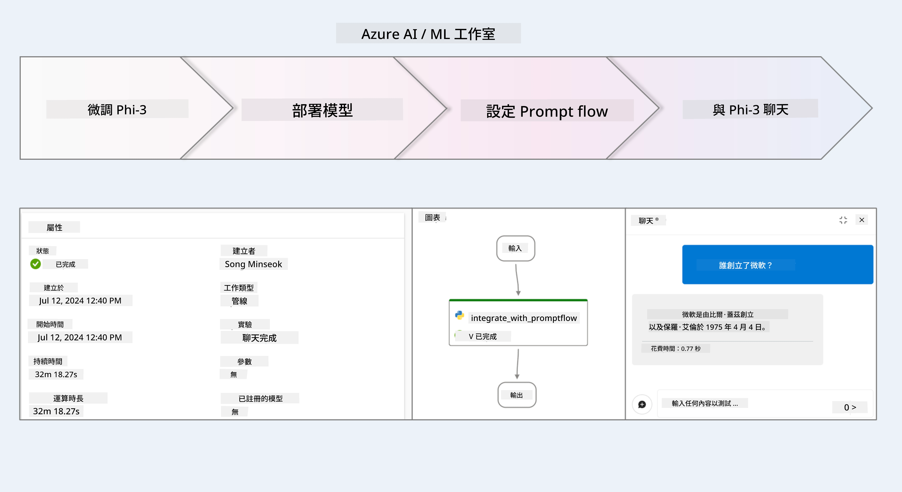

### 目錄

1. **[情境 1：設定 Azure 資源並準備進行微調](../../../../../../md/02.Application/01.TextAndChat/Phi3)**
    - [建立 Azure Machine Learning 工作區](../../../../../../md/02.Application/01.TextAndChat/Phi3)
    - [申請 Azure 訂閱中的 GPU 配額](../../../../../../md/02.Application/01.TextAndChat/Phi3)
    - [新增角色指派](../../../../../../md/02.Application/01.TextAndChat/Phi3)
    - [設定專案](../../../../../../md/02.Application/01.TextAndChat/Phi3)
    - [準備微調用資料集](../../../../../../md/02.Application/01.TextAndChat/Phi3)

1. **[情境 2：微調 Phi-3 模型並於 Azure Machine Learning Studio 部署](../../../../../../md/02.Application/01.TextAndChat/Phi3)**
    - [微調 Phi-3 模型](../../../../../../md/02.Application/01.TextAndChat/Phi3)
    - [部署微調後的 Phi-3 模型](../../../../../../md/02.Application/01.TextAndChat/Phi3)

1. **[情境 3：整合 Prompt flow 並在 Azure AI Foundry 與您的自訂模型聊天](../../../../../../md/02.Application/01.TextAndChat/Phi3)**
    - [將自訂 Phi-3 模型整合至 Prompt flow](../../../../../../md/02.Application/01.TextAndChat/Phi3)
    - [與您的自訂 Phi-3 模型聊天](../../../../../../md/02.Application/01.TextAndChat/Phi3)

## 情境 1：設定 Azure 資源並準備進行微調

### 建立 Azure Machine Learning 工作區

1. 在入口網站頁面上方的 **搜尋列** 輸入 *azure machine learning*，並從出現的選項中選擇 **Azure Machine Learning**。

    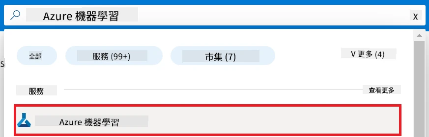

2. 從導覽選單中選擇 **+ 建立**。

3. 從導覽選單選擇 **新工作區**。

    

4. 執行以下操作：

    - 選擇您的 Azure **訂閱**。
    - 選擇要使用的 **資源群組**（若需，請新建）。
    - 輸入 **工作區名稱**。該值必須唯一。
    - 選擇您想使用的 **區域**。
    - 選擇要使用的 **儲存帳戶**（若需，請新建）。
    - 選擇要使用的 **金鑰保管庫**（若需，請新建）。
    - 選擇要使用的 **應用程式見解**（若需，請新建）。
    - 選擇要使用的 **容器登錄**（若需，請新建）。

    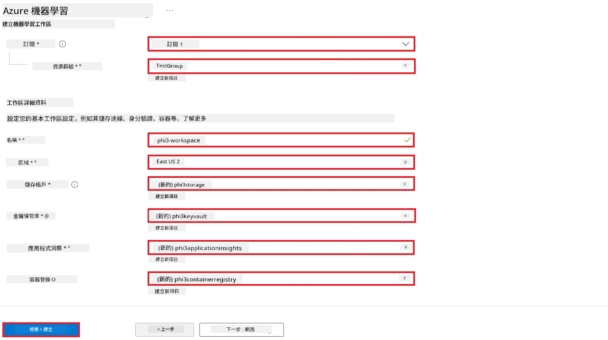

5. 選擇 **檢閱 + 建立**。

6. 選擇 **建立**。

### 申請 Azure 訂閱中的 GPU 配額

本教學中，您將學習如何微調並部署 Phi-3 模型，使用 GPU。微調時將使用 *Standard_NC24ads_A100_v4* GPU，需要提交配額申請。部署時將使用 *Standard_NC6s_v3* GPU，亦需提交配額申請。

> [!NOTE]
>
> 僅 Pay-As-You-Go 訂閱（標準訂閱類型）符合 GPU 配額申請資格，優惠訂閱目前不支援。
>

1. 造訪 [Azure ML Studio](https://ml.azure.com/home?wt.mc_id=studentamb_279723)。

1. 執行以下操作，申請 *Standard NCADSA100v4 Family* 配額：

    - 從左側標籤選擇 **配額**。
    - 選擇要使用的 **虛擬機器家族**，例如選擇包含 *Standard_NC24ads_A100_v4* GPU 的 **Standard NCADSA100v4 Family Cluster Dedicated vCPUs**。
    - 從導覽選單選擇 **申請配額**。

        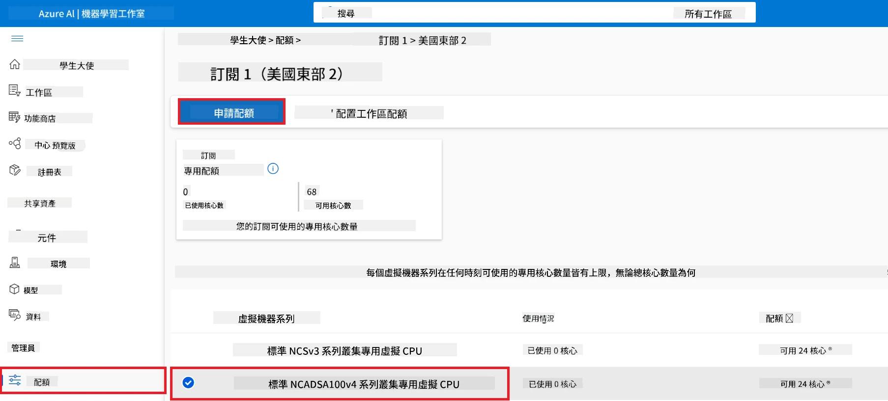

    - 在申請配額頁面輸入您想使用的 **新核心限制**，例如 24。
    - 在申請配額頁面選擇 **提交** 以申請 GPU 配額。

1. 執行以下操作，申請 *Standard NCSv3 Family* 配額：

    - 從左側標籤選擇 **配額**。
    - 選擇要使用的 **虛擬機器家族**，例如選擇包含 *Standard_NC6s_v3* GPU 的 **Standard NCSv3 Family Cluster Dedicated vCPUs**。
    - 從導覽選單選擇 **申請配額**。
    - 在申請配額頁面輸入您想使用的 **新核心限制**，例如 24。
    - 在申請配額頁面選擇 **提交** 以申請 GPU 配額。

### 新增角色指派

要微調與部署您的模型，您必須先建立 User Assigned Managed Identity (UAI)，並為其指派適當的權限。此 UAI 將用於部署期間的身份驗證。

#### 建立 User Assigned Managed Identity (UAI)

1. 在入口網站頁面上方的 **搜尋列** 輸入 *managed identities*，並從出現的選項中選擇 **Managed Identities**。

    

1. 選擇 **+ 建立**。

    

1. 執行以下操作：

    - 選擇您的 Azure **訂閱**。
    - 選擇要使用的 **資源群組**（若需，請新建）。
    - 選擇您想使用的 **區域**。
    - 輸入 **名稱**。該值必須唯一。

    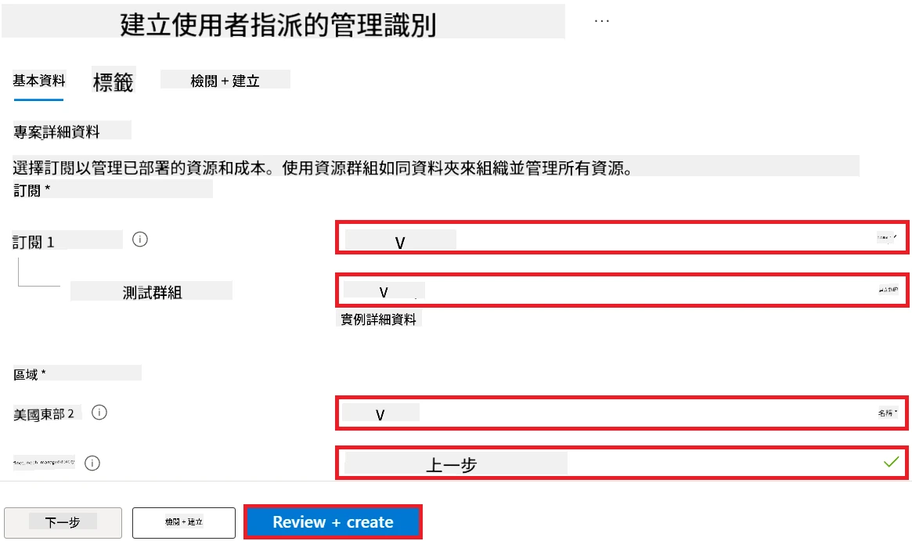

1. 選擇 **檢閱 + 建立**。

1. 選擇 **+ 建立**。

#### 為 Managed Identity 新增 Contributor 角色指派

1. 導覽至您建立的 Managed Identity 資源。

1. 從左側標籤選擇 **Azure 角色指派**。

1. 從導覽選單選擇 **+ 新增角色指派**。

1. 在新增角色指派頁面，執行以下操作：
    - 將 **範圍** 設為 **資源群組**。
    - 選擇您的 Azure **訂閱**。
    - 選擇要使用的 **資源群組**。
    - 將 **角色** 設為 **Contributor**。

    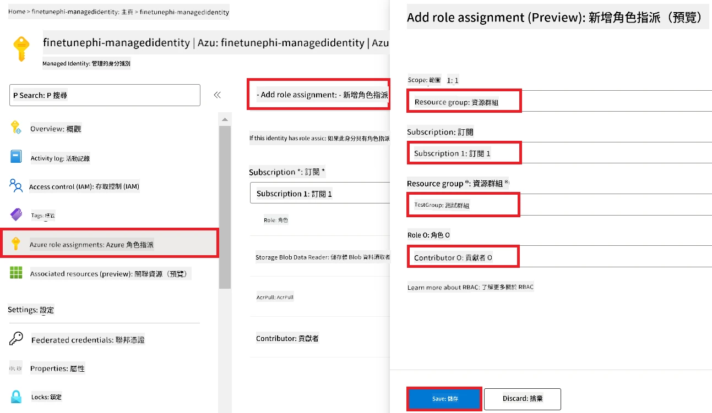

2. 選擇 **儲存**。

#### 為 Managed Identity 新增 Storage Blob Data Reader 角色指派

1. 在入口網站頁面上方的 **搜尋列** 輸入 *storage accounts*，並從出現的選項中選擇 **Storage accounts**。

    

1. 選擇與您建立的 Azure Machine Learning 工作區關聯的儲存帳戶。例如：*finetunephistorage*。

1. 執行以下步驟導航至新增角色指派頁面：

    - 導覽至您建立的 Azure 儲存帳戶。
    - 從左側標籤選擇 **存取控制 (IAM)**。
    - 從導覽選單選擇 **+ 新增**。
    - 選擇 **新增角色指派**。

    

1. 在新增角色指派頁面，執行以下操作：

    - 在角色頁的 **搜尋列** 輸入 *Storage Blob Data Reader*，並從選項中選擇 **Storage Blob Data Reader**。
    - 選擇 **下一步**。
    - 在成員頁面，將 **指派訪問權限給** 設為 **Managed identity**。
    - 選擇 **+ 選擇成員**。
    - 在選擇 Managed Identities 頁面，選擇您的 Azure **訂閱**。
    - 選擇要指派的 **Managed identity**。
    - 選擇您建立的 Managed Identity，例如 *finetunephi-managedidentity*。
    - 選擇 **選擇**。

    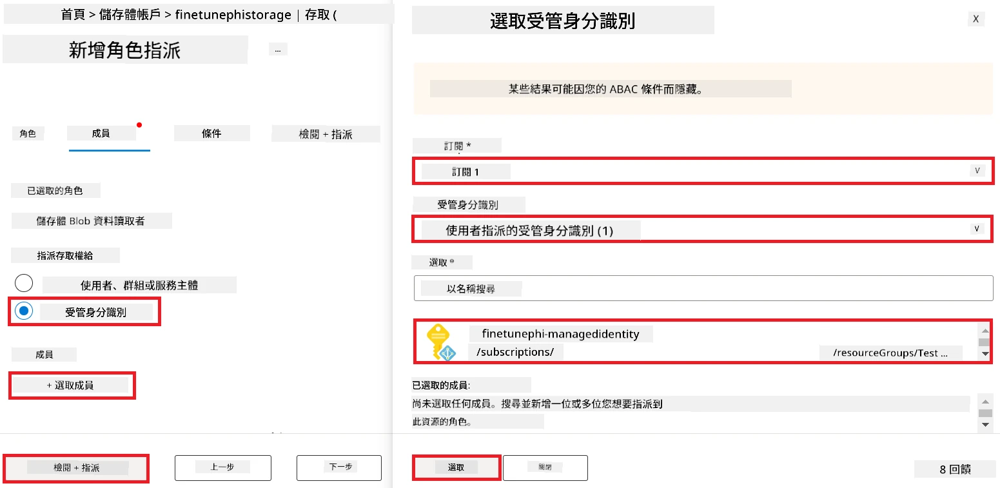

1. 選擇 **檢閱 + 指派**。

#### 為 Managed Identity 新增 AcrPull 角色指派

1. 在入口網站頁面上方的 **搜尋列** 輸入 *container registries*，並從出現的選項中選擇 **Container registries**。

    

1. 選擇與 Azure Machine Learning 工作區關聯的容器登錄，例如 *finetunephicontainerregistry*。

1. 執行以下步驟導航至新增角色指派頁面：

    - 從左側標籤選擇 **存取控制 (IAM)**。
    - 從導覽選單選擇 **+ 新增**。
    - 選擇 **新增角色指派**。

1. 在新增角色指派頁面，執行以下操作：

    - 在角色頁的 **搜尋列** 輸入 *AcrPull*，並從選項中選擇 **AcrPull**。
    - 選擇 **下一步**。
    - 在成員頁面，將 **指派訪問權限給** 設為 **Managed identity**。
    - 選擇 **+ 選擇成員**。
    - 在選擇 Managed Identities 頁面，選擇您的 Azure **訂閱**。
    - 選擇要指派的 **Managed identity**。
    - 選擇您建立的 Managed Identity，例如 *finetunephi-managedidentity*。
    - 選擇 **選擇**。
    - 選擇 **檢閱 + 指派**。

### 設定專案

要下載微調所需的資料集，您將設定本機環境。

本練習中，您將

- 建立一個資料夾以便在其中操作。
- 建立虛擬環境。
- 安裝所需套件。
- 建立 *download_dataset.py* 檔案以下載資料集。

#### 建立一個資料夾以便在其中操作

1. 開啟終端機視窗並輸入下列指令，在預設路徑下建立一個名為 *finetune-phi* 的資料夾。

    ```console
    mkdir finetune-phi
    ```

2. 在終端機中輸入以下指令以切換到您建立的 *finetune-phi* 資料夾。

    ```console
    cd finetune-phi
    ```

#### 建立虛擬環境

1. 在終端機中輸入以下指令以建立名為 *.venv* 的虛擬環境。

    ```console
    python -m venv .venv
    ```

2. 在終端機中輸入以下指令以啟動虛擬環境。

    ```console
    .venv\Scripts\activate.bat
    ```

> [!NOTE]
> 如果成功，您應該會在指令提示符前看到 *(.venv)*。

#### 安裝所需套件

1. 在終端機中輸入以下指令以安裝所需套件。

    ```console
    pip install datasets==2.19.1
    ```

#### 建立 `donload_dataset.py`

> [!NOTE]
> 完整資料夾結構：
>
> ```text
> └── YourUserName
> .    └── finetune-phi
> .        └── download_dataset.py
> ```

1. 開啟 **Visual Studio Code**。

1. 從選單列選擇 **File**。

1. 選擇 **Open Folder**。

1. 選擇您建立的 *finetune-phi* 資料夾，位於 *C:\Users\yourUserName\finetune-phi*。

    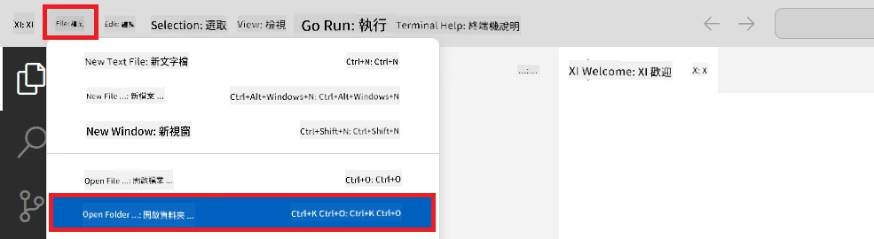

1. 在 Visual Studio Code 左側窗格中，右鍵點擊並選擇 **New File**，建立名為 *download_dataset.py* 的新檔案。

    

### 準備 fine-tuning 的資料集

本練習中，您將執行 *download_dataset.py* 檔案，將 *ultrachat_200k* 資料集下載到本地環境。接著您將使用此資料集在 Azure 機器學習中微調 Phi-3 模型。

在本練習中，您將：

- 在 *download_dataset.py* 檔案中新增下載資料集的程式碼。
- 執行 *download_dataset.py*，將資料集下載到本地環境。

#### 使用 *download_dataset.py* 下載資料集

1. 在 Visual Studio Code 中開啟 *download_dataset.py* 檔案。

1. 新增以下程式碼到 *download_dataset.py* 檔案中。

    ```python
    import json
    import os
    from datasets import load_dataset

    def load_and_split_dataset(dataset_name, config_name, split_ratio):
        """
        Load and split a dataset.
        """
        # 載入具有指定名稱、配置和拆分比例的資料集
        dataset = load_dataset(dataset_name, config_name, split=split_ratio)
        print(f"Original dataset size: {len(dataset)}")
        
        # 將資料集拆分為訓練集和測試集（80%訓練，20%測試）
        split_dataset = dataset.train_test_split(test_size=0.2)
        print(f"Train dataset size: {len(split_dataset['train'])}")
        print(f"Test dataset size: {len(split_dataset['test'])}")
        
        return split_dataset

    def save_dataset_to_jsonl(dataset, filepath):
        """
        Save a dataset to a JSONL file.
        """
        # 如果目錄不存在則建立該目錄
        os.makedirs(os.path.dirname(filepath), exist_ok=True)
        
        # 以寫入模式打開檔案
        with open(filepath, 'w', encoding='utf-8') as f:
            # 遍歷資料集中的每一筆記錄
            for record in dataset:
                # 將記錄以 JSON 物件格式轉儲並寫入檔案
                json.dump(record, f)
                # 寫入換行字元以分隔記錄
                f.write('\n')
        
        print(f"Dataset saved to {filepath}")

    def main():
        """
        Main function to load, split, and save the dataset.
        """
        # 載入並拆分 ULTRACHAT_200k 資料集，使用特定配置和拆分比例
        dataset = load_and_split_dataset("HuggingFaceH4/ultrachat_200k", 'default', 'train_sft[:1%]')
        
        # 從拆分中擷取訓練和測試資料集
        train_dataset = dataset['train']
        test_dataset = dataset['test']

        # 將訓練資料集存成 JSONL 檔案
        save_dataset_to_jsonl(train_dataset, "data/train_data.jsonl")
        
        # 將測試資料集存成獨立的 JSONL 檔案
        save_dataset_to_jsonl(test_dataset, "data/test_data.jsonl")

    if __name__ == "__main__":
        main()

    ```

1. 在終端機中輸入以下指令，執行腳本並將資料集下載到本地環境。

    ```console
    python download_dataset.py
    ```

1. 確認資料集已成功儲存至本地 *finetune-phi/data* 目錄。

> [!NOTE]
>
> #### 資料集大小與微調時間的說明
>
> 本教學中，您只使用資料集的 1% (`split='train[:1%]'`)。如此大幅減少資料量，可以加快上傳與微調過程。您可以調整百分比以達成訓練時間與模型表現的平衡。使用資料集的小子集將縮短微調所需時間，使教學過程更為順利。

## 情境 2：微調 Phi-3 模型並於 Azure Machine Learning Studio 部署

### 微調 Phi-3 模型

在本練習中，您將在 Azure Machine Learning Studio 中微調 Phi-3 模型。

在本練習中，您將：

- 建立微調用的運算叢集。
- 在 Azure Machine Learning Studio 中微調 Phi-3 模型。

#### 建立微調用運算叢集

1. 造訪 [Azure ML Studio](https://ml.azure.com/home?wt.mc_id=studentamb_279723)。

1. 從左側標籤選擇 **Compute**。

1. 從導覽選單選擇 **Compute clusters**。

1. 點選 **+ New**。

    

1. 執行以下設定：

    - 選擇您想使用的 **Region**。
    - 將 **Virtual machine tier** 設為 **Dedicated**。
    - 將 **Virtual machine type** 選為 **GPU**。
    - 在 **Virtual machine size** 過濾器中選擇 **Select from all options**。
    - 選擇 **Virtual machine size** 為 **Standard_NC24ads_A100_v4**。

    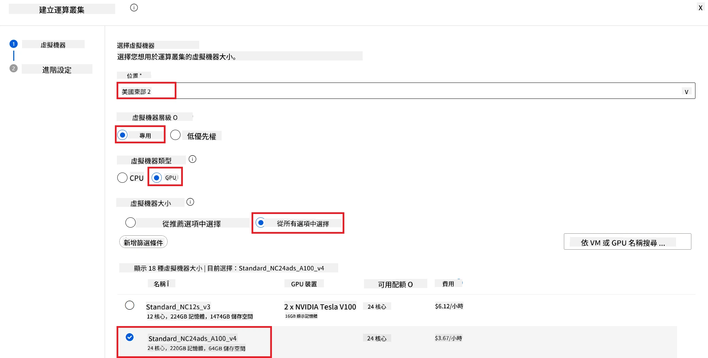

1. 點選 **Next**。

1. 執行以下設定：

    - 輸入 **Compute name**，必須是唯一值。
    - 將 **Minimum number of nodes** 設為 **0**。
    - 將 **Maximum number of nodes** 設為 **1**。
    - 將 **Idle seconds before scale down** 設為 **120**。

    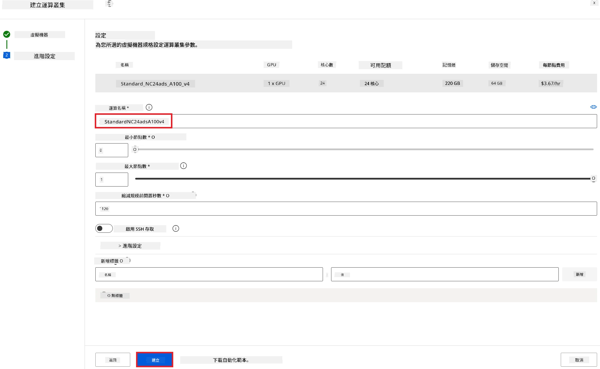

1. 點選 **Create**。

#### 微調 Phi-3 模型

1. 造訪 [Azure ML Studio](https://ml.azure.com/home?wt.mc_id=studentamb_279723)。

1. 選取您建立的 Azure Machine Learning 工作區。

    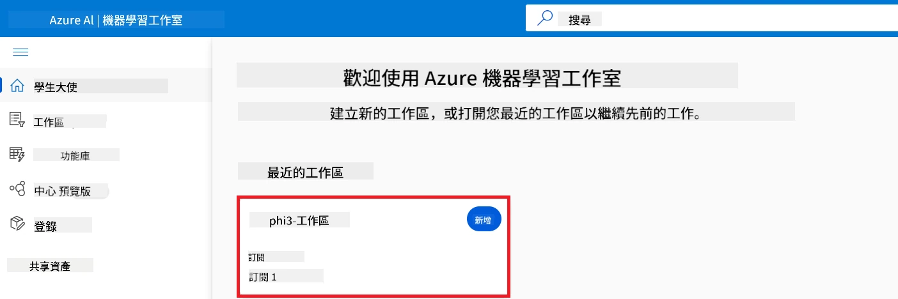

1. 執行以下操作：

    - 從左側標籤選擇 **Model catalog**。
    - 在 **搜尋列** 輸入 *phi-3-mini-4k*，並從出現的選項中選擇 **Phi-3-mini-4k-instruct**。

    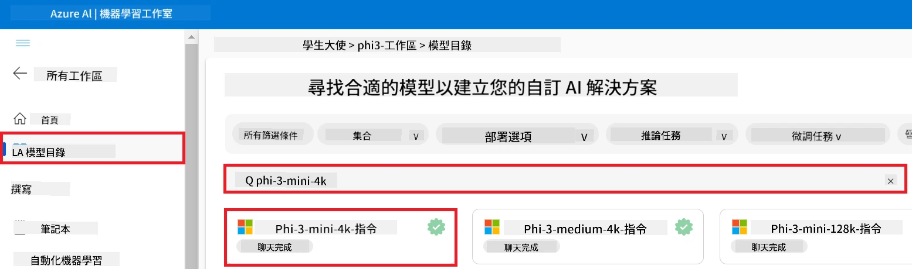

1. 從導覽選單中選擇 **Fine-tune**。

    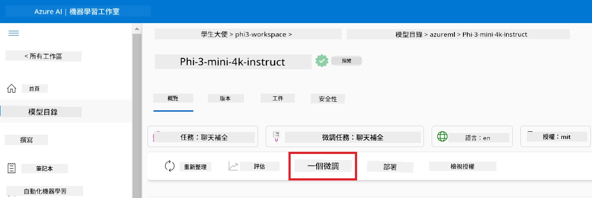

1. 執行以下設定：

    - 將 **Select task type** 設為 **Chat completion**。
    - 點選 **+ Select data** 上傳 **Training data**。
    - 將驗證資料上傳類型選為 **Provide different validation data**。
    - 點選 **+ Select data** 上傳 **Validation data**。

    

> [!TIP]
>
> 您可以點選 **Advanced settings** 自訂配置，如 **learning_rate** 和 **lr_scheduler_type**，以依據需求優化微調過程。

1. 點選 **Finish**。

1. 本練習成功使用 Azure Machine Learning 微調 Phi-3 模型。請注意，微調過程可能需要較長時間。執行微調工作後，需等待其完成。您可以在 Azure Machine Learning 工作區左側 Jobs 頁籤監控微調工作狀態。下一部分將示範如何部署微調模型並與 Prompt flow 整合。

    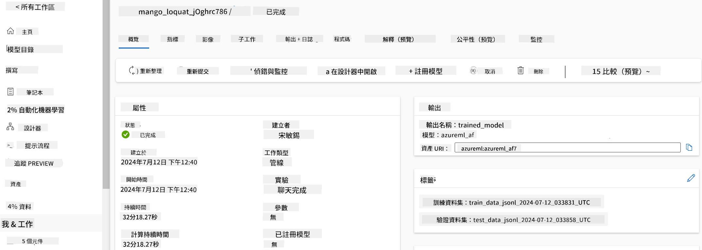

### 部署微調後的 Phi-3 模型

為了將微調模型整合入 Prompt flow，您需要部署模型，使其可用於即時推論。此過程包含模型註冊、建立線上端點以及部署模型。

在本練習中，您將：

- 在 Azure Machine Learning 工作區註冊微調模型。
- 建立線上端點。
- 部署已註冊的微調 Phi-3 模型。

#### 註冊微調模型

1. 造訪 [Azure ML Studio](https://ml.azure.com/home?wt.mc_id=studentamb_279723)。

1. 選取您建立的 Azure Machine Learning 工作區。

    

1. 從左側標籤選擇 **Models**。
1. 點選 **+ Register**。
1. 選擇 **From a job output**。

    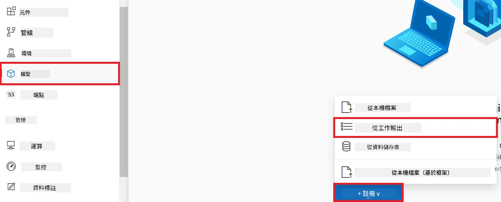

1. 選擇您建立的工作。

    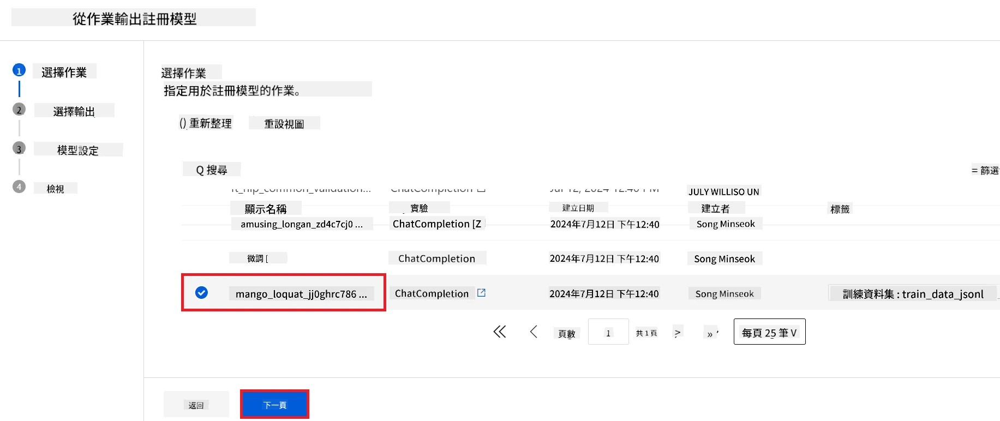

1. 點選 **Next**。

1. 將 **Model type** 設為 **MLflow**。

1. 確認已選擇 **Job output**；理應自動選取。

    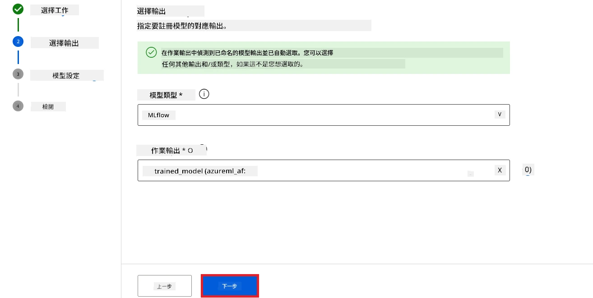

2. 點選 **Next**。

3. 點選 **Register**。

    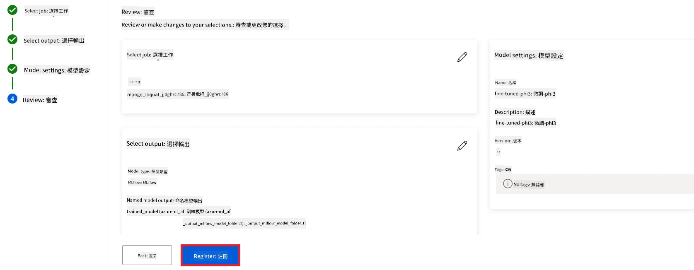

4. 您可透過左側標籤的 **Models** 選單查看註冊的模型。

    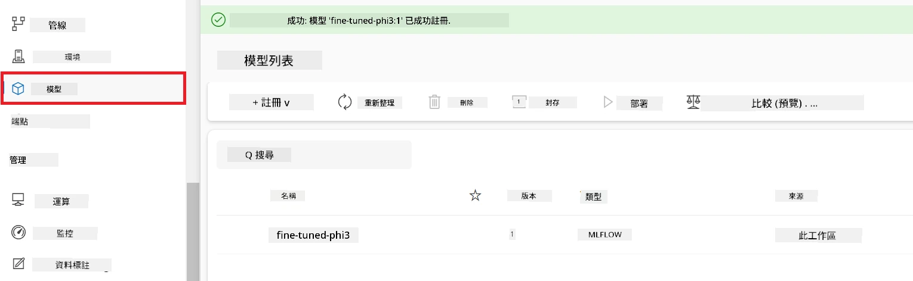

#### 部署微調模型

1. 前往您建立的 Azure Machine Learning 工作區。

1. 從左側標籤選擇 **Endpoints**。

1. 從導覽選單選擇 **Real-time endpoints**。

    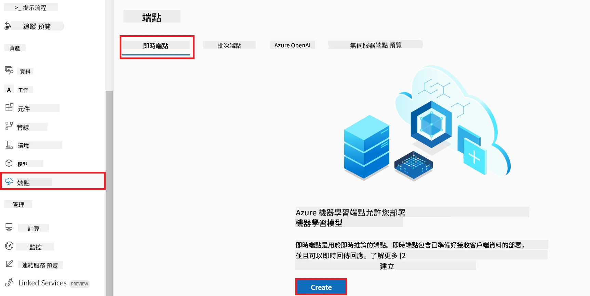

1. 點選 **Create**。

1. 選擇您先前註冊的模型。

    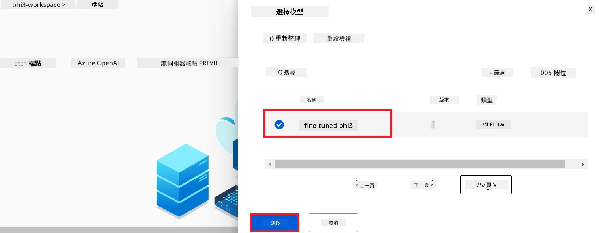

1. 點選 **Select**。

1. 執行以下設定：

    - 將 **Virtual machine** 選為 *Standard_NC6s_v3*。
    - 選擇您的 **Instance count**，例如 *1*。
    - 將 **Endpoint** 設為 **New**，以建立新端點。
    - 輸入 **Endpoint name**，必須是唯一值。
    - 輸入 **Deployment name**，必須是唯一值。

    

1. 點選 **Deploy**。

> [!WARNING]
> 為避免產生額外費用，請務必在 Azure Machine Learning 工作區刪除所建立的端點。
>

#### 檢查在 Azure Machine Learning 工作區的部署狀態

1. 前往您建立的 Azure Machine Learning 工作區。

1. 從左側標籤選擇 **Endpoints**。

1. 選擇您建立的端點。

    

1. 此頁面可管理部署過程中的端點。

> [!NOTE]
> 部署完成後，請確認 **Live traffic** 已設定為 **100%**。如未達 100%，請點選 **Update traffic** 以調整流量設定。注意，若流量為 0%，則無法測試模型。
>
> 
>

## 情境 3：與 Prompt flow 整合並於 Azure AI Foundry 以自訂模型聊天

### 將自訂 Phi-3 模型與 Prompt flow 整合

成功部署微調模型後，接著您可將其與 Prompt Flow 整合，以在即時應用中使用模型，使您的自訂 Phi-3 模型能執行各種互動任務。

在本練習中，您將：

- 建立 Azure AI Foundry Hub。
- 建立 Azure AI Foundry 專案。
- 建立 Prompt flow。
- 新增自訂連線至微調 Phi-3 模型。
- 設定 Prompt flow 與自訂 Phi-3 模型對話。

> [!NOTE]
> 您也可以透過 Azure ML Studio 與 Promptflow 進行整合，整合流程與 Azure ML Studio 相同。

#### 建立 Azure AI Foundry Hub

您必須先建立 Hub 才能建立專案。Hub 類似資源群組，可讓您在 Azure AI Foundry 中管理多個專案。

1. 造訪 [Azure AI Foundry](https://ai.azure.com/?WT.mc_id=aiml-137032-kinfeylo)。

1. 從左側標籤選擇 **All hubs**。

1. 從導覽選單點選 **+ New hub**。
    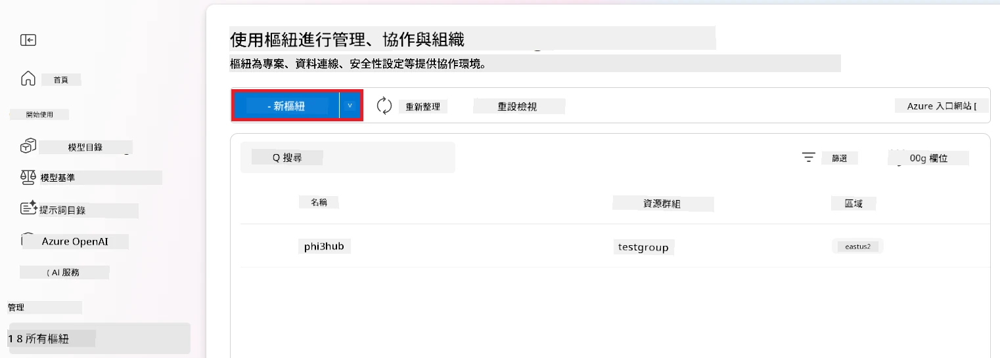

1. 執行以下任務：

    - 輸入 **集線器名稱**。它必須是唯一值。
    - 選擇您的 Azure **訂閱**。
    - 選擇要使用的 **資源群組**（如有需要，請建立新的）。
    - 選擇您要使用的 **位置**。
    - 選擇要使用的 **連接 Azure AI 服務**（如有需要，請建立新的）。
    - 選擇 **連接 Azure AI 搜尋** 並選擇 **跳過連接**。

    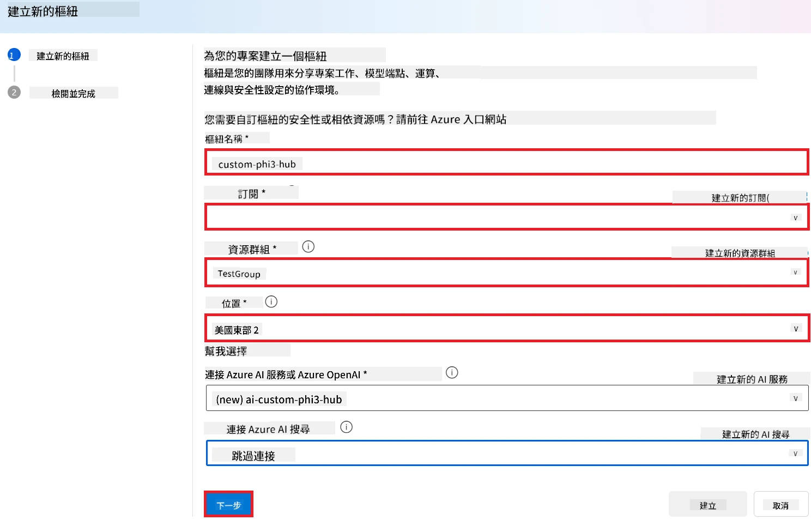

1. 選擇 **下一步**。

#### 建立 Azure AI Foundry 專案

1. 在您建立的集線器中，從左側標籤選擇 **所有專案**。

1. 從導覽選單中選擇 **+ 新增專案**。

    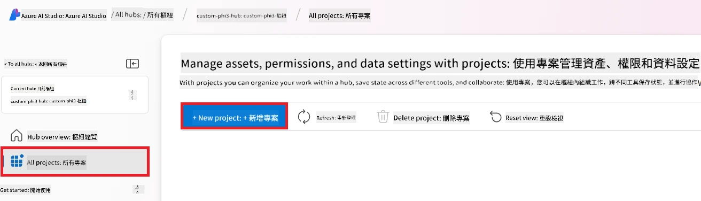

1. 輸入 **專案名稱**。它必須是唯一值。

    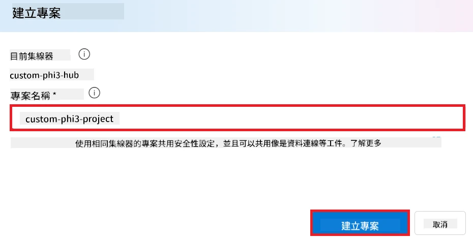

1. 選擇 **建立專案**。

#### 為微調的 Phi-3 模型新增自訂連接

要將您的自訂 Phi-3 模型與 Prompt flow 整合，您需要在自訂連接中保存模型的端點及金鑰。此設定可確保在 Prompt flow 中存取您的自訂 Phi-3 模型。

#### 設定微調 Phi-3 模型的 api 金鑰和端點 uri

1. 訪問 [Azure ML Studio](https://ml.azure.com/home?WT.mc_id=aiml-137032-kinfeylo)。

1. 導覽至您建立的 Azure 機器學習工作區。

1. 從左側標籤中選擇 **端點**。

    

1. 選擇您建立的端點。

    

1. 從導覽選單中選擇 **使用**。

1. 複製您的 **REST 端點** 和 **主要金鑰**。

    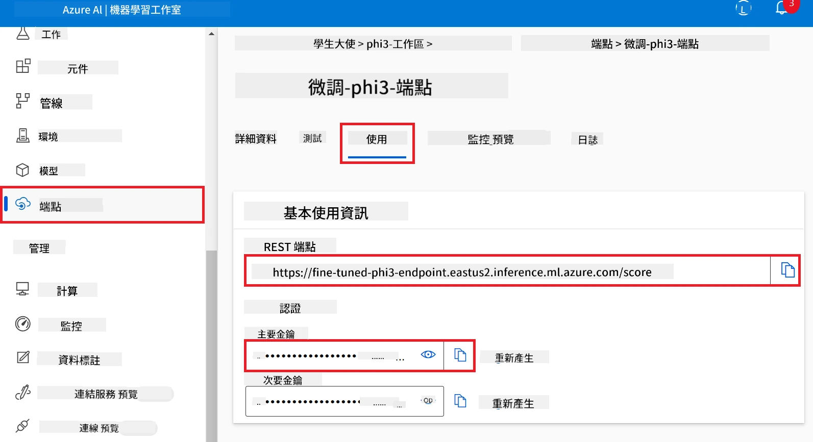

#### 新增自訂連接

1. 訪問 [Azure AI Foundry](https://ai.azure.com/?WT.mc_id=aiml-137032-kinfeylo)。

1. 導覽至您建立的 Azure AI Foundry 專案。

1. 在您建立的專案中，從左側標籤選擇 **設定**。

1. 選擇 **+ 新增連接**。

    

1. 從導覽選單選擇 **自訂金鑰**。

    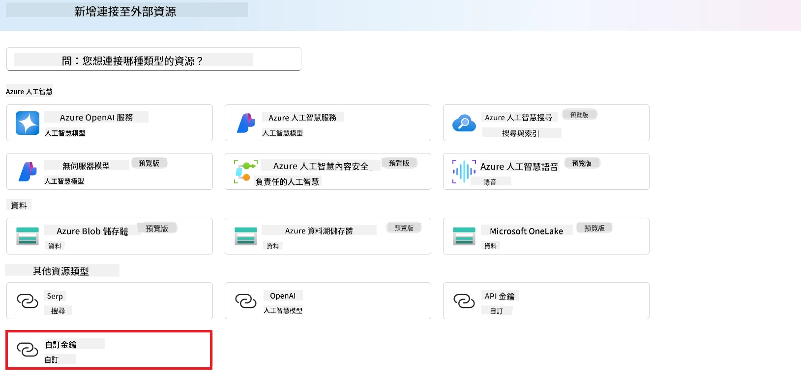

1. 執行以下任務：

    - 選擇 **+ 新增金鑰值對**。
    - 金鑰名稱輸入 **endpoint**，並將您從 Azure ML Studio 複製的端點貼到值欄位。
    - 再次選擇 **+ 新增金鑰值對**。
    - 金鑰名稱輸入 **key**，並將您從 Azure ML Studio 複製的金鑰貼到值欄位。
    - 新增金鑰後，選擇 **is secret**，以防止金鑰洩漏。

    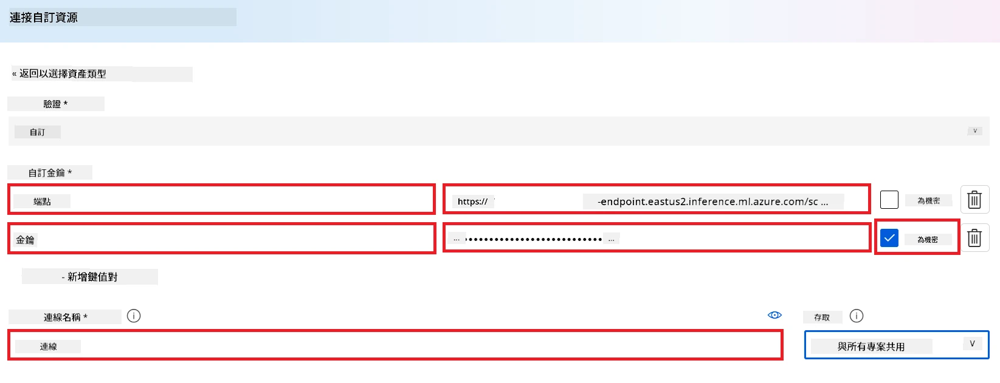

1. 選擇 **新增連接**。

#### 建立 Prompt flow

您已在 Azure AI Foundry 中新增自訂連接。現在，讓我們使用以下步驟建立一個 Prompt flow。然後，您會將此 Prompt flow 連接到自訂連接，從而在 Prompt flow 中使用微調模型。

1. 導覽至您建立的 Azure AI Foundry 專案。

1. 從左側標籤選擇 **Prompt flow**。

1. 從導覽選單中選擇 **+ 建立**。

    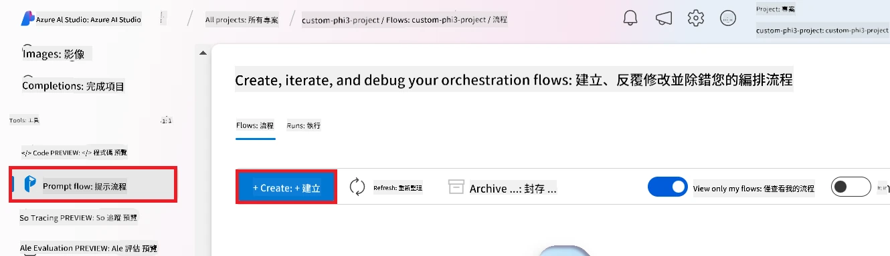

1. 從導覽選單中選擇 **聊天流程**。

    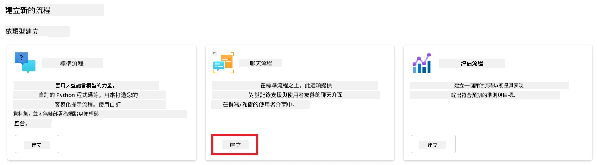

1. 輸入要使用的 **資料夾名稱**。

    

2. 選擇 **建立**。

#### 設定 Prompt flow 與您的自訂 Phi-3 模型對話

您需要將微調的 Phi-3 模型整合到 Prompt flow 中。不過，現有的 Prompt flow 不適合此用途。因此，您必須重新設計 Prompt flow，才能整合自訂模型。

1. 在 Prompt flow 中，執行以下任務以重建現有流程：

    - 選擇 **原始檔模式**。
    - 刪除 *flow.dag.yml* 檔案中所有現有程式碼。
    - 將以下程式碼加到 *flow.dag.yml* 檔案中。

        ```yml
        inputs:
          input_data:
            type: string
            default: "Who founded Microsoft?"

        outputs:
          answer:
            type: string
            reference: ${integrate_with_promptflow.output}

        nodes:
        - name: integrate_with_promptflow
          type: python
          source:
            type: code
            path: integrate_with_promptflow.py
          inputs:
            input_data: ${inputs.input_data}
        ```

    - 選擇 **儲存**。

    

1. 將以下程式碼新增到 *integrate_with_promptflow.py* 檔案中，以便在 Prompt flow 中使用自訂 Phi-3 模型。

    ```python
    import logging
    import requests
    from promptflow import tool
    from promptflow.connections import CustomConnection

    # 日誌設置
    logging.basicConfig(
        format="%(asctime)s - %(levelname)s - %(name)s - %(message)s",
        datefmt="%Y-%m-%d %H:%M:%S",
        level=logging.DEBUG
    )
    logger = logging.getLogger(__name__)

    def query_phi3_model(input_data: str, connection: CustomConnection) -> str:
        """
        Send a request to the Phi-3 model endpoint with the given input data using Custom Connection.
        """

        # "connection" 是自訂連線的名稱，"endpoint"、"key" 是自訂連線中的鍵
        endpoint_url = connection.endpoint
        api_key = connection.key

        headers = {
            "Content-Type": "application/json",
            "Authorization": f"Bearer {api_key}"
        }
        data = {
            "input_data": {
                "input_string": [
                    {"role": "user", "content": input_data}
                ],
                "parameters": {
                    "temperature": 0.7,
                    "max_new_tokens": 128
                }
            }
        }
        try:
            response = requests.post(endpoint_url, json=data, headers=headers)
            response.raise_for_status()
            
            # 紀錄完整的 JSON 回應
            logger.debug(f"Full JSON response: {response.json()}")

            result = response.json()["output"]
            logger.info("Successfully received response from Azure ML Endpoint.")
            return result
        except requests.exceptions.RequestException as e:
            logger.error(f"Error querying Azure ML Endpoint: {e}")
            raise

    @tool
    def my_python_tool(input_data: str, connection: CustomConnection) -> str:
        """
        Tool function to process input data and query the Phi-3 model.
        """
        return query_phi3_model(input_data, connection)

    ```

    

> [!NOTE]
> 有關在 Azure AI Foundry 中使用 Prompt flow 的更詳細資訊，請參閱 [Azure AI Foundry 中的 Prompt flow](https://learn.microsoft.com/azure/ai-studio/how-to/prompt-flow)。

1. 選擇 **聊天輸入**、**聊天輸出** 以啟用與您的模型聊天。

    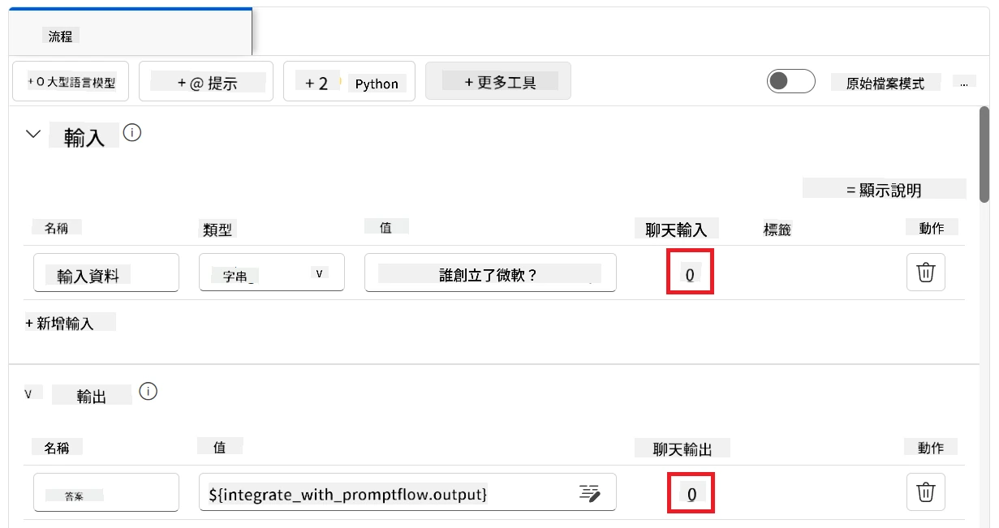

1. 現在，您已準備好與您的自訂 Phi-3 模型聊天。下一個練習中，您將學習如何啟動 Prompt flow 並使用它與您的微調 Phi-3 模型聊天。

> [!NOTE]
>
> 重建後的流程應該如下圖所示：
>
> 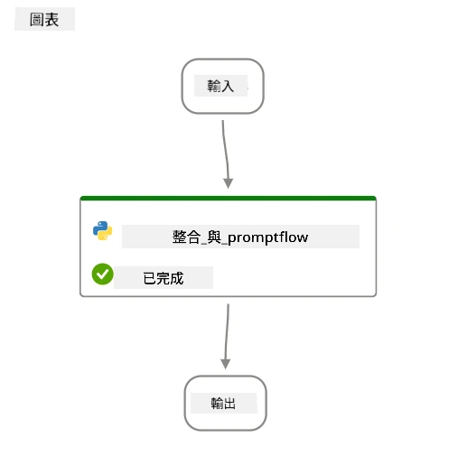
>

### 與您的自訂 Phi-3 模型聊天

現在您已微調並整合您的自訂 Phi-3 模型至 Prompt flow，準備好開始與它互動了。本練習將指導您如何使用 Prompt flow 設定並啟動與模型的聊天。透過這些步驟，您將能充分利用您的微調 Phi-3 模型在各種任務和對話中的能力。

- 使用 Prompt flow 與您的自訂 Phi-3 模型聊天。

#### 啟動 Prompt flow

1. 選擇 **啟動計算階段** 以啟動 Prompt flow。

    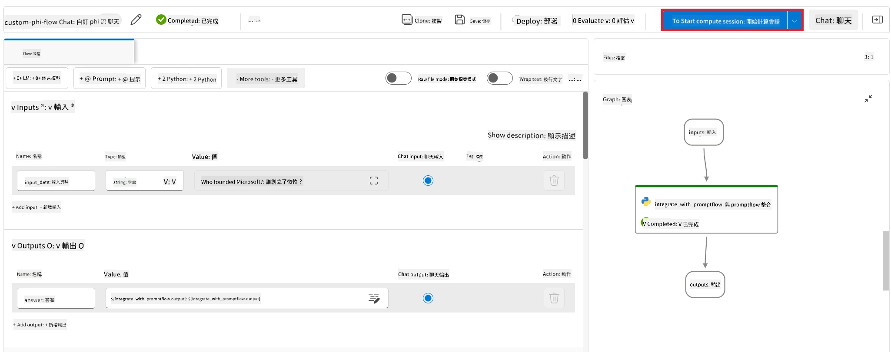

1. 選擇 **驗證並解析輸入** 以更新參數。

    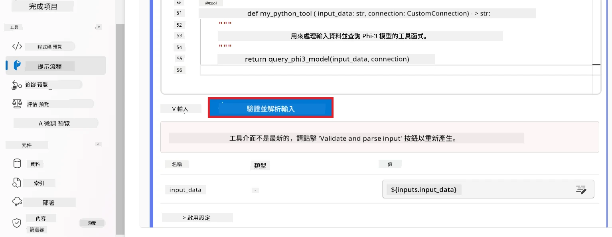

1. 選擇 **連接** 的 **值** 為您建立的自訂連接，例如 *connection*。

    

#### 與您的自訂模型聊天

1. 選擇 **聊天**。

    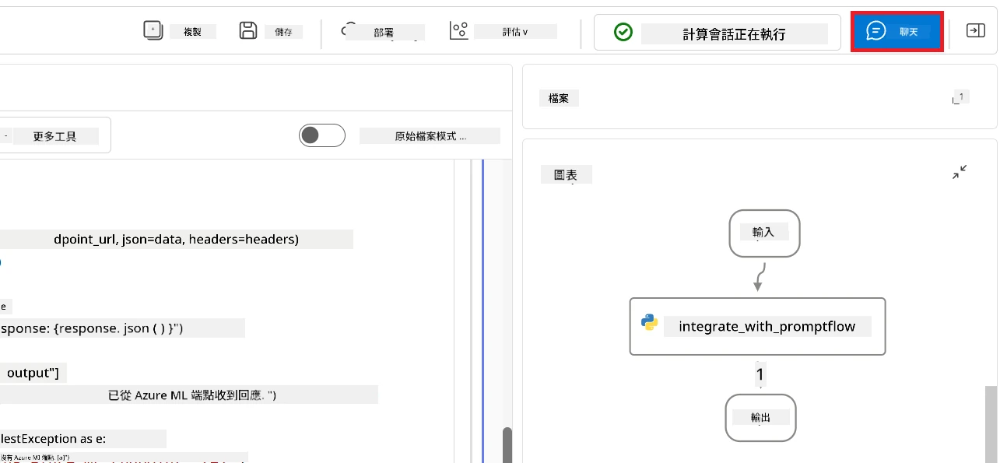

1. 以下是結果範例：您現在可以與您的自訂 Phi-3 模型聊天。建議根據用於微調的資料進行提問。

    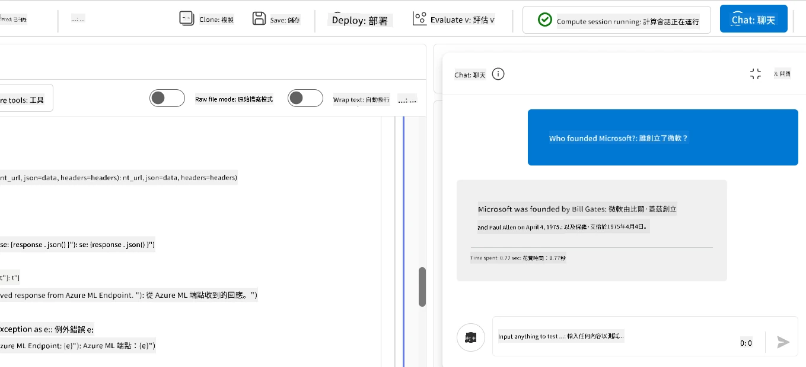

---

<!-- CO-OP TRANSLATOR DISCLAIMER START -->
**免責聲明**：
本文件係使用 AI 翻譯服務 [Co-op Translator](https://github.com/Azure/co-op-translator) 進行翻譯。雖我們力求準確，但請注意自動翻譯可能包含錯誤或不準確之處。原始文件之母語版本應被視為權威來源。對於重要資訊，建議採用專業人工翻譯。我們不對因使用本翻譯而產生的任何誤解或誤釋負責。
<!-- CO-OP TRANSLATOR DISCLAIMER END -->