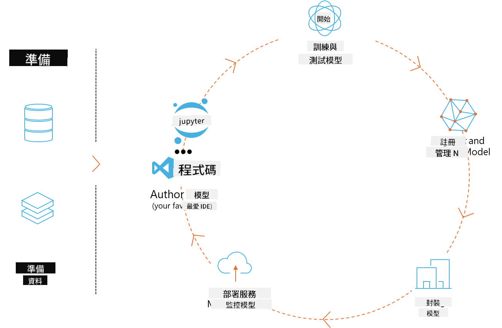
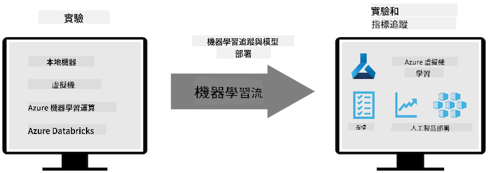

<!--
CO_OP_TRANSLATOR_METADATA:
{
  "original_hash": "1e42c399dcc2fa477925d3ef4038d403",
  "translation_date": "2025-04-04T06:29:45+00:00",
  "source_file": "md\\02.Application\\01.TextAndChat\\Phi3\\E2E_Phi-3-MLflow.md",
  "language_code": "tw"
}
-->
# MLflow

[MLflow](https://mlflow.org/) 是一個開源平台，專為管理機器學習全生命周期而設計。



MLFlow 用於管理機器學習的生命周期，包括實驗、可重現性、部署以及中央模型註冊。MLFlow 目前提供四個主要組件：

- **MLflow Tracking：** 記錄和查詢實驗、程式碼、數據配置和結果。
- **MLflow Projects：** 將數據科學程式碼封裝成一種格式，以便在任何平台上重現執行。
- **MLflow Models：** 在多樣化的服務環境中部署機器學習模型。
- **Model Registry：** 在中央存儲庫中存儲、註釋和管理模型。

它具備追蹤實驗、將程式碼封裝成可重現執行，以及分享和部署模型的功能。MLFlow 已整合至 Databricks，並支持多種機器學習庫，具有庫無關性。透過提供 REST API 和 CLI，MLFlow 可以與任何機器學習庫和任何程式語言搭配使用。



MLFlow 的主要功能包括：

- **實驗追蹤：** 記錄並比較參數和結果。
- **模型管理：** 將模型部署到各種服務和推理平台。
- **模型註冊：** 協作管理 MLFlow 模型的生命周期，包括版本控制和註釋。
- **專案：** 將機器學習程式碼封裝以便共享或生產使用。

MLFlow 也支持 MLOps 循環，包括準備數據、註冊和管理模型、封裝模型以供執行、部署服務以及監控模型。它旨在簡化從原型到生產工作流程的過程，尤其是在雲端和邊緣環境中。

## E2E 案例 - 建立封裝器並使用 Phi-3 作為 MLFlow 模型

在這個 E2E 範例中，我們將展示兩種不同的方法來為 Phi-3 小型語言模型（SLM）建立封裝器，然後將其作為 MLFlow 模型在本地或雲端（例如 Azure 機器學習工作區）中運行。


| 專案 | 描述 | 位置 |
| ------------ | ----------- | -------- |
| Transformer Pipeline | 如果您希望使用 HuggingFace 模型並搭配 MLFlow 的實驗性 transformers 支援，Transformer Pipeline 是建立封裝器的最簡單選擇。 | [**TransformerPipeline.ipynb**](../../../../../../code/06.E2E/E2E_Phi-3-MLflow_TransformerPipeline.ipynb) |
| Custom Python Wrapper | 在撰寫本文時，transformer pipeline 尚不支持為 ONNX 格式的 HuggingFace 模型生成 MLFlow 封裝器，即使使用實驗性的 optimum Python 套件也是如此。針對這種情況，您可以為 MLFlow 模型建立自訂的 Python 封裝器。 | [**CustomPythonWrapper.ipynb**](../../../../../../code/06.E2E/E2E_Phi-3-MLflow_CustomPythonWrapper.ipynb) |

## 專案：Transformer Pipeline

1. 您需要安裝 MLFlow 和 HuggingFace 的相關 Python 套件：

    ``` Python
    import mlflow
    import transformers
    ```

2. 接著，您應該透過 HuggingFace 的註冊庫引用目標 Phi-3 模型來初始化 transformer pipeline。如 _Phi-3-mini-4k-instruct_ 的模型卡所示，其任務類型為 "文本生成"：

    ``` Python
    pipeline = transformers.pipeline(
        task = "text-generation",
        model = "microsoft/Phi-3-mini-4k-instruct"
    )
    ```

3. 您現在可以將 Phi-3 模型的 transformer pipeline 保存為 MLFlow 格式，並提供額外的細節，例如目標 artifacts 路徑、特定模型配置設置以及推理 API 類型：

    ``` Python
    model_info = mlflow.transformers.log_model(
        transformers_model = pipeline,
        artifact_path = "phi3-mlflow-model",
        model_config = model_config,
        task = "llm/v1/chat"
    )
    ```

## 專案：Custom Python Wrapper

1. 在此我們可以利用 Microsoft 的 [ONNX Runtime generate() API](https://github.com/microsoft/onnxruntime-genai) 來執行 ONNX 模型的推理以及編碼/解碼 tokens。您需要根據目標運算環境選擇 _onnxruntime_genai_ 套件，以下示例以 CPU 為目標：

    ``` Python
    import mlflow
    from mlflow.models import infer_signature
    import onnxruntime_genai as og
    ```

1. 我們的自訂類別實現了兩個方法：_load_context()_ 用於初始化 **Phi-3 Mini 4K Instruct 的 ONNX 模型**、**生成器參數**和**tokenizer**；以及 _predict()_ 用於根據提供的提示生成輸出 tokens：

    ``` Python
    class Phi3Model(mlflow.pyfunc.PythonModel):
        def load_context(self, context):
            # Retrieving model from the artifacts
            model_path = context.artifacts["phi3-mini-onnx"]
            model_options = {
                 "max_length": 300,
                 "temperature": 0.2,         
            }
        
            # Defining the model
            self.phi3_model = og.Model(model_path)
            self.params = og.GeneratorParams(self.phi3_model)
            self.params.set_search_options(**model_options)
            
            # Defining the tokenizer
            self.tokenizer = og.Tokenizer(self.phi3_model)
    
        def predict(self, context, model_input):
            # Retrieving prompt from the input
            prompt = model_input["prompt"][0]
            self.params.input_ids = self.tokenizer.encode(prompt)
    
            # Generating the model's response
            response = self.phi3_model.generate(self.params)
    
            return self.tokenizer.decode(response[0][len(self.params.input_ids):])
    ```

1. 現在，您可以使用 _mlflow.pyfunc.log_model()_ 函數為 Phi-3 模型生成自訂的 Python 封裝器（以 pickle 格式），並附上原始 ONNX 模型及所需依賴項：

    ``` Python
    model_info = mlflow.pyfunc.log_model(
        artifact_path = artifact_path,
        python_model = Phi3Model(),
        artifacts = {
            "phi3-mini-onnx": "cpu_and_mobile/cpu-int4-rtn-block-32-acc-level-4",
        },
        input_example = input_example,
        signature = infer_signature(input_example, ["Run"]),
        extra_pip_requirements = ["torch", "onnxruntime_genai", "numpy"],
    )
    ```

## 生成的 MLFlow 模型簽名

1. 在 Transformer Pipeline 專案的第 3 步中，我們將 MLFlow 模型的任務設置為 "_llm/v1/chat_"。此指令會生成一個與 OpenAI 的 Chat API 兼容的模型 API 封裝器，如下所示：

    ``` Python
    {inputs: 
      ['messages': Array({content: string (required), name: string (optional), role: string (required)}) (required), 'temperature': double (optional), 'max_tokens': long (optional), 'stop': Array(string) (optional), 'n': long (optional), 'stream': boolean (optional)],
    outputs: 
      ['id': string (required), 'object': string (required), 'created': long (required), 'model': string (required), 'choices': Array({finish_reason: string (required), index: long (required), message: {content: string (required), name: string (optional), role: string (required)} (required)}) (required), 'usage': {completion_tokens: long (required), prompt_tokens: long (required), total_tokens: long (required)} (required)],
    params: 
      None}
    ```

1. 因此，您可以以下列格式提交您的提示：

    ``` Python
    messages = [{"role": "user", "content": "What is the capital of Spain?"}]
    ```

1. 接著，使用與 OpenAI API 兼容的後處理，例如 _response[0][‘choices’][0][‘message’][‘content’]_，將輸出美化為如下內容：

    ``` JSON
    Question: What is the capital of Spain?
    
    Answer: The capital of Spain is Madrid. It is the largest city in Spain and serves as the political, economic, and cultural center of the country. Madrid is located in the center of the Iberian Peninsula and is known for its rich history, art, and architecture, including the Royal Palace, the Prado Museum, and the Plaza Mayor.
    
    Usage: {'prompt_tokens': 11, 'completion_tokens': 73, 'total_tokens': 84}
    ```

1. 在 Custom Python Wrapper 專案的第 3 步中，我們允許 MLFlow 套件根據提供的輸入範例生成模型簽名。我們的 MLFlow 封裝器簽名將如下所示：

    ``` Python
    {inputs: 
      ['prompt': string (required)],
    outputs: 
      [string (required)],
    params: 
      None}
    ```

1. 因此，我們的提示需要包含 "prompt" 字典鍵，類似於以下格式：

    ``` Python
    {"prompt": "<|system|>You are a stand-up comedian.<|end|><|user|>Tell me a joke about atom<|end|><|assistant|>",}
    ```

1. 模型的輸出將以字符串格式提供：

    ``` JSON
    Alright, here's a little atom-related joke for you!
    
    Why don't electrons ever play hide and seek with protons?
    
    Because good luck finding them when they're always "sharing" their electrons!
    
    Remember, this is all in good fun, and we're just having a little atomic-level humor!
    ```

**免責聲明**：  
本文檔使用 AI 翻譯服務 [Co-op Translator](https://github.com/Azure/co-op-translator) 進行翻譯。雖然我們致力於提供準確的翻譯，但請注意，自動翻譯可能包含錯誤或不準確之處。原始語言的文件應被視為權威來源。對於關鍵信息，建議尋求專業人工翻譯。我們不對因使用此翻譯而引起的任何誤解或誤釋承擔責任。