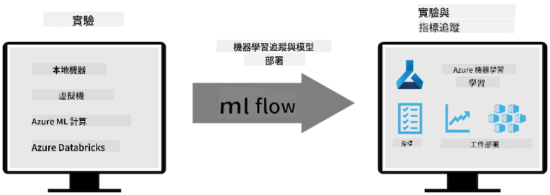
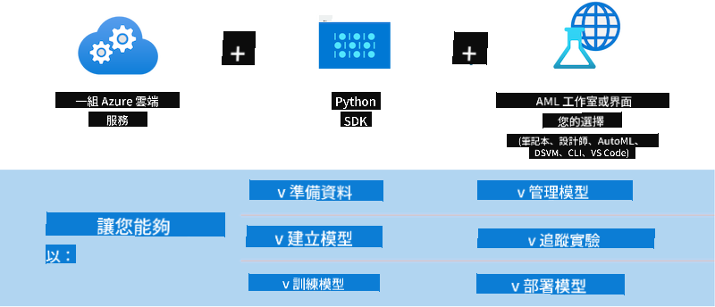

<!--
CO_OP_TRANSLATOR_METADATA:
{
  "original_hash": "f61c383bbf0c3dac97e43f833c258731",
  "translation_date": "2025-05-08T05:35:48+00:00",
  "source_file": "md/02.Application/01.TextAndChat/Phi3/E2E_Phi-3-MLflow.md",
  "language_code": "tw"
}
-->
# MLflow

[MLflow](https://mlflow.org/) 是一個開源平台，專門用來管理機器學習整個生命週期。


MLFlow 用來管理機器學習生命週期，包括實驗、可重現性、部署以及集中式模型註冊。MLFlow 目前提供四個主要組件。

- **MLflow Tracking:** 記錄並查詢實驗、程式碼、資料設定和結果。
- **MLflow Projects:** 將資料科學程式碼包裝成可在任何平台重現的格式。
- **Mlflow Models:** 在多種服務環境中部署機器學習模型。
- **Model Registry:** 在集中式儲存庫中存放、註解並管理模型。

它具備追蹤實驗、包裝程式碼成可重現執行、分享與部署模型的功能。MLFlow 已整合至 Databricks，並支援多種機器學習函式庫，具有函式庫無關性。它可以搭配任何機器學習函式庫及程式語言使用，並提供 REST API 與 CLI 以方便操作。



MLFlow 的主要功能包括：

- **實驗追蹤：** 記錄並比較參數與結果。
- **模型管理：** 將模型部署到各種服務和推論平台。
- **模型註冊：** 協同管理 MLflow 模型的生命週期，包括版本控制與註解。
- **Projects:** 將機器學習程式碼包裝以便分享或生產使用。

MLFlow 也支援 MLOps 循環，包含資料準備、模型註冊與管理、模型包裝以供執行、服務部署及模型監控。它的目標是簡化從原型到生產流程的轉換，特別是在雲端與邊緣運算環境中。

## E2E 範例 - 建立包裝器並使用 Phi-3 作為 MLFlow 模型

在這個端到端範例中，我們會示範兩種不同的方法，來為 Phi-3 小型語言模型（SLM）建立包裝器，並將其作為 MLFlow 模型在本地或雲端（例如 Azure Machine Learning 工作區）運行。



| 專案 | 說明 | 位置 |
| ------------ | ----------- | -------- |
| Transformer Pipeline | Transformer Pipeline 是建立包裝器最簡單的選項，適合想用 HuggingFace 模型搭配 MLFlow 的實驗性 transformers 功能。 | [**TransformerPipeline.ipynb**](../../../../../../code/06.E2E/E2E_Phi-3-MLflow_TransformerPipeline.ipynb) |
| Custom Python Wrapper | 撰寫時，transformer pipeline 尚不支援以 MLFlow 包裝 HuggingFace ONNX 格式模型，即使使用實驗性 optimum Python 套件。這種情況下，可以自訂 Python 包裝器以供 MLFlow 使用。 | [**CustomPythonWrapper.ipynb**](../../../../../../code/06.E2E/E2E_Phi-3-MLflow_CustomPythonWrapper.ipynb) |

## 專案：Transformer Pipeline

1. 你需要安裝 MLFlow 和 HuggingFace 相關的 Python 套件：

    ``` Python
    import mlflow
    import transformers
    ```

2. 接著，透過 HuggingFace 模型庫指定目標 Phi-3 模型，初始化 transformer pipeline。從 _Phi-3-mini-4k-instruct_ 的模型卡可看到，它的任務是「文字生成」類型：

    ``` Python
    pipeline = transformers.pipeline(
        task = "text-generation",
        model = "microsoft/Phi-3-mini-4k-instruct"
    )
    ```

3. 現在你可以將 Phi-3 模型的 transformer pipeline 儲存成 MLFlow 格式，並提供額外細節，如目標 artifact 路徑、特定模型設定以及推論 API 類型：

    ``` Python
    model_info = mlflow.transformers.log_model(
        transformers_model = pipeline,
        artifact_path = "phi3-mlflow-model",
        model_config = model_config,
        task = "llm/v1/chat"
    )
    ```

## 專案：Custom Python Wrapper

1. 這裡我們使用 Microsoft 的 [ONNX Runtime generate() API](https://github.com/microsoft/onnxruntime-genai) 來進行 ONNX 模型的推論與標記編碼／解碼。你需要選擇 _onnxruntime_genai_ 套件來對應目標運算裝置，以下範例是以 CPU 為目標：

    ``` Python
    import mlflow
    from mlflow.models import infer_signature
    import onnxruntime_genai as og
    ```

1. 我們自訂的類別實作兩個方法：_load_context()_ 用來初始化 Phi-3 Mini 4K Instruct 的 **ONNX 模型**、**生成器參數** 和 **tokenizer**；_predict()_ 用來根據輸入提示產生輸出標記：

    ``` Python
    class Phi3Model(mlflow.pyfunc.PythonModel):
        def load_context(self, context):
            # Retrieving model from the artifacts
            model_path = context.artifacts["phi3-mini-onnx"]
            model_options = {
                 "max_length": 300,
                 "temperature": 0.2,         
            }
        
            # Defining the model
            self.phi3_model = og.Model(model_path)
            self.params = og.GeneratorParams(self.phi3_model)
            self.params.set_search_options(**model_options)
            
            # Defining the tokenizer
            self.tokenizer = og.Tokenizer(self.phi3_model)
    
        def predict(self, context, model_input):
            # Retrieving prompt from the input
            prompt = model_input["prompt"][0]
            self.params.input_ids = self.tokenizer.encode(prompt)
    
            # Generating the model's response
            response = self.phi3_model.generate(self.params)
    
            return self.tokenizer.decode(response[0][len(self.params.input_ids):])
    ```

1. 接著可以用 _mlflow.pyfunc.log_model()_ 函式，為 Phi-3 模型產生自訂 Python 包裝器（pickle 格式），並包含原始 ONNX 模型及所需相依套件：

    ``` Python
    model_info = mlflow.pyfunc.log_model(
        artifact_path = artifact_path,
        python_model = Phi3Model(),
        artifacts = {
            "phi3-mini-onnx": "cpu_and_mobile/cpu-int4-rtn-block-32-acc-level-4",
        },
        input_example = input_example,
        signature = infer_signature(input_example, ["Run"]),
        extra_pip_requirements = ["torch", "onnxruntime_genai", "numpy"],
    )
    ```

## 產生的 MLFlow 模型簽章

1. 在上面 Transformer Pipeline 專案的第 3 步，我們設定 MLFlow 模型的任務為「_llm/v1/chat_」。這樣會產生與 OpenAI Chat API 相容的模型 API 包裝器，如下所示：

    ``` Python
    {inputs: 
      ['messages': Array({content: string (required), name: string (optional), role: string (required)}) (required), 'temperature': double (optional), 'max_tokens': long (optional), 'stop': Array(string) (optional), 'n': long (optional), 'stream': boolean (optional)],
    outputs: 
      ['id': string (required), 'object': string (required), 'created': long (required), 'model': string (required), 'choices': Array({finish_reason: string (required), index: long (required), message: {content: string (required), name: string (optional), role: string (required)} (required)}) (required), 'usage': {completion_tokens: long (required), prompt_tokens: long (required), total_tokens: long (required)} (required)],
    params: 
      None}
    ```

1. 因此，你可以用以下格式提交提示：

    ``` Python
    messages = [{"role": "user", "content": "What is the capital of Spain?"}]
    ```

1. 接著，使用類似 OpenAI API 的後處理，例如 _response[0][‘choices’][0][‘message’][‘content’]_，將輸出美化成這樣：

    ``` JSON
    Question: What is the capital of Spain?
    
    Answer: The capital of Spain is Madrid. It is the largest city in Spain and serves as the political, economic, and cultural center of the country. Madrid is located in the center of the Iberian Peninsula and is known for its rich history, art, and architecture, including the Royal Palace, the Prado Museum, and the Plaza Mayor.
    
    Usage: {'prompt_tokens': 11, 'completion_tokens': 73, 'total_tokens': 84}
    ```

1. 在上面 Custom Python Wrapper 專案的第 3 步，我們讓 MLFlow 套件根據範例輸入產生模型簽章。MLFlow 包裝器的簽章會長這樣：

    ``` Python
    {inputs: 
      ['prompt': string (required)],
    outputs: 
      [string (required)],
    params: 
      None}
    ```

1. 因此，我們的提示需要包含名為 "prompt" 的字典鍵，格式類似這樣：

    ``` Python
    {"prompt": "<|system|>You are a stand-up comedian.<|end|><|user|>Tell me a joke about atom<|end|><|assistant|>",}
    ```

1. 模型輸出會以字串格式提供：

    ``` JSON
    Alright, here's a little atom-related joke for you!
    
    Why don't electrons ever play hide and seek with protons?
    
    Because good luck finding them when they're always "sharing" their electrons!
    
    Remember, this is all in good fun, and we're just having a little atomic-level humor!
    ```

**免責聲明**：  
本文件係使用 AI 翻譯服務 [Co-op Translator](https://github.com/Azure/co-op-translator) 進行翻譯。雖然我們努力確保翻譯的準確性，但請注意，自動翻譯可能包含錯誤或不準確之處。原始文件的母語版本應視為權威來源。對於重要資訊，建議使用專業人工翻譯。我們不對因使用此翻譯而產生的任何誤解或誤釋負責。