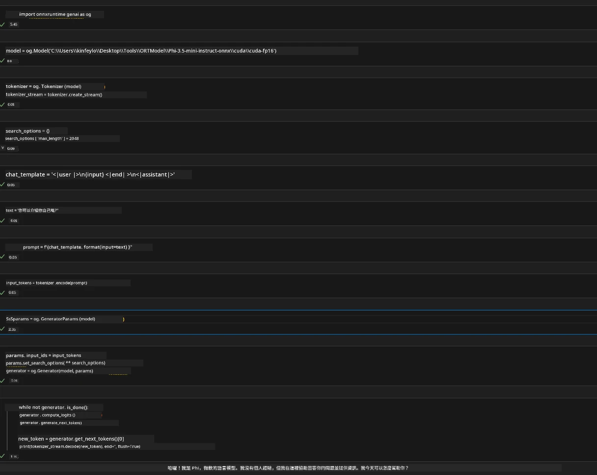

<!--
CO_OP_TRANSLATOR_METADATA:
{
  "original_hash": "b066fc29c1b2129df84e027cb75119ce",
  "translation_date": "2025-07-17T02:40:24+00:00",
  "source_file": "md/02.Application/01.TextAndChat/Phi3/ORTWindowGPUGuideline.md",
  "language_code": "tw"
}
-->
# **OnnxRuntime GenAI Windows GPU 指南**

本指南提供在 Windows 上使用 GPU 設定及運行 ONNX Runtime (ORT) 的步驟，幫助您利用 GPU 加速模型運算，提升效能與效率。

本文涵蓋內容：

- 環境設定：安裝 CUDA、cuDNN 及 ONNX Runtime 等必要依賴的說明。
- 配置：如何設定環境與 ONNX Runtime 以有效使用 GPU 資源。
- 優化建議：調整 GPU 設定以達到最佳效能的技巧。

### **1. Python 3.10.x /3.11.8**

   ***Note*** 建議使用 [miniforge](https://github.com/conda-forge/miniforge/releases/latest/download/Miniforge3-Windows-x86_64.exe) 作為您的 Python 環境

   ```bash

   conda create -n pydev python==3.11.8

   conda activate pydev

   ```

   ***Reminder*** 如果您已安裝任何與 python ONNX 相關的套件，請先將其移除

### **2. 使用 winget 安裝 CMake**

   ```bash

   winget install -e --id Kitware.CMake

   ```

### **3. 安裝 Visual Studio 2022 - 使用 C++ 的桌面開發**

   ***Note*** 如果不打算自行編譯，可以跳過此步驟


### **4. 安裝 NVIDIA 驅動程式**

1. **NVIDIA GPU Driver**  [https://www.nvidia.com/en-us/drivers/](https://www.nvidia.com/en-us/drivers/)

2. **NVIDIA CUDA 12.4** [https://developer.nvidia.com/cuda-12-4-0-download-archive](https://developer.nvidia.com/cuda-12-4-0-download-archive)

3. **NVIDIA CUDNN 9.4**  [https://developer.nvidia.com/cudnn-downloads](https://developer.nvidia.com/cudnn-downloads)

***Reminder*** 請使用預設安裝設定完成安裝流程

### **5. 設定 NVIDIA 環境變數**

將 NVIDIA CUDNN 9.4 的 lib、bin、include 資料夾內容複製到 NVIDIA CUDA 12.4 對應的 lib、bin、include 資料夾

- 將 *'C:\Program Files\NVIDIA\CUDNN\v9.4\bin\12.6'* 內的檔案複製到 *'C:\Program Files\NVIDIA GPU Computing Toolkit\CUDA\v12.4\bin'*

- 將 *'C:\Program Files\NVIDIA\CUDNN\v9.4\include\12.6'* 內的檔案複製到 *'C:\Program Files\NVIDIA GPU Computing Toolkit\CUDA\v12.4\include'*

- 將 *'C:\Program Files\NVIDIA\CUDNN\v9.4\lib\12.6'* 內的檔案複製到 *'C:\Program Files\NVIDIA GPU Computing Toolkit\CUDA\v12.4\lib\x64'*

### **6. 下載 Phi-3.5-mini-instruct-onnx**

   ```bash

   winget install -e --id Git.Git

   winget install -e --id GitHub.GitLFS

   git lfs install

   git clone https://huggingface.co/microsoft/Phi-3.5-mini-instruct-onnx

   ```

### **7. 執行 InferencePhi35Instruct.ipynb**

   開啟 [Notebook](../../../../../../code/09.UpdateSamples/Aug/ortgpu-phi35-instruct.ipynb) 並執行



### **8. 編譯 ORT GenAI GPU**

   ***Note*** 
   
   1. 請先移除所有 onnx、onnxruntime 及 onnxruntime-genai 相關套件

   ```bash

   pip list 
   
   ```

   接著移除所有 onnxruntime 相關函式庫，例如：

   ```bash

   pip uninstall onnxruntime

   pip uninstall onnxruntime-genai

   pip uninstall onnxruntume-genai-cuda
   
   ```

   2. 檢查 Visual Studio 擴充支援

   確認 C:\Program Files\NVIDIA GPU Computing Toolkit\CUDA\v12.4\extras 目錄下有 C:\Program Files\NVIDIA GPU Computing Toolkit\CUDA\v12.4\extras\visual_studio_integration 資料夾。

   若找不到，請檢查其他 CUDA 工具包驅動資料夾，並將 visual_studio_integration 資料夾及內容複製到 C:\Program Files\NVIDIA GPU Computing Toolkit\CUDA\v12.4\extras\visual_studio_integration

   - 如果不打算自行編譯，可以跳過此步驟

   ```bash

   git clone https://github.com/microsoft/onnxruntime-genai

   ```

   - 下載 [https://github.com/microsoft/onnxruntime/releases/download/v1.19.2/onnxruntime-win-x64-gpu-1.19.2.zip](https://github.com/microsoft/onnxruntime/releases/download/v1.19.2/onnxruntime-win-x64-gpu-1.19.2.zip)

   - 解壓 onnxruntime-win-x64-gpu-1.19.2.zip，並將資料夾重新命名為 **ort**，將 ort 資料夾複製到 onnxruntime-genai

   - 使用 Windows Terminal，開啟 VS 2022 的 Developer Command Prompt，切換到 onnxruntime-genai 目錄


   - 使用您的 python 環境編譯

   ```bash

   cd onnxruntime-genai

   python build.py --use_cuda  --cuda_home "C:\Program Files\NVIDIA GPU Computing Toolkit\CUDA\v12.4" --config Release
 

   cd build/Windows/Release/Wheel

   pip install .whl

   ```

**免責聲明**：  
本文件係使用 AI 翻譯服務 [Co-op Translator](https://github.com/Azure/co-op-translator) 進行翻譯。雖然我們致力於確保翻譯的準確性，但請注意，自動翻譯可能包含錯誤或不準確之處。原始文件的母語版本應視為權威來源。對於重要資訊，建議採用專業人工翻譯。我們不對因使用本翻譯而產生的任何誤解或誤釋負責。