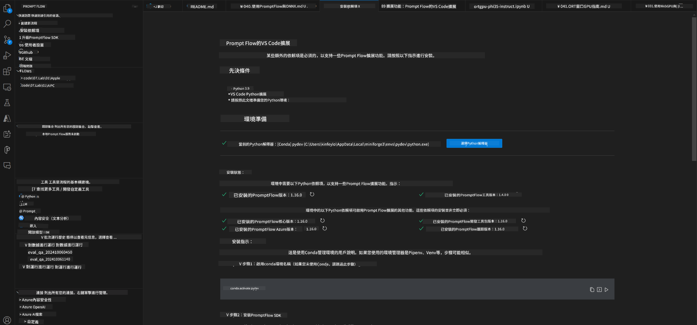
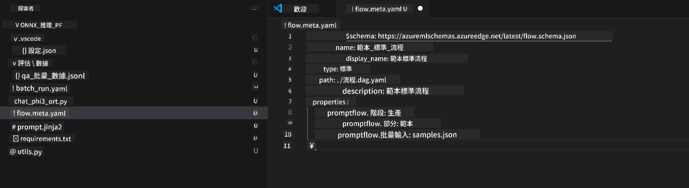
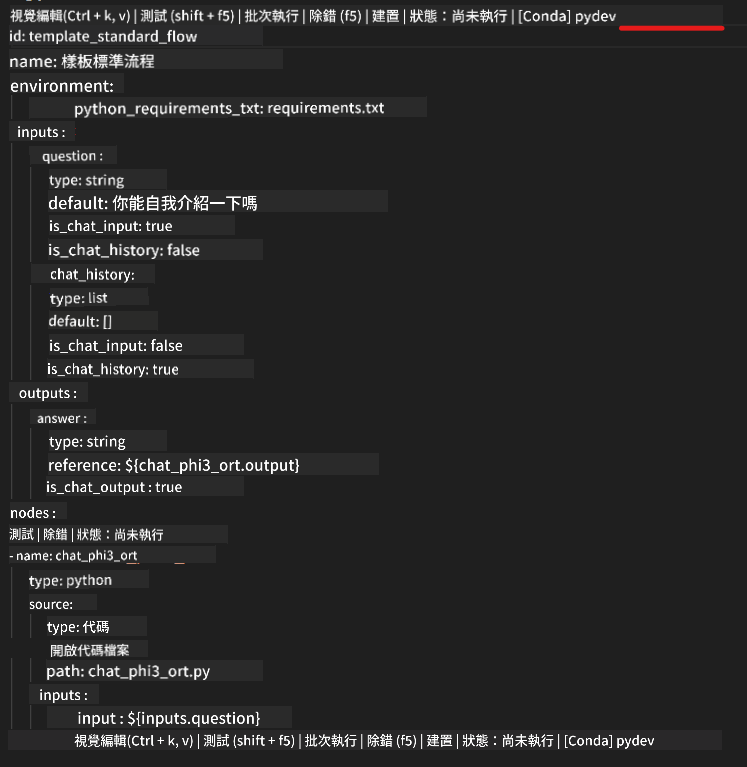
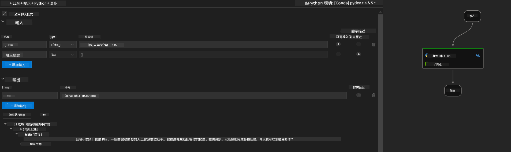
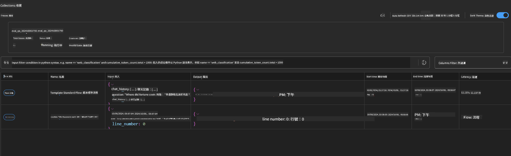

<!--
CO_OP_TRANSLATOR_METADATA:
{
  "original_hash": "20c7e34651318736a2606d351fcc37d0",
  "translation_date": "2025-04-04T06:32:46+00:00",
  "source_file": "md\\02.Application\\01.TextAndChat\\Phi3\\UsingPromptFlowWithONNX.md",
  "language_code": "tw"
}
-->
# 使用 Windows GPU 建立 Prompt Flow 解決方案，搭配 Phi-3.5-Instruct ONNX

本文檔是一個範例，展示如何使用 PromptFlow 與 ONNX（Open Neural Network Exchange）開發基於 Phi-3 模型的 AI 應用。

PromptFlow 是一套開發工具，旨在簡化基於大型語言模型（LLM）的 AI 應用的端到端開發過程，涵蓋從構思、原型設計到測試和評估的整個流程。

透過將 PromptFlow 與 ONNX 整合，開發者可以：

- **優化模型性能**：利用 ONNX 提升模型推理和部署效率。
- **簡化開發流程**：使用 PromptFlow 管理工作流並自動化重複性任務。
- **促進團隊協作**：提供統一的開發環境，增強團隊成員間的合作。

**Prompt flow** 是一套開發工具，旨在簡化基於大型語言模型（LLM）的 AI 應用的端到端開發流程，涵蓋從構思、原型設計、測試、評估到正式部署和監控。它讓提示工程變得更加容易，並幫助您構建具備生產品質的 LLM 應用。

Prompt flow 能夠連接到 OpenAI、Azure OpenAI Service，以及可自訂的模型（如 Huggingface、本地 LLM/SLM）。我們希望將 Phi-3.5 的量化 ONNX 模型部署到本地應用。Prompt flow 可以幫助我們更好地規劃業務，並完成基於 Phi-3.5 的本地解決方案。在這個範例中，我們將結合 ONNX Runtime GenAI Library，完成基於 Windows GPU 的 Prompt flow 解決方案。

## **安裝**

### **Windows GPU 的 ONNX Runtime GenAI**

請參閱此指南以設定 Windows GPU 的 ONNX Runtime GenAI [點擊此處](./ORTWindowGPUGuideline.md)

### **在 VSCode 中設定 Prompt flow**

1. 安裝 Prompt flow VS Code 擴展


2. 安裝 Prompt flow VS Code 擴展後，點擊該擴展，並選擇 **Installation dependencies**，按照指南在您的環境中安裝 Prompt flow SDK



3. 下載 [範例程式碼](../../../../../../code/09.UpdateSamples/Aug/pf/onnx_inference_pf)，並使用 VS Code 開啟此範例



4. 打開 **flow.dag.yaml**，選擇您的 Python 環境



   打開 **chat_phi3_ort.py**，更改您的 Phi-3.5-instruct ONNX 模型位置


5. 執行您的 Prompt flow 進行測試

打開 **flow.dag.yaml**，點擊可視化編輯器


點擊後，執行以進行測試



6. 您可以在終端中執行批量操作以檢查更多結果

```bash

pf run create --file batch_run.yaml --stream --name 'Your eval qa name'    

```

您可以在默認瀏覽器中檢視結果



**免責聲明**：  
本文檔使用 AI 翻譯服務 [Co-op Translator](https://github.com/Azure/co-op-translator) 進行翻譯。儘管我們致力於提供準確的翻譯，請注意自動翻譯可能包含錯誤或不精確之處。原始語言的文件應被視為具有權威性的來源。對於重要信息，建議尋求專業的人工翻譯。我們對因使用此翻譯而引起的任何誤解或誤讀不承擔責任。