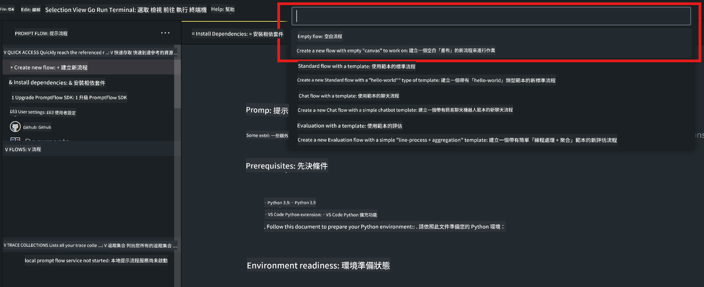
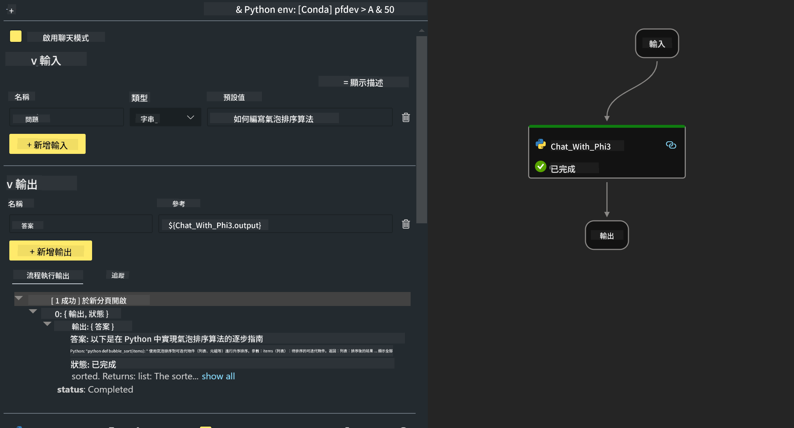

<!--
CO_OP_TRANSLATOR_METADATA:
{
  "original_hash": "bc29f7fe7fc16bed6932733eac8c81b8",
  "translation_date": "2025-05-08T05:30:58+00:00",
  "source_file": "md/02.Application/02.Code/Phi3/VSCodeExt/HOL/AIPC/02.PromptflowWithNPU.md",
  "language_code": "tw"
}
-->
# **Lab 2 - 在 AIPC 上使用 Phi-3-mini 執行 Prompt flow**

## **什麼是 Prompt flow**

Prompt flow 是一套開發工具，專為簡化基於大型語言模型（LLM）AI 應用的端到端開發流程而設計，從構思、原型設計、測試、評估到正式部署與監控。它讓 prompt 工程變得更簡單，並幫助你打造具備生產品質的 LLM 應用。

使用 prompt flow，你可以：

- 建立將 LLM、prompt、Python 程式碼及其他工具串接在一起的可執行工作流程。

- 輕鬆除錯並反覆調整流程，尤其是與 LLM 的互動部分。

- 評估流程，使用更大規模的資料集計算品質和效能指標。

- 將測試與評估整合進 CI/CD 系統，確保流程品質。

- 將流程部署到你選擇的服務平台，或輕鬆整合到應用程式的程式碼庫中。

- （選用但強烈建議）透過 Azure AI 上的雲端版 Prompt flow 與團隊協作。

## **什麼是 AIPC**

AI PC 配備了 CPU、GPU 和 NPU，各自擁有特定的 AI 加速能力。NPU（神經網路處理器）是一種專用加速器，可在你的電腦上直接處理人工智慧（AI）和機器學習（ML）任務，而不需將資料傳送到雲端。GPU 和 CPU 也能處理這些工作負載，但 NPU 尤其擅長低功耗的 AI 運算。AI PC 代表了電腦運作方式的根本轉變。它不是解決過去不存在的問題，而是大幅提升日常電腦使用體驗。

那它是怎麼運作的呢？與基於大量公開資料訓練的大型生成式 AI 和大型語言模型（LLM）相比，AI PC 上執行的 AI 在幾乎所有層面都更容易取得。這個概念更容易理解，且因為它是基於你的資料訓練，無需連接雲端，對更廣泛的使用者群來說更具吸引力。

短期內，AI PC 世界包含個人助理及較小型的 AI 模型直接在你的電腦上運行，利用你的資料提供個人化、私密且更安全的 AI 強化，幫助你完成日常工作——例如會議紀錄、組織夢幻足球聯盟、自動化照片和影片編輯優化，或根據大家的抵達與離開時間規劃完美的家庭聚會行程。

## **在 AIPC 上建立生成程式碼流程**

***Note*** ：如果尚未完成環境安裝，請參考 [Lab 0 - Installations](./01.Installations.md)

1. 在 Visual Studio Code 開啟 Prompt flow 擴充功能，並建立一個空白的流程專案



2. 新增 Inputs 和 Outputs 參數，並新增 Python Code 作為新的流程



你可以參考此結構（flow.dag.yaml）來構建你的流程

```yaml

inputs:
  question:
    type: string
    default: how to write Bubble Algorithm
outputs:
  answer:
    type: string
    reference: ${Chat_With_Phi3.output}
nodes:
- name: Chat_With_Phi3
  type: python
  source:
    type: code
    path: Chat_With_Phi3.py
  inputs:
    question: ${inputs.question}


```

3. 在 ***Chat_With_Phi3.py*** 中加入程式碼

```python


from promptflow.core import tool

# import torch
from transformers import AutoTokenizer, pipeline,TextStreamer
import intel_npu_acceleration_library as npu_lib

import warnings

import asyncio
import platform

class Phi3CodeAgent:
    
    model = None
    tokenizer = None
    text_streamer = None
    
    model_id = "microsoft/Phi-3-mini-4k-instruct"

    @staticmethod
    def init_phi3():
        
        if Phi3CodeAgent.model is None or Phi3CodeAgent.tokenizer is None or Phi3CodeAgent.text_streamer is None:
            Phi3CodeAgent.model = npu_lib.NPUModelForCausalLM.from_pretrained(
                                    Phi3CodeAgent.model_id,
                                    torch_dtype="auto",
                                    dtype=npu_lib.int4,
                                    trust_remote_code=True
                                )
            Phi3CodeAgent.tokenizer = AutoTokenizer.from_pretrained(Phi3CodeAgent.model_id)
            Phi3CodeAgent.text_streamer = TextStreamer(Phi3CodeAgent.tokenizer, skip_prompt=True)

    

    @staticmethod
    def chat_with_phi3(prompt):
        
        Phi3CodeAgent.init_phi3()

        messages = "<|system|>You are a AI Python coding assistant. Please help me to generate code in Python.The answer only genertated Python code, but any comments and instructions do not need to be generated<|end|><|user|>" + prompt +"<|end|><|assistant|>"


        generation_args = {
            "max_new_tokens": 1024,
            "return_full_text": False,
            "temperature": 0.3,
            "do_sample": False,
            "streamer": Phi3CodeAgent.text_streamer,
        }

        pipe = pipeline(
            "text-generation",
            model=Phi3CodeAgent.model,
            tokenizer=Phi3CodeAgent.tokenizer,
            # **generation_args
        )

        result = ''

        with warnings.catch_warnings():
            warnings.simplefilter("ignore")
            response = pipe(messages, **generation_args)
            result =response[0]['generated_text']
            return result


@tool
def my_python_tool(question: str) -> str:
    if platform.system() == 'Windows':
        asyncio.set_event_loop_policy(asyncio.WindowsSelectorEventLoopPolicy())
    return Phi3CodeAgent.chat_with_phi3(question)


```

4. 你可以透過 Debug 或 Run 來測試流程，確認生成程式碼是否正常


5. 在終端機執行流程作為開發 API

```

pf flow serve --source ./ --port 8080 --host localhost   

```

你可以在 Postman 或 Thunder Client 中測試

### **Note**

1. 第一次執行會花比較長時間，建議先透過 Hugging face CLI 下載 phi-3 模型。

2. 考量 Intel NPU 運算能力有限，建議使用 Phi-3-mini-4k-instruct。

3. 我們使用 Intel NPU 加速進行 INT4 量化轉換，但若重新啟動服務，需要刪除 cache 與 nc_workshop 資料夾。

## **資源**

1. 學習 Promptflow [https://microsoft.github.io/promptflow/](https://microsoft.github.io/promptflow/)

2. 學習 Intel NPU Acceleration [https://github.com/intel/intel-npu-acceleration-library](https://github.com/intel/intel-npu-acceleration-library)

3. 範例程式碼，下載 [Local NPU Agent Sample Code](../../../../../../../../../code/07.Lab/01/AIPC)

**免責聲明**：  
本文件係使用 AI 翻譯服務 [Co-op Translator](https://github.com/Azure/co-op-translator) 所翻譯。雖然我們致力於提供準確的翻譯，但請注意，自動翻譯可能包含錯誤或不準確之處。原始文件的母語版本應視為權威來源。對於重要資訊，建議採用專業人工翻譯。我們不對因使用本翻譯所產生之任何誤解或誤釋負責。