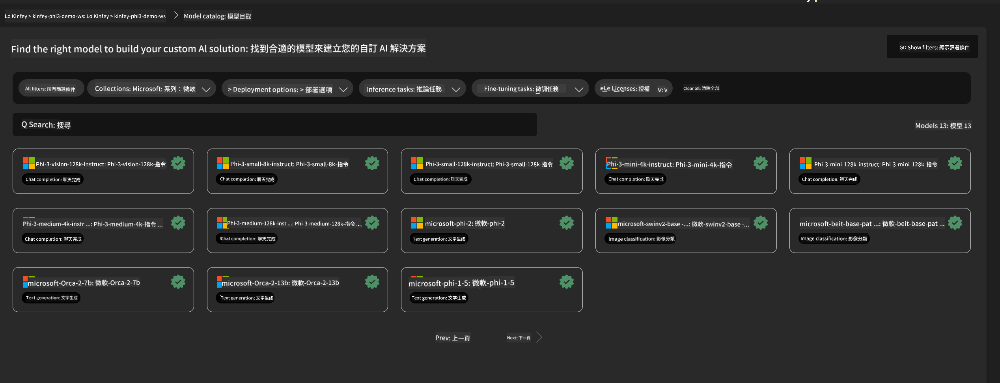
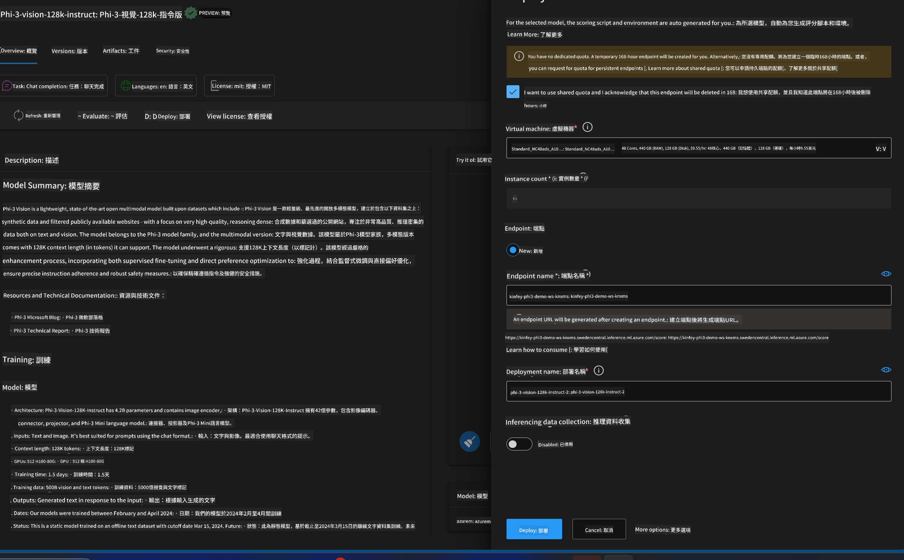
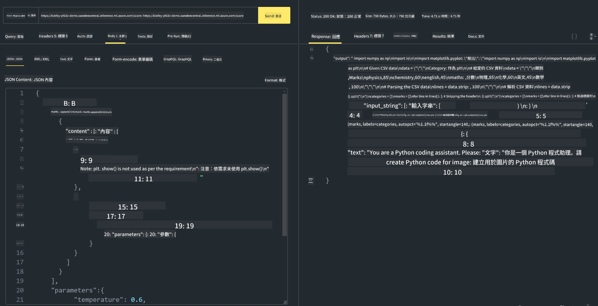

<!--
CO_OP_TRANSLATOR_METADATA:
{
  "original_hash": "20cb4e6ac1686248e8be913ccf6c2bc2",
  "translation_date": "2025-05-08T05:34:38+00:00",
  "source_file": "md/02.Application/02.Code/Phi3/VSCodeExt/HOL/Apple/03.DeployPhi3VisionOnAzure.md",
  "language_code": "tw"
}
-->
# **Lab 3 - 在 Azure Machine Learning Service 部署 Phi-3-vision**

我們使用 NPU 來完成本地程式的生產部署，接著想透過它引入 PHI-3-VISION 的能力，實現由圖片生成程式碼。

在這個介紹中，我們可以快速在 Azure Machine Learning Service 裡建立一個 Model As Service Phi-3 Vision 服務。

***Note***：Phi-3 Vision 需要較強的運算能力來加速內容生成，我們需要雲端運算資源來協助達成。

### **1. 建立 Azure Machine Learning Service**

我們需要在 Azure 入口網站建立 Azure Machine Learning Service。如果想了解如何操作，請參考此連結 [https://learn.microsoft.com/azure/machine-learning/quickstart-create-resources?view=azureml-api-2](https://learn.microsoft.com/azure/machine-learning/quickstart-create-resources?view=azureml-api-2)

### **2. 在 Azure Machine Learning Service 選擇 Phi-3 Vision**



### **3. 在 Azure 部署 Phi-3-Vision**



### **4. 在 Postman 測試 Endpoint**



***Note***

1. 傳送的參數必須包含 Authorization、azureml-model-deployment 和 Content-Type，請查看部署資訊以取得。

2. 傳送參數時，Phi-3-Vision 需要傳送圖片連結，請參考 GPT-4-Vision 的傳參方法，例如

```json

{
  "input_data":{
    "input_string":[
      {
        "role":"user",
        "content":[ 
          {
            "type": "text",
            "text": "You are a Python coding assistant.Please create Python code for image "
          },
          {
              "type": "image_url",
              "image_url": {
                "url": "https://ajaytech.co/wp-content/uploads/2019/09/index.png"
              }
          }
        ]
      }
    ],
    "parameters":{
          "temperature": 0.6,
          "top_p": 0.9,
          "do_sample": false,
          "max_new_tokens": 2048
    }
  }
}

```

3. 使用 Post 方法呼叫 **/score**

**恭喜**！你已完成快速部署 PHI-3-VISION 並嘗試如何用圖片生成程式碼，接下來我們可以結合 NPU 與雲端來打造應用。

**免責聲明**：  
本文件係使用 AI 翻譯服務 [Co-op Translator](https://github.com/Azure/co-op-translator) 所翻譯。雖然我們致力於提供準確的翻譯，但請注意自動翻譯可能包含錯誤或不準確之處。原始文件之母語版本應視為權威來源。對於重要資訊，建議採用專業人工翻譯。我們不對因使用本翻譯所產生之任何誤解或誤譯負責。