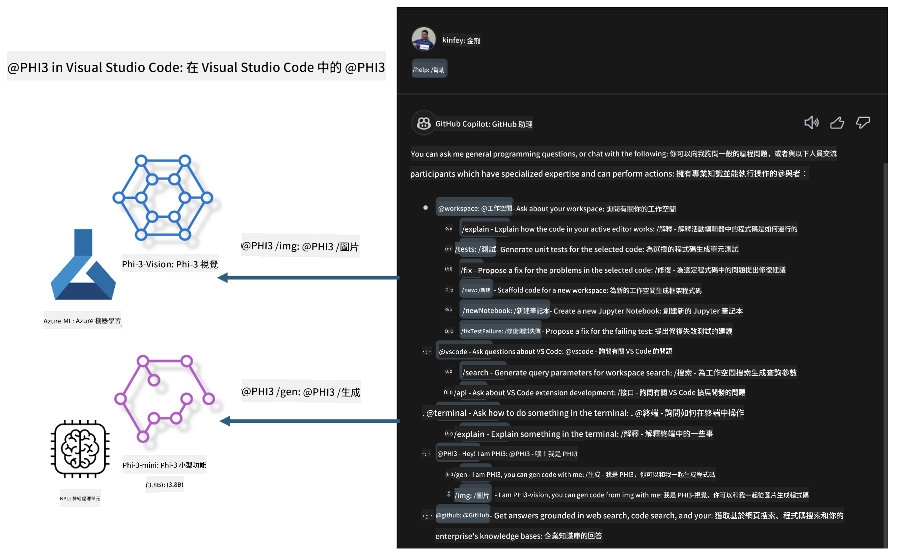

<!--
CO_OP_TRANSLATOR_METADATA:
{
  "original_hash": "7302d85639441c7cedbae09795e6b9a6",
  "translation_date": "2025-04-04T06:36:52+00:00",
  "source_file": "md\\02.Application\\02.Code\\Phi3\\VSCodeExt\\README.md",
  "language_code": "tw"
}
-->
# **打造專屬的 Visual Studio Code GitHub Copilot Chat 與 Microsoft Phi-3 系列**

你是否使用過 GitHub Copilot Chat 的工作區代理？想要建立自己團隊的代碼代理嗎？這個動手實驗希望結合開源模型，打造企業級的代碼業務代理。

## **基礎知識**

### **為什麼選擇 Microsoft Phi-3**

Phi-3 是一個系列家族，包括 phi-3-mini、phi-3-small 和 phi-3-medium，根據不同的訓練參數用於文本生成、對話補全以及代碼生成。此外，還有基於 Vision 的 phi-3-vision。非常適合企業或不同團隊創建離線生成式 AI 解決方案。

推薦閱讀此連結 [https://github.com/microsoft/PhiCookBook/blob/main/md/01.Introduction/01/01.PhiFamily.md](https://github.com/microsoft/PhiCookBook/blob/main/md/01.Introduction/01/01.PhiFamily.md)

### **Microsoft GitHub Copilot Chat**

GitHub Copilot Chat 擴展提供了一個聊天介面，讓你可以直接在 VS Code 中與 GitHub Copilot 互動並獲得與代碼相關問題的解答，而無需瀏覽文件或搜尋線上論壇。

Copilot Chat 可能會使用語法高亮、縮排和其他格式化功能來增加生成回覆的清晰度。根據使用者提出的問題，結果可能包含 Copilot 用於生成回覆的上下文連結，例如源代碼文件或文件，或是用於訪問 VS Code 功能的按鈕。

- Copilot Chat 集成到你的開發流程中，並在你需要的地方提供協助：

- 直接從編輯器或終端啟動內嵌聊天對話，幫助你在編碼時獲得支援

- 使用聊天視圖，隨時擁有一個 AI 助手在旁協助

- 啟動快速聊天以快速提問，然後繼續你的工作

你可以在各種場景中使用 GitHub Copilot Chat，例如：

- 解答如何最佳解決問題的代碼問題

- 解釋他人的代碼並提出改進建議

- 提出代碼修復方案

- 生成單元測試案例

- 生成代碼文檔

推薦閱讀此連結 [https://code.visualstudio.com/docs/copilot/copilot-chat](https://code.visualstudio.com/docs/copilot/copilot-chat?WT.mc_id=aiml-137032-kinfeylo)

###  **Microsoft GitHub Copilot Chat @workspace**

在 Copilot Chat 中引用 **@workspace**，可以讓你針對整個代碼庫提問。根據問題，Copilot 會智能地檢索相關文件和符號，並在答案中以連結和代碼示例的形式呈現。

為了回答你的問題，**@workspace** 會通過以下來源進行檢索，就像開發者在 VS Code 中瀏覽代碼庫時使用的資源：

- 工作區中的所有文件，除了被 .gitignore 文件忽略的文件

- 帶有嵌套文件夾和文件名的目錄結構

- 如果工作區是一個 GitHub 儲存庫且已被代碼搜索索引，則會使用 GitHub 的代碼搜索索引

- 工作區中的符號和定義

- 當前選中的文本或在活動編輯器中可見的文本

注意：如果你打開了一個被忽略的文件或在其中選中了文本，.gitignore 將被繞過。

推薦閱讀此連結 [[https://code.visualstudio.com/docs/copilot/copilot-chat](https://code.visualstudio.com/docs/copilot/workspace-context?WT.mc_id=aiml-137032-kinfeylo)]

## **了解更多關於此實驗**

GitHub Copilot 大幅提升了企業的編程效率，每個企業都希望根據自己的業務場景自定義 GitHub Copilot 的相關功能。許多企業基於自己的業務場景和開源模型，定制了類似 GitHub Copilot 的擴展。對於企業來說，定制的擴展更容易控制，但這也影響了使用者體驗。畢竟，GitHub Copilot 在處理通用場景和專業性方面功能更強。如果能保持一致的使用體驗，並定制企業自己的擴展，將會是一個更好的選擇。GitHub Copilot Chat 提供了相關 API，供企業在聊天體驗中擴展功能。保持一致的使用體驗並擁有定制功能，能帶來更好的使用者體驗。

這個實驗主要結合 Phi-3 模型、本地 NPU 和 Azure 混合，構建 GitHub Copilot Chat 中的定制代理 ***@PHI3***，以協助企業開發者完成代碼生成 ***(@PHI3 /gen)*** 以及基於圖像生成代碼 ***(@PHI3 /img)***。

### ***注意：***

此實驗目前在 Intel CPU 的 AIPC 和 Apple Silicon 上實現。我們將持續更新 Qualcomm NPU 版本。

## **實驗**

| 名稱 | 描述 | AIPC | Apple |
| ------------ | ----------- | -------- |-------- |
| Lab0 - 安裝(✅) | 配置並安裝相關環境及工具 | [Go](./HOL/AIPC/01.Installations.md) |[Go](./HOL/Apple/01.Installations.md) |
| Lab1 - 使用 Phi-3-mini 運行 Prompt flow (✅) | 結合 AIPC / Apple Silicon，使用本地 NPU 通過 Phi-3-mini 創建代碼生成 | [Go](./HOL/AIPC/02.PromptflowWithNPU.md) |  [Go](./HOL/Apple/02.PromptflowWithMLX.md) |
| Lab2 - 在 Azure Machine Learning Service 部署 Phi-3-vision (✅) | 通過部署 Azure Machine Learning Service 的模型目錄 - Phi-3-vision 圖像生成代碼 | [Go](./HOL/AIPC/03.DeployPhi3VisionOnAzure.md) |[Go](./HOL/Apple/03.DeployPhi3VisionOnAzure.md) |
| Lab3 - 在 GitHub Copilot Chat 中創建 @phi-3 代理(✅)  | 在 GitHub Copilot Chat 中創建自定義 Phi-3 代理以完成代碼生成、圖形生成代碼、RAG 等功能 | [Go](./HOL/AIPC/04.CreatePhi3AgentInVSCode.md) | [Go](./HOL/Apple/04.CreatePhi3AgentInVSCode.md) |
| 示例代碼 (✅)  | 下載示例代碼 | [Go](../../../../../../../code/07.Lab/01/AIPC) | [Go](../../../../../../../code/07.Lab/01/Apple) |

## **資源**

1. Phi-3 Cookbook [https://github.com/microsoft/Phi-3CookBook](https://github.com/microsoft/Phi-3CookBook)

2. 了解更多 GitHub Copilot [https://learn.microsoft.com/training/paths/copilot/](https://learn.microsoft.com/training/paths/copilot/?WT.mc_id=aiml-137032-kinfeylo)

3. 了解更多 GitHub Copilot Chat [https://learn.microsoft.com/training/paths/accelerate-app-development-using-github-copilot/](https://learn.microsoft.com/training/paths/accelerate-app-development-using-github-copilot/?WT.mc_id=aiml-137032-kinfeylo)

4. 了解更多 GitHub Copilot Chat API [https://code.visualstudio.com/api/extension-guides/chat](https://code.visualstudio.com/api/extension-guides/chat?WT.mc_id=aiml-137032-kinfeylo)

5. 了解更多 Azure AI Foundry [https://learn.microsoft.com/training/paths/create-custom-copilots-ai-studio/](https://learn.microsoft.com/training/paths/create-custom-copilots-ai-studio/?WT.mc_id=aiml-137032-kinfeylo)

6. 了解更多 Azure AI Foundry 的模型目錄 [https://learn.microsoft.com/azure/ai-studio/how-to/model-catalog-overview](https://learn.microsoft.com/azure/ai-studio/how-to/model-catalog-overview)

**免責聲明**：  
本文檔使用AI翻譯服務 [Co-op Translator](https://github.com/Azure/co-op-translator) 進行翻譯。雖然我們努力確保準確性，但請注意，機器翻譯可能會包含錯誤或不準確之處。原始語言的文檔應被視為權威來源。對於關鍵信息，建議使用專業人工翻譯。我們對因使用此翻譯而引起的任何誤解或誤釋不承擔責任。